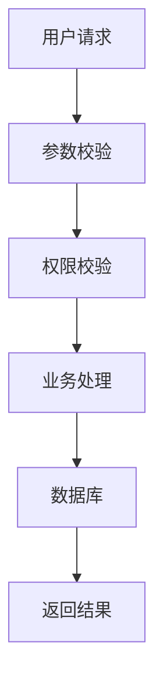

# 任务：为当前功能生成 Task 文档

将我提出的功能需求整理为一份可供后续 AI Coding Agent 执行的 Task 文档。

最终生成：

`docs/tasks/TODO/TASK-xxx-<功能名称>.md`

---

# 一、重要要求

当前项目已经存在并且已经开发了一部分。

在生成任务文档之前，必须先阅读并理解：

1. `AGENTS.md`
2. `docs/architecture.md`
3. `docs/business.md`

如果存在，还需要阅读：

4. 与当前功能相关的 ADR
5. 与当前功能相关的历史 Task
6. 与当前功能相关的源码
7. 数据库结构
8. API 文档
9. 测试代码

---

# 二、核心目标

我要实现下面这个功能：

> 【在这里填写我的功能需求】

请不要立即写代码。

你的第一任务是：

> 将这个功能转换成一份明确、完整、边界清晰、可以直接交给 Codex / Pi Agent 执行的 Task 文档。

---

# 三、先理解现有项目

分析当前项目后，先确认：

### 1. 当前系统已经具备什么能力

说明与本任务直接相关的现有功能。

### 2. 当前系统是如何实现的

说明：

- 涉及哪些模块
- 涉及哪些业务对象
- 涉及哪些接口
- 涉及哪些数据库
- 涉及哪些 Redis / MQ
- 当前相关业务流程是什么

### 3. 当前功能存在什么缺口

明确：

> 为什么需要这个任务？

不要直接跳到实现方案。

---

# 四、明确任务边界

Task 文档必须明确：

### 本次任务要做什么

列出必须完成的内容。

### 本次任务不做什么

列出明确的 Non-Goals。

避免 Coding Agent 因为“顺手优化”而扩大修改范围。

例如：

```text
本任务只增加评论查询缓存。

不处理：
- Redis 集群改造
- 评论数据库重构
- 评论分页方案重构
- CommentService 整体重构
```

---

# 五、分析需求

请把需求拆解成：

## 1. 功能目标

用一句话说明最终要实现什么。

## 2. 用户场景

说明：

> 谁，在什么情况下，通过什么操作，获得什么结果。

## 3. 前置条件

例如：

- 用户必须登录
- 对象必须存在
- 当前状态必须允许操作
- 需要满足某个权限

## 4. 后置条件

功能成功以后，系统的业务状态发生什么变化。

## 5. 异常场景

考虑：

- 参数错误
- 对象不存在
- 权限不足
- 状态不允许
- 重复操作
- 并发
- 数据库失败
- Redis 失败
- MQ 失败
- 第三方服务失败

但只写与本任务相关的异常。

---

# 六、确定影响范围

分析本任务可能涉及的：

- Controller
- Service
- Repository / Mapper
- Entity / Domain
- DTO / VO
- 数据库
- Redis
- MQ
- 配置
- 测试
- API

请区分：

### 必须修改

已经能够根据现有代码确定。

### 可能修改

当前可以推测，但需要 Coding Agent 进一步确认。

### 不应该修改

与任务无关的部分。

不要提前虚构具体文件名。

如果已经确认某个文件需要修改，可以直接列出。

---

# 七、设计业务流程

先从业务层面描述实现后的完整流程。

例如：

```text
用户请求
↓
参数校验
↓
权限校验
↓
业务处理
↓
数据持久化
↓
缓存 / MQ / 异步处理
↓
返回结果
```

如果流程复杂，请使用 Mermaid。

例如：



必须根据当前项目实际情况生成，不要照抄示例。

---

# 八、明确业务规则

找出这个功能涉及的业务规则。

例如：

- 谁可以操作
- 哪些状态允许操作
- 哪些状态不允许操作
- 是否允许重复执行
- 是否必须幂等
- 数据归属关系
- 删除语义
- 时间限制
- 数量限制

请明确列出。

如果需求中没有明确说明某项规则，不要自行编造。

需要人工确认的地方统一放到：

`待确认事项`

---

# 九、设计数据变化

如果功能涉及数据，请描述：

### 数据库

- 是否需要新表
- 是否修改已有表
- 是否增加字段
- 是否增加索引
- 数据如何写入
- 数据如何查询

### Redis

如果涉及 Redis，请说明：

- Key
- Value
- TTL
- 读写策略
- 失效策略
- 并发问题

### MQ

如果涉及 MQ，请说明：

- 什么业务事件产生消息
- 消息包含什么业务信息
- 谁消费
- 消费成功后产生什么业务结果
- 如何保证幂等
- 失败如何处理

如果当前功能不涉及，就不要添加。

---

# 十、设计 API

如果功能涉及 API，请明确：

- HTTP Method
- URL
- 请求参数
- 参数含义
- 返回值
- 错误情况

但不要随意修改现有 API。

如果现有 API 已经存在，请优先复用。

如果需要新增 API，请说明：

> 为什么现有 API 无法满足需求。

---

# 十一、考虑并发、幂等和一致性

如果任务涉及写操作或异步流程，请重点分析：

### 并发

多个请求同时执行会发生什么？

### 幂等

相同操作执行两次会发生什么？

### 一致性

涉及：

- MySQL
- Redis
- MQ

时，请明确：

> 哪些数据必须保持一致，哪些数据允许最终一致。

如果当前方案无法完全解决某个问题，请明确说明风险，不要假装不存在问题。

---

# 十二、确定实现策略

只有在理解需求、现有架构和业务规则后，才提出实现方案。

实现方案应该包含：

1. 推荐方案
2. 为什么采用这个方案
3. 为什么不采用其他明显可行方案
4. 对现有系统的影响
5. 潜在风险

不要为了“技术先进”引入项目当前不存在的复杂组件。

优先遵循：

> 现有架构 > 新技术

---

# 十三、拆分实施步骤

把实现拆成 Coding Agent 可以逐步执行的任务。

例如：

```text
1. 修改数据库
2. 修改 Entity
3. 修改 Mapper
4. 修改 Service
5. 增加 Redis
6. 增加 MQ
7. 增加 API
8. 增加测试
```

每一步说明：

- 做什么
- 为什么
- 影响什么

不要把任务拆得过细。

一般控制在 5~12 个主要步骤。

---

# 十四、定义验收标准

这是最重要的部分。

Task 必须包含：

`## Acceptance Criteria`

使用 Checkbox：

```text
- [ ] 新增功能能够正常执行
- [ ] 参数错误时返回正确错误
- [ ] 无权限用户无法执行
- [ ] 重复请求不会产生重复数据
- [ ] 数据库数据正确
- [ ] Redis 数据正确
- [ ] MQ 消息能够正常消费
- [ ] 异常情况下可以正确恢复
- [ ] 原有功能不受影响
- [ ] 单元测试通过
- [ ] 集成测试通过
```

但是不要照抄这些示例。

必须根据当前功能生成真正的验收条件。

每一项验收标准都应该满足：

> 可以通过测试或代码检查明确判断“完成 / 未完成”。

不要写：

```text
- [ ] 性能良好
- [ ] 代码质量高
```

这种不可验证的条件。

---

# 十五、定义测试要求

请根据功能制定：

### 单元测试

需要验证什么？

### 集成测试

需要验证什么？

### 异常测试

需要验证什么？

### 并发测试

如果需要，请说明。

### 回归测试

哪些原有功能必须保证不受影响？

---

# 十六、定义风险

增加：

`## Risks`

只写与这个功能实际相关的风险。

例如：

- 数据不一致
- 重复消费
- 并发覆盖
- 缓存穿透
- 缓存击穿
- 事务边界
- 性能下降
- 兼容性
- 历史数据

每个风险说明：

1. 风险是什么
2. 为什么产生
3. 如何降低风险

---

# 十七、待确认事项

如果存在需求不明确的地方，不要自行决定。

放到：

`## Open Questions`

例如：

```text
- 是否允许用户重复执行该操作？
- TTL 应该是多少？
- 是否允许管理员执行该操作？
- 历史数据是否需要兼容？
```

如果可以根据现有代码明确判断，就不要列成问题。

只有真正无法确定的内容才放这里。

---

# 十八、最终 Task 文档结构

最终文件统一使用以下结构：

# TASK-xxx <任务名称>

## 1. 背景

## 2. 当前状态

## 3. 功能目标

## 4. 用户场景

## 5. 前置条件

## 6. 后置条件

## 7. 任务范围

### 7.1 Goals

### 7.2 Non-Goals

## 8. 业务规则

## 9. 核心业务流程

## 10. 数据变化

## 11. API 变化

## 12. 技术实现方案

## 13. 影响范围

## 14. 实施步骤

## 15. Acceptance Criteria

## 16. 测试要求

## 17. Risks

## 18. Open Questions

## 19. AI 开发注意事项

---

# 十九、AI 开发注意事项

最后明确告诉 Coding Agent：

- 哪些业务规则不能破坏
- 哪些接口不能修改
- 哪些数据结构需要保持兼容
- 哪些模块不要随意重构
- 哪些操作必须保证幂等
- 哪些地方允许最终一致性
- 哪些地方必须强一致
- 哪些范围不属于本任务

---

# 二十、最终输出要求

完成后：

1. 创建 Task 文档
2. 不修改任何业务代码
3. 不修改 `architecture.md`
4. 不修改 `business.md`
5. 汇报：
   - 任务目标
   - 影响范围
   - 推荐方案
   - 主要风险
   - 待确认事项

如果需求存在明显歧义，不要擅自编造业务规则。

优先根据：

`AGENTS.md → architecture.md → business.md → ADR → 当前源码 → 数据库 → 测试`

建立结论。

最终目标不是让文档“写得详细”，而是让后续 Coding Agent 能够：

> **不需要重新猜测需求，就可以根据这份 Task 安全地完成实现。**

```
我要实现的功能：

给评论系统增加“楼中楼回复”功能。

要求：
1. 用户可以回复某条评论
2. 回复需要关联父评论
3. 查询评论时可以看到回复
4. 支持分页
5. 保持现有评论接口兼容
```

实际使用时，你只需要在最前面换掉这一段