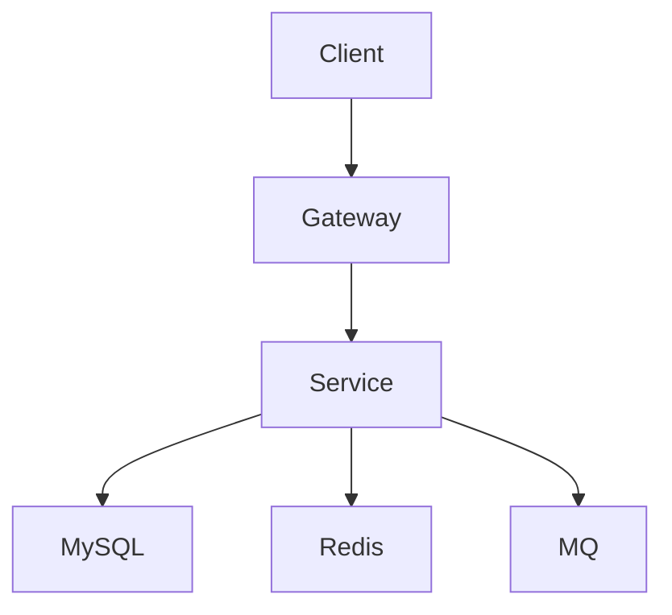

# 任务：分析当前项目并生成 architecture.md

你现在需要作为一名资深软件架构师，分析当前项目，并根据**现有代码、配置文件、数据库脚本和基础设施配置**生成 `docs/architecture.md`。

## 一、重要要求

1. 这是一个已经开发了一部分的真实项目。
2. **必须以项目现有代码为事实依据，不要按照常见项目模板或你的经验猜测架构。**
3. 如果某个信息无法从项目中确定，请明确标记为“未知”或“待确认”，不要自行编造。
4. **本次任务只允许分析和生成 `docs/architecture.md`，不要修改业务代码。**
5. 不要为了完善文档而重构代码。
6. 不要把未来计划写成当前系统已经存在的功能。
7. 区分：
   - 当前已经实现的功能
   - 当前代码中存在但尚未完善的功能
   - 推测出来的内容
8. 文档应该服务于后续 AI Agent，使新的 AI 在第一次进入项目时能够快速理解整体架构。

## 二、分析范围

请优先分析以下内容：

### 1. 项目结构

分析：

- 项目的整体目录结构
- Maven / Gradle 模块
- 各模块职责
- 核心包结构
- Controller / Service / Repository / DAO 等层次
- 模块之间的依赖关系

请说明哪些目录是核心目录，哪些是基础设施或辅助目录。

### 2. 技术栈

根据实际项目确认：

- Java / JDK 版本
- Spring Boot 版本
- MyBatis / JPA 等 ORM
- MySQL
- Redis
- RocketMQ / Kafka 等消息队列
- Nacos / 注册中心
- Elasticsearch
- Docker
- Netty
- 其他实际使用的技术

不要因为 `pom.xml` 中存在依赖就直接认为该技术已经被项目实际使用，必须结合源码确认。

### 3. 系统架构

分析当前项目属于什么架构，例如：

- 单体
- 模块化单体
- 微服务
- 分布式系统

分析实际存在的服务以及服务之间的调用关系。

使用 Mermaid 绘制整体架构图。

例如：

不要照抄这个示例，必须根据实际项目生成。

### 4. 核心业务流程

找出项目中最重要的业务流程，并说明：

- 请求从哪里进入
- 经过哪些模块
- 如何访问数据库
- 如何访问 Redis
- 是否使用 MQ
- 是否存在异步处理
- 最终数据如何落库

至少分析当前项目最核心的 2~5 个业务流程。

使用 Mermaid sequenceDiagram 或 flowchart 描述。

### 5. 数据层架构

分析：

- 数据库
- 核心数据表
- 表之间的主要关系
- ORM / Mapper 使用方式
- 事务边界
- 是否使用分库分表
- 是否存在读写分离
- 是否存在缓存

不要完整复制所有数据库字段，只描述架构层面的关键数据结构。

### 6. Redis 架构

如果项目使用 Redis，请分析：

- Redis 在系统中的作用
- 使用了哪些数据结构
- Key 的命名方式
- 缓存的主要对象
- 缓存读取流程
- 缓存更新 / 删除机制
- TTL
- 分布式锁
- Lua
- Pipeline
- 其他实际使用方式

只能描述代码中确认存在的内容。

### 7. 消息队列

如果项目使用 MQ，请分析：

- Producer
- Consumer
- Topic
- Tag
- 消息发送方式
- 同步 / 异步
- 消费模式
- ACK
- 重试机制
- 幂等处理
- 失败处理
- 是否存在事务消息

重点分析真实代码，而不是 MQ 的理论知识。

### 8. 一致性与事务

分析系统中：

- 本地事务
- 分布式事务
- 数据库事务
- Redis 与 MySQL 一致性
- MQ 与数据库一致性
- 幂等机制
- 重试机制

重点回答：

> 当前项目是如何保证数据一致性的？

如果没有完善机制，也应该明确指出。

### 9. 异常处理

分析：

- 全局异常处理
- 业务异常
- RPC 异常
- MQ 异常
- Redis 异常
- 数据库异常
- 重试机制
- 降级机制

### 10. 配置与部署

分析：

- application.yml / application.properties
- 环境配置
- Docker
- docker-compose
- 服务启动方式
- 外部依赖
- 服务之间的网络关系

说明开发环境和生产环境是否存在明显区别。

## 三、特别关注设计决策

在分析过程中，如果发现一些比较重要或者比较特殊的设计，请单独记录。

例如：

- 为什么使用 Redis
- 为什么使用 MQ
- 为什么某个操作是异步的
- 为什么采用某种 ID 生成方案
- 为什么某个模块采用特殊的数据结构
- 为什么存在某个看起来不常见的实现

但是：

**不要猜测“为什么”。**

如果源码无法证明原因，就写：

> 当前代码采用 XXX，但未发现明确的设计原因。

不要自行编造设计决策。

## 四、识别当前架构风险

在 architecture.md 最后增加：

`## 当前架构风险`

列出当前代码中能够明确观察到的问题，例如：

- 单点
- 性能瓶颈
- 缓存一致性问题
- MQ 消息丢失风险
- 重复消费
- 事务边界问题
- 数据库热点
- 线程池配置问题
- 异常处理缺失
- 可观测性不足

每个问题需要说明：

1. 问题是什么
2. 代码中什么地方体现
3. 可能产生什么影响

不要为了“看起来专业”而人为制造问题。

## 五、不要把建议混进当前架构

请严格区分：

### 当前架构

描述当前代码真实存在的架构。

### 架构风险

描述当前已经存在的问题。

### 后续建议

只能放到最后，并且明确标记为建议。

不要出现：

> “应该使用 Redis Cluster”

然后把它写成当前项目已经使用 Redis Cluster。

## 六、文档结构

最终 `docs/architecture.md` 请尽量按照下面结构组织：

# Architecture

## 1. 系统概览

## 2. 项目结构

## 3. 技术栈

## 4. 系统架构

## 5. 模块职责

## 6. 核心业务流程

## 7. 数据层架构

## 8. Redis 架构

## 9. 消息队列架构

## 10. 事务与一致性

## 11. 异常处理

## 12. 配置与部署

## 13. 当前架构风险

## 14. 后续演进建议

## 15. AI 开发注意事项

其中最后一个章节请记录：

- 哪些模块修改时需要特别谨慎
- 哪些代码之间存在隐含依赖
- 哪些行为不能随意修改
- 哪些接口或数据结构具有兼容性要求

但同样只能根据实际项目分析得出，不允许编造。

## 七、分析流程

请按照以下顺序执行：

1. 先读取项目目录
2. 识别构建文件
3. 识别配置文件
4. 识别核心模块
5. 阅读核心 Controller
6. 阅读核心 Service
7. 阅读 Repository / Mapper / DAO
8. 阅读数据库脚本
9. 阅读 Redis 相关代码
10. 阅读 MQ 相关代码
11. 阅读 Docker / 部署配置
12. 最后综合分析架构

不要只根据 README 推断项目结构。

## 八、完成后的输出

完成后：

1. 创建 `docs/architecture.md`
2. 不修改其他业务代码
3. 输出你分析出的：
   - 项目整体架构
   - 核心模块
   - 核心业务流程
   - 当前架构风险
4. 列出你认为仍然无法从代码确认的信息。

在最终汇报中明确说明：

- 读取了哪些关键文件
- 创建了哪个文档
- 是否修改了其他文件
- 哪些结论是代码明确证明的
- 哪些信息仍待确认

再次强调：

**不要修改任何业务代码。**
**不要重构项目。**
**不要为了让架构看起来更合理而修改现有设计。**
**以现有代码为事实依据。**