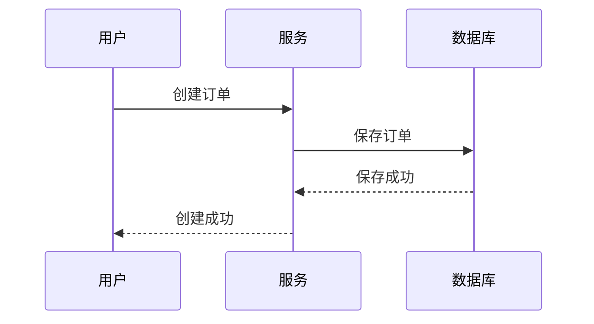

# 任务：分析当前项目并生成 business.md

你现在需要作为一名资深业务分析师 + 软件工程师，分析当前项目的**真实业务逻辑**，并生成：

`docs/business.md`

这个文档的目标是：

> 让一个第一次接触这个项目的开发者或 AI Agent，可以仅通过 `business.md` 快速理解这个系统“做什么、用户怎么使用、业务数据怎么流转、有哪些业务规则、哪些行为不能随意修改”。

---

# 一、重要要求

1. 这是一个已经开发到一部分的真实项目。
2. 必须以当前项目中的：
   - Controller
   - Service
   - Domain / Entity
   - DTO / VO
   - Mapper / Repository
   - 数据库结构
   - MQ Producer / Consumer
   - Redis 相关代码
   - 配置文件
   - API 文档
   - 测试代码

   作为事实依据。

3. **不要根据项目名称、类名、README 或常见业务模式自行猜测业务。**
4. 如果无法确认某条业务规则，请明确标记为：
   - `未知`
   - `待确认`
5. 不允许把“理论上应该存在的业务”写成当前已经存在的业务。
6. 不要修改任何业务代码。
7. 只生成或修改：
   `docs/business.md`
8. 不要为了完善文档而重构项目。
9. 要区分：
   - 当前已经实现的业务
   - 当前代码中部分实现的业务
   - 当前没有实现但未来可能需要的业务
10. 重点描述**业务意图和业务规则**，不要把文档写成源码说明。

---

# 二、你需要重点回答的问题

阅读项目后，需要回答：

### 1. 这个系统解决什么问题？

说明：

- 系统面向什么场景
- 服务什么类型的用户
- 核心业务目标是什么
- 用户通过系统完成什么事情

不要使用空泛的描述。

不要写：

> “这是一个高性能、可扩展的系统。”

而应该写：

> “用户可以创建 XXX，并对 XXX 执行 XXX 操作。”

---

# 三、识别系统中的业务角色

找出项目中真实存在的业务角色。

例如：

- 普通用户
- 管理员
- 商家
- 运营人员
- 系统任务
- MQ Consumer
- 第三方系统

对于每个角色说明：

1. 角色是什么
2. 可以执行什么操作
3. 哪些操作受到权限或状态限制

如果项目只有一种用户，不要强行拆分角色。

---

# 四、识别核心业务对象

分析项目中的核心业务实体。

例如：

- User
- Order
- Product
- Comment
- Note
- Payment
- Message

对于每个核心业务对象，说明：

1. 它代表什么业务概念
2. 它由谁创建
3. 谁可以修改
4. 谁可以删除
5. 生命周期是什么
6. 与其他业务对象是什么关系

不要简单复制数据库字段。

重点回答：

> “这个对象在业务上意味着什么？”

---

# 五、分析核心业务流程

找出系统中最重要的业务流程。

至少分析项目中最核心的 3~8 个流程。

例如：

- 注册
- 登录
- 创建业务对象
- 查询业务对象
- 修改业务对象
- 删除业务对象
- 下单
- 支付
- 评论
- 点赞
- 收藏
- 消息发送
- 异步任务

对于每个流程说明：

### 业务目标

用户为什么执行这个操作？

### 前置条件

在什么情况下允许执行？

### 操作步骤

业务上发生了什么？

### 状态变化

哪些业务对象发生了什么状态变化？

### 后置结果

成功后系统处于什么状态？

### 异常情况

失败时会发生什么？

---

# 六、使用 Mermaid 描述关键业务流程

对于复杂流程，请使用 Mermaid。

例如：



但不要照抄这个示例。

必须根据实际项目代码生成。

复杂状态变化可以使用：

```mermaid
stateDiagram-v2
```

业务决策可以使用：

```mermaid
flowchart TD
```

---

# 七、分析业务状态机

如果项目存在明显的状态流转，请单独分析。

例如订单可能存在：

```text
待支付
↓
已支付
↓
处理中
↓
已完成
```

请明确说明：

- 有哪些状态
- 什么操作可以让状态发生变化
- 谁可以触发状态变化
- 哪些状态不能回退
- 哪些状态可以重复操作
- 哪些状态下不能继续执行某些操作

如果项目不存在明显状态机，不要强行创建。

---

# 八、分析业务规则

这是 `business.md` 最重要的部分之一。

请找出当前代码中真正存在的业务规则。

重点关注：

- 权限规则
- 数据归属规则
- 唯一性规则
- 数量限制
- 状态限制
- 时间限制
- 重复操作限制
- 删除规则
- 更新规则
- 幂等规则
- 业务异常
- 数据校验

例如：

```text
只有评论作者可以删除自己的评论。

评论已经被删除后，不允许再次删除。

同一个用户不能重复执行点赞操作。
```

这些应该被明确写出来。

不要只写：

> CommentService 中有 deleteComment 方法。

我要的是：

> “什么情况下允许删除评论。”

---

# 九、分析权限与数据归属

重点检查代码中的：

- 当前用户 ID
- 登录用户
- Token
- Session
- 权限判断
- Owner 判断
- Admin 判断

明确：

```text
谁可以操作什么数据？
```

例如：

```text
普通用户只能修改自己创建的 XXX。

管理员可以修改所有 XXX。

未登录用户只能读取 XXX。
```

如果无法确认，请标记为待确认。

---

# 十、分析幂等与重复操作

检查项目中是否存在：

- 幂等 Token
- 唯一索引
- Redis Set
- 数据库唯一约束
- MQ 消费幂等
- 状态判断
- 重复请求处理

请回答：

> 如果同一个业务操作执行两次，会发生什么？

例如：

```text
重复提交订单
重复消费消息
重复点赞
重复取消
重复支付
```

必须描述当前实际行为。

---

# 十一、分析异步业务

如果项目使用 MQ、异步任务、线程池、延迟任务等，请从业务角度说明：

1. 哪个业务操作会触发异步任务
2. 为什么采用异步
3. 用户什么时候得到成功响应
4. 真正的数据处理什么时候完成
5. 异步失败后会发生什么
6. 用户最终看到的数据可能处于什么状态

注意：

这里重点解释的是**业务上的异步行为**，而不是 MQ 的技术实现。

例如不要只写：

> 使用 RocketMQTemplate.asyncSend。

而应该解释：

> 用户发表评论后，接口立即返回成功；评论的持久化由异步消费者完成，因此接口成功并不代表评论已经完成数据库落库。

如果当前代码不是这样，请按照实际代码描述。

---

# 十二、分析一致性相关业务语义

从业务角度说明：

- 哪些数据必须立即一致
- 哪些数据允许最终一致
- 哪些操作可能存在短暂延迟
- 用户在延迟期间可能看到什么结果

例如：

```text
评论主数据最终需要写入数据库。

评论数量允许短时间内存在延迟。

MQ 消费失败时评论可能暂时不可见。
```

这些必须基于真实代码分析，不允许猜测。

---

# 十三、分析删除语义

重点检查：

- 逻辑删除
- 物理删除
- 级联删除
- 软删除
- 删除后的查询行为
- 删除后的关联数据

回答：

> 一个业务对象被删除以后，业务上到底发生了什么？

例如：

```text
用户删除评论后：

评论本体被标记删除；
评论列表不再展示；
评论计数是否减少；
缓存是否失效；
相关消息是否处理。
```

---

# 十四、分析异常业务场景

找出重要业务异常：

例如：

```text
用户不存在
对象不存在
没有权限
状态不允许
重复操作
资源已删除
库存不足
支付失败
MQ 消费失败
```

说明：

- 什么情况下发生
- 系统怎么处理
- 用户看到什么
- 数据最终处于什么状态

不要只列异常类名称。

---

# 十五、识别业务不变量

特别寻找：

> 无论发生什么情况，都必须成立的业务规则。

例如：

```text
订单金额不能小于 0。

一个订单只能属于一个用户。

已完成订单不能重新支付。

同一个用户对同一个对象只能点赞一次。
```

把这些整理到：

`## 业务不变量`

这一章节。

如果没有明确业务不变量，也不要强行制造。

---

# 十六、识别跨模块业务流程

如果一个业务跨越多个模块，请描述完整链路。

例如：

```text
用户
↓
Order Service
↓
Payment Service
↓
MQ
↓
Inventory Service
```

这里应该描述：

> 一个业务动作为什么需要经过这些模块，以及每个模块在业务上承担什么职责。

不要只描述技术调用关系。

---

# 十七、区分“业务规则”和“技术实现”

必须严格区分：

### 业务规则

例如：

```text
用户只能修改自己的评论。
```

### 技术实现

例如：

```text
通过 userId 与 comment.userId 比较完成权限校验。
```

`business.md` 主要描述前者。

必要时可以用一句话说明后者，但不要让技术实现淹没业务逻辑。

---

# 十八、识别当前业务风险

增加：

`## 当前业务风险`

只记录代码中能够明确发现的问题。

例如：

- 某个操作可能重复执行
- 某个状态缺少校验
- 异步处理失败后用户可能看不到数据
- 删除操作可能留下脏数据
- 缓存与数据库之间可能短暂不一致

每个问题说明：

1. 问题是什么
2. 哪个业务流程存在问题
3. 可能影响什么业务结果

不要为了让文档显得专业而虚构问题。

---

# 十九、不要把未来业务写成当前业务

如果你发现项目可能未来增加：

- 秒杀
- 推荐
- 搜索
- 会员
- 支付
- 多租户

但源码中没有实现：

不要写成当前业务。

最多放到：

`## 后续业务规划`

并明确标记：

> 当前代码未实现，仅作为未来可能的业务方向。

---

# 二十、最终文档结构

请按照下面的结构生成：

# Business

## 1. 业务概览

## 2. 业务角色

## 3. 核心业务对象

## 4. 核心业务流程

## 5. 业务状态流转

## 6. 业务规则

## 7. 权限与数据归属

## 8. 幂等与重复操作

## 9. 异步业务

## 10. 数据一致性语义

## 11. 删除语义

## 12. 异常业务场景

## 13. 业务不变量

## 14. 跨模块业务流程

## 15. 当前业务风险

## 16. 后续业务规划

## 17. AI 开发注意事项

---

# 二十一、AI 开发注意事项

最后请增加：

`## AI 开发注意事项`

这里不要写代码规范，而是写：

- 哪些业务规则绝对不能破坏
- 哪些操作存在严格的前置条件
- 哪些状态不能随意改变
- 哪些数据具有强业务约束
- 哪些业务流程是异步的
- 哪些地方可能存在最终一致性
- 哪些操作必须保证幂等
- 哪些业务对象存在权限边界

这一章节的目标是：

> 让未来的 AI 在修改代码时，不仅知道“代码怎么写”，还知道“业务上什么不能破坏”。

---

# 二十二、执行方式

请按照以下顺序分析项目：

1. 阅读 README
2. 阅读项目目录结构
3. 阅读 Controller
4. 阅读 Service
5. 阅读 Entity / Domain
6. 阅读 DTO / VO
7. 阅读 Mapper / Repository
8. 阅读数据库结构
9. 阅读 Redis 相关代码
10. 阅读 MQ Producer / Consumer
11. 阅读权限与认证相关代码
12. 阅读异常处理
13. 阅读测试代码
14. 综合整理业务流程和业务规则

尤其要检查测试代码，因为测试代码中经常包含比 README 更准确的业务规则。

---

# 二十三、最终输出要求

完成后：

1. 创建 `docs/business.md`
2. 不修改任何业务代码
3. 不修改 `architecture.md`
4. 输出你识别出的核心业务流程
5. 输出你识别出的关键业务规则
6. 输出当前业务风险
7. 列出无法从代码确认的业务信息

最终汇报必须明确：

- 读取了哪些关键文件
- 创建了哪个文档
- 是否修改其他文件
- 哪些业务规则是代码明确证明的
- 哪些业务规则仍然需要人工确认

再次强调：

**不要修改业务代码。**

**不要按照你的经验创造业务。**

**不要把技术实现直接当成业务规则。**

**以当前项目真实代码为事实依据。**

# 审计

请审查 docs/business.md。

不要修改代码，也不要重新设计业务。

请逐条检查 business.md 中的内容，判断：

1. 是否能从当前代码证明
2. 是否属于合理推测
3. 是否属于文档臆造
4. 是否遗漏重要业务规则
5. 是否把技术实现错误地写成了业务规则

对于无法证明的内容，请标记出来。

重点检查：
- 权限
- 状态流转
- 删除语义
- 幂等
- 异步业务
- 数据一致性
- 异常场景
- 业务不变量