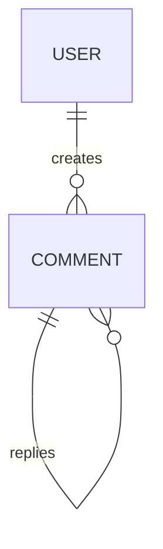

# 任务：分析当前项目并生成 database.md

你现在需要作为一名资深数据库架构师 + 后端工程师，分析当前项目实际使用的数据库结构、数据模型、索引、事务和数据访问方式，并生成：

`docs/database.md`

这个文档的目标是：

> 让第一次接触项目的开发者或 AI Agent 能够快速理解当前项目的数据模型、表结构、表之间的关系、索引设计、数据访问方式、事务边界以及数据库相关风险。

---

# 一、重要要求

1. 当前项目已经存在并且已经开发了一部分。
2. 必须以当前项目真实代码和数据库结构为事实依据。
3. 优先分析：

   - SQL 建表语句
   - migration 文件
   - MyBatis Mapper
   - JPA Entity
   - Repository
   - Service 中的数据操作
   - DAO
   - XML Mapper
   - SQL 文件
   - 测试代码
   - Docker / 数据库配置

4. 不允许根据项目经验自行创造不存在的表、字段、索引或关系。
5. 如果一个信息无法从源码确定，明确标记为：

   - `未知`
   - `待确认`

6. 不要修改任何业务代码。
7. 只允许创建或修改：

   `docs/database.md`

8. 不要为了让数据库看起来更“规范”而自行提出重构并把它写成当前状态。
9. 严格区分：

   - 当前已经存在的数据库设计
   - 当前存在的问题
   - 后续优化建议

10. 不要把未来建议写成当前数据库结构。

---

# 二、首先识别数据库系统

确认项目实际使用的数据库。

例如：

- MySQL
- PostgreSQL
- MongoDB
- Redis
- Elasticsearch

本文件主要关注关系型数据库。

如果项目同时存在：

- MySQL
- Redis
- Elasticsearch
- MongoDB

需要说明它们各自承担什么数据职责，但不要把 Redis / ES 当作 MySQL 表来描述。

---

# 三、分析数据库整体架构

说明：

- 数据库类型
- 数据库实例
- 数据库数量
- 是否存在多数据源
- 是否存在读写分离
- 是否存在主从
- 是否存在分库
- 是否存在分表
- 是否存在分区表
- 是否存在租户隔离

如果项目只是单库，就明确说明：

> 当前项目使用单数据库。

不要为了完整而虚构集群结构。

如果数据库架构无法从项目代码确定，请标记待确认。

---

# 四、分析所有核心数据表

识别项目中的核心业务表。

对于每张核心表，说明：

1. 表名
2. 表的业务含义
3. 主键
4. 核心字段
5. 唯一约束
6. 外键
7. 索引
8. 数据状态字段
9. 创建时间 / 更新时间
10. 逻辑删除字段
11. 是否存在分片字段
12. 是否存在版本字段
13. 与其他表的关系

不要把所有字段都机械地复制出来。

重点描述：

> 哪些字段对业务和数据库设计真正重要。

---

# 五、生成核心表结构

对于核心表，可以使用 Markdown 表格。

例如：

| 字段 | 类型 | 约束 | 业务含义 |
|---|---|---|---|
| id | bigint | PK | 用户 ID |
| name | varchar | NOT NULL | 用户名 |
| status | tinyint | NOT NULL | 用户状态 |
| created_at | datetime | NOT NULL | 创建时间 |

但是：

1. 字段类型必须来自实际数据库定义。
2. 不允许凭经验猜测类型。
3. 不需要把所有字段全部复制。
4. 对于核心表，可以完整列出；对于辅助表，可以只列关键字段。

---

# 六、分析表之间的关系

识别：

- 一对一
- 一对多
- 多对多
- 关联表

明确说明业务关系。

例如：

```text
User
  │
  └── 1:N
       │
       └── Comment
```

如果关系没有通过数据库外键实现，但从业务代码可以确认，也要明确说明：

> 该关系存在于业务层，但数据库未设置物理外键。

不要把业务关系错误描述为数据库外键关系。

---

# 七、绘制 ER 图

使用 Mermaid 绘制核心数据关系。

例如：



必须根据当前项目真实结构生成。

只展示核心表。

如果项目表很多，不需要把所有表全部放进去。

---

# 八、分析主键设计

重点分析：

- 自增 ID
- 雪花 ID
- UUID
- 业务 ID
- 分布式 ID
- 联合主键

说明：

1. 当前使用什么方案
2. 哪些表使用
3. 为什么从代码可以观察到采用这种方案
4. 是否存在 ID 生成器
5. 是否存在分布式环境下的考虑

不要自行推测设计原因。

如果不知道为什么使用某种 ID，请写：

> 当前代码使用 XXX，但未发现明确的设计原因。

---

# 九、分析索引设计

这是 database.md 的重点。

对于核心表分析：

- 主键索引
- 唯一索引
- 普通索引
- 联合索引
- 前缀索引
- 覆盖索引

特别关注：

- WHERE
- ORDER BY
- GROUP BY
- JOIN
- 分页查询

是否与现有索引匹配。

需要说明：

> 当前业务查询主要使用哪些索引。

不要只罗列索引名称。

---

# 十、分析 SQL 查询模式

阅读 Mapper / Repository / DAO / SQL。

找出核心 SQL。

重点分析：

- 单表查询
- JOIN
- 分页
- 聚合
- 排序
- 批量查询
- 批量插入
- 更新
- 删除

说明：

> 哪些 SQL 是核心业务路径。

不要把所有 SQL 原样复制进文档。

---

# 十一、分析分页方案

如果项目存在分页，请分析：

- LIMIT/OFFSET
- Cursor
- 基于 ID
- 基于时间
- PageHelper
- MyBatis-Plus
- 自定义分页

并说明：

1. 当前分页方式
2. 使用场景
3. 是否存在深分页风险
4. 是否存在排序一致性问题

如果项目没有分页，不要强行增加。

---

# 十二、分析事务边界

重点分析：

- `@Transactional`
- `TransactionTemplate`
- 数据库事务
- 事务传播
- rollbackFor
- 多表写入

说明：

> 哪些业务操作需要数据库事务。

例如：

```text
新增订单
↓
写订单表
↓
写订单明细表
```

是否在同一个事务里。

如果代码没有事务，请明确指出。

---

# 十三、分析数据库一致性

分析：

- 主表与从表
- 计数表
- 冗余字段
- 汇总字段
- Redis 与 MySQL
- MQ 与 MySQL
- 异步更新

例如：

```text
评论主表
评论计数表
Redis 评论缓存
```

需要说明：

- 谁是真实数据源
- 谁属于派生数据
- 谁允许暂时不一致
- 如何恢复

不要把缓存当成最终事实来源，除非代码确实如此。

---

# 十四、分析数据生命周期

对于核心业务数据，说明：

- 创建
- 修改
- 删除
- 归档
- 清理

是否存在：

- 逻辑删除
- 物理删除
- 定时任务
- 数据归档
- 数据过期

例如：

```text
创建
↓
正常使用
↓
逻辑删除
↓
后台清理
```

如果实际代码不是这样，请严格按照代码描述。

---

# 十五、分析逻辑删除

如果项目存在逻辑删除，请说明：

- 使用哪个字段
- 哪些查询需要过滤
- 删除操作如何实现
- 唯一索引是否受到影响
- 是否存在恢复机制

重点检查：

> 有没有查询忘记过滤逻辑删除字段。

如果发现问题，放入数据库风险，而不是擅自修改代码。

---

# 十六、分析并发与锁

重点分析项目实际存在的：

- 乐观锁
- 悲观锁
- `SELECT ... FOR UPDATE`
- version 字段
- 唯一约束
- 原子 UPDATE
- Redis 分布式锁

回答：

> 多个请求同时修改同一数据时，数据库如何保证正确性？

只描述实际存在的机制。

---

# 十七、分析唯一性与数据完整性

重点检查：

- UNIQUE
- NOT NULL
- CHECK
- FK
- 默认值
- 数据范围

明确：

> 哪些数据不能重复？

例如：

```text
同一个用户不能重复点赞同一个对象。
```

需要同时判断：

- 是业务代码保证
- 还是数据库唯一索引保证
- 还是两者共同保证

---

# 十八、分析数据库与代码模型的映射

说明：

- Entity
- DTO
- VO
- Mapper
- Repository

之间的关系。

特别关注：

> 数据库表是否直接映射到 Entity。

还是：

```text
数据库
↓
Entity
↓
Domain
↓
DTO
↓
VO
```

如果项目是 MyBatis，请重点分析 Mapper / XML。

如果是 JPA，请重点分析 Entity / Repository。

---

# 十九、分析数据库配置

阅读：

- application.yml
- application.properties
- datasource 配置
- HikariCP / Druid
- Docker Compose
- 数据库初始化脚本

记录：

- 驱动
- 连接池
- URL 配置方式
- 最大连接数（如果实际配置）
- 最小连接数
- 超时时间
- 字符集

注意：

**不要把密码、Token、密钥等敏感信息写入 database.md。**

如果配置文件中包含敏感信息，只描述其存在，不要复制具体值。

---

# 二十、分析数据库性能风险

增加：

`## 当前数据库风险`

只记录能够从代码或数据库结构明确发现的问题。

例如：

- 缺少必要索引
- 索引与查询不匹配
- 深分页
- 大表全表扫描
- SELECT *
- JOIN 条件不合理
- 高频更新热点行
- 单表数据量过大
- 数据库连接池配置问题
- 批量操作效率低
- 事务范围过大
- 主从延迟风险

每个风险说明：

1. 风险是什么
2. 哪张表 / 哪个 SQL
3. 为什么产生
4. 可能影响

不要仅仅根据经验猜测“可能存在”问题。

---

# 二十一、分析历史数据兼容问题

检查：

- 数据库字段是否存在默认值
- 枚举值是否扩展
- 旧数据是否存在空值
- 数据迁移脚本
- 数据版本
- 数据兼容逻辑

如果新功能需要考虑历史数据，请明确指出。

---

# 二十二、数据库变更规范

结合当前项目实际情况说明：

- 是否使用 Flyway
- 是否使用 Liquibase
- 是否使用 SQL Migration
- 是否手动修改数据库
- migration 文件在哪里
- 数据库版本如何管理

如果没有统一 migration 机制，明确指出当前状态。

---

# 二十三、后续优化建议

增加：

`## 后续数据库优化建议`

只能放：

- 当前存在的问题
- 有明确收益的优化方向

例如：

```text
1. 为评论查询增加联合索引。
2. 对深分页查询进行优化。
3. 对历史数据进行归档。
```

但必须明确标记：

> 这是后续建议，不代表当前已经实施。

---

# 二十四、AI 开发注意事项

增加：

`## AI 开发注意事项`

重点说明未来 AI 修改数据库或业务代码时必须注意：

- 哪些表是核心事实表
- 哪些表是派生表
- 哪些字段不能随便修改
- 哪些字段存在兼容性要求
- 哪些字段参与唯一约束
- 哪些索引不能随便删除
- 哪些业务操作必须在事务内
- 哪些数据允许最终一致
- 哪些数据不允许丢失
- 哪些表属于高频写入
- 哪些表存在热点风险

这些内容必须来自当前项目分析。

---

# 二十五、最终文档结构

请按照以下结构生成：

# Database

## 1. 数据库概览

## 2. 数据库架构

## 3. 核心数据表

## 4. 表结构

## 5. 表关系

## 6. ER 图

## 7. 主键与 ID 设计

## 8. 索引设计

## 9. 核心 SQL 与查询模式

## 10. 分页策略

## 11. 事务与一致性

## 12. 数据生命周期

## 13. 并发与锁

## 14. 数据完整性与唯一性

## 15. ORM / Mapper 映射

## 16. 数据源与连接池配置

## 17. 数据库变更与 Migration

## 18. 当前数据库风险

## 19. 后续数据库优化建议

## 20. AI 开发注意事项

---

# 二十六、分析流程

请严格按照以下顺序分析：

1. 阅读 README
2. 阅读项目目录
3. 找到数据库配置
4. 找到数据库建表 SQL / migration
5. 找到 Entity
6. 找到 Mapper / Repository
7. 找到 Service 中的数据读写逻辑
8. 分析核心 SQL
9. 分析事务
10. 分析索引
11. 分析数据删除和生命周期
12. 分析测试代码
13. 最后综合生成 database.md

不要只根据 Entity 生成数据库文档。

必须尽可能以真实数据库定义为准。

---

# 二十七、事实校验要求

生成文档以后，再进行一次自检。

逐条检查：

1. 表是否真实存在
2. 字段类型是否正确
3. 主键是否正确
4. 索引是否真实存在
5. 唯一约束是否真实存在
6. 外键是否真实存在
7. SQL 中的查询条件是否与文档描述一致
8. 事务边界是否与代码一致
9. 逻辑删除规则是否正确
10. 文档是否混入了不存在的数据库能力
11. 是否把优化建议错误写成当前结构

发现不确定的地方，标记为：

`待确认`

不要自行猜测。

---

# 二十八、最终输出要求

完成后：

1. 创建 `docs/database.md`
2. 不修改任何业务代码
3. 不修改数据库结构
4. 不修改 `architecture.md`
5. 不修改 `business.md`
6. 汇报：
   - 数据库类型
   - 核心数据表
   - 核心索引
   - 事务特点
   - 当前数据库风险
   - 待确认事项

再次强调：

**不要修改任何业务代码。**

**不要执行数据库结构变更。**

**不要凭经验创造表、字段、索引或约束。**

**数据库结构以真实 SQL / migration 为最高优先级。**

**业务语义以真实代码为依据。**