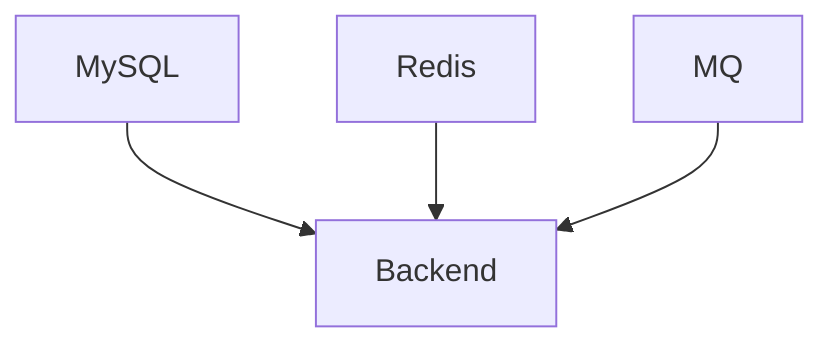

# 任务：分析当前项目并生成 development.md

你现在需要作为一名资深软件工程师 + DevOps 工程师 + Technical Lead，分析当前项目的实际开发方式、运行环境、构建流程、测试流程、代码规范、Git 工作流以及本地开发依赖，并生成：

`docs/development.md`

这个文档的目标是：

> 让一个第一次接触当前项目的开发者或 AI Coding Agent，可以根据 `development.md` 完成项目环境准备、启动项目、运行测试、执行构建、进行调试，并遵循项目现有开发规范完成代码修改。

---

# 一、重要要求

1. 当前项目已经开发了一部分。
2. 必须以当前项目真实配置和实际代码为依据。
3. 优先阅读：

   - `README.md`
   - `AGENTS.md`
   - `pom.xml`
   - `build.gradle`
   - `package.json`
   - `docker-compose.yml`
   - `Dockerfile`
   - GitHub Actions / CI 配置
   - Maven / Gradle 配置
   - `.env.example`
   - application.yml / application.properties
   - 测试代码
   - Makefile
   - shell scripts
   - PowerShell scripts
   - 启动脚本
   - 数据库初始化脚本

4. 不要根据经验编造开发流程。
5. 如果项目没有某个工具或流程，不要强行添加。
6. 如果无法确定某项信息，明确写：
   - `未知`
   - `待确认`
7. 不要修改任何业务代码。
8. 只允许创建或修改：

   `docs/development.md`

9. 不要为了完善文档而重构项目。
10. 不要把“推荐开发方式”误写成“当前项目已经采用的开发方式”。

---

# 二、分析项目运行环境

首先确认当前项目需要什么运行环境。

分析：

- 操作系统要求
- JDK 版本
- Node.js 版本（如果存在）
- npm / pnpm / yarn
- Maven / Gradle
- Docker
- Docker Compose
- Python
- Go
- 其他实际依赖

如果项目存在版本文件，例如：

- `.java-version`
- `.nvmrc`
- `gradle-wrapper.properties`
- Maven Wrapper
- Dockerfile

优先使用这些文件中的信息。

---

# 三、分析项目依赖

找出开发项目所需要的外部服务。

例如：

- MySQL
- Redis
- RocketMQ
- Kafka
- Nacos
- Elasticsearch
- MinIO
- RabbitMQ

对于每个服务说明：

1. 为什么项目需要它
2. 本地开发是否必须启动
3. 是否可以通过 Docker 启动
4. 默认连接地址（如果没有敏感信息）
5. 配置在哪里
6. 初始化方式

不要泄露：

- 密码
- Token
- API Key
- 私钥
- Secret

如果存在敏感配置，只说明：

> 该配置需要通过环境变量提供。

---

# 四、分析项目初始化流程

说明一个新开发者第一次获取项目以后需要做什么。

例如：

```text
1. Clone 项目
2. 安装 JDK
3. 启动 MySQL
4. 初始化数据库
5. 启动 Redis
6. 启动应用
```

必须以当前项目实际情况为准。

如果存在：

```text
mvnw
gradlew
npm install
docker compose up
```

优先使用项目已经提供的脚本。

不要要求开发者安装项目中没有使用的工具。

---

# 五、分析环境配置

分析：

- application.yml
- application-dev.yml
- application-test.yml
- application-prod.yml
- `.env`
- `.env.example`
- Docker 环境变量
- JVM 参数

说明：

### 必须配置

项目启动必需的配置。

### 可选配置

某些功能需要，但不是基础启动必须。

### 环境相关配置

例如：

- 开发环境
- 测试环境
- 生产环境

不要复制真实密码。

例如可以写：

```text
DATABASE_PASSWORD=<your-password>
```

而不是写真实密码。

---

# 六、分析如何启动项目

必须从真实项目中确认启动方式。

例如：

```bash
./mvnw spring-boot:run
```

或者：

```bash
docker compose up -d
```

或者：

```bash
java -jar xxx.jar
```

如果项目存在多个服务，需要说明：

1. 启动顺序
2. 每个服务如何启动
3. 哪些服务必须启动
4. 哪些服务可选

如果存在依赖关系，请绘制 Mermaid。

例如：



---

# 七、分析如何停止项目

说明：

- 如何停止本地服务
- 如何停止 Docker 服务
- 如何清理临时资源

例如：

```bash
docker compose down
```

必须根据项目实际命令生成。

---

# 八、分析构建流程

说明：

- 开发构建
- 测试构建
- 生产构建
- 打包方式

例如 Maven 项目需要说明：

```bash
./mvnw clean package
```

同时说明：

- 是否会自动运行测试
- 构建产物在哪里
- 是否跳过测试
- 是否存在 profile

如果存在不同 profile，请说明用途。

---

# 九、分析测试体系

这是 development.md 的重点。

分析项目实际存在的：

- Unit Test
- Integration Test
- E2E Test
- API Test
- Contract Test

说明：

1. 测试框架
2. 测试目录
3. 如何运行
4. 如何运行单个测试
5. 如何运行某个测试类
6. 如何运行完整测试
7. 测试是否依赖数据库
8. 测试是否依赖 Redis / MQ
9. 是否有 Testcontainers
10. 测试数据如何准备

例如：

```bash
./mvnw test
```

或者：

```bash
./mvnw -Dtest=CommentServiceTest test
```

只能使用项目实际支持的命令。

---

# 十、分析代码格式与静态检查

检查项目是否使用：

- Checkstyle
- Spotless
- PMD
- SonarQube
- ESLint
- Prettier
- Checkstyle
- Error Prone

说明：

- 如何执行
- 是否属于 CI 必须步骤
- 本地开发是否建议执行

如果没有，不要自行添加。

---

# 十一、分析代码规范

从现有项目代码中总结：

- 命名规范
- 包结构
- Controller 规范
- Service 规范
- DAO / Mapper 规范
- DTO / VO 使用方式
- 异常处理
- 日志
- 注释
- Lombok 使用
- Optional 使用
- null 处理
- 常量定义
- 工具类规范

不要创造一套新的编码规范。

目标是：

> 总结项目当前真正存在的开发习惯。

---

# 十二、分析日志与调试方式

分析：

- 日志框架
- 日志级别
- 日志配置
- 日志目录
- Trace ID
- 请求 ID
- 调试方式

说明开发者如何：

1. 查看应用日志
2. 查看错误日志
3. 查看 SQL 日志（如果存在）
4. 查看 MQ 日志（如果存在）
5. 查看 Redis 相关日志（如果存在）

如果项目支持 Debug，请说明：

- IDE 如何启动 Debug
- 使用什么端口（如果可以确定）

不要泄露敏感信息。

---

# 十三、分析数据库开发流程

结合 `database.md` 分析实际开发方式。

说明：

- 修改数据库结构应该怎么做
- migration 文件在哪里
- 如何初始化数据库
- 如何执行 migration
- 是否允许直接修改开发数据库
- 测试数据库怎么处理

如果项目使用 Flyway：

说明：

```text
src/main/resources/db/migration/
```

以及当前项目的命名规则。

如果没有 migration 工具，也必须如实记录。

---

# 十四、分析 Redis 开发流程

如果项目使用 Redis，说明开发阶段：

- Redis 如何启动
- 如何连接
- Key 如何调试
- 是否有 Redis CLI
- 如何清理开发缓存

同时提醒：

> 不要连接生产 Redis 执行清理操作。

只描述实际项目已有工具或方式。

---

# 十五、分析 MQ 开发流程

如果项目使用 RocketMQ / Kafka / RabbitMQ 等：

说明：

- 本地怎么启动
- Producer / Consumer 怎么运行
- Topic 怎么准备
- 如何查看消息
- 如何排查消费失败

如果当前项目没有这些管理工具，则明确说明。

---

# 十六、分析 Git 工作流

分析当前仓库：

- branch
- commit
- pull request
- code review
- merge
- tag

如果存在：

- GitHub Actions
- GitLab CI
- Jenkins

需要分析 CI 流程。

不要自行制定新的 Git Flow，除非项目当前确实已经采用。

如果项目没有明确规范，请写：

> 当前项目未发现统一 Git 分支规范。

---

# 十七、分析 Commit 规范

检查是否存在：

- Conventional Commits
- commitlint
- `.gitmessage`
- Husky
- Git hooks

如果发现规范，记录实际规范。

例如：

```text
feat:
fix:
refactor:
test:
docs:
chore:
```

如果没有，不要自行定义。

---

# 十八、分析 CI/CD

如果项目存在 CI，请分析：

- 触发条件
- 构建
- 测试
- 静态检查
- Docker 镜像构建
- 部署

例如：

```text
Push
↓
Build
↓
Test
↓
Docker Build
↓
Deploy
```

使用 Mermaid 描述实际流程。

如果没有 CI/CD：

明确写：

> 当前仓库未发现自动化 CI/CD 配置。

---

# 十九、分析常见开发问题

增加：

`## 常见问题`

从实际项目中总结可能遇到的问题。

例如：

- JDK 版本不正确
- Docker 服务未启动
- Redis 连接失败
- 数据库初始化失败
- 端口被占用
- 配置文件缺失
- MQ 未启动
- 测试数据库连接失败

对于每个问题说明：

1. 表现
2. 原因
3. 解决方法

不要凭空创造问题。

---

# 二十、分析开发安全边界

增加：

`## 开发安全注意事项`

必须明确：

- 不要提交密码
- 不要提交 Token
- 不要提交 API Key
- 不要提交私钥
- 不要把生产数据库配置放入本地配置
- 不要使用生产 Redis 做测试
- 不要直接修改生产数据库

但如果项目已经有明确安全规范，请优先引用项目现有规则。

---

# 二十一、分析性能相关开发注意事项

如果项目中存在：

- Redis
- MQ
- MySQL
- ThreadPool
- Netty
- Elasticsearch

请记录开发过程中需要注意的实际事项。

例如：

- 不要在循环中执行单条 SQL
- 不要无限创建线程
- MQ Consumer 必须保证幂等
- Redis Key 必须遵循现有规范

这些注意事项必须与项目真实代码相关。

---

# 二十二、分析代码变更流程

描述一个正常功能开发任务应该如何完成。

建议根据项目当前情况形成：

```text
需求
↓
阅读 architecture.md
↓
阅读 business.md
↓
阅读 database.md
↓
创建 TASK
↓
开发
↓
单元测试
↓
集成测试
↓
Code Review
↓
Commit / PR
```

注意：

如果项目尚未采用这种流程，请明确：

> 这是建议的 AI 辅助开发流程，而不是当前项目已有流程。

不要混淆。

---

# 二十三、AI Coding Agent 开发规范

增加：

`## AI Agent Development Rules`

结合当前项目实际情况，说明未来 AI Agent 修改代码时：

1. 必须先阅读哪些文档
2. 修改代码前需要确认什么
3. 哪些目录不能随意修改
4. 是否允许增加依赖
5. 是否必须增加测试
6. 是否必须运行测试
7. 是否必须检查 Git diff
8. 是否需要更新文档
9. 哪些文件属于敏感配置
10. 哪些操作禁止执行

注意：

这里的内容必须结合当前项目实际情况。

如果项目尚未制定规范，请标记为建议，而不是伪装成已有规范。

---

# 二十四、文档结构

最终 `docs/development.md` 使用以下结构：

# Development

## 1. 开发环境要求

## 2. 项目依赖

## 3. 项目初始化

## 4. 环境配置

## 5. 本地启动

## 6. 停止与清理

## 7. 构建与打包

## 8. 测试

## 9. 代码格式与静态检查

## 10. 编码规范

## 11. 日志与调试

## 12. 数据库开发

## 13. Redis 开发

## 14. MQ 开发

## 15. Git 工作流

## 16. Commit 规范

## 17. CI/CD

## 18. 常见问题

## 19. 开发安全注意事项

## 20. AI Agent Development Rules

---

# 二十五、分析流程

请严格按照以下顺序进行分析：

1. 阅读 README
2. 阅读 AGENTS.md
3. 分析项目目录
4. 分析构建工具
5. 分析依赖
6. 分析配置
7. 分析 Docker
8. 分析启动方式
9. 分析测试
10. 分析代码格式工具
11. 分析 Git / CI
12. 分析数据库初始化
13. 分析 Redis / MQ 本地开发方式
14. 分析日志和调试方式
15. 最后生成 development.md

不要只根据 README 写文档。

---

# 二十六、事实准确性检查

生成 `development.md` 后，再做一次事实检查：

1. 所有命令是否真实存在
2. 启动方式是否真实
3. 构建命令是否正确
4. 测试命令是否正确
5. Docker Compose 服务是否真实存在
6. 所需环境变量是否真实存在
7. JDK / Node / Maven / Gradle 版本是否正确
8. CI 配置是否真实存在
9. Git 工作流是否真实存在
10. 文档中是否出现了虚构的工具或流程

如果无法确认，标记：

`待确认`

不要自行猜测。

---

# 二十七、敏感信息处理

绝对不要把以下内容写入文档：

- 密码
- Access Token
- Secret
- API Key
- 私钥
- 数据库真实密码
- 生产环境凭证

可以使用：

```text
<your-password>
<your-token>
<your-api-key>
```

或者说明：

> 通过环境变量提供。

---

# 二十八、最终输出要求

完成后：

1. 创建 `docs/development.md`
2. 不修改任何业务代码
3. 不修改 `architecture.md`
4. 不修改 `business.md`
5. 不修改 `database.md`
6. 不执行数据库结构变更
7. 不提交任何 Git commit

最后汇报：

- 开发环境要求
- 项目启动方法
- 测试方法
- 构建方法
- 本地依赖
- CI/CD 情况
- 当前开发规范
- 当前发现的问题
- 无法确认的信息

再次强调：

**以项目真实配置和脚本为事实依据。**

**不要根据经验虚构开发流程。**

**不要泄露任何敏感配置。**

**不要修改业务代码。**