# 基础篇

## MySQL 执行流程是怎样的？


可以看到， MySQL 的架构共分为两层：**Server 层和存储引擎层**

- **Server 层负责建立连接、分析和执行 SQL**。MySQL 大多数的核心功能模块都在这实现，主要包括连接器，查询缓存、解析器、预处理器、优化器、执行器等。另外，所有的内置函数（如日期、时间、数学和加密函数等）和所有跨存储引擎的功能（如存储过程、触发器、视图等。）都在 Server 层实现。

- **存储引擎层负责数据的存储和提取**。支持 InnoDB、MyISAM、Memory 等多个存储引擎，不同的存储引擎共用一个 Server 层。现在最常用的存储引擎是 InnoDB，从 MySQL 5.5 版本开始， InnoDB 成为了 MySQL 的默认存储引擎。我们常说的索引数据结构，就是由存储引擎层实现的，不同的存储引擎支持的索引类型也不相同，比如 InnoDB 支持索引类型是 B+树 ，且是默认使用，也就是说在数据表中创建的主键索引和二级索引默认使用的是 B+ 树索引。

### 第一步：连接器

如果你在 Linux 操作系统里要使用 MySQL，那你第一步肯定是要先连接 MySQL 服务，然后才能执行 SQL 语句，普遍我们都是使用下面这条命令进行连接：


```bash
# -h 指定 MySQL 服务得 IP 地址，如果是连接本地的 MySQL服务，可以不用这个参数；
# -u 指定用户名，管理员角色名为 root；
# -p 指定密码，如果命令行中不填写密码（为了密码安全，建议不要在命令行写密码），就需要在交互对话里面输入密码
mysql -h$ip -u$user -p
```

连接的过程需要先经过 TCP 三次握手，因为 MySQL 是基于 TCP 协议进行传输的，如果 MySQL 服务并没有启动，则会收到如下的报错：


如果 MySQL 服务正常运行，完成 TCP 连接的建立后，连接器就要开始验证你的用户名和密码，如果用户名或密码不对，就收到一个"Access denied for user"的错误，然后客户端程序结束执行。


如果用户密码都没有问题，连接器就会获取该用户的权限，然后保存起来，后续该用户在此连接里的任何操作，都会基于连接开始时读到的权限进行权限逻辑的判断。

所以，如果一个用户已经建立了连接，即使管理员中途修改了该用户的权限，也不会影响已经存在连接的权限。修改完成后，只有再新建的连接才会使用新的权限设置。

> 如何查看 MySQL 服务被多少个客户端连接了？

如果你想知道当前 MySQL 服务被多少个客户端连接了，你可以执行 `show processlist` 命令进行查看。


比如上图的显示结果，共有两个用户名为 root 的用户连接了 MySQL 服务，其中 id 为 6 的用户的 Command 列的状态为 `Sleep` ，这意味着该用户连接完 MySQL 服务就没有再执行过任何命令，也就是说这是一个空闲的连接，并且空闲的时长是 736 秒（ Time 列）。

> 空闲连接会一直占用着吗？

当然不是了，MySQL 定义了空闲连接的最大空闲时长，由 `wait_timeout` 参数控制的，默认值是 8 小时（28880秒），如果空闲连接超过了这个时间，连接器就会自动将它断开。

```
mysql> show variables like 'wait_timeout';
+---------------+-------+
| Variable_name | Value |
+---------------+-------+
| wait_timeout  | 28800 |
+---------------+-------+
1 row in set (0.00 sec)
```

当然，我们自己也可以手动断开空闲的连接，使用的是 kill connection + id 的命令。

```
mysql> kill connection +6;
Query OK, 0 rows affected (0.00 sec)
```

一个处于空闲状态的连接被服务端主动断开后，这个客户端并不会马上知道，等到客户端在发起下一个请求的时候，才会收到这样的报错“ERROR 2013 (HY000): Lost connection to MySQL server during query”。

> MySQL 的连接数有限制吗？

MySQL 服务支持的最大连接数由 max_connections 参数控制，比如我的 MySQL 服务默认是 151 个,超过这个值，系统就会拒绝接下来的连接请求，并报错提示“Too many connections”。

```
mysql> show variables like 'max_connections';
+-----------------+-------+
| Variable_name   | Value |
+-----------------+-------+
| max_connections | 151   |
+-----------------+-------+
1 row in set (0.00 sec)
```

MySQL 的连接也跟 HTTP 一样，有短连接和长连接的概念，它们的区别如下：

```
// 短连接
连接 mysql 服务（TCP 三次握手）
执行sql
断开 mysql 服务（TCP 四次挥手）

// 长连接
连接 mysql 服务（TCP 三次握手）
执行sql
执行sql
执行sql
....
断开 mysql 服务（TCP 四次挥手）
```

可以看到，使用长连接的好处就是可以减少建立连接和断开连接的过程，所以一般是推荐使用长连接。

但是，使用长连接后可能会占用内存增多，因为 MySQL 在执行查询过程中临时使用内存管理连接对象，这些连接对象资源只有在连接断开时才会释放。如果长连接累计很多，将导致 MySQL 服务占用内存太大，有可能会被系统强制杀掉，这样会发生 MySQL 服务异常重启的现象。

> 怎么解决长连接占用内存的问题？

有两种解决方式。

第一种，**定期断开长连接**。既然断开连接后就会释放连接占用的内存资源，那么我们可以定期断开长连接。

第二种，**客户端主动重置连接**。MySQL 5.7 版本实现了 `mysql_reset_connection()` 函数的接口，注意这是接口函数不是命令，那么当客户端执行了一个很大的操作后，在代码里调用 mysql_reset_connection 函数来重置连接，达到释放内存的效果。这个过程不需要重连和重新做权限验证，但是会将连接恢复到刚刚创建完时的状态。

至此，连接器的工作做完了，简单总结一下：

- 与客户端进行 TCP 三次握手建立连接；
- 校验客户端的用户名和密码，如果用户名或密码不对，则会报错；
- 如果用户名和密码都对了，会读取该用户的权限，然后后面的权限逻辑判断都基于此时读取到的权限；


### 第二步：查询缓存

连接器得工作完成后，客户端就可以向 MySQL 服务发送 SQL 语句了，MySQL 服务收到 SQL 语句后，就会解析出 SQL 语句的第一个字段，看看是什么类型的语句。

如果 SQL 是查询语句（select 语句），MySQL 就会先去查询缓存（ Query Cache ）里查找缓存数据，看看之前有没有执行过这一条命令，这个查询缓存是以 key-value 形式保存在内存中的，key 为 SQL 查询语句，value 为 SQL 语句查询的结果。

如果查询的语句命中查询缓存，那么就会直接返回 value 给客户端。如果查询的语句没有命中查询缓存中，那么就要往下继续执行，等执行完后，查询的结果就会被存入查询缓存中。

这么看，查询缓存还挺有用，但是其实**查询缓存挺鸡肋**的。

对于更新比较频繁的表，查询缓存的命中率很低的，因为只要一个表有更新操作，那么这个表的查询缓存就会被清空。如果刚缓存了一个查询结果很大的数据，还没被使用的时候，刚好这个表有更新操作，查询缓冲就被清空了，相当于缓存了个寂寞。

所以，MySQL 8.0 版本直接将查询缓存删掉了，也就是说 MySQL 8.0 开始，执行一条 SQL 查询语句，不会再走到查询缓存这个阶段了。

对于 MySQL 8.0 之前的版本，如果想关闭查询缓存，我们可以通过将参数 query_cache_type 设置成 DEMAND。

>TIP
>这里说的查询缓存是 server 层的，也就是 MySQL 8.0 版本移除的是 server 层的查询缓存，并不是 Innodb 存储引擎中的 buffer pool。

### 第三步：解析 SQL

在正式执行 SQL 查询语句之前， MySQL 会先对 SQL 语句做解析，这个工作交由「解析器」来完成。

#### 解析器

解析器会做如下两件事情。

第一件事情，**词法分析**。MySQL 会根据你输入的字符串识别出关键字出来，例如，SQL语句 select username from userinfo，在分析之后，会得到 4 个Token，其中有 2 个 Keyword，分别为 select 和 from：

| 关键字    | 非关键字     | 关键字  | 非关键字     |
| ------ | -------- | ---- | -------- |
| select | username | from | userinfo |

第二件事情，**语法分析**。根据词法分析的结果，语法解析器会根据语法规则，判断你输入的这个 SQL 语句是否满足 MySQL 语法，如果没问题就会构建出 SQL 语法树，这样方便后面模块获取 SQL 类型、表名、字段名、 where 条件等等。


如果我们输入的 SQL 语句语法不对，就会在解析器这个阶段报错。比如，我下面这条查询语句，把 from 写成了 form，这时 MySQL 解析器就会给报错。


### 第四步：执行 SQL

经过解析器后，接着就要进入执行 SQL 查询语句的流程了，每条`SELECT` 查询语句流程主要可以分为下面这三个阶段：

- prepare 阶段，也就是预处理阶段；
- optimize 阶段，也就是优化阶段；
- execute 阶段，也就是执行阶段；

#### 预处理器

我们先来说说预处理阶段做了什么事情。

- 检查 SQL 查询语句中的表或者字段是否存在；
- 将 `select *` 中的 `*` 符号，扩展为表上的所有列；

我下面这条查询语句，test 这张表是不存在的，这时 MySQL 就会在执行 SQL 查询语句的 prepare 阶段中报错。


#### 优化器

经过预处理阶段后，还需要为 SQL 查询语句先制定一个执行计划，这个工作交由「优化器」来完成的。

**优化器主要负责将 SQL 查询语句的执行方案确定下来**，比如在表里面有多个索引的时候，优化器会基于查询成本的考虑，来决定选择使用哪个索引。

当然，我们本次的查询语句（select * from product where id = 1）很简单，就是选择使用主键索引。

要想知道优化器选择了哪个索引，我们可以在查询语句最前面加个 `explain` 命令，这样就会输出这条 SQL 语句的执行计划，然后执行计划中的 key 就表示执行过程中使用了哪个索引，比如下图的 key 为 `PRIMARY` 就是使用了主键索引。


#### 执行器

经历完优化器后，就确定了执行方案，接下来 MySQL 就真正开始执行语句了，这个工作是由「执行器」完成的。在执行的过程中，执行器就会和存储引擎交互了，交互是以记录为单位的。

接下来，用三种方式执行过程，跟大家说一下执行器和存储引擎的交互过程（PS ：为了写好这一部分，特地去看 MySQL 源码，也是第一次看哈哈）。

- 主键索引查询
- 全表扫描
- 索引下推

##### 主键索引查询

以本文开头查询语句为例，看看执行器是怎么工作的。

```
select * from product where id = 1;
```

这条查询语句的查询条件用到了主键索引，而且是等值查询，同时主键 id 是唯一，不会有 id 相同的记录，所以优化器决定选用访问类型为 const 进行查询，也就是使用主键索引查询一条记录，那么执行器与存储引擎的执行流程是这样的：

- 执行器第一次查询，会调用 read_first_record 函数指针指向的函数，因为优化器选择的访问类型为 const，这个函数指针被指向为 InnoDB 引擎索引查询的接口，把条件 `id = 1` 交给存储引擎，**让存储引擎定位符合条件的第一条记录**。
- 存储引擎通过主键索引的 B+ 树结构定位到 id = 1的第一条记录，如果记录是不存在的，就会向执行器上报记录找不到的错误，然后查询结束。如果记录是存在的，就会将记录返回给执行器；
- 执行器从存储引擎读到记录后，接着判断记录是否符合查询条件，如果符合则发送给客户端，如果不符合则跳过该记录。
- 执行器查询的过程是一个 while 循环，所以还会再查一次，但是这次因为不是第一次查询了，所以会调用 read_record 函数指针指向的函数，因为优化器选择的访问类型为 const，这个函数指针被指向为一个永远返回 - 1 的函数，所以当调用该函数的时候，执行器就退出循环，也就是结束查询了。

至此，这个语句就执行完成了。

##### 全表扫描

举个全表扫描的例子：

```
select * from product where name = 'iphone';
```

这条查询语句的查询条件没有用到索引，所以优化器决定选用访问类型为 ALL 进行查询，也就是全表扫描的方式查询，那么这时执行器与存储引擎的执行流程是这样的：

- 执行器第一次查询，会调用 read_first_record 函数指针指向的函数，因为优化器选择的访问类型为 all，这个函数指针被指向为 InnoDB 引擎全扫描的接口，**让存储引擎读取表中的第一条记录**；
- 执行器会判断读到的这条记录的 name 是不是 iphone，如果不是则跳过；如果是则将记录发给客户的（是的没错，Server 层每从存储引擎读到一条记录就会发送给客户端，之所以客户端显示的时候是直接显示所有记录的，是因为客户端是等查询语句查询完成后，才会显示出所有的记录）。
- 执行器查询的过程是一个 while 循环，所以还会再查一次，会调用 read_record 函数指针指向的函数，因为优化器选择的访问类型为 all，read_record 函数指针指向的还是 InnoDB 引擎全扫描的接口，所以接着向存储引擎层要求继续读刚才那条记录的下一条记录，存储引擎把下一条记录取出后就将其返回给执行器（Server层），执行器继续判断条件，不符合查询条件即跳过该记录，否则发送到客户端；
- 一直重复上述过程，直到存储引擎把表中的所有记录读完，然后向执行器（Server层） 返回了读取完毕的信息；
- 执行器收到存储引擎报告的查询完毕的信息，退出循环，停止查询。

至此，这个语句就执行完成了

##### 索引下推

在这部分非常适合讲索引下推（MySQL 5.6 推出的查询优化策略），这样大家能清楚的知道，「下推」这个动作，下推到了哪里。

索引下推能够减少**二级索引**在查询时的回表操作，提高查询的效率，因为它将 Server 层部分负责的事情，交给存储引擎层去处理了。

举一个具体的例子，方便大家理解，这里一张用户表如下，我对 age 和 reward 字段建立了联合索引（age，reward）：


现在有下面这条查询语句：

```
select * from t_user  where age > 20 and reward = 100000;
```

联合索引当遇到范围查询 (>、<) 就会停止匹配，也就是 **age 字段能用到联合索引，但是 reward 字段则无法利用到索引**。具体原因这里可以看这篇：[索引常见面试题(opens new window)](https://xiaolincoding.com/mysql/index/index_interview.html#%E6%8C%89%E5%AD%97%E6%AE%B5%E4%B8%AA%E6%95%B0%E5%88%86%E7%B1%BB)

那么，不使用索引下推（MySQL 5.6 之前的版本）时，执行器与存储引擎的执行流程是这样的：

- Server 层首先调用存储引擎的接口定位到满足查询条件的第一条二级索引记录，也就是定位到 age > 20 的第一条记录；
- 存储引擎根据二级索引的 B+ 树快速定位到这条记录后，获取主键值，然后**进行回表操作**，将完整的记录返回给 Server 层；
- Server 层在判断该记录的 reward 是否等于 100000，如果成立则将其发送给客户端；否则跳过该记录；
- 接着，继续向存储引擎索要下一条记录，存储引擎在二级索引定位到记录后，获取主键值，然后回表操作，将完整的记录返回给 Server 层；
- 如此往复，直到存储引擎把表中的所有记录读完。

可以看到，没有索引下推的时候，每查询到一条二级索引记录，都要进行回表操作，然后将记录返回给 Server，接着 Server 再判断该记录的 reward 是否等于 100000。

而使用索引下推后，判断记录的 reward 是否等于 100000 的工作交给了存储引擎层，过程如下 ：

- Server 层首先调用存储引擎的接口定位到满足查询条件的第一条二级索引记录，也就是定位到 age > 20 的第一条记录；
- 存储引擎定位到二级索引后，**先不执行回表**操作，而是先判断一下该索引中包含的列（reward列）的条件（reward 是否等于 100000）是否成立。如果**条件不成立**，则直接**跳过该二级索引**。如果**成立**，则**执行回表**操作，将完成记录返回给 Server 层。
- Server 层在判断其他的查询条件（本次查询没有其他条件）是否成立，如果成立则将其发送给客户端；否则跳过该记录，然后向存储引擎索要下一条记录。
- 如此往复，直到存储引擎把表中的所有记录读完。

可以看到，使用了索引下推后，虽然 reward 列无法使用到联合索引，但是因为它包含在联合索引（age，reward）里，所以直接在存储引擎过滤出满足 reward = 100000 的记录后，才去执行回表操作获取整个记录。相比于没有使用索引下推，节省了很多回表操作。

当你发现执行计划里的 Extr 部分显示了 “Using index condition”，说明使用了索引下推。


## MySQL 一行记录是怎么存储的？

### 表空间文件的结构是怎么样的？

**表空间由段（segment）、区（extent）、页（page）、行（row）组成**，InnoDB存储引擎的逻辑存储结构大致如下图：


#### 1、行（row）

数据库表中的记录都是按行（row）进行存放的，每行记录根据不同的行格式，有不同的存储结构。

后面我们详细介绍 InnoDB 存储引擎的行格式，也是本文重点介绍的内容。

#### 2、页（page）

记录是按照行来存储的，但是数据库的读取并不以「行」为单位，否则一次读取（也就是一次 I/O 操作）只能处理一行数据，效率会非常低。

因此，**InnoDB 的数据是按「页」为单位来读写的**，也就是说，当需要读一条记录的时候，并不是将这个行记录从磁盘读出来，而是以页为单位，将其整体读入内存。

**默认每个页的大小为 16KB**，也就是最多能保证 16KB 的连续存储空间。

页是 InnoDB 存储引擎磁盘管理的最小单元，意味着数据库每次读写都是以 16KB 为单位的，一次最少从磁盘中读取 16K 的内容到内存中，一次最少把内存中的 16K 内容刷新到磁盘中。

页的类型有很多，常见的有数据页、undo 日志页、溢出页等等。数据表中的行记录是用「数据页」来管理的，数据页的结构这里我就不讲细说了，之前文章有说过，感兴趣的可以去看这篇文章：[换一个角度看 B+ 树(opens new window)](https://xiaolincoding.com/mysql/index/page.html)

总之知道表中的记录存储在「数据页」里面就行。

#### 3、区（extent）

我们知道 InnoDB 存储引擎是用 B+ 树来组织数据的。

B+ 树中每一层都是通过双向链表连接起来的，如果是以页为单位来分配存储空间，那么链表中相邻的两个页之间的物理位置并不是连续的，可能离得非常远，那么磁盘查询时就会有大量的随机I/O，随机 I/O 是非常慢的。

解决这个问题也很简单，就是让链表中相邻的页的物理位置也相邻，这样就可以使用顺序 I/O 了，那么在范围查询（扫描叶子节点）的时候性能就会很高。

那具体怎么解决呢？

**在表中数据量大的时候，为某个索引分配空间的时候就不再按照页为单位分配了，而是按照区（extent）为单位分配。每个区的大小为 1MB，对于 16KB 的页来说，连续的 64 个页会被划为一个区，这样就使得链表中相邻的页的物理位置也相邻，就能使用顺序 I/O 了**。

#### 4、段（segment）

表空间是由各个段（segment）组成的，段是由多个区（extent）组成的。段一般分为数据段、索引段和回滚段等。

- 索引段：存放 B + 树的非叶子节点的区的集合；
- 数据段：存放 B + 树的叶子节点的区的集合；
- 回滚段：存放的是回滚数据的区的集合，之前讲 [事务隔离 (opens new window)](https://xiaolincoding.com/mysql/transaction/mvcc.html) 的时候就介绍到了 MVCC 利用了回滚段实现了多版本查询数据。

好了，终于说完表空间的结构了。接下来，就具体讲一下 InnoDB 的行格式了。

之所以要绕一大圈才讲行记录的格式，主要是想让大家知道行记录是存储在哪个文件，以及行记录在这个表空间文件中的哪个区域，有一个从上往下切入的视角，这样理解起来不会觉得很抽象。

### InnoDB 行格式有哪些？

行格式（row_format），就是一条记录的存储结构。

InnoDB 提供了 4 种行格式，分别是 Redundant、Compact、Dynamic和 Compressed 行格式。

- Redundant 是很古老的行格式了， MySQL 5.0 版本之前用的行格式，现在基本没人用了。
- 由于 Redundant 不是一种紧凑的行格式，所以 MySQL 5.0 之后引入了 Compact 行记录存储方式，Compact 是一种紧凑的行格式，设计的初衷就是为了让一个数据页中可以存放更多的行记录，从 MySQL 5.1 版本之后，行格式默认设置成 Compact。
- Dynamic 和 Compressed 两个都是紧凑的行格式，它们的行格式都和 Compact 差不多，因为都是基于 Compact 改进一点东西。从 MySQL5.7 版本之后，默认使用 Dynamic 行格式。

Redundant 行格式我这里就不讲了，因为现在基本没人用了，这次重点介绍 Compact 行格式，因为 Dynamic 和 Compressed 这两个行格式跟 Compact 非常像。

所以，弄懂了 Compact 行格式，之后你们在去了解其他行格式，很快也能看懂。

### COMPACT 行格式长什么样？


可以看到，一条完整的记录分为「记录的额外信息」和「记录的真实数据」两个部分。

#### 记录的额外信息

记录的额外信息包含 3 个部分：变长字段长度列表、NULL 值列表、记录头信息。

##### 1. 变长字段长度列表

varchar(n) 和 char(n) 的区别是什么，相信大家都非常清楚，char 是定长的，varchar 是变长的，变长字段实际存储的数据的长度（大小）不固定的。

所以，在存储数据的时候，也要把数据占用的大小存起来，存到「变长字段长度列表」里面，读取数据的时候才能根据这个「变长字段长度列表」去读取对应长度的数据。其他 TEXT、BLOB 等变长字段也是这么实现的。

为了展示「变长字段长度列表」具体是怎么保存「变长字段的真实数据占用的字节数」，我们先创建这样一张表，字符集是 ascii（所以每一个字符占用的 1 字节），行格式是 Compact，t_user 表中 name 和 phone 字段都是变长字段：

```sql
CREATE TABLE `t_user` (
  `id` int(11) NOT NULL,
  `name` VARCHAR(20) DEFAULT NULL,
  `phone` VARCHAR(20) DEFAULT NULL,
  `age` int(11) DEFAULT NULL,
  PRIMARY KEY (`id`) USING BTREE
) ENGINE = InnoDB DEFAULT CHARACTER SET = ascii ROW_FORMAT = COMPACT;
```

现在 t_user 表里有这三条记录：


接下来，我们看看看看这三条记录的行格式中的 「变长字段长度列表」是怎样存储的。

先来看第一条记录：

- name 列的值为 a，真实数据占用的字节数是 1 字节，十六进制 0x01；
- phone 列的值为 123，真实数据占用的字节数是 3 字节，十六进制 0x03；
- age 列和 id 列不是变长字段，所以这里不用管。

这些变长字段的真实数据占用的字节数会按照列的顺序**逆序存放**（等下会说为什么要这么设计），所以「变长字段长度列表」里的内容是「 03 01」，而不是 「01 03」。


同样的道理，我们也可以得出**第二条记录**的行格式中，「变长字段长度列表」里的内容是「 04 02」，如下图：


**第三条记录**中 phone 列的值是 NULL，**NULL 是不会存放在行格式中记录的真实数据部分里的**，所以「变长字段长度列表」里不需要保存值为 NULL 的变长字段的长度。


>为什么「变长字段长度列表」的信息要按照逆序存放？

这个设计是有想法的，主要是因为「记录头信息」中指向下一个记录的指针，指向的是下一条记录的「记录头信息」和「真实数据」之间的位置，这样的好处是向左读就是记录头信息，向右读就是真实数据，比较方便。

「变长字段长度列表」中的信息之所以要逆序存放，是因为这样可以**使得位置靠前的记录的真实数据和数据对应的字段长度信息可以同时在一个 CPU Cache Line 中，这样就可以提高 CPU Cache 的命中率**。

同样的道理， NULL 值列表的信息也需要逆序存放。

如果你不知道什么是 CPU Cache，可以看[这篇文章 (opens new window)](https://xiaolincoding.com/os/1_hardware/how_to_make_cpu_run_faster.html)，这属于计算机组成的知识。

>每个数据库表的行格式都有「变长字段字节数列表」吗？

其实变长字段字节数列表不是必须的。

**当数据表没有变长字段的时候，比如全部都是 int 类型的字段，这时候表里的行格式就不会有「变长字段长度列表」了**，因为没必要，不如去掉以节省空间。

所以「变长字段长度列表」只出现在数据表有变长字段的时候。

##### 2. NULL 值列表

表中的某些列可能会存储 NULL 值，如果把这些 NULL 值都放到记录的真实数据中会比较浪费空间，所以 Compact 行格式把这些值为 NULL 的列存储到 NULL值列表中。

如果存在允许 NULL 值的列，则每个列对应一个二进制位（bit），二进制位按照列的顺序逆序排列。

- 二进制位的值为`1`时，代表该列的值为NULL。
- 二进制位的值为`0`时，代表该列的值不为NULL。

另外，NULL 值列表必须用整数个字节的位表示（1字节8位），如果使用的二进制位个数不足整数个字节，则在字节的高位补 `0`。

还是以 t_user 表的这三条记录作为例子：


接下来，我们看看看看这三条记录的行格式中的 NULL 值列表是怎样存储的。

先来看**第一条记录**，第一条记录所有列都有值，不存在 NULL 值，所以用二进制来表示是酱紫的：


但是 InnoDB 是用整数字节的二进制位来表示 NULL 值列表的，现在不足 8 位，所以要在高位补 0，最终用二进制来表示是酱紫的：


所以，对于第一条数据，NULL 值列表用十六进制表示是 0x00。

接下来看**第二条记录**，第二条记录 age 列是 NULL 值，所以，对于第二条数据，NULL值列表用十六进制表示是 0x04。


最后**第三条记录**，第三条记录 phone 列 和 age 列是 NULL 值，所以，对于第三条数据，NULL 值列表用十六进制表示是 0x06。


我们把三条记录的 NULL 值列表都填充完毕后，它们的行格式是这样的：


>每个数据库表的行格式都有「NULL 值列表」吗？

NULL 值列表也不是必须的。

**当数据表的字段都定义成 NOT NULL 的时候，这时候表里的行格式就不会有 NULL 值列表了**。

所以在设计数据库表的时候，通常都是建议将字段设置为 NOT NULL，这样可以至少节省 1 字节的空间（NULL 值列表至少占用 1 字节空间）。

>「NULL 值列表」是固定 1 字节空间吗？如果这样的话，一条记录有 9 个字段值都是 NULL，这时候怎么表示？

「NULL 值列表」的空间不是固定 1 字节的。

当一条记录有 9 个字段值都是 NULL，那么就会创建 2 字节空间的「NULL 值列表」，以此类推。

##### 3. 记录头信息

记录头信息中包含的内容很多，我就不一一列举了，这里说几个比较重要的：

- delete_mask ：标识此条数据是否被删除。从这里可以知道，我们执行 detele 删除记录的时候，并不会真正的删除记录，只是将这个记录的 delete_mask 标记为 1。
- next_record：下一条记录的位置。从这里可以知道，记录与记录之间是通过链表组织的。在前面我也提到了，指向的是下一条记录的「记录头信息」和「真实数据」之间的位置，这样的好处是向左读就是记录头信息，向右读就是真实数据，比较方便。
- record_type：表示当前记录的类型，0表示普通记录，1表示B+树非叶子节点记录，2表示最小记录，3表示最大记录

#### 记录的真实数据

记录真实数据部分除了我们定义的字段，还有三个隐藏字段，分别为：row_id、trx_id、roll_pointer，我们来看下这三个字段是什么。


- row_id

如果我们建表的时候指定了主键或者唯一约束列，那么就没有 row_id 隐藏字段了。如果既没有指定主键，又没有唯一约束，那么 InnoDB 就会为记录添加 row_id 隐藏字段。row_id 不是必需的，占用 6 个字节。

- trx_id

事务id，表示这个数据是由哪个事务生成的。 trx_id是必需的，占用 6 个字节。

- roll_pointer

这条记录上一个版本的指针。roll_pointer 是必需的，占用 7 个字节。

如果你熟悉 MVCC 机制，你应该就清楚 trx_id 和 roll_pointer 的作用了，如果你还不知道 MVCC 机制，可以看完[这篇文章 (opens new window)](https://xiaolincoding.com/mysql/transaction/mvcc.html)，一定要掌握，面试也很经常问 MVCC 是怎么实现的。

### 行溢出后，MySQL 是怎么处理的？

MySQL 中磁盘和内存交互的基本单位是页，一个页的大小一般是 `16KB`，也就是 `16384字节`，而一个 varchar(n) 类型的列最多可以存储 `65532字节`，一些大对象如 TEXT、BLOB 可能存储更多的数据，这时一个页可能就存不了一条记录。这个时候就会**发生行溢出，多的数据就会存到另外的「溢出页」中**。

如果一个数据页存不了一条记录，InnoDB 存储引擎会自动将溢出的数据存放到「溢出页」中。在一般情况下，InnoDB 的数据都是存放在 「数据页」中。但是当发生行溢出时，溢出的数据会存放到「溢出页」中。

当发生行溢出时，在记录的真实数据处只会保存该列的一部分数据，而把剩余的数据放在「溢出页」中，然后真实数据处用 20 字节存储指向溢出页的地址，从而可以找到剩余数据所在的页。大致如下图所示。


上面这个是 Compact 行格式在发生行溢出后的处理。

Compressed 和 Dynamic 这两个行格式和 Compact 非常类似，主要的区别在于处理行溢出数据时有些区别。

这两种格式采用完全的行溢出方式，记录的真实数据处不会存储该列的一部分数据，只存储 20 个字节的指针来指向溢出页。而实际的数据都存储在溢出页中，看起来就像下面这样：


# 索引篇

## 索引常见面试题


### 什么是索引？

当你想查阅书中某个知识的内容，你会选择一页一页的找呢？还是在书的目录去找呢？

傻瓜都知道时间是宝贵的，当然是选择在书的目录去找，找到后再翻到对应的页。书中的**目录**，就是充当**索引**的角色，方便我们快速查找书中的内容，所以索引是以空间换时间的设计思想。

那换到数据库中，索引的定义就是帮助存储引擎快速获取数据的一种数据结构，形象的说就是**索引是数据的目录**。

所谓的存储引擎，说白了就是如何存储数据、如何为存储的数据建立索引和如何更新、查询数据等技术的实现方法。MySQL 存储引擎有 MyISAM 、InnoDB、Memory，其中 InnoDB 是在 MySQL 5.5 之后成为默认的存储引擎。

下图是 MySQL 的结构图，索引和数据就是位于存储引擎中：


### 索引的分类

你知道索引有哪些吗？大家肯定都能霹雳啪啦地说出聚簇索引、主键索引、二级索引、普通索引、唯一索引、hash 索引、B+ 树索引等等。

然后再问你，你能将这些索引分一下类吗？可能大家就有点模糊了。其实，要对这些索引进行分类，要清楚这些索引的使用和实现方式，然后再针对有相同特点的索引归为一类。

我们可以按照四个角度来分类索引。

- 按「数据结构」分类：**B+tree 索引、Hash 索引、Full-text 索引**。
- 按「物理存储」分类：**聚簇索引（主键索引）、二级索引（辅助索引）**。
- 按「字段特性」分类：**主键索引、唯一索引、普通索引、前缀索引**。
- 按「字段个数」分类：**单列索引、联合索引**。

#### 按数据结构分类

从数据结构的角度来看，MySQL 常见索引有 B+Tree 索引、HASH 索引、Full-Text 索引。

每一种存储引擎支持的索引类型不一定相同，我在表中总结了 MySQL 常见的存储引擎 InnoDB、MyISAM 和 Memory 分别支持的索引类型。


InnoDB 是在 MySQL 5.5 之后成为默认的 MySQL 存储引擎，B+Tree 索引类型也是 MySQL 存储引擎采用最多的索引类型。

在创建表时，InnoDB 存储引擎会根据不同的场景选择不同的列作为索引：

- 如果有主键，默认会使用主键作为聚簇索引的索引键（key）；
- 如果没有主键，就选择第一个不包含 NULL 值的唯一列作为聚簇索引的索引键（key）；
- 在上面两个都没有的情况下，InnoDB 将自动生成一个隐式自增 id 列作为聚簇索引的索引键（key）；

其它索引都属于辅助索引（Secondary Index），也被称为二级索引或非聚簇索引。**创建的主键索引和二级索引默认使用的是 B+Tree 索引**。

为了让大家理解 B+Tree 索引的存储和查询的过程，接下来我通过一个简单例子，说明一下 B+Tree 索引在存储数据中的具体实现。

先创建一张商品表，id 为主键，如下：

```sql
CREATE TABLE `product` (
  `id` int(11) NOT NULL,
  `product_no` varchar(20)  DEFAULT NULL,
  `name` varchar(255) DEFAULT NULL,
  `price` decimal(10, 2) DEFAULT NULL,
  PRIMARY KEY (`id`) USING BTREE
) CHARACTER SET = utf8 COLLATE = utf8_general_ci ROW_FORMAT = Dynamic;
```

商品表里，有这些行数据：


这些行数据，存储在 B+Tree 索引时是长什么样子的？

B+Tree 是一种多叉树，叶子节点才存放数据，非叶子节点只存放索引，而且每个节点里的数据是 **按主键顺序存放** 的。每一层父节点的索引值都会出现在下层子节点的索引值中，因此在叶子节点中，包括了所有的索引值信息，并且每一个叶子节点都有两个指针，分别指向下一个叶子节点和上一个叶子节点，形成一个双向链表。

主键索引的 B+Tree 如图所示（图中叶子节点之间我画了单向链表，但是实际上是双向链表，原图我找不到了，修改不了，偷个懒我不重画了，大家脑补成双向链表就行）：


##### 通过主键查询商品数据的过程

比如，我们执行了下面这条查询语句：

```sql
select * from product where id = 5;
```

这条语句使用了主键索引查询 id 号为 5 的商品。查询过程是这样的，B+Tree 会自顶向下逐层进行查找：

- 将 5 与根节点的索引数据 (1，10，20) 比较，5 在 1 和 10 之间，所以根据 B+Tree的搜索逻辑，找到第二层的索引数据 (1，4，7)；
- 在第二层的索引数据 (1，4，7)中进行查找，因为 5 在 4 和 7 之间，所以找到第三层的索引数据（4，5，6）；
- 在叶子节点的索引数据（4，5，6）中进行查找，然后我们找到了索引值为 5 的行数据。

数据库的索引和数据都是存储在硬盘的，我们可以把读取一个节点当作一次磁盘 I/O 操作。那么上面的整个查询过程一共经历了 3 个节点，也就是进行了 3 次 I/O 操作。

B+Tree 存储千万级的数据只需要 3-4 层高度就可以满足，这意味着从千万级的表查询目标数据最多需要 3-4 次磁盘 I/O，所以**B+Tree 相比于 B 树和二叉树来说，最大的优势在于查询效率很高，因为即使在数据量很大的情况，查询一个数据的磁盘 I/O 依然维持在 3-4次。**

##### 通过二级索引查询商品数据的过程

主键索引的 B+Tree 和二级索引的 B+Tree 区别如下：

- 主键索引的 B+Tree 的叶子节点存放的是实际数据，所有完整的用户记录都存放在主键索引的 B+Tree 的叶子节点里；
- 二级索引的 B+Tree 的叶子节点存放的是主键值，而不是实际数据。

我这里将前面的商品表中的 product_no （商品编码）字段设置为二级索引，那么二级索引的 B+Tree 如下图（图中叶子节点之间我画了单向链表，但是实际上是双向链表，原图我找不到了，修改不了，偷个懒我不重画了，大家脑补成双向链表就行）。


其中非叶子的 key 值是 product_no（图中橙色部分），叶子节点存储的数据是主键值（图中绿色部分）。

如果我用 product_no 二级索引查询商品，如下查询语句：

```sql
select * from product where product_no = '0002';
```

会先检二级索引中的 B+Tree 的索引值（商品编码，product_no），找到对应的叶子节点，然后获取主键值，然后再通过主键索引中的 B+Tree 树查询到对应的叶子节点，然后获取整行数据。**这个过程叫「回表」，也就是说要查两个 B+Tree 才能查到数据**。如下图（图中叶子节点之间我画了单向链表，但是实际上是双向链表，原图我找不到了，修改不了，偷个懒我不重画了，大家脑补成双向链表就行）：


不过，当查询的数据是能在二级索引的 B+Tree 的叶子节点里查询到，这时就不用再查主键索引查，比如下面这条查询语句：

```sql
select id from product where product_no = '0002';
```

**这种在二级索引的 B+Tree 就能查询到结果的过程就叫作「覆盖索引」，也就是只需要查一个 B+Tree 就能找到数据**。

##### 为什么 MySQL InnoDB 选择 B+tree 作为索引的数据结构？

前面已经讲了 B+Tree 的索引原理，现在就来回答一下 B+Tree 相比于 B 树、二叉树或 Hash 索引结构的优势在哪儿？

之前我也专门写过一篇文章，想详细了解的可以看这篇：「[女朋友问我：为什么 MySQL 喜欢 B+ 树？我笑着画了 20 张图 (opens new window)](https://mp.weixin.qq.com/s/w1ZFOug8-Sa7ThtMnlaUtQ)」，这里就简单做个比对。

_**1、B+Tree vs B Tree**_

B+Tree 只在叶子节点存储数据，而 B 树 的非叶子节点也要存储数据，所以 B+Tree 的单个节点的数据量更小，在相同的磁盘 I/O 次数下，就能查询更多的节点。

另外，B+Tree 叶子节点采用的是双链表连接，适合 MySQL 中常见的基于范围的顺序查找，而 B 树无法做到这一点。

_**2、B+Tree vs 二叉树**_

对于有 N 个叶子节点的 B+Tree，其搜索复杂度为 `O(logdN)`，其中 d 表示节点允许的最大子节点个数为 d 个。

在实际的应用当中， d 值是大于100的，这样就保证了，即使数据达到千万级别时，B+Tree 的高度依然维持在 3~4 层左右，也就是说一次数据查询操作只需要做 3~4 次的磁盘 I/O 操作就能查询到目标数据。

而二叉树的每个父节点的儿子节点个数只能是 2 个，意味着其搜索复杂度为 `O(logN)`，这已经比 B+Tree 高出不少，因此二叉树检索到目标数据所经历的磁盘 I/O 次数要更多。

_**3、B+Tree vs Hash**_

Hash 在做等值查询的时候效率贼快，搜索复杂度为 O(1)。

但是 Hash 表不适合做范围查询，它更适合做等值的查询，这也是 B+Tree 索引要比 Hash 表索引有着更广泛的适用场景的原因。

#### 按物理存储分类

从物理存储的角度来看，索引分为聚簇索引（主键索引）、二级索引（辅助索引）。

这两个区别在前面也提到了：

- 主键索引的 B+Tree 的叶子节点存放的是实际数据，所有完整的用户记录都存放在主键索引的 B+Tree 的叶子节点里；
- 二级索引的 B+Tree 的叶子节点存放的是主键值，而不是实际数据。

所以，在查询时使用了二级索引，如果查询的数据能在二级索引里查询的到，那么就不需要回表，这个过程就是覆盖索引。如果查询的数据不在二级索引里，就会先检索二级索引，找到对应的叶子节点，获取到主键值后，然后再检索主键索引，就能查询到数据了，这个过程就是 **回表**。

#### 按字段特性分类

从字段特性的角度来看，索引分为主键索引、唯一索引、普通索引、前缀索引。

##### 主键索引

主键索引就是建立在主键字段上的索引，通常在创建表的时候一起创建，一张表最多只有一个主键索引，索引列的值不允许有空值。

在创建表时，创建主键索引的方式如下：

```sql
CREATE TABLE table_name  (
  PRIMARY KEY (index_column_1) USING BTREE
);
```

##### 唯一索引

唯一索引建立在 UNIQUE 字段上的索引，一张表可以有多个唯一索引，索引列的值必须唯一，但是允许有空值。

在创建表时，创建唯一索引的方式如下：

```sql
CREATE TABLE table_name (
  ....
  UNIQUE KEY(index_column_1,index_column_2,...) 
);
```

##### 普通索引

普通索引就是建立在普通字段上的索引，既不要求字段为主键，也不要求字段为 UNIQUE。

##### 前缀索引

前缀索引是指对字符类型字段的前几个字符建立的索引，而不是在整个字段上建立的索引，前缀索引可以建立在字段类型为 char、 varchar、binary、varbinary 的列上。

使用前缀索引的目的是为了减少索引占用的存储空间，提升查询效率。

#### 按字段个数分类

从字段个数的角度来看，索引分为单列索引、联合索引（复合索引）。

- 建立在单列上的索引称为单列索引，比如主键索引；
- 建立在多列上的索引称为联合索引；

##### 联合索引

通过将多个字段组合成一个索引，该索引就被称为联合索引。

比如，将商品表中的 product_no 和 name 字段组合成联合索引`(product_no, name)`，创建联合索引的方式如下：

```sql
CREATE INDEX index_product_no_name ON product(product_no, name);
```

联合索引`(product_no, name)` 的 B+Tree 示意图如下（图中叶子节点之间我画了单向链表，但是实际上是双向链表，原图我找不到了，修改不了，偷个懒我不重画了，大家脑补成双向链表就行）。


可以看到，联合索引的非叶子节点用两个字段的值作为 B+Tree 的 key 值。当在联合索引查询数据时，先按 product_no 字段比较，在 product_no 相同的情况下再按 name 字段比较。

也就是说，联合索引查询的 B+Tree 是先按 product_no 进行排序，然后再 product_no 相同的情况再按 name 字段排序。

因此，使用联合索引时，存在 **最左匹配原则**，也就是按照最左优先的方式进行索引的匹配。在使用联合索引进行查询的时候，如果不遵循「最左匹配原则」，联合索引会失效，这样就无法利用到索引快速查询的特性了。

比如，如果创建了一个 `(a, b, c)` 联合索引，如果查询条件是以下这几种，就可以匹配上联合索引：

- where a=1；
- where a=1 and b=2 and c=3；
- where a=1 and b=2；

需要注意的是，因为有查询优化器，所以 a 字段在 where 子句的顺序并不重要。

但是，如果查询条件是以下这几种，因为不符合最左匹配原则，所以就无法匹配上联合索引，联合索引就会失效:

- where b=2；
- where c=3；
- where b=2 and c=3；

上面这些查询条件之所以会失效，是因为 `(a, b, c)` 联合索引，是先按 a 排序，在 a 相同的情况再按 b 排序，在 b 相同的情况再按 c 排序。所以，**b 和 c 是全局无序，局部相对有序的**，这样在没有遵循最左匹配原则的情况下，是无法利用到索引的。

我这里举联合索引（a，b）的例子，该联合索引的 B+ Tree 如下（图中叶子节点之间我画了单向链表，但是实际上是双向链表，原图我找不到了，修改不了，偷个懒我不重画了，大家脑补成双向链表就行）。


可以看到，a 是全局有序的（1, 2, 2, 3, 4, 5, 6, 7 ,8），而 b 是全局是无序的（12，7，8，2，3，8，10，5，2）。因此，直接执行`where b = 2`这种查询条件没有办法利用联合索引的，**利用索引的前提是索引里的 key 是有序的**。

只有在 a 相同的情况才，b 才是有序的，比如 a 等于 2 的时候，b 的值为（7，8），这时就是有序的，这个有序状态是局部的，因此，执行`where a = 2 and b = 7`是 a 和 b 字段能用到联合索引的，也就是联合索引生效了。

###### 联合索引范围查询

联合索引有一些特殊情况，**并不是查询过程使用了联合索引查询，就代表联合索引中的所有字段都用到了联合索引进行索引查询**，也就是可能存在部分字段用到联合索引的 B+Tree，部分字段没有用到联合索引的 B+Tree 的情况。

这种特殊情况就发生在范围查询。联合索引的最左匹配原则会一直向右匹配直到遇到「范围查询」就会停止匹配。**也就是范围查询的字段可以用到联合索引，但是在范围查询字段的后面的字段无法用到联合索引**。

范围查询有很多种，那到底是哪些范围查询会导致联合索引的最左匹配原则会停止匹配呢？

接下来，举例几个范围查例子。

> Q1: `select * from t_table where a > 1 and b = 2`，联合索引（a, b）哪一个字段用到了联合索引的 B+Tree？

由于联合索引（二级索引）是先按照 a 字段的值排序的，所以符合 a > 1 条件的二级索引记录肯定是相邻，于是在进行索引扫描的时候，可以定位到符合 a > 1 条件的第一条记录，然后沿着记录所在的链表向后扫描，直到某条记录不符合 a > 1 条件位置。所以 a 字段可以在联合索引的 B+Tree 中进行索引查询。

**但是在符合 a > 1 条件的二级索引记录的范围里，b 字段的值是无序的**。比如前面图的联合索引的 B+ Tree 里，下面这三条记录的 a 字段的值都符合 a > 1 查询条件，而 b 字段的值是无序的：

- a 字段值为 5 的记录，该记录的 b 字段值为 8；
- a 字段值为 6 的记录，该记录的 b 字段值为 10；
- a 字段值为 7 的记录，该记录的 b 字段值为 5；

因此，我们不能根据查询条件 b = 2 来进一步减少需要扫描的记录数量（b 字段无法利用联合索引进行索引查询的意思）。

所以在执行 Q1 这条查询语句的时候，对应的扫描区间是 (2, + ∞)，形成该扫描区间的边界条件是 a > 1，与 b = 2 无关。

因此，**Q1 这条查询语句只有 a 字段用到了联合索引进行索引查询，而 b 字段并没有使用到联合索引**。

我们也可以在执行计划中的 key_len 知道这一点，在使用联合索引进行查询的时候，通过 key_len 我们可以知道优化器具体使用了多少个字段的搜索条件来形成扫描区间的边界条件。

举例个例子 ，a 和 b 都是 int 类型且不为 NULL 的字段，那么 Q1 这条查询语句执行计划如下，可以看到 key_len 为 4 字节（如果字段允许为 NULL，就在字段类型占用的字节数上加 1，也就是 5 字节），说明只有 a 字段用到了联合索引进行索引查询，而且可以看到，即使 b 字段没用到联合索引，key 为 idx_a_b，说明 Q1 查询语句使用了 idx_a_b 联合索引。


通过 Q1 查询语句我们可以知道，a 字段使用了 > 进行范围查询，联合索引的最左匹配原则在遇到 a 字段的范围查询（ >）后就停止匹配了，因此 b 字段并没有使用到联合索引。

> Q2: `select * from t_table where a >= 1 and b = 2`，联合索引（a, b）哪一个字段用到了联合索引的 B+Tree？

Q2 和 Q1 的查询语句很像，唯一的区别就是 a 字段的查询条件「大于等于」。

由于联合索引（二级索引）是先按照 a 字段的值排序的，所以符合 >= 1 条件的二级索引记录肯定是相邻，于是在进行索引扫描的时候，可以定位到符合 >= 1 条件的第一条记录，然后沿着记录所在的链表向后扫描，直到某条记录不符合 a>= 1 条件位置。所以 a 字段可以在联合索引的 B+Tree 中进行索引查询。

虽然在符合 a>= 1 条件的二级索引记录的范围里，b 字段的值是「无序」的，**但是对于符合 a = 1 的二级索引记录的范围里，b 字段的值是「有序」的**（因为对于联合索引，是先按照 a 字段的值排序，然后在 a 字段的值相同的情况下，再按照 b 字段的值进行排序）。

于是，在确定需要扫描的二级索引的范围时，当二级索引记录的 a 字段值为 1 时，可以通过 b = 2 条件减少需要扫描的二级索引记录范围（b 字段可以利用联合索引进行索引查询的意思）。也就是说，从符合 a = 1 and b = 2 条件的第一条记录开始扫描，而不需要从第一个 a 字段值为 1 的记录开始扫描。

所以，**Q2 这条查询语句 a 和 b 字段都用到了联合索引进行索引查询**。

我们也可以在执行计划中的 key_len 知道这一点。执行计划如下，可以看到 key_len 为 8 字节，说明优化器使用了 2 个字段的查询条件来形成扫描区间的边界条件，也就是 a 和 b 字段都用到了联合索引进行索引查询。


通过 Q2 查询语句我们可以知道，虽然 a 字段使用了 >= 进行范围查询，但是联合索引的最左匹配原则并没有在遇到 a 字段的范围查询（ >=）后就停止匹配了，b 字段还是可以用到了联合索引的。

> Q3: `SELECT * FROM t_table WHERE a BETWEEN 2 AND 8 AND b = 2`，联合索引（a, b）哪一个字段用到了联合索引的 B+Tree？

Q3 查询条件中 `a BETWEEN 2 AND 8` 的意思是查询 a 字段的值在 2 和 8 之间的记录。不同的数据库对 BETWEEN ... AND 处理方式是有差异的。在 MySQL 中，BETWEEN 包含了 value1 和 value2 边界值，类似于 >= and =<。而有的数据库则不包含 value1 和 value2 边界值（类似于 > and <）。

这里我们只讨论 MySQL。由于 MySQL 的 BETWEEN 包含 value1 和 value2 边界值，所以类似于 Q2 查询语句，因此 **Q3 这条查询语句 a 和 b 字段都用到了联合索引进行索引查询**。

我们也可以在执行计划中的 key_len 知道这一点。执行计划如下，可以看到 key_len 为 8 字节，说明优化器使用了 2 个字段的查询条件来形成扫描区间的边界条件，也就是 a 和 b 字段都用到了联合索引进行索引查询。


通过 Q3 查询语句我们可以知道，虽然 a 字段使用了 BETWEEN 进行范围查询，但是联合索引的最左匹配原则并没有在遇到 a 字段的范围查询（ BETWEEN）后就停止匹配了，b 字段还是可以用到了联合索引的。

> Q4: `SELECT * FROM t_user WHERE name like 'j%' and age = 22`，联合索引（name, age）哪一个字段用到了联合索引的 B+Tree？

由于联合索引（二级索引）是先按照 name 字段的值排序的，所以前缀为 ‘j’ 的 name 字段的二级索引记录都是相邻的， 于是在进行索引扫描的时候，可以定位到符合前缀为 ‘j’ 的 name 字段的第一条记录，然后沿着记录所在的链表向后扫描，直到某条记录的 name 前缀不为 ‘j’ 为止。

所以 a 字段可以在联合索引的 B+Tree 中进行索引查询，形成的扫描区间是['j','k')。注意， j 是闭区间。如下图：


虽然在符合前缀为 ‘j’ 的 name 字段的二级索引记录的范围里，age 字段的值是「无序」的，**但是对于符合 name = j 的二级索引记录的范围里，age字段的值是「有序」的**（因为对于联合索引，是先按照 name 字段的值排序，然后在 name 字段的值相同的情况下，再按照 age 字段的值进行排序）。

于是，在确定需要扫描的二级索引的范围时，当二级索引记录的 name 字段值为 ‘j’ 时，可以通过 age = 22 条件减少需要扫描的二级索引记录范围（age 字段可以利用联合索引进行索引查询的意思）。也就是说，从符合 `name = 'j' and age = 22` 条件的第一条记录时开始扫描，而不需要从第一个 name 为 j 的记录开始扫描 。如下图的右边：


所以，**Q4 这条查询语句 a 和 b 字段都用到了联合索引进行索引查询**。

我们也可以在执行计划中的 key_len 知道这一点。本次例子中：

- name 字段的类型是 varchar(30) 且不为 NULL，数据库表使用了 utf8mb4 字符集，一个字符集为 utf8mb4 的字符是 4 个字节，因此 name 字段的实际数据最多占用的存储空间长度是 120 字节（30 x 4），然后因为 name 是变长类型的字段，需要再加 2 字节（用于存储该字段实际数据的长度值），也就是 name 的 key_len 为 122。
- age 字段的类型是 int 且不为 NULL，key_len 为 4。

综上所示，**联合索引的最左匹配原则，在遇到范围查询（如 >、<）的时候，就会停止匹配，也就是范围查询的字段可以用到联合索引，但是在范围查询字段的后面的字段无法用到联合索引。注意，对于 >=、<=、BETWEEN、like 前缀匹配的范围查询，并不会停止匹配，前面我也用了四个例子说明了**。

###### 索引下推

现在我们知道，对于联合索引（a, b），在执行 `select * from table where a > 1 and b = 2` 语句的时候，只有 a 字段能用到索引，那在联合索引的 B+Tree 找到第一个满足条件的主键值（ID 为 2）后，还需要判断其他条件是否满足（看 b 是否等于 2），那是在联合索引里判断？还是回主键索引去判断呢？

- 在 MySQL 5.6 之前，只能从 ID2 （主键值）开始一个个回表，到「主键索引」上找出数据行，再对比 b 字段值。
    
- 而 MySQL 5.6 引入的**索引下推优化**（index condition pushdown)， **可以在联合索引遍历过程中，对联合索引中包含的字段先做判断，直接过滤掉不满足条件的记录，减少回表次数**。

当你的查询语句的执行计划里，出现了 Extra 为 `Using index condition`，那么说明使用了索引下推的优化。

###### 索引区分度

另外，建立联合索引时的字段顺序，对索引效率也有很大影响。越靠前的字段被用于索引过滤的概率越高，实际开发工作中**建立联合索引时，要把区分度大的字段排在前面，这样区分度大的字段越有可能被更多的 SQL 使用到**。

区分度就是某个字段 column 不同值的个数「除以」表的总行数，计算公式如下：


比如，性别的区分度就很小，不适合建立索引或不适合排在联合索引列的靠前的位置，而 UUID 这类字段就比较适合做索引或排在联合索引列的靠前的位置。

因为如果索引的区分度很小，假设字段的值分布均匀，那么无论搜索哪个值都可能得到一半的数据。在这些情况下，还不如不要索引，因为 MySQL 还有一个查询优化器，查询优化器发现某个值出现在表的数据行中的百分比（惯用的百分比界线是"30%"）很高的时候，它一般会忽略索引，进行全表扫描。

###### 联合索引进行排序

这里出一个题目，针对针对下面这条 SQL，你怎么通过索引来提高查询效率呢？

```sql
select * from order where status = 1 order by create_time asc
```

有的同学会认为，单独给 status 建立一个索引就可以了。

但是更好的方式给 status 和 create_time 列建立一个联合索引，因为这样可以避免 MySQL 数据库发生文件排序。

因为在查询时，如果只用到 status 的索引，但是这条语句还要对 create_time 排序，这时就要用文件排序 filesort，也就是在 SQL 执行计划中，Extra 列会出现 Using filesort。

所以，要利用索引的有序性，在 status 和 create_time 列建立联合索引，这样根据 status 筛选后的数据就是按照 create_time 排好序的，避免在文件排序，提高了查询效率。

### 什么时候需要 / 不需要创建索引？

索引最大的好处是提高查询速度，但是索引也是有缺点的，比如：

- 需要占用物理空间，数量越大，占用空间越大；
- 创建索引和维护索引要耗费时间，这种时间随着数据量的增加而增大；
- 会降低表的增删改的效率，因为每次增删改索引，B+ 树为了维护索引有序性，都需要进行动态维护。

所以，索引不是万能钥匙，它也是根据场景来使用的。

#### 什么时候适用索引？

- 字段有唯一性限制的，比如商品编码；
- 经常用于 `WHERE` 查询条件的字段，这样能够提高整个表的查询速度，如果查询条件不是一个字段，可以建立联合索引。
- 经常用于 `GROUP BY` 和 `ORDER BY` 的字段，这样在查询的时候就不需要再去做一次排序了，因为我们都已经知道了建立索引之后在 B+Tree 中的记录都是排序好的。

#### 什么时候不需要创建索引？

- `WHERE` 条件，`GROUP BY`，`ORDER BY` 里用不到的字段，索引的价值是快速定位，如果起不到定位的字段通常是不需要创建索引的，因为索引是会占用物理空间的。
- 字段中存在大量重复数据，不需要创建索引，比如性别字段，只有男女，如果数据库表中，男女的记录分布均匀，那么无论搜索哪个值都可能得到一半的数据。在这些情况下，还不如不要索引，因为 MySQL 还有一个查询优化器，查询优化器发现某个值出现在表的数据行中的百分比很高的时候，它一般会忽略索引，进行全表扫描。
- 表数据太少的时候，不需要创建索引；
- 经常更新的字段不用创建索引，比如不要对电商项目的用户余额建立索引，因为索引字段频繁修改，由于要维护 B+Tree的有序性，那么就需要频繁的重建索引，这个过程是会影响数据库性能的。

### 有什么优化索引的方法？

这里说一下几种常见优化索引的方法：

- 前缀索引优化；
- 覆盖索引优化；
- 主键索引最好是自增的；
- 防止索引失效；

#### 前缀索引优化

前缀索引顾名思义就是使用某个字段中字符串的前几个字符建立索引，那我们为什么需要使用前缀来建立索引呢？

使用前缀索引是为了减小索引字段大小，可以增加一个索引页中存储的索引值，有效提高索引的查询速度。在一些大字符串的字段作为索引时，使用前缀索引可以帮助我们减小索引项的大小。

不过，前缀索引有一定的局限性，例如：

- order by 就无法使用前缀索引；
- 无法把前缀索引用作 **覆盖索引**；

#### 覆盖索引优化

覆盖索引是指 SQL 中 query 的所有字段，在索引 B+Tree 的叶子节点上都能找得到的那些索引，从二级索引中查询得到记录，而不需要通过聚簇索引查询获得，可以避免回表的操作。

假设我们只需要查询商品的名称、价格，有什么方式可以避免回表呢？

我们可以建立一个联合索引，即「商品ID、名称、价格」作为一个联合索引。如果索引中存在这些数据，查询将不会再次检索主键索引，从而避免回表。

所以，使用覆盖索引的好处就是，不需要查询出包含整行记录的所有信息，也就减少了大量的 I/O 操作。

#### 主键索引最好是自增的

我们在建表的时候，都会默认将主键索引设置为自增的，具体为什么要这样做呢？又什么好处？

InnoDB 创建主键索引默认为聚簇索引，数据被存放在了 B+Tree 的叶子节点上。也就是说，同一个叶子节点内的各个数据是按主键顺序存放的，因此，每当有一条新的数据插入时，数据库会根据主键将其插入到对应的叶子节点中。

**如果我们使用自增主键**，那么每次插入的新数据就会按顺序添加到当前索引节点的位置，不需要移动已有的数据，当页面写满，就会自动开辟一个新页面。因为每次**插入一条新记录，都是追加操作，不需要重新移动数据**，因此这种插入数据的方法效率非常高。

**如果我们使用非自增主键**，由于每次插入主键的索引值都是随机的，因此每次插入新的数据时，就可能会插入到现有数据页中间的某个位置，这将不得不移动其它数据来满足新数据的插入，甚至需要从一个页面复制数据到另外一个页面，我们通常将这种情况称为**页分裂**。**页分裂还有可能会造成大量的内存碎片，导致索引结构不紧凑，从而影响查询效率**。

举个例子，假设某个数据页中的数据是1、3、5、9，且数据页满了，现在准备插入一个数据7，则需要把数据页分割为两个数据页：


出现页分裂时，需要将一个页的记录移动到另外一个页，性能会受到影响，同时页空间的利用率下降，造成存储空间的浪费。

而如果记录是顺序插入的，例如插入数据11，则只需开辟新的数据页，也就不会发生页分裂：


因此，在使用 InnoDB 存储引擎时，如果没有特别的业务需求，建议使用自增字段作为主键。

另外，主键字段的长度不要太大，因为 **主键字段长度越小，意味着二级索引的叶子节点越小（二级索引的叶子节点存放的数据是主键值），这样二级索引占用的空间也就越小**。

#### 索引最好设置为 NOT NULL

为了更好的利用索引，索引列要设置为 NOT NULL 约束。有两个原因：

- 第一原因：索引列存在 NULL 就会导致优化器在做索引选择的时候更加复杂，更加难以优化，因为可为 NULL 的列会使索引、索引统计和值比较都更复杂，比如进行索引统计时，count 会省略值为NULL 的行。
    
- 第二个原因：NULL 值是一个没意义的值，但是它会占用物理空间，所以会带来的存储空间的问题，因为 InnoDB 存储记录的时候，如果表中存在允许为 NULL 的字段，那么[行格式 (opens new window)](https://xiaolincoding.com/mysql/base/row_format.html#innodb-%E8%A1%8C%E6%A0%BC%E5%BC%8F%E6%9C%89%E5%93%AA%E4%BA%9B)中**至少会用 1 字节空间存储 NULL 值列表**，如下图的紫色部分：


#### 防止索引失效

用上了索引并不意味着查询的时候会使用到索引，所以我们心里要清楚有哪些情况会导致索引失效，从而避免写出索引失效的查询语句，否则这样的查询效率是很低的。

我之前写过索引失效的文章，想详细了解的可以去看这篇文章：[谁还没碰过索引失效呢?(opens new window)](https://mp.weixin.qq.com/s/lEx6iRRP3MbwJ82Xwp675w)

这里简单说一下，发生索引失效的情况：

- 当我们使用左或者左右模糊匹配的时候，也就是 `like %xx` 或者 `like %xx%`这两种方式都会造成索引失效；
- 当我们在查询条件中对索引列做了计算、函数、类型转换操作，这些情况下都会造成索引失效；
- 联合索引要能正确使用需要遵循最左匹配原则，也就是按照最左优先的方式进行索引的匹配，否则就会导致索引失效。
- 在 WHERE 子句中，如果在 OR 前的条件列是索引列，而在 OR 后的条件列不是索引列，那么索引会失效。

我上面说的是常见的索引失效场景，实际过程中，可能会出现其他的索引失效场景，这时我们就需要查看执行计划，通过执行计划显示的数据判断查询语句是否使用了索引。

如下图，就是一个没有使用索引，并且是一个全表扫描的查询语句。


对于执行计划，参数有：

- possible_keys 字段表示可能用到的索引；
- key 字段表示实际用的索引，如果这一项为 NULL，说明没有使用索引；
- key_len 表示索引的长度；
- rows 表示扫描的数据行数。
- type 表示数据扫描类型，我们需要重点看这个。

type 字段就是描述了找到所需数据时使用的扫描方式是什么，常见扫描类型的**执行效率从低到高的顺序为**：

- All（全表扫描）；
- index（全索引扫描）；
- range（索引范围扫描）；
- ref（非唯一索引扫描）；
- eq_ref（唯一索引扫描）；
- const（结果只有一条的主键或唯一索引扫描）。

在这些情况里，all 是最坏的情况，因为采用了全表扫描的方式。index 和 all 差不多，只不过 index 对索引表进行全扫描，这样做的好处是不再需要对数据进行排序，但是开销依然很大。所以，要尽量避免全表扫描和全索引扫描。

range 表示采用了索引范围扫描，一般在 where 子句中使用 < 、>、in、between 等关键词，只检索给定范围的行，属于范围查找。**从这一级别开始，索引的作用会越来越明显，因此我们需要尽量让 SQL 查询可以使用到 range 这一级别及以上的 type 访问方式**。

ref 类型表示采用了非唯一索引，或者是唯一索引的非唯一性前缀，返回数据返回可能是多条。因为虽然使用了索引，但该索引列的值并不唯一，有重复。这样即使使用索引快速查找到了第一条数据，仍然不能停止，要进行目标值附近的小范围扫描。但它的好处是它并不需要扫全表，因为索引是有序的，即便有重复值，也是在一个非常小的范围内扫描。

eq_ref 类型是使用主键或唯一索引时产生的访问方式，通常使用在多表联查中。比如，对两张表进行联查，关联条件是两张表的 user_id 相等，且 user_id 是唯一索引，那么使用 EXPLAIN 进行执行计划查看的时候，type 就会显示 eq_ref。

const 类型表示使用了主键或者唯一索引与常量值进行比较，比如 select name from product where id=1。

需要说明的是 const 类型和 eq_ref 都使用了主键或唯一索引，不过这两个类型有所区别，**const 是与常量进行比较，查询效率会更快，而 eq_ref 通常用于多表联查中**。

> 除了关注 type，我们也要关注 extra 显示的结果。

这里说几个重要的参考指标：

- Using filesort ：当查询语句中包含 group by 操作，而且无法利用索引完成排序操作的时候， 这时不得不选择相应的排序算法进行，甚至可能会通过文件排序，效率是很低的，所以要避免这种问题的出现。
- Using temporary：使了用临时表保存中间结果，MySQL 在对查询结果排序时使用临时表，常见于排序 order by 和分组查询 group by。效率低，要避免这种问题的出现。
- Using index：所需数据只需在索引即可全部获得，不须要再到表中取数据，也就是使用了覆盖索引，避免了回表操作，效率不错。


## 从数据页的角度看 B+ 树

这次，我们 **从数据页的角度看 B+ 树**，看看每个节点长啥样。


### InnoDB 是如何存储数据的？

MySQL 支持多种存储引擎，不同的存储引擎，存储数据的方式也是不同的，我们最常使用的是 InnoDB 存储引擎，所以就跟大家图解下 InnoDB 是如何存储数据的。

记录是按照行来存储的，但是数据库的读取并不以「行」为单位，否则一次读取（也就是一次 I/O 操作）只能处理一行数据，效率会非常低。

因此，**InnoDB 的数据是按「数据页」为单位来读写的**，也就是说，当需要读一条记录的时候，并不是将这个记录本身从磁盘读出来，而是以页为单位，将其整体读入内存。

数据库的 I/O 操作的最小单位是页，**InnoDB 数据页的默认大小是 16KB**，意味着数据库每次读写都是以 16KB 为单位的，一次最少从磁盘中读取 16K 的内容到内存中，一次最少把内存中的 16K 内容刷新到磁盘中。

数据页包括七个部分，结构如下图：


这 7 个部分的作用如下图：


在 File Header 中有两个指针，分别指向上一个数据页和下一个数据页，连接起来的页相当于一个双向的链表，如下图所示：


采用链表的结构是让数据页之间不需要是物理上的连续的，而是逻辑上的连续。

数据页的主要作用是存储记录，也就是数据库的数据，所以重点说一下数据页中的 User Records 是怎么组织数据的。

**数据页中的记录按照「主键」顺序组成单向链表**，单向链表的特点就是插入、删除非常方便，但是检索效率不高，最差的情况下需要遍历链表上的所有节点才能完成检索。

因此，数据页中有一个**页目录**，起到记录的索引作用，就像我们书那样，针对书中内容的每个章节设立了一个目录，想看某个章节的时候，可以查看目录，快速找到对应的章节的页数，而数据页中的页目录就是为了能快速找到记录。

那 InnoDB 是如何给记录创建页目录的呢？页目录与记录的关系如下图：


页目录创建的过程如下：

1. 将所有的记录划分成几个组，这些记录包括最小记录和最大记录，但不包括标记为“已删除”的记录；
2. 每个记录组的最后一条记录就是组内最大的那条记录，并且最后一条记录的头信息中会存储该组一共有多少条记录，作为 n_owned 字段（上图中粉红色字段）
3. 页目录用来存储每组最后一条记录的地址偏移量，这些地址偏移量会按照先后顺序存储起来，每组的地址偏移量也被称之为槽（slot），**每个槽相当于指针指向了不同组的最后一个记录**。

从图可以看到，**页目录就是由多个槽组成的，槽相当于分组记录的索引**。然后，因为记录是按照「主键值」从小到大排序的，所以**我们通过槽查找记录时，可以使用二分法快速定位要查询的记录在哪个槽（哪个记录分组），定位到槽后，再遍历槽内的所有记录，找到对应的记录**，无需从最小记录开始遍历整个页中的记录链表。

以上面那张图举个例子，5 个槽的编号分别为 0，1，2，3，4，我想查找主键为 11 的用户记录：

- 先二分得出槽中间位是 (0+4)/2 = 2 ，2号槽里最大的记录为 8。因为 11 > 8，所以需要从 2 号槽后继续搜索记录；
- 再使用二分搜索出 2 号和 4 槽的中间位是 (2+4)/2= 3，3 号槽里最大的记录为 12。因为 11 < 12，所以主键为 11 的记录在 3 号槽里；
- 这里有个问题，**「槽对应的值都是这个组的主键最大的记录，如何找到组里最小的记录」**？比如槽 3 对应最大主键是 12 的记录，那如何找到最小记录 9。解决办法是：通过槽 3 找到 槽 2 对应的记录，也就是主键为 8 的记录。主键为 8 的记录的下一条记录就是槽 3 当中主键最小的 9 记录，然后开始向下搜索 2 次，定位到主键为 11 的记录，取出该条记录的信息即为我们想要查找的内容。

看到第三步的时候，可能有的同学会疑问，如果某个槽内的记录很多，然后因为记录都是单向链表串起来的，那这样在槽内查找某个记录的时间复杂度不就是 O(n) 了吗？

这点不用担心，InnoDB 对每个分组中的记录条数都是有规定的，槽内的记录就只有几条：

- 第一个分组中的记录只能有 1 条记录；
- 最后一个分组中的记录条数范围只能在 1-8 条之间；
- 剩下的分组中记录条数范围只能在 4-8 条之间。


### B+ 树是如何进行查询的？

上面我们都是在说一个数据页中的记录检索，因为一个数据页中的记录是有限的，且主键值是有序的，所以通过对所有记录进行分组，然后将组号（槽号）存储到页目录，使其起到索引作用，通过二分查找的方法快速检索到记录在哪个分组，来降低检索的时间复杂度。

但是，当我们需要存储大量的记录时，就需要多个数据页，这时我们就需要考虑如何建立合适的索引，才能方便定位记录所在的页。

为了解决这个问题，**InnoDB 采用了 B+ 树作为索引**。磁盘的 I/O 操作次数对索引的使用效率至关重要，因此在构造索引的时候，我们更倾向于采用“矮胖”的 B+ 树数据结构，这样所需要进行的磁盘 I/O 次数更少，而且 B+ 树 更适合进行关键字的范围查询。

InnoDB 里的 B+ 树中的**每个节点都是一个数据页**，结构示意图如下：


通过上图，我们看出 B+ 树的特点：

- 只有叶子节点（最底层的节点）才存放了数据，非叶子节点（其他上层节）仅用来存放目录项作为索引。
- 非叶子节点分为不同层次，通过分层来降低每一层的搜索量；
- 所有节点按照索引键大小排序，构成一个双向链表，便于范围查询；

我们再看看 B+ 树如何实现快速查找主键为 6 的记录，以上图为例子：

- 从根节点开始，通过二分法快速定位到符合页内范围包含查询值的页，因为查询的主键值为 6，在 \[1, 7) 范围之间，所以到页 30 中查找更详细的目录项；
- 在非叶子节点（页30）中，继续通过二分法快速定位到符合页内范围包含查询值的页，主键值大于 5，所以就到叶子节点（页16）查找记录；
- 接着，在叶子节点（页16）中，通过槽查找记录时，使用二分法快速定位要查询的记录在哪个槽（哪个记录分组），定位到槽后，再遍历槽内的所有记录，找到主键为 6 的记录。

可以看到，在定位记录所在哪一个页时，也是通过二分法快速定位到包含该记录的页。定位到该页后，又会在该页内进行二分法快速定位记录所在的分组（槽号），最后在分组内进行遍历查找。

### 聚簇索引和二级索引

另外，索引又可以分成聚簇索引和非聚簇索引（二级索引），它们区别就在于叶子节点存放的是什么数据：

- 聚簇索引的叶子节点存放的是实际数据，所有完整的用户记录都存放在聚簇索引的叶子节点；
- 二级索引的叶子节点存放的是主键值，而不是实际数据。

因为表的数据都是存放在聚簇索引的叶子节点里，所以 InnoDB 存储引擎一定会为表创建一个聚簇索引，且由于数据在物理上只会保存一份，所以聚簇索引只能有一个。

InnoDB 在创建聚簇索引时，会根据不同的场景选择不同的列作为索引：

- 如果有主键，默认会使用主键作为聚簇索引的索引键；
- 如果没有主键，就选择第一个不包含 NULL 值的唯一列作为聚簇索引的索引键；
- 在上面两个都没有的情况下，InnoDB 将自动生成一个隐式自增 id 列作为聚簇索引的索引键；

一张表只能有一个聚簇索引，那为了实现非主键字段的快速搜索，就引出了二级索引（非聚簇索引/辅助索引），它也是利用了 B+ 树的数据结构，但是二级索引的叶子节点存放的是主键值，不是实际数据。

二级索引的 B+ 树如下图，数据部分为主键值：


因此，**如果某个查询语句使用了二级索引，但是查询的数据不是主键值，这时在二级索引找到主键值后，需要去聚簇索引中获得数据行，这个过程就叫作「回表」，也就是说要查两个 B+ 树才能查到数据。不过，当查询的数据是主键值时，因为只在二级索引就能查询到，不用再去聚簇索引查，这个过程就叫作「索引覆盖」，也就是只需要查一个 B+ 树就能找到数据。**

### 总结

InnoDB 的数据是按「数据页」为单位来读写的，默认数据页大小为 16 KB。每个数据页之间通过双向链表的形式组织起来，物理上不连续，但是逻辑上连续。

数据页内包含用户记录，每个记录之间用单向链表的方式组织起来，为了加快在数据页内高效查询记录，设计了一个页目录，页目录存储各个槽（分组），且主键值是有序的，于是可以通过二分查找法的方式进行检索从而提高效率。

为了高效查询记录所在的数据页，InnoDB 采用 b+ 树作为索引，每个节点都是一个数据页。

如果叶子节点存储的是实际数据的就是聚簇索引，一个表只能有一个聚簇索引；如果叶子节点存储的不是实际数据，而是主键值则就是二级索引，一个表中可以有多个二级索引。

在使用二级索引进行查找数据时，如果查询的数据能在二级索引找到，那么就是「索引覆盖」操作，如果查询的数据不在二级索引里，就需要先在二级索引找到主键值，需要去聚簇索引中获得数据行，这个过程就叫作「回表」。


## 为什么 MySQL 采用 B+ 树作为索引？

「为什么 MySQL 采用 B+ 树作为索引？」这句话，是不是在面试时经常出现。

要解释这个问题，其实不单单要从数据结构的角度出发，还要考虑磁盘 I/O 操作次数，因为 MySQL 的数据是存储在磁盘中的嘛。

这次，就跟大家一层一层的分析这个问题，图中包含大量的动图来帮助大家理解，相信看完你就拿捏这道题目了！


### 怎样的索引的数据结构是好的？

MySQL 的数据是持久化的，意味着数据（索引+记录）是保存到磁盘上的，因为这样即使设备断电了，数据也不会丢失。

磁盘是一个慢的离谱的存储设备，有多离谱呢？

人家内存的访问速度是纳秒级别的，而磁盘访问的速度是毫秒级别的，也就是说读取同样大小的数据，磁盘中读取的速度比从内存中读取的速度要慢上万倍，甚至几十万倍。

磁盘读写的最小单位是**扇区**，扇区的大小只有 `512B` 大小，操作系统一次会读写多个扇区，所以**操作系统的最小读写单位是块（Block）。Linux 中的块大小为 `4KB`**，也就是一次磁盘 I/O 操作会直接读写 8 个扇区。

由于数据库的索引是保存到磁盘上的，因此当我们通过索引查找某行数据的时候，就需要先从磁盘读取索引到内存，再通过索引从磁盘中找到某行数据，然后读入到内存，也就是说查询过程中会发生多次磁盘 I/O，而磁盘 I/O 次数越多，所消耗的时间也就越大。

所以，我们希望索引的数据结构能在尽可能少的磁盘的 I/O 操作中完成查询工作，因为磁盘 I/O 操作越少，所消耗的时间也就越小。

另外，MySQL 是支持范围查找的，所以索引的数据结构不仅要能高效地查询某一个记录，而且也要能高效地执行范围查找。

所以，要设计一个适合 MySQL 索引的数据结构，至少满足以下要求：

- 能在尽可能少的磁盘的 I/O 操作中完成查询工作；
- 要能高效地查询某一个记录，也要能高效地执行范围查找；

分析完要求后，我们针对每一个数据结构分析一下。


### 什么是二分查找？

索引数据最好能按顺序排列，这样可以使用「二分查找法」高效定位数据。

假设我们现在用数组来存储索引，比如下面有一个排序的数组，如果要从中找出数字 3，最简单办法就是从头依次遍历查询，这种方法的时间复杂度是 O(n)，查询效率并不高。因为该数组是有序的，所以我们可以采用二分查找法，比如下面这张采用二分法的查询过程图：


可以看到，二分查找法每次都把查询的范围减半，这样时间复杂度就降到了 O(logn)，但是每次查找都需要不断计算中间位置。

### 什么是二分查找树？

用数组来实现线性排序的数据虽然简单好用，但是插入新元素的时候性能太低。

因为插入一个元素，需要将这个元素之后的所有元素后移一位，如果这个操作发生在磁盘中呢？这必然是灾难性的。因为磁盘的速度比内存慢几十万倍，所以我们不能用一种线性结构将磁盘排序。

其次，有序的数组在使用二分查找的时候，每次查找都要不断计算中间的位置。

那我们能不能设计一个非线形且天然适合二分查找的数据结构呢？

有的，请看下图这个神奇的操作，找到所有二分查找中用到的所有中间节点，把他们用指针连起来，并将最中间的节点作为根节点。

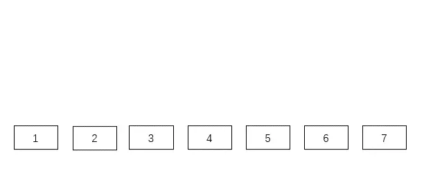

怎么样？是不是变成了二叉树，不过它不是普通的二叉树，它是一个 **二叉查找树**。

**二叉查找树的特点是一个节点的左子树的所有节点都小于这个节点，右子树的所有节点都大于这个节点**，这样我们在查询数据时，不需要计算中间节点的位置了，只需将查找的数据与节点的数据进行比较。

假设，我们查找索引值为 key 的节点：

1. 如果 key 大于根节点，则在右子树中进行查找；
2. 如果 key 小于根节点，则在左子树中进行查找；
3. 如果 key 等于根节点，也就是找到了这个节点，返回根节点即可。

二叉查找树查找某个节点的动图演示如下，比如要查找节点 3 ：

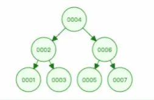

另外，二叉查找树解决了插入新节点的问题，因为二叉查找树是一个跳跃结构，不必连续排列。这样在插入的时候，新节点可以放在任何位置，不会像线性结构那样插入一个元素，所有元素都需要向后排列。

下面是二叉查找树插入某个节点的动图演示：

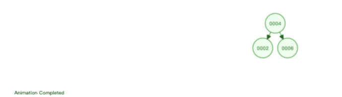

因此，二叉查找树解决了连续结构插入新元素开销很大的问题，同时又保持着天然的二分结构。

那是不是二叉查找树就可以作为索引的数据结构了呢？

不行不行，二叉查找树存在一个极端情况，会导致它变成一个瘸子！

**当每次插入的元素都是二叉查找树中最大的元素，二叉查找树就会退化成了一条链表，查找数据的时间复杂度变成了 O(n)**，如下动图演示：

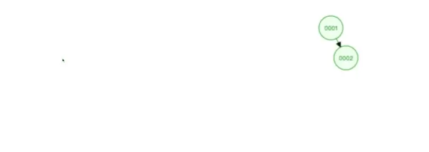

由于树是存储在磁盘中的，访问每个节点，都对应一次磁盘 I/O 操作（_假设一个节点的大小「小于」操作系统的最小读写单位块的大小_），也就是说**树的高度就等于每次查询数据时磁盘 IO 操作的次数**，所以树的高度越高，就会影响查询性能。

二叉查找树由于存在退化成链表的可能性，会使得查询操作的时间复杂度从 O(logn) 升为 O(n)。

而且会随着插入的元素越多，树的高度也变高，意味着需要磁盘 IO 操作的次数就越多，这样导致查询性能严重下降，再加上不能范围查询，所以不适合作为数据库的索引结构。

### 什么是自平衡二叉树？

为了解决二叉查找树会在极端情况下退化成链表的问题，后面就有人提出**平衡二叉查找树（AVL 树）**。

主要是在二叉查找树的基础上增加了一些条件约束：**每个节点的左子树和右子树的高度差不能超过 1**。也就是说节点的左子树和右子树仍然为平衡二叉树，这样查询操作的时间复杂度就会一直维持在 O(logn) 。

下图是每次插入的元素都是平衡二叉查找树中最大的元素，可以看到，它会维持自平衡：

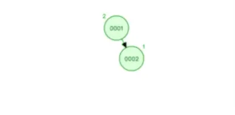

除了平衡二叉查找树，还有很多自平衡的二叉树，比如红黑树，它也是通过一些约束条件来达到自平衡，不过红黑树的约束条件比较复杂，不是本篇的重点重点，大家可以看《数据结构》相关的书籍来了解红黑树的约束条件。

下面是红黑树插入节点的过程，这左旋右旋的操作，就是为了自平衡。

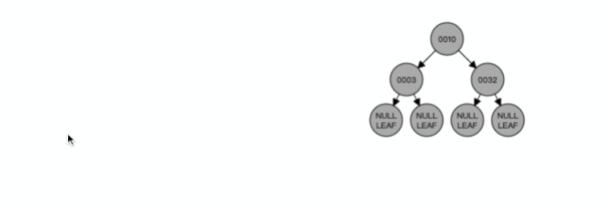

**不管平衡二叉查找树还是红黑树，都会随着插入的元素增多，而导致树的高度变高，这就意味着磁盘 I/O 操作次数多，会影响整体数据查询的效率**。

比如，下面这个平衡二叉查找树的高度为 5，那么在访问最底部的节点时，就需要磁盘 5 次 I/O 操作。


根本原因是因为它们都是二叉树，也就是每个节点只能保存 2 个子节点 ，如果我们把二叉树改成 M 叉树（M>2）呢？

比如，当 M=3 时，在同样的节点个数情况下，三叉树比二叉树的树高要矮。


因此，**当树的节点越多的时候，并且树的分叉数 M 越大的时候，M 叉树的高度会远小于二叉树的高度**。

### 什么是 B 树

自平衡二叉树虽然能保持查询操作的时间复杂度在O(logn)，但是因为它本质上是一个二叉树，每个节点只能有 2 个子节点，那么当节点个数越多的时候，树的高度也会相应变高，这样就会增加磁盘的 I/O 次数，从而影响数据查询的效率。

为了解决降低树的高度的问题，后面就出来了 B 树，它不再限制一个节点就只能有 2 个子节点，而是允许 M 个子节点 (M>2)，从而降低树的高度。

B 树的每一个节点最多可以包括 M 个子节点，M 称为 B 树的阶，所以 B 树就是一个多叉树。

假设 M = 3，那么就是一棵 3 阶的 B 树，特点就是每个节点最多有 2 个（M-1个）数据和最多有 3 个（M个）子节点，超过这些要求的话，就会分裂节点，比如下面的的动图：


我们来看看一棵 3 阶的 B 树的查询过程是怎样的？

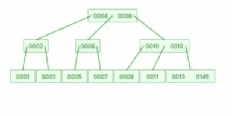

假设我们在上图一棵 3 阶的 B 树中要查找的索引值是 9 的记录那么步骤可以分为以下几步：

1. 与根节点的索引(4，8）进行比较，9 大于 8，那么往右边的子节点走；
2. 然后该子节点的索引为（10，12），因为 9 小于 10，所以会往该节点的左边子节点走；
3. 走到索引为9的节点，然后我们找到了索引值 9 的节点。

可以看到，一棵 3 阶的 B 树在查询叶子节点中的数据时，由于树的高度是 3 ，所以在查询过程中会发生 3 次磁盘 I/O 操作。

而如果同样的节点数量在平衡二叉树的场景下，树的高度就会很高，意味着磁盘 I/O 操作会更多。所以，B 树在数据查询中比平衡二叉树效率要高。

但是 B 树的每个节点都包含数据（索引+记录），而用户的记录数据的大小很有可能远远超过了索引数据，这就需要花费更多的磁盘 I/O 操作次数来读到「有用的索引数据」。

而且，在我们查询位于底层的某个节点（比如 A 记录）过程中，「非 A 记录节点」里的记录数据会从磁盘加载到内存，但是这些记录数据是没用的，我们只是想读取这些节点的索引数据来做比较查询，而「非 A 记录节点」里的记录数据对我们是没用的，这样不仅增多磁盘 I/O 操作次数，也占用内存资源。

另外，如果使用 B 树来做范围查询的话，需要使用中序遍历，这会涉及多个节点的磁盘 I/O 问题，从而导致整体速度下降。

### 什么是 B+ 树？

B+ 树就是对 B 树做了一个升级，MySQL 中索引的数据结构就是采用了 B+ 树，B+ 树结构如下图：


B+ 树与 B 树差异的点，主要是以下这几点：

- 叶子节点（最底部的节点）才会存放实际数据（索引+记录），非叶子节点只会存放索引；
- 所有索引都会在叶子节点出现，叶子节点之间构成一个有序链表；
- 非叶子节点的索引也会同时存在在子节点中，并且是在子节点中所有索引的最大（或最小）。
- 非叶子节点中有多少个子节点，就有多少个索引；

下面通过三个方面，比较下 B+ 和 B 树的性能区别。

#### 1、单点查询

B 树进行单个索引查询时，最快可以在 O(1) 的时间代价内就查到，而从平均时间代价来看，会比 B+ 树稍快一些。

但是 B 树的查询波动会比较大，因为每个节点即存索引又存记录，所以有时候访问到了非叶子节点就可以找到索引，而有时需要访问到叶子节点才能找到索引。

**B+ 树的非叶子节点不存放实际的记录数据，仅存放索引，因此数据量相同的情况下，相比存储即存索引又存记录的 B 树，B+树的非叶子节点可以存放更多的索引，因此 B+ 树可以比 B 树更「矮胖」，查询底层节点的磁盘 I/O次数会更少**。

#### 2、插入和删除效率

B+ 树有大量的冗余节点，这样使得删除一个节点的时候，可以直接从叶子节点中删除，甚至可以不动非叶子节点，这样删除非常快，

比如下面这个动图是删除 B+ 树 0004 节点的过程，因为非叶子节点有 0004 的冗余节点，所以在删除的时候，树形结构变化很小：

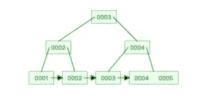

>注意，：B+ 树对于非叶子节点的子节点和索引的个数，定义方式可能会有不同，有的是说非叶子节点的子节点的个数为 M 阶，而索引的个数为 M-1（这个是维基百科里的定义），因此我本文关于 B+ 树的动图都是基于这个。但是我在前面介绍 B 树与 B+ 树的差异时，说的是「非叶子节点中有多少个子节点，就有多少个索引」，主要是 MySQL 用到的 B+ 树就是这个特性。

下面这个动图是删除 B 树 0008 节点的过程，可能会导致树的复杂变化：

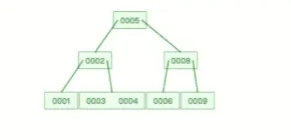

甚至，B+ 树在删除根节点的时候，由于存在冗余的节点，所以不会发生复杂的树的变形，比如下面这个动图是删除 B+ 树根节点的过程：

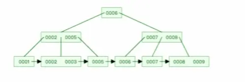

B 树则不同，B 树没有冗余节点，删除节点的时候非常复杂，比如删除根节点中的数据，可能涉及复杂的树的变形，比如下面这个动图是删除 B 树根节点的过程：

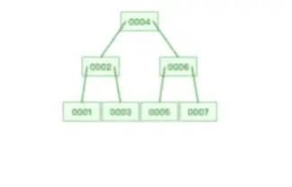

B+ 树的插入也是一样，有冗余节点，插入可能存在节点的分裂（如果节点饱和），但是最多只涉及树的一条路径。而且 B+ 树会自动平衡，不需要像更多复杂的算法，类似红黑树的旋转操作等。

因此，**B+ 树的插入和删除效率更高**。

#### 3、范围查询

B 树和 B+ 树等值查询原理基本一致，先从根节点查找，然后对比目标数据的范围，最后递归的进入子节点查找。

因为 **B+ 树所有叶子节点间还有一个链表进行连接，这种设计对范围查找非常有帮助**，比如说我们想知道 12 月 1 日和 12 月 12 日之间的订单，这个时候可以先查找到 12 月 1 日所在的叶子节点，然后利用链表向右遍历，直到找到 12 月12 日的节点，这样就不需要从根节点查询了，进一步节省查询需要的时间。

而 B 树没有将所有叶子节点用链表串联起来的结构，因此只能通过树的遍历来完成范围查询，这会涉及多个节点的磁盘 I/O 操作，范围查询效率不如 B+ 树。

因此，存在大量范围检索的场景，适合使用 B+树，比如数据库。而对于大量的单个索引查询的场景，可以考虑 B 树，比如 nosql 的MongoDB。

#### MySQL 中的 B+ 树

MySQL 的存储方式根据存储引擎的不同而不同，我们最常用的就是 Innodb 存储引擎，它就是采用了 B+ 树作为了索引的数据结构。

下图就是 Innodb 里的 B+ 树：


但是 Innodb 使用的 B+ 树有一些特别的点，比如：

- B+ 树的叶子节点之间是用「双向链表」进行连接，这样的好处是既能向右遍历，也能向左遍历。
- B+ 树节点内容是数据页，数据页里存放了用户的记录以及各种信息，每个数据页默认大小是 16 KB。

Innodb 根据索引类型不同，分为聚簇和二级索引。他们区别在于：

- 聚簇索引的叶子节点存放的是实际数据，所有完整的用户记录都存放在聚簇索引的叶子节点
- 而二级索引的叶子节点存放的是主键值，而不是实际数据。

因为表的数据都是存放在聚簇索引的叶子节点里，所以 InnoDB 存储引擎一定会为表创建一个聚簇索引，且由于数据在物理上只会保存一份，所以聚簇索引只能有一个，而二级索引可以创建多个。

### 总结

MySQL 是会将数据持久化在硬盘，而存储功能是由 MySQL 存储引擎实现的，所以讨论 MySQL 使用哪种数据结构作为索引，实际上是在讨论存储引使用哪种数据结构作为索引，InnoDB 是 MySQL 默认的存储引擎，它就是采用了 B+ 树作为索引的数据结构。

要设计一个 MySQL 的索引数据结构，不仅仅考虑数据结构增删改的时间复杂度，更重要的是要考虑磁盘 I/0 的操作次数。因为索引和记录都是存放在硬盘，硬盘是一个非常慢的存储设备，我们在查询数据的时候，最好能在尽可能少的磁盘 I/0 的操作次数内完成。

二分查找树虽然是一个天然的二分结构，能很好的利用二分查找快速定位数据，但是它存在一种极端的情况，每当插入的元素都是树内最大的元素，就会导致二分查找树退化成一个链表，此时查询复杂度就会从 O(logn)降低为 O(n)。

为了解决二分查找树退化成链表的问题，就出现了自平衡二叉树，保证了查询操作的时间复杂度就会一直维持在 O(logn) 。但是它本质上还是一个二叉树，每个节点只能有 2 个子节点，随着元素的增多，树的高度会越来越高。

而树的高度决定于磁盘 I/O 操作的次数，因为树是存储在磁盘中的，访问每个节点，都对应一次磁盘 I/O 操作，也就是说树的高度就等于每次查询数据时磁盘 IO 操作的次数，所以树的高度越高，就会影响查询性能。

B 树和 B+ 都是通过多叉树的方式，会将树的高度变矮，所以这两个数据结构非常适合检索存于磁盘中的数据。

但是 MySQL 默认的存储引擎 InnoDB 采用的是 B+ 作为索引的数据结构，原因有：

- B+ 树的非叶子节点不存放实际的记录数据，仅存放索引，因此数据量相同的情况下，相比存储即存索引又存记录的 B 树，B+树的非叶子节点可以存放更多的索引，因此 B+ 树可以比 B 树更「矮胖」，查询底层节点的磁盘 I/O次数会更少。
- B+ 树有大量的冗余节点（所有非叶子节点都是冗余索引），这些冗余索引让 B+ 树在插入、删除的效率都更高，比如删除根节点的时候，不会像 B 树那样会发生复杂的树的变化；
- B+ 树叶子节点之间用链表连接了起来，有利于范围查询，而 B 树要实现范围查询，因此只能通过树的遍历来完成范围查询，这会涉及多个节点的磁盘 I/O 操作，范围查询效率不如 B+ 树。

## MySQL 单表不要超过 2000W 行，靠谱吗？

作为在后端圈开车的多年老司机，是不是经常听到过：

- “MySQL 单表最好不要超过 2000W”
- “单表超过 2000W 就要考虑数据迁移了”
- “你这个表数据都马上要到 2000W 了，难怪查询速度慢”

这些名言民语就和 “群里只讨论技术，不开车，开车速度不要超过 120 码，否则自动踢群”，只听过，没试过，哈哈。

下面我们就把车速踩到底，干到 180 码试试…….

> 原文链接：https://my.oschina.net/u/4090830/blog/5559454

### 实验

实验一把看看… 建一张表

```sql
CREATE TABLE person(
    id int NOT NULL AUTO_INCREMENT PRIMARY KEY comment '主键',
    person_id tinyint not null comment '用户id',
    person_name VARCHAR(200) comment '用户名称',
    gmt_create datetime comment '创建时间',
    gmt_modified datetime comment '修改时间'
) comment '人员信息表';
```

插入一条数据

```sql
insert into person values(1, 1,'user_1', NOW(), now());
```

利用 MySQL 伪列 rownum 设置伪列起始点为 1

```sql
select (@i:=@i+1) as rownum, person_name from person, (select @i:=100) as init; 
set @i=1;
```

运行下面的 sql，连续执行 20 次，就是 2 的 20 次方约等于 100w 的数据；执行 23 次就是 2 的 23 次方约等于 800w , 如此下去即可实现千万测试数据的插入。

如果不想翻倍翻倍的增加数据，而是想少量，少量的增加，有个技巧，就是在 SQL 的后面增加 where 条件，如 id > 某一个值去控制增加的数据量即可。

```sql
insert into person(id, person_id, person_name, gmt_create, gmt_modified)
select @i:=@i+1,
left(rand()*10,10) as person_id,
concat('user_',@i%2048),
date_add(gmt_create,interval + @i*cast(rand()*100 as signed) SECOND),
date_add(date_add(gmt_modified,interval +@i*cast(rand()*100 as signed) SECOND), interval + cast(rand()*1000000 as signed) SECOND)
from person;
```

此处需要注意的是，也许你在执行到近 800w 或者 1000w 数据的时候，会报错：The total number of locks exceeds the lock table size。

这是由于你的临时表内存设置的不够大，只需要扩大一下设置参数即可。

```sql
SET GLOBAL tmp_table_size =512*1024*1024; （512M）
SET global innodb_buffer_pool_size= 1*1024*1024*1024 (1G);
```

先来看一组测试数据，这组数据是在 MySQL 8.0 的版本，并且是在我本机上，由于本机还跑着 idea , 浏览器等各种工具，所以并不是机器配置就是用于数据库配置，所以测试数据只限于参考。


看到这组数据似乎好像真的和标题对应，当数据达到 2000W 以后，查询时长急剧上升，难道这就是铁律吗？

那下面我们就来看看这个建议值 2000W 是怎么来的？

### 单表数量限制

首先我们先想想数据库单表行数最大多大？

```sql
CREATE TABLE person(
    id int(10) NOT NULL AUTO_INCREMENT PRIMARY KEY comment '主键',
    person_id tinyint not null comment '用户id',
    person_name VARCHAR(200) comment '用户名称',
    gmt_create datetime comment '创建时间',
    gmt_modified datetime comment '修改时间'
) comment '人员信息表';
```

看看上面的建表 sql。id 是主键，本身就是唯一的，也就是说主键的大小可以限制表的上限：

- 如果主键声明 `int` 类型，也就是 32 位，那么支持 2^32-1 ~~21 亿；
- 如果主键声明 `bigint` 类型，那就是 2^62-1 （36893488147419103232），难以想象这个的多大了，一般还没有到这个限制之前，可能数据库已经爆满了！！

有人统计过，如果建表的时候，自增字段选择无符号的 bigint , 那么自增长最大值是 18446744073709551615，按照一秒新增一条记录的速度，大约什么时候能用完？


### 表空间

下面我们再来看看索引的结构，我们下面讲内容都是基于 Innodb 引擎的，大家都知道 Innodb 的索引内部用的是 B+ 树。


这张表数据，在硬盘上存储也是类似如此的，它实际是放在一个叫 person.ibd （innodb data）的文件中，也叫做表空间；虽然数据表中，他们看起来是一条连着一条，但是实际上在文件中它被分成很多小份的数据页，而且每一份都是 16K。

大概就像下面这样，当然这只是我们抽象出来的，在表空间中还有段、区、组等很多概念，但是我们需要跳出来看。


### 页的数据结构

实际页的内部结构像是下面这样的：


从图中可以看出，一个 InnoDB 数据页的存储空间大致被划分成了 7 个部分，有的部分占用的字节数是确定的，有的部分占用的字节数是不确定的。

在页的 7 个组成部分中，我们自己存储的记录会按照我们指定的行格式存储到 `User Records` 部分。

但是在一开始生成页的时候，其实并没有 User Records 这个部分，每当我们插入一条记录，都会从 Free Space 部分，也就是尚未使用的存储空间中申请一个记录大小的空间划分到 User Records 部分。

当 Free Space 部分的空间全部被 User Records 部分替代掉之后，也就意味着这个页使用完了，如果还有新的记录插入的话，就需要去申请新的页了。

这个过程的图示如下：


刚刚上面说到了数据的新增的过程。

那下面就来说说，数据的查找过程，假如我们需要查找一条记录，我们可以把表空间中的每一页都加载到内存中，然后对记录挨个判断是不是我们想要的。

在数据量小的时候，没啥问题，内存也可以撑。但是现实就是这么残酷，不会给你这个局面。

为了解决这问题，MySQL 中就有了索引的概念，大家都知道索引能够加快数据的查询，那到底是怎么个回事呢？下面我就来看看。

### 索引的数据结构

在 MySQL 中索引的数据结构和刚刚描述的页几乎是一模一样的，而且大小也是 16K,。

但是在索引页中记录的是页 (数据页，索引页) 的最小主键 id 和页号，以及在索引页中增加了层级的信息，从 0 开始往上算，所以页与页之间就有了上下层级的概念。


看到这个图之后，是不是有点似曾相似的感觉，是不是像一棵二叉树啊，对，没错！它就是一棵树。

只不过我们在这里只是简单画了三个节点，2 层结构的而已，如果数据多了，可能就会扩展到 3 层的树，这个就是我们常说的 B+ 树，最下面那一层的 page level =0, 也就是叶子节点，其余都是非叶子节点。


看上图中，我们是单拿一个节点来看，首先它是一个非叶子节点（索引页），在它的内容区中有 id 和 页号地址两部分：

- id ：对应页中记录的最小记录 id 值；
- 页号：地址是指向对应页的指针；

而数据页与此几乎大同小异，区别在于数据页记录的是真实的行数据而不是页地址，而且 id 的也是顺序的。

### 单表建议值

下面我们就以 3 层，2 分叉（实际中是 M 分叉）的图例来说明一下查找一个行数据的过程。


比如说我们需要查找一个 id=6 的行数据：

- 因为在非叶子节点中存放的是页号和该页最小的 id，所以我们从顶层开始对比，首先看页号 10 中的目录，有 [id=1, 页号 = 20],[id=5, 页号 = 30], 说明左侧节点最小 id 为 1，右侧节点最小 id 是 5。6>5, 那按照二分法查找的规则，肯定就往右侧节点继续查找；
- 找到页号 30 的节点后，发现这个节点还有子节点（非叶子节点），那就继续比对，同理，6>5 && 6<7, 所以找到了页号 60；
- 找到页号 60 之后，发现此节点为叶子节点（数据节点），于是将此页数据加载至内存进行一一对比，结果找到了 id=6 的数据行。

从上述的过程中发现，我们为了查找 id=6 的数据，总共查询了三个页，如果三个页都在磁盘中（未提前加载至内存），那么最多需要经历三次的磁盘 IO。

需要注意的是，图中的页号只是个示例，实际情况下并不是连续的，在磁盘中存储也不一定是顺序的。

至此，我们大概已经了解了表的数据是怎么个结构了，也大概知道查询数据是个怎么的过程了，这样我们也就能大概估算这样的结构能存放多少数据了。

从上面的图解我们知道 B+ 数的叶子节点才是存在数据的，而非叶子节点是用来存放索引数据的。

所以，同样一个 16K 的页，非叶子节点里的每条数据都指向新的页，而新的页有两种可能

- 如果是叶子节点，那么里面就是一行行的数据
- 如果是非叶子节点的话，那么就会继续指向新的页

假设

- 非叶子节点内指向其他页的数量为 x
- 叶子节点内能容纳的数据行数为 y
- B+ 数的层数为 z

如下图中所示，**Total =x^(z-1) *y 也就是说总数会等于 x 的 z-1 次方 与 Y 的乘积**。


> X =？

在文章的开头已经介绍了页的结构，索引也也不例外，都会有 File Header (38 byte)、Page Header (56 Byte)、Infimum + Supermum（26 byte）、File Trailer（8byte）, 再加上页目录，大概 1k 左右。

我们就当做它就是 1K, 那整个页的大小是 16K, 剩下 15k 用于存数据，在索引页中主要记录的是主键与页号，主键我们假设是 Bigint (8 byte), 而页号也是固定的（4Byte）, 那么索引页中的一条数据也就是 12byte。

所以 x=15*1024/12≈1280 行。

> Y=？

叶子节点和非叶子节点的结构是一样的，同理，能放数据的空间也是 15k。

但是叶子节点中存放的是真正的行数据，这个影响的因素就会多很多，比如，字段的类型，字段的数量。每行数据占用空间越大，页中所放的行数量就会越少。

这边我们暂时按一条行数据 1k 来算，那一页就能存下 15 条，Y = 15*1024/1000 ≈15。

算到这边了，是不是心里已经有谱了啊。

根据上述的公式，Total =x^(z-1) *y，已知 x=1280，y=15：

- 假设 B+ 树是两层，那就是 z = 2， Total = （1280 ^1 ）*15 = 19200
- 假设 B+ 树是三层，那就是 z = 3， Total = （1280 ^2） *15 = 24576000 （约 2.45kw）

哎呀，妈呀！这不是正好就是文章开头说的最大行数建议值 2000W 嘛！对的，一般 B+ 数的层级最多也就是 3 层。

你试想一下，如果是 4 层，除了查询的时候磁盘 IO 次数会增加，而且这个 Total 值会是多少，大概应该是 3 百多亿吧，也不太合理，所以，3 层应该是比较合理的一个值。

> 到这里难道就完了？

不。

我们刚刚在说 Y 的值时候假设的是 1K ，那比如我实际当行的数据占用空间不是 1K , 而是 5K, 那么单个数据页最多只能放下 3 条数据。

同样，还是按照 z = 3 的值来计算，那 Total = （1280 ^2） *3 = 4915200 （近 500w）

所以，在保持相同的层级（相似查询性能）的情况下，在行数据大小不同的情况下，其实这个最大建议值也是不同的，而且影响查询性能的还有很多其他因素，比如，数据库版本，服务器配置，sql 的编写等等。

MySQL 为了提高性能，会将表的索引装载到内存中，在 InnoDB buffer size 足够的情况下，其能完成全加载进内存，查询不会有问题。

但是，当单表数据库到达某个量级的上限时，导致内存无法存储其索引，使得之后的 SQL 查询会产生磁盘 IO，从而导致性能下降，所以增加硬件配置（比如把内存当磁盘使），可能会带来立竿见影的性能提升哈。

### 总结

- MySQL 的表数据是以页的形式存放的，页在磁盘中不一定是连续的。
- 页的空间是 16K, 并不是所有的空间都是用来存放数据的，会有一些固定的信息，如，页头，页尾，页码，校验码等等。
- 在 B+ 树中，叶子节点和非叶子节点的数据结构是一样的，区别在于，叶子节点存放的是实际的行数据，而非叶子节点存放的是主键和页号。
- 索引结构不会影响单表最大行数，2000W 也只是推荐值，超过了这个值可能会导致 B + 树层级更高，影响查询性能。


## 索引失效有哪些？


### 索引存储结构长什么样？

我们先来看看索引存储结构长什么样？因为只有知道索引的存储结构，才能更好的理解索引失效的问题。

索引的存储结构跟 MySQL 使用哪种存储引擎有关，因为存储引擎就是负责将数据持久化在磁盘中，而不同的存储引擎采用的索引数据结构也会不相同。

MySQL 默认的存储引擎是 InnoDB，它采用 B+Tree 作为索引的数据结构，至于为什么选择 B+ 树作为索引的数据结构 ，详细的分析可以看我这篇文章：[为什么 MySQL 喜欢 B+ 树？(opens new window)](https://mp.weixin.qq.com/s?__biz=MzUxODAzNDg4NQ==&mid=2247502168&idx=1&sn=ff63afcea1e8835fca3fe7a97e6922b4&scene=21#wechat_redirect)

在创建表时，InnoDB 存储引擎默认会创建一个主键索引，也就是聚簇索引，其它索引都属于二级索引。

MySQL 的 MyISAM 存储引擎支持多种索引数据结构，比如 B+ 树索引、R 树索引、Full-Text 索引。MyISAM 存储引擎在创建表时，创建的主键索引默认使用的是 B+ 树索引。

虽然，InnoDB 和 MyISAM 都支持 B+ 树索引，但是它们数据的存储结构实现方式不同。不同之处在于：

- InnoDB 存储引擎：B+ 树索引的叶子节点保存数据本身；
- MyISAM 存储引擎：B+ 树索引的叶子节点保存数据的物理地址；

接下来，我举个例子，给大家展示下这两种存储引擎的索引存储结构的区别。

这里有一张 t_user 表，其中 id 字段为主键索引，其他都是普通字段。


如果使用的是 MyISAM 存储引擎，B+ 树索引的叶子节点保存数据的物理地址，即用户数据的指针，如下图：


如果使用的是 InnoDB 存储引擎， B+ 树索引的叶子节点保存数据本身，如下图所示（图中叶子节点之间我画了单向链表，但是实际上是双向链表，原图我找不到了，修改不了，偷个懒我不重画了，大家脑补成双向链表就行）。


InnoDB 存储引擎根据索引类型不同，分为聚簇索引（上图就是聚簇索引）和二级索引。它们区别在于，聚簇索引的叶子节点存放的是实际数据，所有完整的用户数据都存放在聚簇索引的叶子节点，而二级索引的叶子节点存放的是主键值，而不是实际数据。

如果将 name 字段设置为普通索引，那么这个二级索引长下图这样（图中叶子节点之间我画了单向链表，但是实际上是双向链表，原图我找不到了，修改不了，偷个懒我不重画了，大家脑补成双向链表就行），**叶子节点仅存放主键值**。


知道了 InnoDB 存储引擎的聚簇索引和二级索引的存储结构后，接下来举几个查询语句，说下查询过程是怎么选择用哪个索引类型的。

在我们使用「主键索引」字段作为条件查询的时候，如果要查询的数据都在「聚簇索引」的叶子节点里，那么就会在「聚簇索引」中的 B+ 树检索到对应的叶子节点，然后直接读取要查询的数据。如下面这条语句：

```sql
// id 字段为主键索引
select * from t_user where id=1;
```

在我们使用「二级索引」字段作为条件查询的时候，如果要查询的数据都在「聚簇索引」的叶子节点里，那么需要检索两颗B+树：

- 先在「二级索引」的 B+ 树找到对应的叶子节点，获取主键值；
- 然后用上一步获取的主键值，在「聚簇索引」中的 B+ 树检索到对应的叶子节点，然后获取要查询的数据。

上面这个过程叫做**回表**，如下面这条语句：

```sql
// name 字段为二级索引
select * from t_user where name="林某";
```

在我们使用「二级索引」字段作为条件查询的时候，如果要查询的数据在「二级索引」的叶子节点，那么只需要在「二级索引」的 B+ 树找到对应的叶子节点，然后读取要查询的数据，这个过程叫做**覆盖索引**。如下面这条语句：

```
// name 字段为二级索引
select id from t_user where name="林某";
```

上面这些查询语句的条件都用到了索引列，所以在查询过程都用上了索引。

但是并不意味着，查询条件用上了索引列，就查询过程就一定都用上索引，接下来我们再一起看看哪些情况会导致索引失效，而发生全表扫描。

首先说明下，下面的实验案例，我使用的 MySQL 版本为 `8.0.26`。

### 对索引使用左或者左右模糊匹配

当我们使用左或者左右模糊匹配的时候，也就是 `like %xx` 或者 `like %xx%` 这两种方式都会造成索引失效。

比如下面的 like 语句，查询 name 后缀为「林」的用户，执行计划中的 type=ALL 就代表了全表扫描，而没有走索引。

```sql
// name 字段为二级索引
select * from t_user where name like '%林';
```


如果是查询 name 前缀为林的用户，那么就会走索引扫描，执行计划中的 type=range 表示走索引扫描，key=index_name 看到实际走了 index_name 索引：

```sql
// name 字段为二级索引
select * from t_user where name like '林%';
```


> 为什么 like 关键字左或者左右模糊匹配无法走索引呢？

**因为索引 B+ 树是按照「索引值」有序排列存储的，只能根据前缀进行比较。**

举个例子，下面这张二级索引图（图中叶子节点之间我画了单向链表，但是实际上是双向链表，原图我找不到了，修改不了，偷个懒我不重画了，大家脑补成双向链表就行），是以 name 字段有序排列存储的。


假设我们要查询 name 字段前缀为「林」的数据，也就是 `name like '林%'`，扫描索引的过程：

- 首节点查询比较：林这个字的拼音大小比首节点的第一个索引值中的陈字大，但是比首节点的第二个索引值中的周字小，所以选择去节点2继续查询；
- 节点 2 查询比较：节点2的第一个索引值中的陈字的拼音大小比林字小，所以继续看下一个索引值，发现节点2有与林字前缀匹配的索引值，于是就往叶子节点查询，即叶子节点4；
- 节点 4 查询比较：节点4的第一个索引值的前缀符合林字，于是就读取该行数据，接着继续往右匹配，直到匹配不到前缀为林的索引值。

如果使用 `name like '%林'` 方式来查询，因为查询的结果可能是「陈林、张林、周林」等之类的，所以不知道从哪个索引值开始比较，于是就只能通过全表扫描的方式来查询。

想要更详细了解 InnoDB 的 B+ 树查询过程，可以看我写的这篇：[B+ 树里的节点里存放的是什么呢？查询数据的过程又是怎样的？](https://mp.weixin.qq.com/s?__biz=MzUxODAzNDg4NQ==&mid=2247502059&idx=1&sn=ccbee22bda8c3d6a98237be769a7c89c&scene=21#wechat_redirect)

### 对索引使用函数

有时候我们会用一些 MySQL 自带的函数来得到我们想要的结果，这时候要注意了，如果查询条件中对索引字段使用函数，就会导致索引失效。

比如下面这条语句查询条件中对 name 字段使用了 LENGTH 函数，执行计划中的 type=ALL，代表了全表扫描：

```sql
// name 为二级索引
select * from t_user where length(name)=6;
```


> 为什么对索引使用函数，就无法走索引了呢？

因为索引保存的是索引字段的原始值，而不是经过函数计算后的值，自然就没办法走索引了。

不过，从 MySQL 8.0 开始，索引特性增加了函数索引，即可以针对函数计算后的值建立一个索引，也就是说该索引的值是函数计算后的值，所以就可以通过扫描索引来查询数据。

举个例子，我通过下面这条语句，对 length(name) 的计算结果建立一个名为 idx_name_length 的索引。

```sql
alter table t_user add key idx_name_length ((length(name)));
```

然后我再用下面这条查询语句，这时候就会走索引了。


### 对索引进行表达式计算

在查询条件中对索引进行表达式计算，也是无法走索引的。

比如，下面这条查询语句，执行计划中 type = ALL，说明是通过全表扫描的方式查询数据的：

```sql
explain select * from t_user where id + 1 = 10;
```


但是，如果把查询语句的条件改成 where id = 10 - 1，这样就不是在索引字段进行表达式计算了，于是就可以走索引查询了。


> 为什么对索引进行表达式计算，就无法走索引了呢？

原因跟对索引使用函数差不多。

因为索引保存的是索引字段的原始值，而不是 id + 1 表达式计算后的值，所以无法走索引，只能通过把索引字段的取值都取出来，然后依次进行表达式的计算来进行条件判断，因此采用的就是全表扫描的方式。

有的同学可能会说，这种对索引进行简单的表达式计算，在代码特殊处理下，应该是可以做到索引扫描的，比方将 id + 1 = 10 变成 id = 10 - 1。

是的，是能够实现，但是 MySQL 还是偷了这个懒，没有实现。

我的想法是，可能也是因为，表达式计算的情况多种多样，每种都要考虑的话，代码可能会很臃肿，所以干脆将这种索引失效的场景告诉程序员，让程序员自己保证在查询条件中不要对索引进行表达式计算。

### 对索引隐式类型转换

如果索引字段是字符串类型，但是在条件查询中，输入的参数是整型的话，你会在执行计划的结果发现这条语句会走全表扫描。

我在原本的 t_user 表增加了 phone 字段，是二级索引且类型是 varchar。


然后我在条件查询中，用整型作为输入参数，此时执行计划中 type = ALL，所以是通过全表扫描来查询数据的。

```sql
select * from t_user where phone = 1300000001;
```


但是如果索引字段是整型类型，查询条件中的输入参数即使字符串，是不会导致索引失效，还是可以走索引扫描。

我们再看第二个例子，id 是整型，但是下面这条语句还是走了索引扫描的。

```sql
 explain select * from t_user where id = '1';
```


> 为什么第一个例子会导致索引失效，而第二例子不会呢？

要明白这个原因，首先我们要知道 MySQL 的数据类型转换规则是什么？就是看 MySQL 是会将字符串转成数字处理，还是将数字转换成字符串处理。

我在看《mysql45讲的时候》看到一个简单的测试方式，就是通过 select “10” > 9 的结果来知道MySQL 的数据类型转换规则是什么：

- 如果规则是 MySQL 会将自动「字符串」转换成「数字」，就相当于 select 10 > 9，这个就是数字比较，所以结果应该是 1；
- 如果规则是 MySQL 会将自动「数字」转换成「字符串」，就相当于 select "10" > "9"，这个是字符串比较，字符串比较大小是逐位从高位到低位逐个比较（按ascii码） ，那么"10"字符串相当于 “1”和“0”字符的组合，所以先是拿 “1” 字符和 “9” 字符比较，因为 “1” 字符比 “9” 字符小，所以结果应该是 0。

在 MySQL 中，执行的结果如下图：


上面的结果为 1，说明 **MySQL 在遇到字符串和数字比较的时候，会自动把字符串转为数字，然后再进行比较**。

前面的例子一中的查询语句，我也跟大家说了是会走全表扫描：

```sql
//例子一的查询语句
select * from t_user where phone = 1300000001;
```

这是因为 phone 字段为字符串，所以 MySQL 要会自动把字符串转为数字，所以这条语句相当于：

```sql
select * from t_user where CAST(phone AS signed int) = 1300000001;
```

可以看到，**CAST 函数是作用在了 phone 字段，而 phone 字段是索引，也就是对索引使用了函数！而前面我们也说了，对索引使用函数是会导致索引失效的**。

例子二中的查询语句，我跟大家说了是会走索引扫描：

```sql
//例子二的查询语句
select * from t_user where id = "1";
```

这时因为字符串部分是输入参数，也就需要将字符串转为数字，所以这条语句相当于：

```sql
select * from t_user where id = CAST("1" AS signed int);
```

可以看到，索引字段并没有用任何函数，CAST 函数是用在了输入参数，因此是可以走索引扫描的。

### 联合索引非最左匹配

对主键字段建立的索引叫做聚簇索引，对普通字段建立的索引叫做二级索引。

那么**多个普通字段组合在一起创建的索引就叫做联合索引**，也叫组合索引。

创建联合索引时，我们需要注意创建时的顺序问题，因为联合索引 (a, b, c) 和 (c, b, a) 在使用的时候会存在差别。

联合索引要能正确使用需要遵循**最左匹配原则**，也就是按照最左优先的方式进行索引的匹配。

比如，如果创建了一个 `(a, b, c)` 联合索引，如果查询条件是以下这几种，就可以匹配上联合索引：

- where a=1；
- where a=1 and b=2 and c=3；
- where a=1 and b=2；

需要注意的是，因为有查询优化器，所以 a 字段在 where 子句的顺序并不重要。

但是，如果查询条件是以下这几种，因为不符合最左匹配原则，所以就无法匹配上联合索引，联合索引就会失效:

- where b=2；
- where c=3；
- where b=2 and c=3；

有一个比较特殊的查询条件：where a = 1 and c = 3 ，符合最左匹配吗？

这种其实严格意义上来说是属于索引截断，不同版本处理方式也不一样。

MySQL 5.5 的话，前面 a 会走索引，在联合索引找到主键值后，开始回表，到主键索引读取数据行，Server 层从存储引擎层获取到数据行后，然后在 Server 层再比对 c 字段的值。

从 MySQL 5.6 之后，有一个**索引下推功能**，可以在存储引擎层进行索引遍历过程中，对索引中包含的字段先做判断，直接过滤掉不满足条件的记录，再返还给 Server 层，从而减少回表次数。

索引下推的大概原理是：截断的字段不会在 Server 层进行条件判断，而是会被下推到「存储引擎层」进行条件判断（因为 c 字段的值是在 `(a, b, c)` 联合索引里的），然后过滤出符合条件的数据后再返回给 Server 层。由于在引擎层就过滤掉大量的数据，无需再回表读取数据来进行判断，减少回表次数，从而提升了性能。

比如下面这条 where a = 1 and c = 0 语句，我们可以从执行计划中的 Extra=Using index condition 使用了索引下推功能。


> 为什么联合索引不遵循最左匹配原则就会失效？

原因是，在联合索引的情况下，数据是按照索引第一列排序，第一列数据相同时才会按照第二列排序。

也就是说，如果我们想使用联合索引中尽可能多的列，查询条件中的各个列必须是联合索引中从最左边开始连续的列。如果我们仅仅按照第二列搜索，肯定无法走索引。

### WHERE 子句中的 OR

在 WHERE 子句中，如果在 OR 前的条件列是索引列，而在 OR 后的条件列不是索引列，那么索引会失效。

举个例子，比如下面的查询语句，id 是主键，age 是普通列，从执行计划的结果看，是走了全表扫描。

```SQL
select * from t_user where id = 1 or age = 18;
```


这是因为 OR 的含义就是两个只要满足一个即可，因此只有一个条件列是索引列是没有意义的，只要有条件列不是索引列，就会进行全表扫描。(要是某个条件列没有索引，MySQL 就不得不进行全表扫描，这样一来，使用索引去扫描其他条件列所带来的效率提升就被抵消了，所以查询优化器可能会直接选择全表扫描。)

要解决办法很简单，将 age 字段设置为索引即可。


可以看到 type=index merge， index merge 的意思就是对 id 和 age 分别进行了扫描，然后将这两个结果集进行了合并，这样做的好处就是避免了全表扫描。

### 总结

今天给大家介绍了 6 种会发生索引失效的情况：

- 当我们使用左或者左右模糊匹配的时候，也就是 `like %xx` 或者 `like %xx%`这两种方式都会造成索引失效；
- 当我们在查询条件中对索引列使用函数，就会导致索引失效。
- 当我们在查询条件中对索引列进行表达式计算，也是无法走索引的。
- MySQL 在遇到字符串和数字比较的时候，会自动把字符串转为数字，然后再进行比较。如果字符串是索引列，而条件语句中的输入参数是数字的话，那么索引列会发生隐式类型转换，由于隐式类型转换是通过 CAST 函数实现的，等同于对索引列使用了函数，所以就会导致索引失效。
- 联合索引要能正确使用需要遵循最左匹配原则，也就是按照最左优先的方式进行索引的匹配，否则就会导致索引失效。
- 在 WHERE 子句中，如果在 OR 前的条件列是索引列，而在 OR 后的条件列不是索引列，那么索引会失效。

## count(\*) 和 count(1) 有什么区别？哪个性能最好？

大家好，我是小林。

当我们对一张数据表中的记录进行统计的时候，习惯都会使用 count 函数来统计，但是 count 函数传入的参数有很多种，比如 count(1)、count(`*`)、count(字段) 等。

到底哪种效率是最好的呢？是不是 count(`*`) 效率最差？

我曾经以为 count(`*`) 是效率最差的，因为认知上 `selete * from t` 会读取所有表中的字段，所以凡事带有 `*` 字符的就觉得会读取表中所有的字段，当时网上有很多博客也这么说。

但是，当我深入 count 函数的原理后，被啪啪啪的打脸了！

不多说， 发车！


### 哪种 count 性能最好？

我先直接说结论：


要弄明白这个，我们得要深入 count 的原理，以下内容基于常用的 innodb 存储引擎来说明。

### count() 是什么？

count() 是一个聚合函数，函数的参数不仅可以是字段名，也可以是其他任意表达式，该函数作用是**统计符合查询条件的记录中，函数指定的参数不为 NULL 的记录有多少个**。

假设 count() 函数的参数是字段名，如下：

```
select count(name) from t_order;
```

这条语句是统计「 t_order 表中，name 字段不为 NULL 的记录」有多少个。也就是说，如果某一条记录中的 name 字段的值为 NULL，则就不会被统计进去。

再来假设 count() 函数的参数是数字 1 这个表达式，如下：

```
select count(1) from t_order;
```

这条语句是统计「 t_order 表中，1 这个表达式不为 NULL 的记录」有多少个。

1 这个表达式就是单纯数字，它永远都不是 NULL，所以上面这条语句，其实是在统计 t_order 表中有多少个记录。

### count(主键字段) 执行过程是怎样的？

在通过 count 函数统计有多少个记录时，MySQL 的 server 层会维护一个名叫 count 的变量。

server 层会循环向 InnoDB 读取一条记录，如果 count 函数指定的参数不为 NULL，那么就会将变量 count 加 1，直到符合查询的全部记录被读完，就退出循环。最后将 count 变量的值发送给客户端。

InnoDB 是通过 B+ 树来保存记录的，根据索引的类型又分为聚簇索引和二级索引，它们区别在于，聚簇索引的叶子节点存放的是实际数据，而二级索引的叶子节点存放的是主键值，而不是实际数据。

用下面这条语句作为例子：

```
//id 为主键值
select count(id) from t_order;
```

如果表里只有主键索引，没有二级索引时，那么，InnoDB 循环遍历聚簇索引，将读取到的记录返回给 server 层，然后读取记录中的 id 值，就会 id 值判断是否为 NULL，如果不为 NULL，就将 count 变量加 1。


但是，如果表里有二级索引时，InnoDB 循环遍历的对象就不是聚簇索引，而是二级索引。


这是因为相同数量的二级索引记录可以比聚簇索引记录占用更少的存储空间，所以二级索引树比聚簇索引树小，这样遍历二级索引的 I/O 成本比遍历聚簇索引的 I/O 成本小，因此「优化器」优先选择的是二级索引。

### count(1) 执行过程是怎样的？

用下面这条语句作为例子：

```
select count(1) from t_order;
```

如果表里只有主键索引，没有二级索引时。


那么，InnoDB 循环遍历聚簇索引（主键索引），将读取到的记录返回给 server 层，**但是不会读取记录中的任何字段的值**，因为 count 函数的参数是 1，不是字段，所以不需要读取记录中的字段值。参数 1 很明显并不是 NULL，因此 server 层每从 InnoDB 读取到一条记录，就将 count 变量加 1。

可以看到，count(1) 相比 count(主键字段) 少一个步骤，就是不需要读取记录中的字段值，所以通常会说 count(1) 执行效率会比 count(主键字段) 高一点。

但是，如果表里有二级索引时，InnoDB 循环遍历的对象就二级索引了。


### count(\*) 执行过程是怎样的？

看到 `*` 这个字符的时候，是不是大家觉得是读取记录中的所有字段值？

对于 `selete *` 这条语句来说是这个意思，但是在 count(*) 中并不是这个意思。

**count(`\*`) 其实等于 count(`0`)**，也就是说，当你使用 count(`*`) 时，MySQL 会将 `*` 参数转化为参数 0 来处理。


所以，**count(*) 执行过程跟 count(1) 执行过程基本一样的**，性能没有什么差异。

在 MySQL 5.7 的官方手册中有这么一句话：

_InnoDB handles SELECT COUNT(`\*`) and SELECT COUNT(`1`) operations in the same way. There is no performance difference._

_翻译：InnoDB以相同的方式处理SELECT COUNT（`\*`）和SELECT COUNT（`1`）操作，没有性能差异。_

而且 MySQL 会对 count(*) 和 count(1) 有个优化，如果有多个二级索引的时候，优化器会使用key_len 最小的二级索引进行扫描。

只有当没有二级索引的时候，才会采用主键索引来进行统计。

### count(字段) 执行过程是怎样的？

count(字段) 的执行效率相比前面的 count(1)、 count(*)、 count(主键字段) 执行效率是最差的。

用下面这条语句作为例子：

```
// name不是索引，普通字段
select count(name) from t_order;
```

对于这个查询来说，会采用全表扫描的方式来计数，所以它的执行效率是比较差的。


### 小结

count(1)、 count(*)、 count(主键字段)在执行的时候，如果表里存在二级索引，优化器就会选择二级索引进行扫描。

所以，如果要执行 count(1)、 count(*)、 count(主键字段) 时，尽量在数据表上建立二级索引，这样优化器会自动采用 key_len 最小的二级索引进行扫描，相比于扫描主键索引效率会高一些。

再来，就是不要使用 count(字段) 来统计记录个数，因为它的效率是最差的，会采用全表扫描的方式来统计。如果你非要统计表中该字段不为 NULL 的记录个数，建议给这个字段建立一个二级索引。

### 为什么要通过遍历的方式来计数？

你可能会好奇，为什么 count 函数需要通过遍历的方式来统计记录个数？

我前面将的案例都是基于 Innodb 存储引擎来说明的，但是在 MyISAM 存储引擎里，执行 count 函数的方式是不一样的，通常在没有任何查询条件下的 count(*)，MyISAM 的查询速度要明显快于 InnoDB。

使用 MyISAM 引擎时，执行 count 函数只需要 O(1 )复杂度，这是因为每张 MyISAM 的数据表都有一个 meta 信息有存储了row_count值，由表级锁保证一致性，所以直接读取 row_count 值就是 count 函数的执行结果。

而 InnoDB 存储引擎是支持事务的，同一个时刻的多个查询，由于多版本并发控制（MVCC）的原因，InnoDB 表“应该返回多少行”也是不确定的，所以无法像 MyISAM一样，只维护一个 row_count 变量。

举个例子，假设表 t_order 有 100 条记录，现在有两个会话并行以下语句：


在会话 A 和会话 B的最后一个时刻，同时查表 t_order 的记录总个数，可以发现，显示的结果是不一样的。所以，在使用 InnoDB 存储引擎时，就需要扫描表来统计具体的记录。

而当带上 where 条件语句之后，MyISAM 跟 InnoDB 就没有区别了，它们都需要扫描表来进行记录个数的统计。

### 如何优化 count(*)？

如果对一张大表经常用 count(*) 来做统计，其实是很不好的。

比如下面我这个案例，表 t_order 共有 1200+ 万条记录，我也创建了二级索引，但是执行一次 `select count(*) from t_order` 要花费差不多 5 秒！


面对大表的记录统计，我们有没有什么其他更好的办法呢？

### 第一种，近似值

如果你的业务对于统计个数不需要很精确，比如搜索引擎在搜索关键词的时候，给出的搜索结果条数是一个大概值。


这时，我们就可以使用 show table status 或者 explain 命令来表进行估算。

执行 explain 命令效率是很高的，因为它并不会真正的去查询，下图中的 rows 字段值就是 explain 命令对表 t_order 记录的估算值。


### 第二种，额外表保存计数值

如果是想精确的获取表的记录总数，我们可以将这个计数值保存到单独的一张计数表中。

当我们在数据表插入一条记录的同时，将计数表中的计数字段 + 1。也就是说，在新增和删除操作时，我们需要额外维护这个计数表。

## MySQL 分页有什么性能问题？怎么优化？

我们刷网站的时候，我们经常会遇到需要分页查询的场景。

比如下图红框里的翻页功能。


我们很容易能联想到可以用mysql实现。

假设我们的建表sql是这样的


建表sql大家也不用扣细节，只需要知道**id是主键，并且在user_name建了个非主键索引**就够了，其他都不重要。

为了实现分页。

很容易联想到下面这样的sql语句。

```
select * from page order by id limit offset, size;
```

比如一页有10条数据。


第一页就是下面这样的sql语句。

```
select * from page order by id limit 0, 10;
```

第一百页就是

```
select * from page order by id limit 990, 10;
```

那么问题来了。

用这种方式，**同样都是拿10条数据，查第一页和第一百页的查询速度是一样的吗？为什么？**

### 两种limit的执行过程

上面的两种查询方式。对应 `limit offset, size` 和 `limit size` 两种方式。

而其实 `limit size` ，相当于 `limit 0, size`。也就是从0开始取size条数据。

也就是说，两种方式的**区别在于offset是否为0。**

我们先来看下limit sql的内部执行逻辑。


mysql内部分为**server层**和**存储引擎层**。一般情况下存储引擎都用innodb。

server层有很多模块，其中需要关注的是**执行器**是用于跟存储引擎打交道的组件。

执行器可以通过调用存储引擎提供的接口，将一行行数据取出，当这些数据完全符合要求（比如满足其他where条件），则会放到**结果集**中，最后返回给调用mysql的**客户端（go、java写的应用程序）**。

我们可以对下面的sql先执行下 `explain`。

```
explain select * from page order by id limit 0, 10;
```

可以看到，explain中提示 key 那里，执行的是**PRIMARY**，也就是走的**主键索引**。


主键索引本质是一棵B+树，它是放在innodb中的一个数据结构。

我们可以回忆下，B+树大概长这样。


在这个树状结构里，我们需要关注的是，最下面一层节点，也就是**叶子结点**。而这个叶子结点里放的信息会根据当前的索引是**主键还是非主键**有所不同。

- 如果是**主键索引**，它的叶子节点会存放完整的行数据信息。
- 如果是**非主键索引**，那它的叶子节点则会存放主键，如果想获得行数据信息，则需要再跑到主键索引去拿一次数据，这叫**回表**。

比如执行

```
select * from page where user_name = "小白10";
```

会通过非主键索引去查询**user_name**为"**小白10**"的数据，然后在叶子结点里找到"**小白10**"的数据对应的**主键为10**。

此时回表到**主键索引**中做查询，最后定位到**主键为10的行数据**。


但不管是主键还是非主键索引，他们的叶子结点数据都是**有序的**。比如在主键索引中，这些数据是根据主键id的大小，从小到大，进行排序的。

#### 基于主键索引的limit执行过程

那么回到文章开头的问题里。

当我们去掉explain，执行这条sql。

```
select * from page order by id limit 0, 10;
```

上面select后面带的是**星号***，也就是要求获得行数据的**所有字段信息。**

server层会调用innodb的接口，在innodb里的主键索引中获取到第0到10条**完整行数据**，依次返回给server层，并放到server层的结果集中，返回给客户端。

而当我们把offset搞离谱点，比如执行的是

```
select * from page order by id limit 6000000, 10;
```

server层会调用innodb的接口，由于这次的offset=6000000，会在innodb里的主键索引中获取到第0到（6000000 + 10）条**完整行数据**，**返回给server层之后根据offset的值挨个抛弃，最后只留下最后面的size条**，也就是10条数据，放到server层的结果集中，返回给客户端。

可以看出，当offset非0时，server层会从引擎层获取到**很多无用的数据**，而获取的这些无用数据都是要耗时的。

因此，我们就知道了文章开头的问题的答案，**mysql查询中 limit 1000,10 会比 limit 10 更慢。原因是 limit 1000,10 会取出1000+10条数据，并抛弃前1000条，这部分耗时更大**

**那这种case有办法优化吗？**

可以看出，当offset非0时，server层会从引擎层获取到很多无用的数据，而当select后面是*号时，就需要拷贝完整的行信息，**拷贝完整数据**跟**只拷贝行数据里的其中一两个列字段**耗时是不同的，这就让原本就耗时的操作变得更加离谱。

因为前面的offset条数据最后都是不要的，就算将完整字段都拷贝来了又有什么用呢，所以我们可以将sql语句修改成下面这样。

```
select * from page  where id >=(select id from page  order by id limit 6000000, 1) order by id limit 10;
```

上面这条sql语句，里面先执行子查询 `select id from page order by id limit 6000000, 1`, 这个操作，其实也是将在innodb中的主键索引中获取到`6000000+1`条数据，然后server层会抛弃前6000000条，只保留最后一条数据的id。

但不同的地方在于，在返回server层的过程中，只会拷贝数据行内的id这一列，而不会拷贝数据行的所有列，当数据量较大时，这部分的耗时还是比较明显的。

在拿到了上面的id之后，假设这个id正好等于6000000，那sql就变成了

```
select * from page  where id >=(6000000) order by id limit 10;
```

这样innodb再走一次**主键索引**，通过B+树快速定位到id=6000000的行数据，时间复杂度是lg(n)，然后向后取10条数据。

这样性能确实是提升了，亲测能快一倍左右，属于那种耗时从3s变成1.5s的操作。

这······

属实有些杯水车薪，有点搓，属于没办法中的办法。

#### 基于非主键索引的limit执行过程

上面提到的是主键索引的执行过程，我们再来看下基于**非主键索引**的limit执行过程。

比如下面的sql语句

```
select * from page order by user_name  limit 0, 10;
```

server层会调用innodb的接口，在innodb里的非主键索引中获取到第0条数据对应的主键id后，**回表**到主键索引中找到对应的完整行数据，然后返回给server层，server层将其放到结果集中，返回给客户端。

而当offset>0时，且offset的值较小时，逻辑也类似，区别在于，offset>0时会丢弃前面的offset条数据。

也就是说**非主键索引的limit过程，比主键索引的limit过程，多了个回表的消耗。**

但当offset变得非常大时，比如600万，此时执行explain。


可以看到type那一栏显示的是ALL，也就是**全表扫描**。

这是因为server层的**优化器**，会在执行器执行sql语句前，判断下哪种执行计划的代价更小。

很明显，优化器在看到非主键索引的600w次回表之后，摇了摇头，还不如全表一条条记录去判断算了，于是选择了全表扫描。

因此，**当limit offset过大时，非主键索引查询非常容易变成全表扫描。是真·性能杀手**。

这种情况也能通过一些方式去优化。比如

```
select * from page t1, (select id from page order by user_name limit 6000000, 100) t2  WHERE t1.id = t2.id;
```

通过`select id from page order by user_name limit 6000000, 100`。先走innodb层的user_name非主键索引取出id，因为只拿主键id，**不需要回表**，所以这块性能会稍微快点，在返回server层之后，同样抛弃前600w条数据，保留最后的100个id。然后再用这100个id去跟t1表做id匹配，此时走的是主键索引，将匹配到的100条行数据返回。这样就绕开了之前的600w条数据的回表。

当然，跟上面的case一样，还是没有解决要白拿600w条数据然后抛弃的问题，这也是非常挫的优化。

像这种，当offset变得超大时，比如到了百万千万的量级，问题就突然变得严肃了。

这里就产生了个专门的术语，叫**深度分页**。

### 深度分页问题

深度分页问题，是个很恶心的问题，恶心就恶心在，这个问题，它其实**无解**。

不管你是用mysql还是es，你都只能通过一些手段去"减缓"问题的严重性。

遇到这个问题，我们就该回过头来想想。

为什么我们的代码会产生深度分页问题？

**它背后的原始需求是什么**，我们可以根据这个做一些规避。

#### 如果你是想取出全表的数据

有些需求是这样的，我们有一张数据库表，但我们希望将这个数据库表里的所有数据取出，异构到es，或者hive里，这时候如果直接执行

```
select * from page;
```

这个sql一执行，狗看了都摇头。

因为数据量较大，mysql根本没办法一次性获取到全部数据，妥妥**超时报错**。

于是不少mysql小白会通过`limit offset size`分页的形式去分批获取，刚开始都是好的，等慢慢地，哪天数据表变得奇大无比，就有可能出现前面提到的**深度分页**问题。

这种场景是最好解决的。

我们可以将所有的数据**根据id主键进行排序**，然后分批次取，将当前批次的最大id作为下次筛选的条件进行查询。

可以看下伪代码


这个操作，可以通过主键索引，每次定位到id在哪，然后往后遍历100个数据，这样不管是多少万的数据，查询性能都很稳定。


#### 如果是给用户做分页展示

如果深度分页背后的原始需求只是产品经理希望做一个展示页的功能，比如商品展示页，那么我们就应该好好跟产品经理battle一下了。

什么样的翻页，需要翻到10多万以后，这明显是不合理的需求。

是不是可以改一下需求，让它更接近用户的使用行为？

比如，我们在使用谷歌搜索时看到的翻页功能。


一般来说，谷歌搜索基本上都在20页以内，作为一个用户，我就很少会翻到第10页之后。

作为参考。

如果我们要做搜索或筛选类的页面的话，就别用mysql了，用es，并且也需要控制展示的结果数，比如一万以内，这样不至于让分页过深。

如果因为各种原因，必须使用mysql。那同样，也需要控制下返回结果数量，比如数量1k以内。

这样就能勉强支持各种翻页，跳页（比如突然跳到第6页然后再跳到第106页）。

但如果能从产品的形式上就做成不支持跳页会更好，比如**只支持上一页或下一页**。


**这样我们就可以使用上面提到的start_id方式，采用分批获取，每批数据以start_id为起始位置。这个解法最大的好处是不管翻到多少页，查询速度永远稳定。**

听起来很挫？

怎么会呢，把这个功能包装一下。

变成像抖音那样只能上划或下划，专业点，叫**瀑布流**。

是不是就不挫了？


### 总结

- `limit offset, size` 比 `limit size` 要慢，且offset的值越大，sql的执行速度越慢。
- 当offset过大，会引发**深度分页**问题，目前不管是mysql还是es都没有很好的方法去解决这个问题。只能通过限制查询数量或分批获取的方式进行规避。
- 遇到深度分页的问题，多思考其原始需求，大部分时候是不应该出现深度分页的场景的，必要时多去影响产品经理。
- 如果数据量很少，比如1k的量级，且长期不太可能有巨大的增长，还是用`limit offset, size` 的方案吧，整挺好，能用就行。

# 事务篇

## 事务隔离级别是怎么实现的？


### 事务有哪些特性？

事务是由 MySQL 的引擎来实现的，我们常见的 InnoDB 引擎它是支持事务的。

不过并不是所有的引擎都能支持事务，比如 MySQL 原生的 MyISAM 引擎就不支持事务，也正是这样，所以大多数 MySQL 的引擎都是用 InnoDB。

事务看起来感觉简单，但是要实现事务必须要遵守 4 个特性，分别如下：

- **原子性（Atomicity）**：一个事务中的所有操作，要么全部完成，要么全部不完成，不会结束在中间某个环节，而且事务在执行过程中发生错误，会被回滚到事务开始前的状态，就像这个事务从来没有执行过一样，就好比买一件商品，购买成功时，则给商家付了钱，商品到手；购买失败时，则商品在商家手中，消费者的钱也没花出去。
- **隔离性（Isolation）**：数据库允许多个并发事务同时对其数据进行读写和修改的能力，隔离性可以防止多个事务并发执行时由于交叉执行而导致数据的不一致，因为多个事务同时使用相同的数据时，不会相互干扰，每个事务都有一个完整的数据空间，对其他并发事务是隔离的。也就是说，消费者购买商品这个事务，是不影响其他消费者购买的。
- **持久性（Durability）**：事务处理结束后，对数据的修改就是永久的，即便系统故障也不会丢失。
- **一致性（Consistency）**：是指事务操作前和操作后，数据满足完整性约束，数据库保持一致性状态。比如，用户 A 和用户 B 在银行分别有 800 元和 600 元，总共 1400 元，用户 A 给用户 B 转账 200 元，分为两个步骤，从 A 的账户扣除 200 元和对 B 的账户增加 200 元。一致性就是要求上述步骤操作后，最后的结果是用户 A 还有 600 元，用户 B 有 800 元，总共 1400 元，而不会出现用户 A 扣除了 200 元，但用户 B 未增加的情况（该情况，用户 A 和 B 均为 600 元，总共 1200 元）。

InnoDB 引擎通过什么技术来保证事务的这四个特性的呢？

- 持久性是通过 redo log （重做日志）来保证的；
- 原子性是通过 undo log（回滚日志） 来保证的；
- 隔离性是通过 MVCC（多版本并发控制） 或锁机制来保证的；
- 一致性则是通过持久性+原子性+隔离性来保证；

这次将**重点介绍事务的隔离性**，这也是面试时最常问的知识的点。

为什么事务要有隔离性，我们就要知道并发事务时会引发什么问题。

### 并行事务会引发什么问题？

MySQL 服务端是允许多个客户端连接的，这意味着 MySQL 会出现同时处理多个事务的情况。

那么**在同时处理多个事务的时候，就可能出现脏读（dirty read）、不可重复读（non-repeatable read）、幻读（phantom read）的问题**。

接下来，通过举例子给大家说明，这些问题是如何发生的。

#### 脏读

**如果一个事务「读到」了另一个「未提交事务修改过的数据」，就意味着发生了「脏读」现象。**

举个栗子。

假设有 A 和 B 这两个事务同时在处理，事务 A 先开始从数据库中读取小林的余额数据，然后再执行更新操作，如果此时事务 A 还没有提交事务，而此时正好事务 B 也从数据库中读取小林的余额数据，那么事务 B 读取到的余额数据是刚才事务 A 更新后的数据，即使没有提交事务。


因为事务 A 是还没提交事务的，也就是它随时可能发生回滚操作，**如果在上面这种情况事务 A 发生了回滚，那么事务 B 刚才得到的数据就是过期的数据，这种现象就被称为脏读。**

#### 不可重复读

**在一个事务内多次读取同一个数据，如果出现前后两次读到的数据不一样的情况，就意味着发生了「不可重复读」现象。**

举个栗子。

假设有 A 和 B 这两个事务同时在处理，事务 A 先开始从数据库中读取小林的余额数据，然后继续执行代码逻辑处理，**在这过程中如果事务 B 更新了这条数据，并提交了事务，那么当事务 A 再次读取该数据时，就会发现前后两次读到的数据是不一致的，这种现象就被称为不可重复读。**


#### 幻读

**在一个事务内多次查询某个符合查询条件的「记录数量」，如果出现前后两次查询到的记录数量不一样的情况，就意味着发生了「幻读」现象。**

举个栗子。

假设有 A 和 B 这两个事务同时在处理，事务 A 先开始从数据库查询账户余额大于 100 万的记录，发现共有 5 条，然后事务 B 也按相同的搜索条件也是查询出了 5 条记录。


接下来，事务 A 插入了一条余额超过 100 万的账号，并提交了事务，此时数据库超过 100 万余额的账号个数就变为 6。

然后事务 B 再次查询账户余额大于 100 万的记录，此时查询到的记录数量有 6 条，**发现和前一次读到的记录数量不一样了，就感觉发生了幻觉一样，这种现象就被称为幻读。**

### 事务的隔离级别有哪些？

前面我们提到，当多个事务并发执行时可能会遇到「脏读、不可重复读、幻读」的现象，这些现象会对事务的一致性产生不同程序的影响。

- 脏读：读到其他事务未提交的数据；
- 不可重复读：前后读取的数据不一致；
- 幻读：前后读取的记录数量不一致。

这三个现象的严重性排序如下：


SQL 标准提出了四种隔离级别来规避这些现象，隔离级别越高，性能效率就越低，这四个隔离级别如下：

- **读未提交（_read uncommitted_）**：指一个事务还没提交时，它做的变更就能被其他事务看到
- **读提交（_read committed_）**：指一个事务提交之后，它做的变更才能被其他事务看到
- **可重复读（_repeatable read_）**：指一个事务执行过程中看到的数据，一直跟这个事务启动时看到的数据是一致的，**MySQL InnoDB 引擎的默认隔离级别**
- **串行化（_serializable_ ）**：会对记录加上读写锁，在多个事务对这条记录进行读写操作时，如果发生了读写冲突的时候，后访问的事务必须等前一个事务执行完成，才能继续执行

按隔离水平高低排序如下：


针对不同的隔离级别，并发事务时可能发生的现象也会不同。


也就是说：

- 在「读未提交」隔离级别下，可能发生脏读、不可重复读和幻读现象；
- 在「读提交」隔离级别下，可能发生不可重复读和幻读现象，但是不可能发生脏读现象；
- 在「可重复读」隔离级别下，可能发生幻读现象，但是不可能脏读和不可重复读现象；
- 在「串行化」隔离级别下，脏读、不可重复读和幻读现象都不可能会发生。

所以，要解决脏读现象，就要升级到「读提交」以上的隔离级别；要解决不可重复读现象，就要升级到「可重复读」的隔离级别，要解决幻读现象不建议将隔离级别升级到「串行化」。

不同的数据库厂商对 SQL 标准中规定的 4 种隔离级别的支持不一样，有的数据库只实现了其中几种隔离级别，**我们讨论的 MySQL 虽然支持 4 种隔离级别，但是与SQL 标准中规定的各级隔离级别允许发生的现象却有些出入**。

MySQL 在「可重复读」隔离级别下，可以很大程度上避免幻读现象的发生（注意是很大程度避免，并不是彻底避免），所以 MySQL 并不会使用「串行化」隔离级别来避免幻读现象的发生，因为使用「串行化」隔离级别会影响性能。

**MySQL InnoDB 引擎的默认隔离级别虽然是「可重复读」，但是它很大程度上避免幻读现象（并不是完全解决了，详见这篇[文章 (opens new window)](https://xiaolincoding.com/mysql/transaction/phantom.html)）** 解决的方案有两种：

- 针对**快照读**（普通 select 语句），是**通过 MVCC 方式解决了幻读**，因为可重复读隔离级别下，事务执行过程中看到的数据，一直跟这个事务启动时看到的数据是一致的，即使中途有其他事务插入了一条数据，是查询不出来这条数据的，所以就很好了避免幻读问题。
- 针对**当前读**（select ... for update 等语句），是**通过 next-key lock（记录锁+间隙锁）方式解决了幻读**，因为当执行 select ... for update 语句的时候，会加上 next-key lock，如果有其他事务在 next-key lock 锁范围内插入了一条记录，那么这个插入语句就会被阻塞，无法成功插入，所以就很好了避免幻读问题。

接下来，举个具体的例子来说明这四种隔离级别，有一张账户余额表，里面有一条账户余额为 100 万的记录。然后有两个并发的事务，事务 A 只负责查询余额，事务 B 则会将我的余额改成 200 万，下面是按照时间顺序执行两个事务的行为：


在不同隔离级别下，事务 A 执行过程中查询到的余额可能会不同：

- 在「读未提交」隔离级别下，事务 B 修改余额后，虽然没有提交事务，但是此时的余额已经可以被事务 A 看见了，于是事务 A 中余额 V1 查询的值是 200 万，余额 V2、V3 自然也是 200 万了；
- 在「读提交」隔离级别下，事务 B 修改余额后，因为没有提交事务，所以事务 A 中余额 V1 的值还是 100 万，等事务 B 提交完后，最新的余额数据才能被事务 A 看见，因此额 V2、V3 都是 200 万；
- 在「可重复读」隔离级别下，事务 A 只能看见启动事务时的数据，所以余额 V1、余额 V2 的值都是 100 万，当事务 A 提交事务后，就能看见最新的余额数据了，所以余额 V3 的值是 200 万；
- 在「串行化」隔离级别下，事务 B 在执行将余额 100 万修改为 200 万时，由于此前事务 A 执行了读操作，这样就发生了读写冲突，于是就会被锁住，直到事务 A 提交后，事务 B 才可以继续执行，所以从 A 的角度看，余额 V1、V2 的值是 100 万，余额 V3 的值是 200万。

这四种隔离级别具体是如何实现的呢？

- 对于「读未提交」隔离级别的事务来说，因为可以读到未提交事务修改的数据，所以直接读取最新的数据就好了；
- 对于「串行化」隔离级别的事务来说，通过加读写锁的方式来避免并行访问；
- 对于「读提交」和「可重复读」隔离级别的事务来说，它们是通过 **Read View 来实现的，它们的区别在于创建 Read View 的时机不同，大家可以把 Read View 理解成一个数据快照，就像相机拍照那样，定格某一时刻的风景。**「读提交」隔离级别是在「每个语句执行前」都会重新生成一个 Read View，而「可重复读」隔离级别是「启动事务时」生成一个 Read View，然后整个事务期间都在用这个 **Read View**。

注意，执行「开始事务」命令，并不意味着启动了事务。在 MySQL 有两种开启事务的命令，分别是：

- 第一种：begin/start transaction 命令；
- 第二种：start transaction with consistent snapshot 命令；

这两种开启事务的命令，事务的启动时机是不同的：

- 执行了 begin/start transaction 命令后，并不代表事务启动了。只有在执行这个命令后，执行了第一条 select 语句，才是事务真正启动的时机；
- 执行了 start transaction with consistent snapshot 命令，就会马上启动事务。

接下来详细说下，Read View 在 MVCC 里如何工作的？

### Read View 在 MVCC 里如何工作的？

我们需要了解两个知识：

- Read View 中四个字段作用；
- 聚簇索引记录中两个跟事务有关的隐藏列；

那 Read View 到底是个什么东西？


Read View 有四个重要的字段：

- m_ids ：指的是在创建 Read View 时，当前数据库中「活跃事务」的 **事务 id 列表**，注意是一个列表，**“活跃事务”指的就是，启动了但还没提交的事务**。
- min_trx_id ：指的是在创建 Read View 时，当前数据库中「活跃事务」中事务 **id 最小的事务**，也就是 m_ids 的最小值。
- max_trx_id ：这个并不是 m_ids 的最大值，而是**创建 Read View 时当前数据库中应该给下一个事务的 id 值**，也就是全局事务中最大的事务 id 值 + 1；
- creator_trx_id ：指的是**创建该 Read View 的事务的事务 id**。

知道了 Read View 的字段，我们还需要了解聚簇索引记录中的两个隐藏列。

假设在账户余额表插入一条小林余额为 100 万的记录，然后我把这两个隐藏列也画出来，该记录的整个示意图如下：


对于使用 InnoDB 存储引擎的数据库表，它的聚簇索引记录中都包含下面两个隐藏列：

- trx_id，当一个事务对某条聚簇索引记录进行改动时，就会**把该事务的事务 id 记录在 trx_id 隐藏列里**；
- roll_pointer，每次对某条聚簇索引记录进行改动时，都会把旧版本的记录写入到 undo 日志中，然后**这个隐藏列是个指针，指向每一个旧版本记录**，于是就可以通过它找到修改前的记录。

在创建 Read View 后，我们可以将记录中的 trx_id 划分这三种情况：


一个事务去访问记录的时候，除了自己的更新记录总是可见之外，还有这几种情况：

- 如果记录的 trx_id 值小于 Read View 中的 `min_trx_id` 值，表示这个版本的记录是在创建 Read View **前**已经提交的事务生成的，所以该版本的记录对当前事务**可见**。
- 如果记录的 trx_id 值大于等于 Read View 中的 `max_trx_id` 值，表示这个版本的记录是在创建 Read View **后**才启动的事务生成的，所以该版本的记录对当前事务**不可见**。
- 如果记录的 trx_id 值在 Read View 的 `min_trx_id` 和 `max_trx_id` 之间，需要判断 trx_id 是否在 m_ids 列表中：
    - 如果记录的 trx_id **在** `m_ids` 列表中，表示生成该版本记录的活跃事务依然活跃着（还没提交事务），所以该版本的记录对当前事务**不可见**。
    - 如果记录的 trx_id **不在** `m_ids`列表中，表示生成该版本记录的活跃事务已经被提交，所以该版本的记录对当前事务**可见**。

**这种通过「版本链」来控制并发事务访问同一个记录时的行为就叫 MVCC（多版本并发控制）。**

### 可重复读是如何工作的？

**可重复读隔离级别是启动事务时生成一个 Read View，然后整个事务期间都在用这个 Read View**。

假设事务 A （事务 id 为51）启动后，紧接着事务 B （事务 id 为52）也启动了，那这两个事务创建的 Read View 如下：


事务 A 和 事务 B 的 Read View 具体内容如下：

- 在事务 A 的 Read View 中，它的事务 id 是 51，由于它是第一个启动的事务，所以此时活跃事务的事务 id 列表就只有 51，活跃事务的事务 id 列表中最小的事务 id 是事务 A 本身，下一个事务 id 则是 52。
- 在事务 B 的 Read View 中，它的事务 id 是 52，由于事务 A 是活跃的，所以此时活跃事务的事务 id 列表是 51 和 52，**活跃的事务 id 中最小的事务 id 是事务 A**，下一个事务 id 应该是 53。

接着，在可重复读隔离级别下，事务 A 和事务 B 按顺序执行了以下操作：

- 事务 B 读取小林的账户余额记录，读到余额是 100 万；
- 事务 A 将小林的账户余额记录修改成 200 万，并没有提交事务；
- 事务 B 读取小林的账户余额记录，读到余额还是 100 万；
- 事务 A 提交事务；
- 事务 B 读取小林的账户余额记录，读到余额依然还是 100 万；

接下来，跟大家具体分析下。

事务 B 第一次读小林的账户余额记录，在找到记录后，它会先看这条记录的 trx_id，此时**发现 trx_id 为 50，比事务 B 的 Read View 中的 min_trx_id 值（51）还小，这意味着修改这条记录的事务早就在事务 B 启动前提交过了，所以该版本的记录对事务 B 可见的**，也就是事务 B 可以获取到这条记录。

接着，事务 A 通过 update 语句将这条记录修改了（还未提交事务），将小林的余额改成 200 万，这时 MySQL 会记录相应的 undo log，并以链表的方式串联起来，形成**版本链**，如下图：


你可以在上图的「记录的字段」看到，由于事务 A 修改了该记录，以前的记录就变成旧版本记录了，于是最新记录和旧版本记录通过链表的方式串起来，而且最新记录的 trx_id 是事务 A 的事务 id（trx_id = 51）。

然后事务 B 第二次去读取该记录，**发现这条记录的 trx_id 值为 51，在事务 B 的 Read View 的 min_trx_id 和 max_trx_id 之间，则需要判断 trx_id 值是否在 m_ids 范围内，判断的结果是在的，那么说明这条记录是被还未提交的事务修改的，这时事务 B 并不会读取这个版本的记录。而是沿着 undo log 链条往下找旧版本的记录，直到找到 trx_id 「小于」事务 B 的 Read View 中的 min_trx_id 值的第一条记录**，所以事务 B 能读取到的是 trx_id 为 50 的记录，也就是小林余额是 100 万的这条记录。

最后，当事物 A 提交事务后，**由于隔离级别时「可重复读」，所以事务 B 再次读取记录时，还是基于启动事务时创建的 Read View 来判断当前版本的记录是否可见。所以，即使事物 A 将小林余额修改为 200 万并提交了事务， 事务 B 第三次读取记录时，读到的记录都是小林余额是 100 万的这条记录**。

就是通过这样的方式实现了，「可重复读」隔离级别下在事务期间读到的记录都是事务启动前的记录。

### 读提交是如何工作的？

**读提交隔离级别是在每次读取数据时，都会生成一个新的 Read View**。

也意味着，事务期间的多次读取同一条数据，前后两次读的数据可能会出现不一致，因为可能这期间另外一个事务修改了该记录，并提交了事务。

那读提交隔离级别是怎么工作呢？我们还是以前面的例子来聊聊。

假设事务 A （事务 id 为51）启动后，紧接着事务 B （事务 id 为52）也启动了，接着按顺序执行了以下操作：

- 事务 B 读取数据（创建 Read View），小林的账户余额为 100 万；
- 事务 A 修改数据（还没提交事务），将小林的账户余额从 100 万修改成了 200 万；
- 事务 B 读取数据（创建 Read View），小林的账户余额为 100 万；
- 事务 A 提交事务；
- 事务 B 读取数据（创建 Read View），小林的账户余额为 200 万；

那具体怎么做到的呢？我们重点看事务 B 每次读取数据时创建的 Read View。前两次 事务 B 读取数据时创建的 Read View 如下图：


我们来分析下为什么事务 B 第二次读数据时，读不到事务 A （还未提交事务）修改的数据？

事务 B 在找到小林这条记录时，会看这条记录的 trx_id 是 51，在事务 B 的 Read View 的 min_trx_id 和 max_trx_id 之间，接下来需要判断 trx_id 值是否在 m_ids 范围内，判断的结果是在的，那么说明**这条记录是被还未提交的事务修改的，这时事务 B 并不会读取这个版本的记录**。而是，沿着 undo log 链条往下找旧版本的记录，直到找到 trx_id 「小于」事务 B 的 Read View 中的 min_trx_id 值的第一条记录，所以事务 B 能读取到的是 trx_id 为 50 的记录，也就是小林余额是 100 万的这条记录。

我们来分析下为什么事务 A 提交后，事务 B 就可以读到事务 A 修改的数据？

在事务 A 提交后，**由于隔离级别是「读提交」，所以事务 B 在每次读数据的时候，会重新创建 Read View**，此时事务 B 第三次读取数据时创建的 Read View 如下：


事务 B 在找到小林这条记录时，**会发现这条记录的 trx_id 是 51，比事务 B 的 Read View 中的 min_trx_id 值（52）还小，这意味着修改这条记录的事务早就在创建 Read View 前提交过了，所以该版本的记录对事务 B 是可见的**。

正是因为在读提交隔离级别下，事务每次读数据时都重新创建 Read View，那么在事务期间的多次读取同一条数据，前后两次读的数据可能会出现不一致，因为可能这期间另外一个事务修改了该记录，并提交了事务。

### 总结

事务是在 MySQL 引擎层实现的，我们常见的 InnoDB 引擎是支持事务的，事务的四大特性是原子性、一致性、隔离性、持久性，我们这次主要讲的是隔离性。

当多个事务并发执行的时候，会引发脏读、不可重复读、幻读这些问题，那为了避免这些问题，SQL 提出了四种隔离级别，分别是读未提交、读已提交、可重复读、串行化，从左往右隔离级别顺序递增，隔离级别越高，意味着性能越差，InnoDB 引擎的默认隔离级别是可重复读。

要解决脏读现象，就要将隔离级别升级到读已提交以上的隔离级别，要解决不可重复读现象，就要将隔离级别升级到可重复读以上的隔离级别。

而对于幻读现象，不建议将隔离级别升级为串行化，因为这会导致数据库并发时性能很差。MySQL InnoDB 引擎的默认隔离级别虽然是「可重复读」，但是它很大程度上避免幻读现象（并不是完全解决了，详见这篇[文章 (opens new window)](https://xiaolincoding.com/mysql/transaction/phantom.html)），解决的方案有两种：

- 针对**快照读**（普通 select 语句），是**通过 MVCC 方式解决了幻读**，因为可重复读隔离级别下，事务执行过程中看到的数据，一直跟这个事务启动时看到的数据是一致的，即使中途有其他事务插入了一条数据，是查询不出来这条数据的，所以就很好了避免幻读问题。
- 针对**当前读**（select ... for update 等语句），是**通过 next-key lock（记录锁+间隙锁）方式解决了幻读**，因为当执行 select ... for update 语句的时候，会加上 next-key lock，如果有其他事务在 next-key lock 锁范围内插入了一条记录，那么这个插入语句就会被阻塞，无法成功插入，所以就很好了避免幻读问题。

对于「读提交」和「可重复读」隔离级别的事务来说，它们是通过 Read View 来实现的，它们的区别在于创建 Read View 的时机不同：

- 「读提交」隔离级别是在每个 select 都会生成一个新的 Read View，也意味着，事务期间的多次读取同一条数据，前后两次读的数据可能会出现不一致，因为可能这期间另外一个事务修改了该记录，并提交了事务。
- 「可重复读」隔离级别是启动事务时生成一个 Read View，然后整个事务期间都在用这个 Read View，这样就保证了在事务期间读到的数据都是事务启动前的记录。

这两个隔离级别实现是通过「事务的 Read View 里的字段」和「记录中的两个隐藏列」的比对，来控制并发事务访问同一个记录时的行为，这就叫 MVCC（多版本并发控制）。

在可重复读隔离级别中，普通的 select 语句就是基于 MVCC 实现的快照读，也就是不会加锁的。而 select .. for update 语句就不是快照读了，而是当前读了，也就是每次读都是拿到最新版本的数据，但是它会对读到的记录加上 next-key lock 锁。


## MySQL 可重复读隔离级别，完全解决幻读了吗？

我在[上一篇文章 (opens new window)](https://xiaolincoding.com/mysql/transaction/mvcc.html)提到，MySQL InnoDB 引擎的默认隔离级别虽然是「可重复读」，但是它很大程度上避免幻读现象（并不是完全解决了），解决的方案有两种：

- 针对**快照读**（普通 select 语句），是**通过 MVCC 方式解决了幻读**，因为可重复读隔离级别下，事务执行过程中看到的数据，一直跟这个事务启动时看到的数据是一致的，即使中途有其他事务插入了一条数据，是查询不出来这条数据的，所以就很好了避免幻读问题。
- 针对**当前读**（select ... for update 等语句），是**通过 next-key lock（记录锁+间隙锁）方式解决了幻读**，因为当执行 select ... for update 语句的时候，会加上 next-key lock，如果有其他事务在 next-key lock 锁范围内插入了一条记录，那么这个插入语句就会被阻塞，无法成功插入，所以就很好了避免幻读问题。

这两个解决方案是很大程度上解决了幻读现象，但是还是有个别的情况造成的幻读现象是无法解决的。

### 什么是幻读？

首先来看看 MySQL 文档是怎么定义幻读（Phantom Read）的:

_**The so-called phantom problem occurs within a transaction when the same query produces different sets of rows at different times. For example, if a SELECT is executed twice, but returns a row the second time that was not returned the first time, the row is a “phantom” row.**_

翻译：当同一个查询在不同的时间产生不同的结果集时，事务中就会出现所谓的幻象问题。例如，如果 SELECT 执行了两次，但第二次返回了第一次没有返回的行，则该行是“幻像”行。

举个例子，假设一个事务在 T1 时刻和 T2 时刻分别执行了下面查询语句，途中没有执行其他任何语句：

```sql
SELECT * FROM t_test WHERE id > 100;
```

只要 T1 和 T2 时刻执行产生的结果集是不相同的，那就发生了幻读的问题，比如：

- T1 时间执行的结果是有 5 条行记录，而 T2 时间执行的结果是有 6 条行记录，那就发生了幻读的问题。
- T1 时间执行的结果是有 5 条行记录，而 T2 时间执行的结果是有 4 条行记录，也是发生了幻读的问题。

### 快照读是如何避免幻读的？


可重复读隔离级是由 MVCC（多版本并发控制）实现的，实现的方式是开始事务后（执行 begin 语句后），在执行第一个查询语句后，会创建一个 Read View，**后续的查询语句利用这个 Read View，通过这个 Read View 就可以在 undo log 版本链找到事务开始时的数据，所以事务过程中每次查询的数据都是一样的**，即使中途有其他事务插入了新纪录，是查询不出来这条数据的，所以就很好了避免幻读问题。

做个实验，数据库表 t_stu 如下，其中 id 为主键。


然后在可重复读隔离级别下，有两个事务的执行顺序如下：


从这个实验结果可以看到，即使事务 B 中途插入了一条记录，事务 A 前后两次查询的结果集都是一样的，并没有出现所谓的幻读现象。

### 当前读是如何避免幻读的？

MySQL 里除了普通查询是快照读，其他都是**当前读**，比如 update、insert、delete，这些语句执行前都会查询最新版本的数据，然后再做进一步的操作。

这很好理解，假设你要 update 一个记录，另一个事务已经 delete 这条记录并且提交事务了，这样不是会产生冲突吗，所以 update 的时候肯定要知道最新的数据。

另外，`select ... for update` 这种查询语句是当前读，每次执行的时候都是读取最新的数据。

接下来，我们假设`select ... for update`当前读是不会加锁的（实际上是会加锁的），在做一遍实验。


这时候，事务 B 插入的记录，就会被事务 A 的第二条查询语句查询到（因为是当前读），这样就会出现前后两次查询的结果集合不一样，这就出现了幻读。

所以，**Innodb 引擎为了解决「可重复读」隔离级别使用「当前读」而造成的幻读问题，就引出了间隙锁**。

假设，表中有一个范围 id 为（3，5）间隙锁，那么其他事务就无法插入 id = 4 这条记录了，这样就有效的防止幻读现象的发生。


举个具体例子，场景如下：


事务 A 执行了这面这条锁定读语句后，就在对表中的记录加上 id 范围为 (2, +∞] 的 next-key lock（next-key lock 是间隙锁+记录锁的组合）。

然后，事务 B 在执行插入语句的时候，判断到插入的位置被事务 A 加了 next-key lock，于是事物 B 会生成一个插入意向锁，同时进入等待状态，直到事务 A 提交了事务。这就避免了由于事务 B 插入新记录而导致事务 A 发生幻读的现象。

### 幻读被完全解决了吗？

**可重复读隔离级别下虽然很大程度上避免了幻读，但是还是没有能完全解决幻读**。

我举例一个可重复读隔离级别发生幻读现象的场景。

#### 第一个发生幻读现象的场景

还是以这张表作为例子：


事务 A 执行查询 id = 5 的记录，此时表中是没有该记录的，所以查询不出来。

```sql
# 事务 A
mysql> begin;
Query OK, 0 rows affected (0.00 sec)

mysql> select * from t_stu where id = 5;
Empty set (0.01 sec)
```

然后事务 B 插入一条 id = 5 的记录，并且提交了事务。

```sql
# 事务 B
mysql> begin;
Query OK, 0 rows affected (0.00 sec)

mysql> insert into t_stu values(5, '小美', 18);
Query OK, 1 row affected (0.00 sec)

mysql> commit;
Query OK, 0 rows affected (0.00 sec)
```

整个发生幻读的时序图如下：


在可重复读隔离级别下，事务 A 第一次执行普通的 select 语句时生成了一个 ReadView，之后事务 B 向表中新插入了一条 id = 5 的记录并提交。接着，事务 A 对 id = 5 这条记录进行了更新操作，在这个时刻，这条新记录的 trx_id 隐藏列的值就变成了事务 A 的事务 id，之后事务 A 再使用普通 select 语句去查询这条记录时就可以看到这条记录了，于是就发生了幻读。

因为这种特殊现象的存在，所以我们认为 **MySQL Innodb 中的 MVCC 并不能完全避免幻读现象**。

#### 第二个发生幻读现象的场景

除了上面这一种场景会发生幻读现象之外，还有下面这个场景也会发生幻读现象。

- T1 时刻：事务 A 先执行「快照读语句」：select * from t_test where id > 100 得到了 3 条记录。
- T2 时刻：事务 B 往插入一个 id= 200 的记录并提交；
- T3 时刻：事务 A 再执行「当前读语句」 select * from t_test where id > 100 for update 就会得到 4 条记录，此时也发生了幻读现象。

**要避免这类特殊场景下发生幻读的现象的话，就是尽量在开启事务之后，马上执行 select ... for update 这类当前读的语句**，因为它会对记录加 next-key lock，从而避免其他事务插入一条新记录。

### 总结

MySQL InnoDB 引擎的可重复读隔离级别（默认隔离级），根据不同的查询方式，分别提出了避免幻读的方案：

- 针对**快照读**（普通 select 语句），是通过 MVCC 方式解决了幻读。
- 针对**当前读**（select ... for update 等语句），是通过 next-key lock（记录锁+间隙锁）方式解决了幻读。

我举例了两个发生幻读场景的例子。

第一个例子：对于快照读， MVCC 并不能完全避免幻读现象。因为当事务 A 更新了一条事务 B 插入的记录，那么事务 A 前后两次查询的记录条目就不一样了，所以就发生幻读。

第二个例子：对于当前读，如果事务开启后，并没有执行当前读，而是先快照读，然后这期间如果其他事务插入了一条记录，那么事务后续使用当前读进行查询的时候，就会发现两次查询的记录条目就不一样了，所以就发生幻读。

所以，**MySQL 可重复读隔离级别并没有彻底解决幻读，只是很大程度上避免了幻读现象的发生。**

要避免这类特殊场景下发生幻读的现象的话，就是尽量在开启事务之后，马上执行 select ... for update 这类当前读的语句，因为它会对记录加 next-key lock，从而避免其他事务插入一条新记录。


# 锁篇

## MySQL 有哪些锁？

在 MySQL 里，根据加锁的范围，可以分为**全局锁、表级锁和行锁**三类。


### 全局锁

> 全局锁是怎么用的？

要使用全局锁，则要执行这条命令：

```sql
flush tables with read lock
```

执行后，**整个数据库就处于只读状态了**，这时其他线程执行以下操作，都会被阻塞：

- 对数据的增删改操作，比如 insert、delete、update 等语句；
- 对表结构的更改操作，比如 alter table、drop table 等语句。

如果要释放全局锁，则要执行这条命令：

```sql
unlock tables
```

当然，当会话断开了，全局锁会被自动释放。

> 全局锁应用场景是什么？

全局锁主要应用于做 **全库逻辑备份**，这样在备份数据库期间，不会因为数据或表结构的更新，而出现备份文件的数据与预期的不一样。

举个例子大家就知道了。

在全库逻辑备份期间，假设不加全局锁的场景，看看会出现什么意外的情况。

如果在全库逻辑备份期间，有用户购买了一件商品，一般购买商品的业务逻辑是会涉及到多张数据库表的更新，比如在用户表更新该用户的余额，然后在商品表更新被购买的商品的库存。

那么，有可能出现这样的顺序：

1. 先备份了用户表的数据；
2. 然后有用户发起了购买商品的操作；
3. 接着再备份商品表的数据。

也就是在备份用户表和商品表之间，有用户购买了商品。

这种情况下，备份的结果是用户表中该用户的余额并没有扣除，反而商品表中该商品的库存被减少了，如果后面用这个备份文件恢复数据库数据的话，用户钱没少，而库存少了，等于用户白嫖了一件商品。

所以，在全库逻辑备份期间，加上全局锁，就不会出现上面这种情况了。

> 加全局锁又会带来什么缺点呢？

加上全局锁，意味着整个数据库都是只读状态。

那么如果数据库里有很多数据，备份就会花费很多的时间，关键是备份期间，业务只能读数据，而不能更新数据，这样会造成业务停滞。

> 既然备份数据库数据的时候，使用全局锁会影响业务，那有什么其他方式可以避免？

有的，如果数据库的引擎支持的事务支持 **可重复读的隔离级别**，那么在备份数据库之前先开启事务，会先创建 Read View，然后整个事务执行期间都在用这个 Read View，而且由于 MVCC 的支持，备份期间业务依然可以对数据进行更新操作。

因为在可重复读的隔离级别下，即使其他事务更新了表的数据，也不会影响备份数据库时的 Read View，这就是事务四大特性中的隔离性，这样备份期间备份的数据一直是在开启事务时的数据。

备份数据库的工具是 mysqldump，在使用 mysqldump 时加上 `–single-transaction` 参数的时候，就会在备份数据库之前先开启事务。这种方法只适用于支持「可重复读隔离级别的事务」的存储引擎。

InnoDB 存储引擎默认的事务隔离级别正是可重复读，因此可以采用这种方式来备份数据库。

但是，对于 MyISAM 这种不支持事务的引擎，在备份数据库时就要使用全局锁的方法

### 表级锁

> MySQL 表级锁有哪些？具体怎么用的。

MySQL 里面表级别的锁有这几种：

- 表锁；
- 元数据锁（MDL）;
- 意向锁；
- AUTO-INC 锁；

#### 表锁

先来说说**表锁**。

如果我们想对学生表（t_student）加表锁，可以使用下面的命令：

```sql
//表级别的共享锁，也就是读锁；
//允许当前会话读取被锁定的表，但阻止其他会话对这些表进行写操作。
lock tables t_student read;

//表级别的独占锁，也就是写锁；
//允许当前会话对表进行读写操作，但阻止其他会话对这些表进行任何操作（读或写）。
lock tables t_stuent write;
```

需要注意的是，表锁除了会限制别的线程的读写外，也会限制本线程接下来的读写操作。

举个例子， 如果在某个线程 A 中执行 `lock tables t1 read, t2 write`; 这个语句，则其他线程写 t1、读写 t2 的语句都会被阻塞。同时，线程 A 在执行 unlock tables 之前，也只能执行读 t1、读写 t2 的操作。连写 t1 都不允许，自然也不能访问其他表。

现在我对 t_test 表执行 `lock tables t_test read`，也就是对 t_test 表加了表级别的共享锁。


这时候本线程（会话）可以读 t_test 表的数据


但是不能写 t_test 表的数据，报错如下：


同时**本线程不能访问其他表**，比如下面我在本线程读 t_student 表就报错了。


其他线程可以对 t_test 表进行读操作，但是也不能对 t_test 表进行写操作，这时候写操作会发生阻塞。


要释放表锁，可以使用下面这条命令，会释放当前会话的所有表锁：

```sql
unlock tables
```

另外，当会话退出后，也会释放所有表锁。

在还没有出现更细粒度的锁的时候，表锁是最常用的处理并发的方式，不过尽量避免在使用 InnoDB 引擎的表使用表锁，因为表锁的颗粒度太大，会影响并发性能，**InnoDB 牛逼的地方在于实现了颗粒度更细的行级锁**。

#### 元数据锁

再来说说 **元数据锁**（MDL）。

我们不需要显示的使用 MDL，因为当我们对数据库表进行操作时，会自动给这个表加上 MDL：

- 对一张表进行 CRUD 操作时，加的是 **MDL 读锁**；
- 对一张表做结构变更操作的时候，加的是 **MDL 写锁**；

MDL 是为了保证当用户对表执行 CRUD 操作时，防止其他线程对这个表结构做了变更。

当有线程在执行 select 语句（ 加 MDL 读锁）的期间，如果有其他线程要更改该表的结构（ 申请 MDL 写锁），那么将会被阻塞，直到执行完 select 语句（ 释放 MDL 读锁）。

反之，当有线程对表结构进行变更（加 MDL 写锁）的期间，如果有其他线程执行了 CRUD 操作（ 申请 MDL 读锁），那么就会被阻塞，直到表结构变更完成（ 释放 MDL 写锁）。

> MDL 不需要显示调用，那它是在什么时候释放的?

MDL 是在事务提交后才会释放，这意味着**事务执行期间，MDL 是一直持有的**。

那如果数据库有一个长事务（所谓的长事务，就是开启了事务，但是一直还没提交），那在对表结构做变更操作的时候，可能会发生意想不到的事情，比如下面这个顺序的场景：

1. 首先，线程 A 先启用了事务（但是一直不提交），然后执行一条 select 语句，此时就先对该表加上 MDL 读锁；
2. 然后，线程 B 也执行了同样的 select 语句，此时并不会阻塞，因为「读读」并不冲突；
3. 接着，线程 C 修改了表字段，此时由于线程 A 的事务并没有提交，也就是 MDL 读锁还在占用着，这时线程 C 就无法申请到 MDL 写锁，就会被阻塞，

那么在线程 C 阻塞后，后续有对该表的 select 语句，就都会被阻塞，如果此时有大量该表的 select 语句的请求到来，就会有大量的线程被阻塞住，这时数据库的线程很快就会爆满了。

> 为什么线程 C 因为申请不到 MDL 写锁，而导致后续的申请读锁的查询操作也会被阻塞？

这是因为申请 MDL 锁的操作会形成一个队列，队列中**写锁获取优先级高于读锁**，一旦出现 MDL 写锁等待，会阻塞后续该表的所有 CRUD 操作。

所以为了能安全的对表结构进行变更，在对表结构变更前，先要看看数据库中的长事务，是否有事务已经对表加上了 MDL 读锁，如果可以考虑 kill 掉这个长事务，然后再做表结构的变更。

#### 意向锁

接着，说说**意向锁**。

- 在使用 InnoDB 引擎的表里对某些记录加上「共享锁」之前，需要先在表级别加上一个「意向共享锁」；
- 在使用 InnoDB 引擎的表里对某些纪录加上「独占锁」之前，需要先在表级别加上一个「意向独占锁」；

也就是，当执行插入、更新、删除操作，需要先对表加上「意向独占锁」，然后对该记录加独占锁。

而普通的 select 是不会加行级锁的，普通的 select 语句是利用 MVCC 实现一致性读，是无锁的。

不过，select 也是可以对记录加共享锁和独占锁的，具体方式如下：

```sql
//先在表上加上意向共享锁，然后对读取的记录加共享锁
select ... lock in share mode;

//先表上加上意向独占锁，然后对读取的记录加独占锁
select ... for update;
```

**意向共享锁和意向独占锁是表级锁，不会和行级的共享锁和独占锁发生冲突，而且意向锁之间也不会发生冲突，只会和共享表锁（_lock tables ... read_）和独占表锁（_lock tables ... write_）发生冲突。**

表锁和行锁是满足读读共享、读写互斥、写写互斥的。

如果没有「意向锁」，那么加「独占表锁」时，就需要遍历表里所有记录，查看是否有记录存在独占锁，这样效率会很慢。

那么有了「意向锁」，由于在对记录加独占锁前，先会加上表级别的意向独占锁，那么在加「独占表锁」时，直接查该表是否有意向独占锁，如果有就意味着表里已经有记录被加了独占锁，这样就不用去遍历表里的记录。

所以，**意向锁的目的是为了快速判断表里是否有记录被加锁**。

#### AUTO-INC 锁

表里的主键通常都会设置成自增的，这是通过对主键字段声明 `AUTO_INCREMENT` 属性实现的。

之后可以在插入数据时，可以不指定主键的值，数据库会自动给主键赋值递增的值，这主要是通过 **AUTO-INC 锁**实现的。

AUTO-INC 锁是特殊的表锁机制，锁**不是再一个事务提交后才释放，而是再执行完插入语句后就会立即释放**。

**在插入数据时，会加一个表级别的 AUTO-INC 锁**，然后为被 `AUTO_INCREMENT` 修饰的字段赋值递增的值，等插入语句执行完成后，才会把 AUTO-INC 锁释放掉。

那么，一个事务在持有 AUTO-INC 锁的过程中，其他事务的如果要向该表插入语句都会被阻塞，从而保证插入数据时，被 `AUTO_INCREMENT` 修饰的字段的值是连续递增的。

但是， AUTO-INC 锁再对大量数据进行插入的时候，会影响插入性能，因为另一个事务中的插入会被阻塞。

因此， 在 MySQL 5.1.22 版本开始，InnoDB 存储引擎提供了一种**轻量级的锁**来实现自增。

一样也是在插入数据的时候，会为被 `AUTO_INCREMENT` 修饰的字段加上轻量级锁，**然后给该字段赋值一个自增的值，就把这个轻量级锁释放了，而不需要等待整个插入语句执行完后才释放锁**。

InnoDB 存储引擎提供了个 innodb_autoinc_lock_mode 的系统变量，是用来控制选择用 AUTO-INC 锁，还是轻量级的锁。

- 当 innodb_autoinc_lock_mode = 0，就采用 AUTO-INC 锁，语句执行结束后才释放锁；
- 当 innodb_autoinc_lock_mode = 2，就采用轻量级锁，申请自增主键后就释放锁，并不需要等语句执行后才释放。
- 当 innodb_autoinc_lock_mode = 1：
    - 普通 insert 语句，自增锁在申请之后就马上释放；
    - 类似 insert … select 这样的批量插入数据的语句，自增锁还是要等语句结束后才被释放；

当 innodb_autoinc_lock_mode = 2 是性能最高的方式，但是当搭配 binlog 的日志格式是 statement 一起使用的时候，在「主从复制的场景」中会发生**数据不一致的问题**。

举个例子，考虑下面场景：


session A 往表 t 中插入了 4 行数据，然后创建了一个相同结构的表 t2，然后**两个 session 同时执行向表 t2 中插入数据**。

如果 innodb_autoinc_lock_mode = 2，意味着「申请自增主键后就释放锁，不必等插入语句执行完」。那么就可能出现这样的情况：

- session B 先插入了两个记录，(1,1,1)、(2,2,2)；
- 然后，session A 来申请自增 id 得到 id=3，插入了（3,5,5)；
- 之后，session B 继续执行，插入两条记录 (4,3,3)、 (5,4,4)。

可以看到，**session B 的 insert 语句，生成的 id 不连续**。

当「主库」发生了这种情况，binlog 面对 t2 表的更新只会记录这两个 session 的 insert 语句，如果 binlog_format=statement，记录的语句就是原始语句。记录的顺序要么先记 session A 的 insert 语句，要么先记 session B 的 insert 语句。

但不论是哪一种，这个 binlog 拿去「从库」执行，这时从库是按「顺序」执行语句的，只有当执行完一条 SQL 语句后，才会执行下一条 SQL。因此，在**从库上「不会」发生像主库那样两个 session 「同时」执行向表 t2 中插入数据的场景。所以，在备库上执行了 session B 的 insert 语句，生成的结果里面，id 都是连续的。这时，主从库就发生了数据不一致**。

要解决这问题，binlog 日志格式要设置为 row，这样在 binlog 里面记录的是主库分配的自增值，到备库执行的时候，主库的自增值是什么，从库的自增值就是什么。

所以，**当 innodb_autoinc_lock_mode = 2 时，并且 binlog_format = row，既能提升并发性，又不会出现数据一致性问题**。

### 行级锁

InnoDB 引擎是支持行级锁的，而 MyISAM 引擎并不支持行级锁。

前面也提到，普通的 select 语句是不会对记录加锁的，因为它属于快照读。如果要在查询时对记录加行锁，可以使用下面这两个方式，这种查询会加锁的语句称为 **锁定读**。

```sql
//对读取的记录加共享锁
select ... lock in share mode;

//对读取的记录加独占锁
select ... for update;
```

上面这两条语句必须在一个事务中，**因为当事务提交了，锁就会被释放**，所以在使用这两条语句的时候，要加上 begin、start transaction 或者 set autocommit = 0。

共享锁（S锁）满足读读共享，读写互斥。独占锁（X锁）满足写写互斥、读写互斥。


行级锁的类型主要有三类：

- Record Lock，记录锁，也就是仅仅把一条记录锁上；
- Gap Lock，间隙锁，锁定一个范围，但是不包含记录本身；
- Next-Key Lock：Record Lock + Gap Lock 的组合，锁定一个范围，并且锁定记录本身。

#### Record Lock

Record Lock 称为记录锁，锁住的是一条记录。而且记录锁是有 S 锁和 X 锁之分的：

- 当一个事务对一条记录加了 S 型记录锁后，其他事务也可以继续对该记录加 S 型记录锁（S 型与 S 锁兼容），但是不可以对该记录加 X 型记录锁（S 型与 X 锁不兼容）;
- 当一个事务对一条记录加了 X 型记录锁后，其他事务既不可以对该记录加 S 型记录锁（S 型与 X 锁不兼容），也不可以对该记录加 X 型记录锁（X 型与 X 锁不兼容）。

举个例子，当一个事务执行了下面这条语句：

```sql
mysql > begin;
mysql > select * from t_test where id = 1 for update;
```

就是对 t_test 表中主键 id 为 1 的这条记录加上 X 型的记录锁，这样其他事务就无法对这条记录进行修改了。


当事务执行 commit 后，事务过程中生成的锁都会被释放。

#### Gap Lock

Gap Lock 称为间隙锁，存在于可重复读隔离级别和串行化隔离级别，目的是为了解决可重复读隔离级别下幻读的现象。

假设，表中有一个范围 id 为（3，5）间隙锁，那么其他事务就无法插入 id = 4 这条记录了，这样就有效的防止幻读现象的发生。


间隙锁虽然存在 X 型间隙锁和 S 型间隙锁，但是并没有什么区别，**间隙锁之间是兼容的，即两个事务可以同时持有包含共同间隙范围的间隙锁，并不存在互斥关系，因为间隙锁的目的是防止插入幻影记录而提出的**。

#### Next-Key Lock

Next-Key Lock 称为临键锁，是 Record Lock + Gap Lock 的组合，锁定一个范围，并且锁定记录本身。

假设，表中有一个范围 id 为（3，5] 的 next-key lock，那么其他事务即不能插入 id = 4 记录，也不能修改 id = 5 这条记录。


所以，next-key lock 即能保护该记录，又能阻止其他事务将新纪录插入到被保护记录前面的间隙中。

**next-key lock 是包含间隙锁+记录锁的，如果一个事务获取了 X 型的 next-key lock，那么另外一个事务在获取相同范围的 X 型的 next-key lock 时，是会被阻塞的**。

比如，一个事务持有了范围为 (1, 10] 的 X 型的 next-key lock，那么另外一个事务在获取相同范围的 X 型的 next-key lock 时，就会被阻塞。

虽然相同范围的间隙锁是多个事务相互兼容的，但对于记录锁，我们是要考虑 X 型与 S 型关系，X 型的记录锁与 X 型的记录锁是冲突的。

#### 插入意向锁

一个事务在插入一条记录的时候，需要判断插入位置是否已被其他事务加了间隙锁（next-key lock 也包含间隙锁）。

如果有的话，插入操作就会发生**阻塞**，直到拥有间隙锁的那个事务提交为止（释放间隙锁的时刻），在此期间会生成一个**插入意向锁**，表明有事务想在某个区间插入新记录，但是现在处于等待状态。

举个例子，假设事务 A 已经对表加了一个范围 id 为（3，5）间隙锁。


当事务 A 还没提交的时候，事务 B 向该表插入一条 id = 4 的新记录，这时会判断到插入的位置已经被事务 A 加了间隙锁，于是事物 B 会生成一个插入意向锁，然后将锁的状态设置为等待状态（_PS：MySQL 加锁时，是先生成锁结构，然后设置锁的状态，如果锁状态是等待状态，并不是意味着事务成功获取到了锁，只有当锁状态为正常状态时，才代表事务成功获取到了锁_），此时事务 B 就会发生阻塞，直到事务 A 提交了事务。

插入意向锁名字虽然有意向锁，但是它并**不是意向锁，它是一种特殊的间隙锁，属于行级别锁**。

如果说间隙锁锁住的是一个区间，那么「插入意向锁」锁住的就是一个点。因而从这个角度来说，插入意向锁确实是一种特殊的间隙锁。

插入意向锁与间隙锁的另一个非常重要的差别是：尽管「插入意向锁」也属于间隙锁，但两个事务却不能在同一时间内，一个拥有间隙锁，另一个拥有该间隙区间内的插入意向锁（当然，插入意向锁如果不在间隙锁区间内则是可以的）。


## MySQL 是怎么加锁的？

### 什么 SQL 语句会加行级锁？

InnoDB 引擎是支持行级锁的，而 MyISAM 引擎并不支持行级锁，所以后面的内容都是基于 InnoDB 引擎 的。

所以，在说 MySQL 是怎么加行级锁的时候，其实是在说 InnoDB 引擎是怎么加行级锁的。

普通的 select 语句是不会对记录加锁的（除了串行化隔离级别），因为它属于快照读，是通过 MVCC（多版本并发控制）实现的。

如果要在查询时对记录加行级锁，可以使用下面这两个方式，这两种查询会加锁的语句称为**锁定读**。

```sql
//对读取的记录加共享锁(S型锁)
select ... lock in share mode;

//对读取的记录加独占锁(X型锁)
select ... for update;
```

上面这两条语句必须在一个事务中，**因为当事务提交了，锁就会被释放**，所以在使用这两条语句的时候，要加上 begin 或者 start transaction 开启事务的语句。

**除了上面这两条锁定读语句会加行级锁之外，update 和 delete 操作都会加行级锁，且锁的类型都是独占锁(X型锁)**。

```sql
//对操作的记录加独占锁(X型锁)
update table .... where id = 1;

//对操作的记录加独占锁(X型锁)
delete from table where id = 1;
```

共享锁（S锁）满足读读共享，读写互斥。独占锁（X锁）满足写写互斥、读写互斥。


### 行级锁有哪些种类？

不同隔离级别下，行级锁的种类是不同的。

在读已提交隔离级别下，行级锁的种类只有记录锁，也就是仅仅把一条记录锁上。

在可重复读隔离级别下，行级锁的种类除了有记录锁，还有间隙锁（目的是为了避免幻读），所以行级锁的种类主要有三类：

- Record Lock，记录锁，也就是仅仅把一条记录锁上；
- Gap Lock，间隙锁，锁定一个范围，但是不包含记录本身；
- Next-Key Lock：Record Lock + Gap Lock 的组合，锁定一个范围，并且锁定记录本身。

接下来，分别介绍这三种行级锁。

#### Record Lock

Record Lock 称为记录锁，锁住的是一条记录。而且记录锁是有 S 锁和 X 锁之分的：

- 当一个事务对一条记录加了 S 型记录锁后，其他事务也可以继续对该记录加 S 型记录锁（S 型与 S 锁兼容），但是不可以对该记录加 X 型记录锁（S 型与 X 锁不兼容）;
- 当一个事务对一条记录加了 X 型记录锁后，其他事务既不可以对该记录加 S 型记录锁（S 型与 X 锁不兼容），也不可以对该记录加 X 型记录锁（X 型与 X 锁不兼容）。

举个例子，当一个事务执行了下面这条语句：

```sql
mysql > begin;
mysql > select * from t_test where id = 1 for update;
```

事务会对表中主键 id = 1 的这条记录加上 X 型的记录锁，如果这时候其他事务对这条记录进行删除或者更新操作，那么这些操作都会被阻塞。注意，其他事务插入一条 id = 1 的新记录并不会被阻塞，而是会报主键冲突的错误，这是因为主键有唯一性的约束。


当事务执行 commit 后，事务过程中生成的锁都会被释放。

#### Gap Lock

Gap Lock 称为间隙锁，存在于可重复读隔离级别和串行化隔离级别，目的是为了解决可重复读隔离级别下幻读的现象。

假设，表中有一个范围 id 为（3，5）间隙锁，那么其他事务就无法插入 id = 4 这条记录了，这样就有效的防止幻读现象的发生。


间隙锁虽然存在 X 型间隙锁和 S 型间隙锁，但是并没有什么区别，**间隙锁之间是兼容的，即两个事务可以同时持有包含共同间隙范围的间隙锁，并不存在互斥关系，因为间隙锁的目的是防止插入幻影记录而提出的**。

#### Next-Key Lock

Next-Key Lock 称为临键锁，是 Record Lock + Gap Lock 的组合，锁定一个范围，并且锁定记录本身。

假设，表中有一个范围 id 为（3，5] 的 next-key lock，那么其他事务即不能插入 id = 4 记录，也不能修改和删除 id = 5 这条记录。


所以，next-key lock 即能保护该记录，又能阻止其他事务将新记录插入到被保护记录前面的间隙中。

**next-key lock 是包含间隙锁+记录锁的，如果一个事务获取了 X 型的 next-key lock，那么另外一个事务在获取相同范围的 X 型的 next-key lock 时，是会被阻塞的**。

比如，一个事务持有了范围为 (1, 10] 的 X 型的 next-key lock，那么另外一个事务在获取相同范围的 X 型的 next-key lock 时，就会被阻塞。

虽然相同范围的间隙锁是多个事务相互兼容的，但对于记录锁，我们是要考虑 X 型与 S 型关系，X 型的记录锁与 X 型的记录锁是冲突的。

### MySQL 是怎么加行级锁的？

行级锁加锁规则比较复杂，不同的场景，加锁的形式是不同的。

**加锁的对象是索引，加锁的基本单位是 next-key lock**，它是由记录锁和间隙锁组合而成的，**next-key lock 是前开后闭区间，而间隙锁是前开后开区间**。

但是，next-key lock 在一些场景下会退化成记录锁或间隙锁。

那到底是什么场景呢？总结一句，**在能使用记录锁或者间隙锁就能避免幻读现象的场景下， next-key lock 就会退化成记录锁或间隙锁**。

这次会以下面这个表结构来进行实验说明：

```sql
CREATE TABLE `user` (
  `id` bigint NOT NULL AUTO_INCREMENT,
  `name` varchar(30) COLLATE utf8mb4_unicode_ci NOT NULL,
  `age` int NOT NULL,
  PRIMARY KEY (`id`),
  KEY `index_age` (`age`) USING BTREE
) ENGINE=InnoDB  DEFAULT CHARSET=utf8mb4 COLLATE=utf8mb4_unicode_ci;
```

其中，id 是主键索引（唯一索引），age 是普通索引（非唯一索引），name 是普通的列。

表中的有这些行记录：


这次实验环境的 **MySQL 版本是 8.0.26，隔离级别是「可重复读」**。

不同版本的加锁规则可能是不同的，但是大体上是相同的。

#### 唯一索引（主键索引）等值查询

当我们用唯一索引进行等值查询的时候，查询的记录存不存在，加锁的规则也会不同：

- 当查询的记录是「存在」的，在索引树上定位到这一条记录后，将该记录的索引中的 next-key lock 会**退化成「记录锁」**。
- 当查询的记录是「不存在」的，在索引树找到第一条大于该查询记录的记录后，将该记录的索引中的 next-key lock 会**退化成「间隙锁」**。

>TIP
>
我本篇文章的「唯一索引」是用「主键索引」作为案例说明的，加锁只加在主键索引项上。
>
然后，很多同学误以为如果是二级索引的「唯一索引」，加锁也是只加在二级索引项上。
>
其实这是不对的，所以这里特此说明下，如果是用二级索引（不管是不是非唯一索引，还是唯一索引）进行锁定读查询的时候，除了会对二级索引项加行级锁（如果是唯一索引的二级索引，加锁规则和主键索引的案例相同），而且还会对查询到的记录的主键索引项上加「记录锁」。
>
在文章的「非唯一索引」的案例中，我就是用二级索引作为例子，在后面的章节我有说明，对二级索引进行锁定读查询的时候，因为存在两个索引（二级索引和主键索引），所以两个索引都会加锁。

##### 1、记录存在的情况

假设事务 A 执行了这条等值查询语句，查询的记录是「存在」于表中的。

```
mysql> begin;
Query OK, 0 rows affected (0.00 sec)

mysql> select * from user where id = 1 for update;
+----+--------+-----+
| id | name   | age |
+----+--------+-----+
|  1 | 路飞   |  19 |
+----+--------+-----+
1 row in set (0.02 sec)
```

那么，事务 A 会为 id 为 1 的这条记录就会加上 **X 型的记录锁**。


接下来，如果有其他事务，对 id 为 1 的记录进行更新或者删除操作的话，这些操作都会被阻塞，因为更新或者删除操作也会对记录加 X 型的记录锁，而 X 锁和 X 锁之间是互斥关系。

比如，下面这个例子：


因为事务 A 对 id = 1的记录加了 **X 型的记录锁**，所以事务 B 在修改 id=1 的记录时会被阻塞，事务 C 在删除 id=1 的记录时也会被阻塞。

> 有什么命令可以分析加了什么锁？

我们可以通过 `select * from performance_schema.data_locks\G;` 这条语句，查看事务执行 SQL 过程中加了什么锁。

我们以前面的事务 A 作为例子，分析下下它加了什么锁。


从上图可以看到，共加了两个锁，分别是：

- 表锁：X 类型的意向锁；
- 行锁：X 类型的记录锁；

这里我们重点关注行级锁，图中 LOCK_TYPE 中的 RECORD 表示行级锁，而不是记录锁的意思。

通过 LOCK_MODE 可以确认是 next-key 锁，还是间隙锁，还是记录锁：

- 如果 LOCK_MODE 为 `X`，说明是 next-key 锁；
- 如果 LOCK_MODE 为 `X, REC_NOT_GAP`，说明是记录锁；
- 如果 LOCK_MODE 为 `X, GAP`，说明是间隙锁；

因此，**此时事务 A 在 id = 1 记录的主键索引上加的是记录锁，锁住的范围是 id 为 1 的这条记录。**这样其他事务就无法对 id 为 1 的这条记录进行更新和删除操作了。

从这里我们也可以得知，**加锁的对象是针对索引**，因为这里查询语句扫描的 B+ 树是聚簇索引树，即主键索引树，所以是对主键索引加锁。将对应记录的主键索引加 记录锁后，就意味着其他事务无法对该记录进行更新和删除操作了。

> 为什么唯一索引等值查询并且查询记录存在的场景下，该记录的索引中的 next-key lock 会退化成记录锁？

原因就是在唯一索引等值查询并且查询记录存在的场景下，仅靠记录锁也能避免幻读的问题。

幻读的定义就是，当一个事务前后两次查询的结果集，不相同时，就认为发生幻读。所以，要避免幻读就是避免结果集某一条记录被其他事务删除，或者有其他事务插入了一条新记录，这样前后两次查询的结果集就不会出现不相同的情况。

- 由于主键具有唯一性，所以**其他事务插入 id = 1 的时候，会因为主键冲突，导致无法插入 id = 1 的新记录**。这样事务 A 在多次查询 id = 1 的记录的时候，不会出现前后两次查询的结果集不同，也就避免了幻读的问题。
    
- 由于对 id = 1 加了记录锁，**其他事务无法删除该记录**，这样事务 A 在多次查询 id = 1 的记录的时候，不会出现前后两次查询的结果集不同，也就避免了幻读的问题。

##### 2、记录不存在的情况

假设事务 A 执行了这条等值查询语句，查询的记录是「不存在」于表中的。

```
mysql> begin;
Query OK, 0 rows affected (0.00 sec)

mysql> select * from user where id = 2 for update;
Empty set (0.03 sec)
```

接下来，通过 `select * from performance_schema.data_locks\G;` 这条语句，查看事务执行 SQL 过程中加了什么锁。


从上图可以看到，共加了两个锁，分别是：

- 表锁：X 类型的意向锁；
- 行锁：X 类型的间隙锁；

因此，**此时事务 A 在 id = 5 记录的主键索引上加的是间隙锁，锁住的范围是 (1, 5)。**


接下来，如果有其他事务插入 id 值为 2、3、4 这一些记录的话，这些插入语句都会发生阻塞。

注意，如果其他事务插入的 id = 1 或者 id = 5 的记录话，并不会发生阻塞，而是报主键冲突的错误，因为表中已经存在 id = 1 和 id = 5 的记录了。

比如，下面这个例子：


因为事务 A 在 id = 5 记录的主键索引上加了范围为 (1, 5) 的 X 型间隙锁，所以事务 B 在插入一条 id 为 3 的记录时会被阻塞住，即无法插入 id = 3 的记录。

> 间隙锁的范围`(1, 5)` ，是怎么确定的？

根据我的经验，如果 LOCK_MODE 是 next-key 锁或者间隙锁，那么 LOCK_DATA 就表示锁的范围「右边界」，此次的事务 A 的 LOCK_DATA 是 5。

然后锁范围的「左边界」是表中 id 为 5 的上一条记录的 id 值，即 1。

因此，间隙锁的范围`(1, 5)`。

> 为什么唯一索引等值查询并且查询记录「不存在」的场景下，在索引树找到第一条大于该查询记录的记录后，要将该记录的索引中的 next-key lock 会退化成「间隙锁」？

原因就是在唯一索引等值查询并且查询记录不存在的场景下，仅靠间隙锁就能避免幻读的问题。

- 为什么 id = 5 记录上的主键索引的锁不可以是 next-key lock？如果是 next-key lock，就意味着其他事务无法删除 id = 5 这条记录，但是这次的案例是查询 id = 2 的记录，只要保证前后两次查询 id = 2 的结果集相同，就能避免幻读的问题了，所以即使 id =5 被删除，也不会有什么影响，那就没必须加 next-key lock，因此只需要在 id = 5 加间隙锁，避免其他事务插入 id = 2 的新记录就行了。
- 为什么不可以针对不存在的记录加记录锁？锁是加在索引上的，而这个场景下查询的记录是不存在的，自然就没办法锁住这条不存在的记录。

#### 唯一索引（主键索引）范围查询

范围查询和等值查询的加锁规则是不同的。

当唯一索引进行范围查询时，**会对每一个扫描到的索引加 next-key 锁，然后如果遇到下面这些情况，会退化成记录锁或者间隙锁**：

- 情况一：针对「大于等于」的范围查询，因为存在等值查询的条件，那么如果等值查询的记录是存在于表中，那么该记录的索引中的 next-key 锁会**退化成记录锁**。
- 情况二：针对「小于或者小于等于」的范围查询，要看条件值的记录是否存在于表中：
    - 当条件值的记录不在表中，那么不管是「小于」还是「小于等于」条件的范围查询，**扫描到终止范围查询的记录时，该记录的索引的 next-key 锁会退化成间隙锁**，其他扫描到的记录，都是在这些记录的索引上加 next-key 锁。
    - 当条件值的记录在表中，如果是「小于」条件的范围查询，**扫描到终止范围查询的记录时，该记录的索引的 next-key 锁会退化成间隙锁**，其他扫描到的记录，都是在这些记录的索引上加 next-key 锁；如果「小于等于」条件的范围查询，扫描到终止范围查询的记录时，该记录的索引 next-key 锁不会退化成间隙锁。其他扫描到的记录，都是在这些记录的索引上加 next-key 锁。

接下来，通过几个实验，才验证我上面说的结论。

##### 1、针对「大于或者大于等于」的范围查询

> 实验一：针对「大于」的范围查询的情况。

假设事务 A 执行了这条范围查询语句：

```
mysql> begin;
Query OK, 0 rows affected (0.00 sec)

mysql> select * from user where id > 15 for update;
+----+-----------+-----+
| id | name      | age |
+----+-----------+-----+
| 20 | 香克斯    |  39 |
+----+-----------+-----+
1 row in set (0.01 sec)
```

事务 A 加锁变化过程如下：

1. 最开始要找的第一行是 id = 20，由于查询该记录不是一个等值查询（不是大于等于条件查询），所以对该主键索引加的是范围为 (15, 20] 的 next-key 锁；
2. 由于是范围查找，就会继续往后找存在的记录，虽然我们看见表中最后一条记录是 id = 20 的记录，但是实际在 Innodb 存储引擎中，会用一个特殊的记录来标识最后一条记录，该特殊的记录的名字叫 supremum pseudo-record ，所以扫描第二行的时候，也就扫描到了这个特殊记录的时候，会对该主键索引加的是范围为 (20, +∞] 的 next-key 锁。
3. 停止扫描。

可以得知，事务 A 在主键索引上加了两个 X 型 的 next-key 锁：


- 在 id = 20 这条记录的主键索引上，加了范围为 (15, 20] 的 next-key 锁，意味着其他事务即无法更新或者删除 id = 20 的记录，同时无法插入 id 值为 16、17、18、19 的这一些新记录。
- 在特殊记录（ supremum pseudo-record）的主键索引上，加了范围为 (20, +∞] 的 next-key 锁，意味着其他事务无法插入 id 值大于 20 的这一些新记录。

我们也可以通过 `select * from performance_schema.data_locks\G;` 这条语句来看看事务 A 加了什么锁。

输出结果如下，我这里只截取了行级锁的内容。


从上图中的分析中，也可以得到**事务 A 在主键索引上加了两个 X 型 的next-key 锁：**

- 在 id = 20 这条记录的主键索引上，加了范围为 (15, 20] 的 next-key 锁，意味着其他事务即无法更新或者删除 id = 20 的记录，同时无法插入 id 值为 16、17、18、19 的这一些新记录。
- 在特殊记录（ supremum pseudo-record）的主键索引上，加了范围为 (20, +∞] 的 next-key 锁，意味着其他事务无法插入 id 值大于 20 的这一些新记录。

> 实验二：针对「大于等于」的范围查询的情况。

假设事务 A 执行了这条范围查询语句：

```
mysql> begin;
Query OK, 0 rows affected (0.00 sec)

mysql> select * from user where id >= 15 for update;
+----+-----------+-----+
| id | name      | age |
+----+-----------+-----+
| 15 | 乌索普    |  20 |
| 20 | 香克斯    |  39 |
+----+-----------+-----+
2 rows in set (0.00 sec)
```

事务 A 加锁变化过程如下：

1. 最开始要找的第一行是 id = 15，由于查询该记录是一个等值查询（等于 15），所以该主键索引的 next-key 锁会**退化成记录锁**，也就是仅锁住 id = 15 这一行记录。
2. 由于是范围查找，就会继续往后找存在的记录，扫描到的第二行是 id = 20，于是对该主键索引加的是范围为 (15, 20] 的 next-key 锁；
3. 接着扫描到第三行的时候，扫描到了特殊记录（ supremum pseudo-record），于是对该主键索引加的是范围为 (20, +∞] 的 next-key 锁。
4. 停止扫描。

可以得知，事务 A 在主键索引上加了三个 X 型 的锁，分别是：


- 在 id = 15 这条记录的主键索引上，加了记录锁，范围是 id = 15 这一行记录；意味着其他事务无法更新或者删除 id = 15 的这一条记录；
- 在 id = 20 这条记录的主键索引上，加了 next-key 锁，范围是 (15, 20] 。意味着其他事务即无法更新或者删除 id = 20 的记录，同时无法插入 id 值为 16、17、18、19 的这一些新记录。
- 在特殊记录（ supremum pseudo-record）的主键索引上，加了 next-key 锁，范围是 (20, +∞] 。意味着其他事务无法插入 id 值大于 20 的这一些新记录。

我们也可以通过 `select * from performance_schema.data_locks\G;` 这条语句来看看事务 A 加了什么锁。

输出结果如下，我这里只截取了行级锁的内容。


通过前面这个实验，我们证明了：

- 针对「大于等于」条件的唯一索引范围查询的情况下， 如果条件值的记录存在于表中，那么由于查询该条件值的记录是包含一个等值查询的操作，所以该记录的索引中的 next-key 锁会**退化成记录锁**。


##### 2、针对「小于或者小于等于」的范围查询

> 实验一：针对「小于」的范围查询时，查询条件值的记录「不存在」表中的情况。

假设事务 A 执行了这条范围查询语句，注意查询条件值的记录（id 为 6）并不存在于表中。

```
mysql> begin;
Query OK, 0 rows affected (0.00 sec)

mysql> select * from user where id < 6 for update;
+----+--------+-----+
| id | name   | age |
+----+--------+-----+
|  1 | 路飞   |  19 |
|  5 | 索隆   |  21 |
+----+--------+-----+
3 rows in set (0.00 sec)
```

事务 A 加锁变化过程如下：

1. 最开始要找的第一行是 id = 1，于是对该主键索引加的是范围为 (-∞, 1] 的 next-key 锁；
2. 由于是范围查找，就会继续往后找存在的记录，扫描到的第二行是 id = 5，所以对该主键索引加的是范围为 (1, 5] 的 next-key 锁；
3. 由于扫描到的第二行记录（id = 5），满足 id < 6 条件，而且也没有达到终止扫描的条件，接着会继续扫描。
4. 扫描到的第三行是 id = 10，该记录不满足 id < 6 条件的记录，所以 id = 10 这一行记录的锁会**退化成间隙锁**，于是对该主键索引加的是范围为 (5, 10) 的间隙锁。
5. 由于扫描到的第三行记录（id = 10），不满足 id < 6 条件，达到了终止扫描的条件，于是停止扫描。

从上面的分析中，可以得知事务 A 在主键索引上加了三个 X 型的锁：


- 在 id = 1 这条记录的主键索引上，加了范围为 (-∞, 1] 的 next-key 锁，意味着其他事务即无法更新或者删除 id = 1 的这一条记录，同时也无法插入 id 小于 1 的这一些新记录。
- 在 id = 5 这条记录的主键索引上，加了范围为 (1, 5] 的 next-key 锁，意味着其他事务即无法更新或者删除 id = 5 的这一条记录，同时也无法插入 id 值为 2、3、4 的这一些新记录。
- 在 id = 10 这条记录的主键索引上，加了范围为 (5, 10) 的间隙锁，意味着其他事务无法插入 id 值为 6、7、8、9 的这一些新记录。

>TIP
>
读者提问：小林哥 ，请教一个问题 在看mysql加行级锁中 select *from user where id<6 for update; 为什么id(5,10)要加间隙锁呢？ 不加 也不会发生幻读吧 ？
>
小林回答：第三个间隙锁是加在id=10 索引上的，这个例子不太好说明，如果是id<7，id=10索引不加间隙锁的话，中途插入一个 6，就发生幻读了

我们也可以通过 `select * from performance_schema.data_locks\G;` 这条语句来看看事务 A 加了什么锁。

输出结果如下，我这里只截取了行级锁的内容。


从上图中的分析中，也可以得知事务 A 在主键索引加的三个锁，就是我们前面分析出那三个锁。

虽然这次范围查询的条件是「小于」，但是查询条件值的记录不存在于表中（ id 为 6 的记录不在表中），所以如果事务 A 的范围查询的条件改成 <= 6 的话，加的锁还是和范围查询条件为 < 6 是一样的。 大家自己也验证下这个结论。

因此，**针对「小于或者小于等于」的唯一索引范围查询，如果条件值的记录不在表中，那么不管是「小于」还是「小于等于」的范围查询，扫描到终止范围查询的记录时，该记录中索引的 next-key 锁会退化成间隙锁，其他扫描的记录，则是在这些记录的索引上加 next-key 锁**。

> 实验二：针对「小于等于」的范围查询时，查询条件值的记录「存在」表中的情况。

假设事务 A 执行了这条范围查询语句，注意查询条件值的记录（id 为 5）存在于表中。

```
mysql> begin;
Query OK, 0 rows affected (0.00 sec)

mysql> select * from user where id <= 5 for update;
+----+--------+-----+
| id | name   | age |
+----+--------+-----+
|  1 | 路飞   |  19 |
|  5 | 索隆   |  21 |
+----+--------+-----+
2 rows in set (0.00 sec)
```

事务 A 加锁变化过程如下：

1. 最开始要找的第一行是 id = 1，于是对该记录加的是范围为 (-∞, 1] 的 next-key 锁；
2. 由于是范围查找，就会继续往后找存在的记录，扫描到的第二行是 id = 5，于是对该记录加的是范围为 (1, 5] 的 next-key 锁。
3. 由于主键索引具有唯一性，不会存在两个 id = 5 的记录，所以不会再继续扫描，于是停止扫描。

从上面的分析中，可以得到**事务 A 在主键索引上加了 2 个 X 型的锁**：


- 在 id = 1 这条记录的主键索引上，加了范围为 (-∞, 1] 的 next-key 锁。意味着其他事务即无法更新或者删除 id = 1 的这一条记录，同时也无法插入 id 小于 1 的这一些新记录。
- 在 id = 5 这条记录的主键索引上，加了范围为 (1, 5] 的 next-key 锁。意味着其他事务即无法更新或者删除 id = 5 的这一条记录，同时也无法插入 id 值为 2、3、4 的这一些新记录。

我们也可以通过 `select * from performance_schema.data_locks\G;` 这条语句来看看事务 A 加了什么锁。

输出结果如下，我这里只截取了行级锁的内容


从上图中的分析中，可以得到事务 A 在主键索引上加了两个 X 型 next-key 锁，分别是：

- 在 id = 1 这条记录的主键索引上，加了范围为 (-∞, 1] 的 next-key 锁；
- 在 id = 5 这条记录的主键索引上，加了范围为(1, 5 ] 的 next-key 锁。

> 实验三：再来看针对「小于」的范围查询时，查询条件值的记录「存在」表中的情况。

如果事务 A 的查询语句是小于的范围查询，且查询条件值的记录（id 为 5）存在于表中。

```
select * from user where id < 5 for update;
```

事务 A 加锁变化过程如下：

1. 最开始要找的第一行是 id = 1，于是对该记录加的是范围为 (-∞, 1] 的 next-key 锁；
2. 由于是范围查找，就会继续往后找存在的记录，扫描到的第二行是 id = 5，该记录是第一条不满足 id < 5 条件的记录，于是**该记录的锁会退化为间隙锁，锁范围是 (1,5)**。
3. 由于找到了第一条不满足 id < 5 条件的记录，于是停止扫描。

可以得知，此时**事务 A 在主键索引上加了两种 X 型锁：**


- 在 id = 1 这条记录的主键索引上，加了范围为 (-∞, 1] 的 next-key 锁，意味着其他事务即无法更新或者删除 id = 1 的这一条记录，同时也无法插入 id 小于 1 的这一些新记录。
    
- 在 id = 5 这条记录的主键索引上，加了范围为 (1,5) 的间隙锁，意味着其他事务无法插入 id 值为 2、3、4 的这一些新记录。
    

我们也可以通过 `select * from performance_schema.data_locks\G;` 这条语句来看看事务 A 加了什么锁。

输出结果如下，我这里只截取了行级锁的内容。


从上图中的分析中，可以得到事务 A 在主键索引上加了 **X 型的范围为 (-∞, 1] 的 next-key 锁，和 X 型的范围为 (1, 5) 的间隙锁**。

因此，通过前面这三个实验，可以得知。

在针对「小于或者小于等于」的唯一索引（主键索引）范围查询时，存在这两种情况会将索引的 next-key 锁会退化成间隙锁的：

- 当条件值的记录「不在」表中时，那么不管是「小于」还是「小于等于」条件的范围查询，扫描到终止范围查询的记录时，该记录的主键索引中的 next-key 锁会**退化成间隙锁**，其他扫描到的记录，都是在这些记录的主键索引上加 next-key 锁。
- 当条件值的记录「在」表中时：
    - 如果是「小于」条件的范围查询，扫描到终止范围查询的记录时，该记录的主键索引中的 next-key 锁会**退化成间隙锁**，其他扫描到的记录，都是在这些记录的主键索引上，加 next-key 锁。
    - 如果是「小于等于」条件的范围查询，扫描到终止范围查询的记录时，该记录的主键索引中的 next-key 锁「不会」退化成间隙锁，其他扫描到的记录，都是在这些记录的主键索引上加 next-key 锁。


#### 非唯一索引等值查询

当我们用非唯一索引进行等值查询的时候，**因为存在两个索引，一个是主键索引，一个是非唯一索引（二级索引），所以在加锁时，同时会对这两个索引都加锁，但是对主键索引加锁的时候，只有满足查询条件的记录才会对它们的主键索引加锁**。

针对非唯一索引等值查询时，查询的记录存不存在，加锁的规则也会不同：

- 当查询的记录「存在」时，由于不是唯一索引，所以肯定存在索引值相同的记录，于是**非唯一索引等值查询的过程是一个扫描的过程，直到扫描到第一个不符合条件的二级索引记录就停止扫描，然后在扫描的过程中，对扫描到的二级索引记录加的是 next-key 锁，而对于第一个不符合条件的二级索引记录，该二级索引的 next-key 锁会退化成间隙锁。同时，在符合查询条件的记录的主键索引上加记录锁**。
- 当查询的记录「不存在」时，**扫描到第一条不符合条件的二级索引记录，该二级索引的 next-key 锁会退化成间隙锁。因为不存在满足查询条件的记录，所以不会对主键索引加锁**。

接下里用两个实验来说明。

##### 1、记录不存在的情况

> 实验一：针对非唯一索引等值查询时，查询的值不存在的情况。

先来说说非唯一索引等值查询时，查询的记录不存在的情况，因为这个比较简单。

假设事务 A 对非唯一索引（age）进行了等值查询，且表中不存在 age = 25 的记录。

```
mysql> begin;
Query OK, 0 rows affected (0.00 sec)

mysql> select * from user where age = 25 for update;
Empty set (0.00 sec)
```

事务 A 加锁变化过程如下：

- 定位到第一条不符合查询条件的二级索引记录，即扫描到 age = 39，于是**该二级索引的 next-key 锁会退化成间隙锁，范围是 (22, 39)**。
- 停止查询

事务 A 在 age = 39 记录的二级索引上，加了 X 型的间隙锁，范围是 (22, 39)。意味着其他事务无法插入 age 值为 23、24、25、26、....、38 这些新记录。不过对于插入 age = 22 和 age = 39 记录的语句，在一些情况是可以成功插入的，而一些情况则无法成功插入，具体哪些情况，会在后面说。


我们也可以通过 `select * from performance_schema.data_locks\G;` 这条语句来看看事务 A 加了什么锁。

输出结果如下，我这里只截取了行级锁的内容。


从上图的分析，可以看到，事务 A 在 age = 39 记录的二级索引上（INDEX_NAME: index_age ），加了范围为 (22, 39) 的 X 型间隙锁。

此时，如果有其他事务插入了 age 值为 23、24、25、26、....、38 这些新记录，那么这些插入语句都会发生阻塞。不过对于插入 age = 39 记录的语句，在一些情况是可以成功插入的，而一些情况则无法成功插入，具体哪些情况，接下来我们就说！

> 当有一个事务持有二级索引的间隙锁 (22, 39) 时，什么情况下，可以让其他事务的插入 age = 22 或者 age = 39 记录的语句成功？又是什么情况下，插入 age = 22 或者 age = 39 记录时的语句会被阻塞？

我们先要清楚，什么情况下插入语句会发生阻塞。

**插入语句在插入一条记录之前，需要先定位到该记录在 B+树 的位置，如果插入的位置的下一条记录的索引上有间隙锁，才会发生阻塞**。

在分析二级索引的间隙锁是否可以成功插入记录时，我们要先要知道二级索引树是如何存放记录的？

二级索引树是按照二级索引值（age列）按顺序存放的，在相同的二级索引值情况下， 再按主键 id 的顺序存放。知道了这个前提，我们才能知道执行插入语句的时候，插入的位置的下一条记录是谁。

基于前面的实验，事务 A 是在 age = 39 记录的二级索引上，加了 X 型的间隙锁，范围是 (22, 39)。

插入 age = 22 记录的成功和失败的情况分别如下：

- 当其他事务插入一条 age = 22，id = 3 的记录的时候，在二级索引树上定位到插入的位置，而**该位置的下一条是 id = 10、age = 22 的记录，该记录的二级索引上没有间隙锁，所以这条插入语句可以执行成功**。
- 当其他事务插入一条 age = 22，id = 12 的记录的时候，在二级索引树上定位到插入的位置，而**该位置的下一条是 id = 20、age = 39 的记录，正好该记录的二级索引上有间隙锁，所以这条插入语句会被阻塞，无法插入成功**。

插入 age = 39 记录的成功和失败的情况分别如下：

- 当其他事务插入一条 age = 39，id = 3 的记录的时候，在二级索引树上定位到插入的位置，而**该位置的下一条是 id = 20、age = 39 的记录，正好该记录的二级索引上有间隙锁，所以这条插入语句会被阻塞，无法插入成功**。
    
- 当其他事务插入一条 age = 39，id = 21 的记录的时候，在二级索引树上定位到插入的位置，而**该位置的下一条记录不存在，也就没有间隙锁了，所以这条插入语句可以插入成功**。
    

所以，**当有一个事务持有二级索引的间隙锁 (22, 39) 时，插入 age = 22 或者 age = 39 记录的语句是否可以执行成功，关键还要考虑插入记录的主键值，因为「二级索引值（age列）+主键值（id列）」才可以确定插入的位置，确定了插入位置后，就要看插入的位置的下一条记录是否有间隙锁，如果有间隙锁，就会发生阻塞，如果没有间隙锁，则可以插入成功**。

知道了这个结论之后，我们再回过头看，非唯一索引等值查询时，查询的记录不存在时，执行`select * from performance_schema.data_locks\G;` 输出的结果。


在前面分析输出结果的时候，我说的结论是：「_事务 A 在 age = 39 记录的二级索引上（INDEX_NAME: index_age ），加了范围为 (22, 39) 的 X 型间隙锁_」。这个结论其实还不够准确，因为只考虑了 LOCK_DATA 第一个数值（39），没有考虑 LOCK_DATA 第二个数值（20）。

那 `LOCK_DATA：39，20` 是什么意思？

- LOCK_DATA 第一个数值，也就是 39， 它代表的是 age 值。从前面我们也知道了，LOCK_DATA 第一个数值是 next-key 锁和间隙锁**锁住的范围的右边界值**。
- LOCK_DATA 第二个数值，也就是 20， 它代表的是 id 值。

之所以 LOCK_DATA 要多显示一个数值（ID值），是因为针对「当某个事务持有非唯一索引的 (22, 39) 间隙锁的时候，其他事务是否可以插入 age = 39 新记录」的问题，还需要考虑插入记录的 id 值。而 **LOCK_DATA 的第二个数值，就是说明在插入 age = 39 新记录时，哪些范围的 id 值是不可以插入的**。

因此， `LOCK_DATA：39，20` + `LOCK_MODE : X, GAP` 的意思是，事务 A 在 age = 39 记录的二级索引上（INDEX_NAME: index_age ），加了 age 值范围为 (22, 39) 的 X 型间隙锁，**同时针对其他事务插入 age 值为 39 的新记录时，不允许插入的新记录的 id 值小于 20 **。如果插入的新记录的 id 值大于 20，则可以插入成功。

但是我们无法从`select * from performance_schema.data_locks\G;` 输出的结果分析出「在插入 age =22 新记录时，哪些范围的 id 值是可以插入成功的」，这时候就**得自己画出二级索引的 B+ 树的结构，然后确定插入位置后，看下该位置的下一条记录是否存在间隙锁，如果存在间隙锁，则无法插入成功，如果不存在间隙锁，则可以插入成功**。

##### 2、记录存在的情况

> 实验二：针对非唯一索引等值查询时，查询的值存在的情况。

假设事务 A 对非唯一索引（age）进行了等值查询，且表中存在 age = 22 的记录。

```
mysql> begin;
Query OK, 0 rows affected (0.00 sec)

mysql> select * from user where age = 22 for update;
+----+--------+-----+
| id | name   | age |
+----+--------+-----+
| 10 | 山治   |  22 |
+----+--------+-----+
1 row in set (0.00 sec)
```

事务 A 加锁变化过程如下：

- 由于不是唯一索引，所以肯定存在值相同的记录，于是非唯一索引等值查询的过程是一个扫描的过程，最开始要找的第一行是 age = 22，于是对该二级索引记录加上范围为 (21, 22] 的 next-key 锁。同时，因为 age = 22 符合查询条件，于是对 age = 22 的记录的主键索引加上记录锁，即对 id = 10 这一行加记录锁。
- 接着继续扫描，扫描到的第二行是 age = 39，该记录是第一个不符合条件的二级索引记录，所以该二级索引的 next-key 锁会**退化成间隙锁**，范围是 (22, 39)。
- 停止查询。

可以看到，事务 A 对主键索引和二级索引都加了 X 型的锁：


- 主键索引：
    - 在 id = 10 这条记录的主键索引上，加了记录锁，意味着其他事务无法更新或者删除 id = 10 的这一行记录。
- 二级索引（非唯一索引）：
    - 在 age = 22 这条记录的二级索引上，加了范围为 (21, 22] 的 next-key 锁，意味着其他事务无法更新或者删除 age = 22 的这一些新记录，不过对于插入 age = 21 和 age = 22 新记录的语句，在一些情况是可以成功插入的，而一些情况则无法成功插入，具体哪些情况，会在后面说。
    - 在 age = 39 这条记录的二级索引上，加了范围 (22, 39) 的间隙锁。意味着其他事务无法插入 age 值为 23、24、..... 、38 的这一些新记录。不过对于插入 age = 22 和 age = 39 记录的语句，在一些情况是可以成功插入的，而一些情况则无法成功插入，具体哪些情况，会在后面说。

我们也可以通过 `select * from performance_schema.data_locks\G;` 这条语句来看看事务 A 加了什么锁。

输出结果如下，我这里只截取了行级锁的内容。


从上图的分析，可以看到，事务 A 对二级索引（INDEX_NAME: index_age ）加了两个 X 型锁，分别是：

- 在 age = 22 这条记录的二级索引上，加了范围为 (21, 22] 的 next-key 锁，意味着其他事务无法更新或者删除 age = 22 的这一些新记录，针对是否可以插入 age = 21 和 age = 22 的新记录，分析如下：
    - 是否可以插入 age = 21 的新记录，还要看插入的新记录的 id 值，**如果插入 age = 21 新记录的 id 值小于 5，那么就可以插入成功**，因为此时插入的位置的下一条记录是 id = 5，age = 21 的记录，该记录的二级索引上没有间隙锁。**如果插入 age = 21 新记录的 id 值大于 5，那么就无法插入成功**，因为此时插入的位置的下一条记录是 id = 10，age = 22 的记录，该记录的二级索引上有间隙锁。
    - 是否可以插入 age = 22 的新记录，还要看插入的新记录的 id 值，从 `LOCK_DATA : 22, 10` 可以得知，其他事务插入 age 值为 22 的新记录时，**如果插入的新记录的 id 值小于 10，那么插入语句会发生阻塞；如果插入的新记录的 id 大于 10，还要看该新记录插入的位置的下一条记录是否有间隙锁，如果没有间隙锁则可以插入成功，如果有间隙锁，则无法插入成功**。
- 在 age = 39 这条记录的二级索引上，加了范围 (22, 39) 的间隙锁。意味着其他事务无法插入 age 值为 23、24、..... 、38 的这一些新记录，针对是否可以插入 age = 22 和 age = 39 的新记录，分析如下：
    - 是否可以插入 age = 22 的新记录，还要看插入的新记录的 id 值，**如果插入 age = 22 新记录的 id 值小于 10，那么插入语句会被阻塞，无法插入**，因为此时插入的位置的下一条记录是 id = 10，age = 22 的记录，该记录的二级索引上有间隙锁（ age = 22 这条记录的二级索引上有 next-key 锁）。**如果插入 age = 22 新记录的 id 值大于 10，也无法插入**，因为此时插入的位置的下一条记录是 id = 20，age = 39 的记录，该记录的二级索引上有间隙锁。
    - 是否可以插入 age = 39 的新记录，还要看插入的新记录的 id 值，从 `LOCK_DATA : 39, 20` 可以得知，其他事务插入 age 值为 39 的新记录时，**如果插入的新记录的 id 值小于 20，那么插入语句会发生阻塞，如果插入的新记录的 id 大于 20，则可以插入成功**。

同时，事务 A 还对主键索引（INDEX_NAME: PRIMARY ）加了 X 型的记录锁：

- 在 id = 10 这条记录的主键索引上，加了记录锁，意味着其他事务无法更新或者删除 id = 10 的这一行记录。

> 为什么这个实验案例中，需要在二级索引索引上加范围 (22, 39) 的间隙锁？

要找到这个问题的答案，我们要明白 MySQL 在可重复读的隔离级别场景下，为什么要引入间隙锁？其实**是为了避免幻读现象的发生**。

如果这个实验案例中：

```
select * from user where age = 22 for update;
```

如果事务 A 不在二级索引索引上加范围 (22, 39) 的间隙锁，只在二级索引索引上加范围为 (21, 22] 的 next-key 锁的话，那么就会有幻读的问题。

前面我也说过，在非唯一索引上加了范围为 (21, 22] 的 next-key 锁，是无法完全锁住 age = 22 新记录的插入，因为对于是否可以插入 age = 22 的新记录，还要看插入的新记录的 id 值，从 `LOCK_DATA : 22, 10` 可以得知，其他事务插入 age 值为 22 的新记录时，如果插入的新记录的 id 值小于 10，那么插入语句会发生阻塞，**如果插入的新记录的 id 值大于 10，则可以插入成功**。

也就是说，只在二级索引索引（非唯一索引）上加范围为 (21, 22] 的 next-key 锁，其他事务是有可能插入 age 值为 22 的新记录的（比如插入一个 age = 22，id = 12 的新记录），那么如果事务 A 再一次查询 age = 22 的记录的时候，前后两次查询 age = 22 的结果集就不一样了，这时就发生了幻读的现象。

**那么当在 age = 39 这条记录的二级索引索引上加了范围为 (22, 39) 的间隙锁后，其他事务是无法插入一个 age = 22，id = 12 的新记录，因为当其他事务插入一条 age = 22，id = 12 的新记录的时候，在二级索引树上定位到插入的位置，而该位置的下一条是 id = 20、age = 39 的记录，正好该记录的二级索引上有间隙锁，所以这条插入语句会被阻塞，无法插入成功，这样就避免幻读现象的发生**。

所以，为了避免幻读现象的发生，就需要在二级索引索引上加范围 (22, 39) 的间隙锁。

#### 非唯一索引范围查询

非唯一索引和主键索引的范围查询的加锁也有所不同，不同之处在于**非唯一索引范围查询，索引的 next-key lock 不会有退化为间隙锁和记录锁的情况**，也就是非唯一索引进行范围查询时，对二级索引记录加锁都是加 next-key 锁。

就带大家简单分析一下，事务 A 的这条范围查询语句：

```
mysql> begin;
Query OK, 0 rows affected (0.00 sec)

mysql> select * from user where age >= 22  for update;
+----+-----------+-----+
| id | name      | age |
+----+-----------+-----+
| 10 | 山治      |  22 |
| 20 | 香克斯    |  39 |
+----+-----------+-----+
2 rows in set (0.01 sec)
```

事务 A 的加锁变化：

- 最开始要找的第一行是 age = 22，虽然范围查询语句包含等值查询，但是这里不是唯一索引范围查询，所以是不会发生退化锁的现象，因此对该二级索引记录加 next-key 锁，范围是 (21, 22]。同时，对 age = 22 这条记录的主键索引加记录锁，即对 id = 10 这一行记录的主键索引加记录锁。
- 由于是范围查询，接着继续扫描已经存在的二级索引记录。扫面的第二行是 age = 39 的二级索引记录，于是对该二级索引记录加 next-key 锁，范围是 (22, 39]，同时，对 age = 39 这条记录的主键索引加记录锁，即对 id = 20 这一行记录的主键索引加记录锁。
- 虽然我们看见表中最后一条二级索引记录是 age = 39 的记录，但是实际在 Innodb 存储引擎中，会用一个特殊的记录来标识最后一条记录，该特殊的记录的名字叫 supremum pseudo-record ，所以扫描第二行的时候，也就扫描到了这个特殊记录的时候，会对该二级索引记录加的是范围为 (39, +∞] 的 next-key 锁。
- 停止查询

可以看到，事务 A 对主键索引和二级索引都加了 X 型的锁：


- 主键索引（id 列）：
    - 在 id = 10 这条记录的主键索引上，加了记录锁，意味着其他事务无法更新或者删除 id = 10 的这一行记录。
    - 在 id = 20 这条记录的主键索引上，加了记录锁，意味着其他事务无法更新或者删除 id = 20 的这一行记录。
- 二级索引（age 列）：
    - 在 age = 22 这条记录的二级索引上，加了范围为 (21, 22] 的 next-key 锁，意味着其他事务无法更新或者删除 age = 22 的这一些新记录，不过对于是否可以插入 age = 21 和 age = 22 的新记录，还需要看新记录的 id 值，有些情况是可以成功插入的，而一些情况则无法插入，具体哪些情况，我们前面也讲了。
    - 在 age = 39 这条记录的二级索引上，加了范围为 (22, 39] 的 next-key 锁，意味着其他事务无法更新或者删除 age = 39 的这一些记录，也无法插入 age 值为 23、24、25、...、38 的这一些新记录。不过对于是否可以插入 age = 21 ，还需要看新记录的 id 值，有些情况是可以成功插入的，而一些情况则无法插入，比如新记录（ age=21，id 小 5）都是可以正常插入，而新记录（ age=21，id 大于 5）则是无法正常插入，因为插入位置的下一条记录上是有间隙锁。对于是否可以插入 age =22，不管新记录 age=22 的 id 是什么值都是无法插入的，因为插入位置的下一条记录上都是有间隙锁。
    - 在特殊的记录（supremum pseudo-record）的二级索引上，加了范围为 (39, +∞] 的 next-key 锁，意味着其他事务无法插入 age 值大于 39 的这些新记录。

> 在 age >= 22 的范围查询中，明明查询 age = 22 的记录存在并且属于等值查询，为什么不会像唯一索引那样，将 age = 22 记录的二级索引上的 next-key 锁退化为记录锁？

因为 age 字段是非唯一索引，不具有唯一性，所以如果只加记录锁（记录锁无法防止插入，只能防止删除或者修改），就会导致其他事务插入一条 age = 22 的记录，这样前后两次查询的结果集就不相同了，出现了幻读现象。

>TIP
>
读者问题：这里的查询条件如果是age <= 22，验证了一下确实都是临键锁，不过感觉age=39那里加一个间隙锁就可以避免幻读了，为什么age=39也要加临键锁额外的把39也锁住了。
>
小林回答：这里属于能优化，但是 mysql 没有做这方面的优化，具体原因未知，官方文档也没解释，大概率是作者忘记了😂

#### 没有加索引的查询

前面的案例，我们的查询语句都有使用索引查询，也就是查询记录的时候，是通过索引扫描的方式查询的，然后对扫描出来的记录进行加锁。

**如果锁定读查询语句，没有使用索引列作为查询条件，或者查询语句没有走索引查询，导致扫描是全表扫描。那么，每一条记录的索引上都会加 next-key 锁，这样就相当于锁住的全表，这时如果其他事务对该表进行增、删、改操作的时候，都会被阻塞**。

不只是锁定读查询语句不加索引才会导致这种情况，update 和 delete 语句如果查询条件不加索引，那么由于扫描的方式是全表扫描，于是就会对每一条记录的索引上都会加 next-key 锁，这样就相当于锁住的全表。

因此，**在线上在执行 update、delete、select ... for update 等具有加锁性质的语句，一定要检查语句是否走了索引，如果是全表扫描的话，会对每一个索引加 next-key 锁，相当于把整个表锁住了**，这是挺严重的问题。

#### 总结

这次我以 **MySQL 8.0.26** 版本，在可重复读隔离级别之下，做了几个实验，让大家了解了唯一索引和非唯一索引的行级锁的加锁规则。

我这里总结下， MySQL 行级锁的加锁规则。

唯一索引等值查询：

- 当查询的记录是「存在」的，在索引树上定位到这一条记录后，将该记录的索引中的 next-key lock 会**退化成「记录锁」**。
- 当查询的记录是「不存在」的，在索引树找到第一条大于该查询记录的记录后，将该记录的索引中的 next-key lock 会**退化成「间隙锁」**。

非唯一索引等值查询：

- 当查询的记录「存在」时，由于不是唯一索引，所以肯定存在索引值相同的记录，于是非唯一索引等值查询的过程是一个扫描的过程，直到扫描到第一个不符合条件的二级索引记录就停止扫描，然后**在扫描的过程中，对扫描到的二级索引记录加的是 next-key 锁，而对于第一个不符合条件的二级索引记录，该二级索引的 next-key 锁会退化成间隙锁。同时，在符合查询条件的记录的主键索引上加记录锁**。
- 当查询的记录「不存在」时，**扫描到第一条不符合条件的二级索引记录，该二级索引的 next-key 锁会退化成间隙锁。因为不存在满足查询条件的记录，所以不会对主键索引加锁**。

非唯一索引和主键索引的范围查询的加锁规则不同之处在于：

- 唯一索引在满足一些条件的时候，索引的 next-key lock 退化为间隙锁或者记录锁。
- 非唯一索引范围查询，索引的 next-key lock 不会退化为间隙锁和记录锁。

其实理解 MySQL 为什么要这样加锁，主要要以避免幻读角度去分析，这样就很容易理解这些加锁的规则了。

还有一件很重要的事情，在线上在执行 update、delete、select ... for update 等具有加锁性质的语句，一定要检查语句是否走了索引，**如果是全表扫描的话，会对每一个索引加 next-key 锁，相当于把整个表锁住了**，这是挺严重的问题。

最后附上「@一只小铭」同学总结的流程图。

唯一索引（主键索引）加锁的流程图如下。（_注意这个流程图是针对「主键索引」的，如果是二级索引的唯一索引，除了流程图中对二级索引的加锁规则之外，还会对查询到的记录的主键索引项加「记录锁」，流程图没有提示这一个点，所以在这里用文字补充说明下_）


非唯一索引加锁的流程图：


## update 没加索引会锁全表？

大概就是，在线上执行一条 update 语句修改数据库数据的时候，where 条件没有带上索引，导致业务直接崩了，被老板教训了一波

这次我们就来看看：

- 为什么会发生这种的事故？
- 又该如何避免这种事故的发生？

说个前提，接下来说的案例都是基于 InnoDB 存储引擎，且事务的隔离级别是可重复读。

### 为什么会发生这种的事故？

InnoDB 存储引擎的默认事务隔离级别是「可重复读」，但是在这个隔离级别下，在多个事务并发的时候，会出现幻读的问题，所谓的幻读是指在同一事务下，连续执行两次同样的查询语句，第二次的查询语句可能会返回之前不存在的行。

因此 InnoDB 存储引擎自己实现了行锁，通过 next-key 锁（记录锁和间隙锁的组合）来锁住记录本身和记录之间的“间隙”，防止其他事务在这个记录之间插入新的记录，从而避免了幻读现象。

当我们执行 update 语句时，实际上是会对记录加独占锁（X 锁）的，如果其他事务对持有独占锁的记录进行修改时是会被阻塞的。另外，这个锁并不是执行完 update 语句就会释放的，而是会等事务结束时才会释放。

在 InnoDB 事务中，对记录加锁带基本单位是 next-key 锁，但是会因为一些条件会退化成间隙锁，或者记录锁。加锁的位置准确的说，锁是加在索引上的而非行上。

比如，在 update 语句的 where 条件使用了唯一索引，那么 next-key 锁会退化成记录锁，也就是只会给一行记录加锁。

这里举个例子，这里有一张数据库表，其中 id 为主键索引。


假设有两个事务的执行顺序如下：


可以看到，事务 A 的 update 语句中 where 是等值查询，并且 id 是唯一索引，所以只会对 id = 1 这条记录加锁，因此，事务 B 的更新操作并不会阻塞。

但是，**在 update 语句的 where 条件没有使用索引，就会全表扫描，于是就会对所有记录加上 next-key 锁（记录锁 + 间隙锁），相当于把整个表锁住了**。

假设有两个事务的执行顺序如下：


可以看到，这次事务 B 的 update 语句被阻塞了。

这是因为事务 A的 update 语句中 where 条件没有索引列，触发了全表扫描，在扫描过程中会对索引加锁，所以全表扫描的场景下，所有记录都会被加锁，也就是这条 update 语句产生了 4 个记录锁和 5 个间隙锁，相当于锁住了全表。


因此，当在数据量非常大的数据库表执行 update 语句时，如果没有使用索引，就会给全表的加上 next-key 锁， 那么锁就会持续很长一段时间，直到事务结束，而这期间除了 `select ... from`语句，其他语句都会被锁住不能执行，业务会因此停滞，接下来等着你的，就是老板的挨骂。

那 update 语句的 where 带上索引就能避免全表记录加锁了吗？

并不是。

**关键还得看这条语句在执行过程种，优化器最终选择的是索引扫描，还是全表扫描，如果走了全表扫描，就会对全表的记录加锁了**。

>TIP
>
网上很多资料说，update 没加锁索引会加表锁，这是不对的。
>
Innodb 源码里面在扫描记录的时候，都是针对索引项这个单位去加锁的， update 不带索引就是全表扫扫描，也就是表里的索引项都加锁，相当于锁了整张表，所以大家误以为加了表锁。

### 如何避免这种事故的发生？

我们可以将 MySQL 里的 `sql_safe_updates` 参数设置为 1，开启安全更新模式。

> 官方的解释： If set to 1, MySQL aborts UPDATE or DELETE statements that do not use a key in the WHERE clause or a LIMIT clause. (Specifically, UPDATE statements must have a WHERE clause that uses a key or a LIMIT clause, or both. DELETE statements must have both.) This makes it possible to catch UPDATE or DELETE statements where keys are not used properly and that would probably change or delete a large number of rows. The default value is 0.

大致的意思是，当 sql_safe_updates 设置为 1 时。

update 语句必须满足如下条件之一才能执行成功：

- 使用 where，并且 where 条件中必须有索引列；
- 使用 limit；
- 同时使用 where 和 limit，此时 where 条件中可以没有索引列；

delete 语句必须满足以下条件能执行成功：

- 同时使用 where 和 limit，此时 where 条件中可以没有索引列；

如果 where 条件带上了索引列，但是优化器最终扫描选择的是全表，而不是索引的话，我们可以使用 `force index([index_name])` 可以告诉优化器使用哪个索引，以此避免有几率锁全表带来的隐患。

### 总结

不要小看一条 update 语句，在生产机上使用不当可能会导致业务停滞，甚至崩溃。

当我们要执行 update 语句的时候，确保 where 条件中带上了索引列，并且在测试机确认该语句是否走的是索引扫描，防止因为扫描全表，而对表中的所有记录加上锁。

我们可以打开 MySQL sql_safe_updates 参数，这样可以预防 update 操作时 where 条件没有带上索引列。

如果发现即使在 where 条件中带上了列索引列，优化器走的还是全标扫描，这时我们就要使用 `force index([index_name])` 可以告诉优化器使用哪个索引。

## MySQL 记录锁+间隙锁可以防止删除操作而导致的幻读吗？


面试官反问的大概意思是，**MySQL 记录锁+间隙锁可以防止删除操作而导致的幻读吗？**

答案是可以的。

接下来，通过几个小实验来证明这个结论吧，顺便再帮大家复习一下记录锁+间隙锁

### 什么是幻读？

首先来看看 MySQL 文档是怎么定义幻读（Phantom Read）的:

_**The so-called phantom problem occurs within a transaction when the same query produces different sets of rows at different times. For example, if a SELECT is executed twice, but returns a row the second time that was not returned the first time, the row is a “phantom” row.**_

翻译：当同一个查询在不同的时间产生不同的结果集时，事务中就会出现所谓的幻象问题。例如，如果 SELECT 执行了两次，但第二次返回了第一次没有返回的行，则该行是“幻像”行。

举个例子，假设一个事务在 T1 时刻和 T2 时刻分别执行了下面查询语句，途中没有执行其他任何语句：

```sql
SELECT * FROM t_test WHERE id > 100;
```

只要 T1 和 T2 时刻执行产生的结果集是不相同的，那就发生了幻读的问题，比如：

- T1 时间执行的结果是有 5 条行记录，而 T2 时间执行的结果是有 6 条行记录，那就发生了幻读的问题。
- T1 时间执行的结果是有 5 条行记录，而 T2 时间执行的结果是有 4 条行记录，也是发生了幻读的问题。

> MySQL 是怎么解决幻读的？

MySQL InnoDB 引擎的默认隔离级别虽然是「可重复读」，但是它很大程度上避免幻读现象（并不是完全解决了，详见这篇[文章 (opens new window)](https://xiaolincoding.com/mysql/transaction/phantom.html)），解决的方案有两种：

- 针对**快照读**（普通 select 语句），是**通过 MVCC 方式解决了幻读**，因为可重复读隔离级别下，事务执行过程中看到的数据，一直跟这个事务启动时看到的数据是一致的，即使中途有其他事务插入了一条数据，是查询不出来这条数据的，所以就很好了避免幻读问题。
- 针对**当前读**（select ... for update 等语句），是**通过 next-key lock（记录锁+间隙锁）方式解决了幻读**，因为当执行 select ... for update 语句的时候，会加上 next-key lock，如果有其他事务在 next-key lock 锁范围内插入了一条记录，那么这个插入语句就会被阻塞，无法成功插入，所以就很好了避免幻读问题。

### 实验验证

接下来，来验证「 MySQL 记录锁+间隙锁**可以防止**删除操作而导致的幻读问题」的结论。

实验环境：MySQL 8.0 版本，可重复读隔离级。

现在有一张用户表（t_user），表里**只有一个主键索引**，表里有以下行数据：


现在有一个 A 事务执行了一条查询语句，查询到年龄大于 20 岁的用户共有 6 条行记录。


然后， B 事务执行了一条删除 id = 2 的语句：


此时，B 事务的删除语句就陷入了**等待状态**，说明是无法进行删除的。

因此，MySQL 记录锁+间隙锁**可以防止**删除操作而导致的幻读问题。

### 加锁分析

问题来了，A 事务在执行 select ... for update 语句时，具体加了什么锁呢？

我们可以通过 `select * from performance_schema.data_locks\G;` 这条语句，查看事务执行 SQL 过程中加了什么锁。

输出的内容很多，共有 11 行信息，我删减了一些不重要的信息：


从上面输出的信息可以看到，共加了两种不同粒度的锁，分别是：

- 表锁（`LOCK_TYPE: TABLE`）：X 类型的意向锁；
- 行锁（`LOCK_TYPE: RECORD`）：X 类型的 next-key 锁；

这里我们重点关注「行锁」，图中 `LOCK_TYPE` 中的 `RECORD` 表示行级锁，而不是记录锁的意思：

- 如果 LOCK_MODE 为 `X`，说明是 next-key 锁；
- 如果 LOCK_MODE 为 `X, REC_NOT_GAP`，说明是记录锁；
- 如果 LOCK_MODE 为 `X, GAP`，说明是间隙锁；

然后通过 `LOCK_DATA` 信息，可以确认 next-key 锁的范围，具体怎么确定呢？

- 根据我的经验，如果 LOCK_MODE 是 next-key 锁或者间隙锁，那么 **LOCK_DATA 就表示锁的范围最右值**，而锁范围的最左值为 LOCK_DATA 的上一条记录的值。

因此，此时事务 A 在主键索引（`INDEX_NAME : PRIMARY`）上加了 10 个 next-key 锁，如下：

- X 型的 next-key 锁，范围：(-∞, 1]
- X 型的 next-key 锁，范围：(1, 2]
- X 型的 next-key 锁，范围：(2, 3]
- X 型的 next-key 锁，范围：(3, 4]
- X 型的 next-key 锁，范围：(4, 5]
- X 型的 next-key 锁，范围：(5, 6]
- X 型的 next-key 锁，范围：(6, 7]
- X 型的 next-key 锁，范围：(7, 8]
- X 型的 next-key 锁，范围：(8, 9]
- X 型的 next-key 锁，范围：(9, +∞]

**这相当于把整个表给锁住了，其他事务在对该表进行增、删、改操作的时候都会被阻塞**。

只有在事务 A 提交了事务，事务 A 执行过程中产生的锁才会被释放。

> 为什么只是查询年龄 20 岁以上行记录，而把整个表给锁住了呢？

这是因为事务 A 的这条查询语句是**全表扫描，锁是在遍历索引的时候加上的，并不是针对输出的结果加锁**。


因此，**在线上在执行 update、delete、select ... for update 等具有加锁性质的语句，一定要检查语句是否走了索引，如果是全表扫描的话，会对每一个索引加 next-key 锁，相当于把整个表锁住了**，这是挺严重的问题。

> 如果对 age 建立索引，事务 A 这条查询会加什么锁呢？

接下来，我**对 age 字段建立索引**，然后再执行这条查询语句：


接下来，继续通过 `select * from performance_schema.data_locks\G;` 这条语句，查看事务执行 SQL 过程中加了什么锁。

具体的信息，我就不打印了，我直接说结论吧。

**因为表中有两个索引，分别是主键索引和 age 索引，所以会分别对这两个索引加锁。**

主键索引会加如下的锁：

- X 型的记录锁，锁住 id = 2 的记录；
- X 型的记录锁，锁住 id = 3 的记录；
- X 型的记录锁，锁住 id = 5 的记录；
- X 型的记录锁，锁住 id = 6 的记录；
- X 型的记录锁，锁住 id = 7 的记录；
- X 型的记录锁，锁住 id = 8 的记录；

分析 age 索引加锁的范围时，要先对 age 字段进行排序。


age 索引加的锁：

- X 型的 next-key lock，锁住 age 范围 (19, 21] 的记录；
- X 型的 next-key lock，锁住 age 范围 (21, 21] 的记录；
- X 型的 next-key lock，锁住 age 范围 (21, 23] 的记录；
- X 型的 next-key lock，锁住 age 范围 (23, 23] 的记录；
- X 型的 next-key lock，锁住 age 范围 (23, 39] 的记录；
- X 型的 next-key lock，锁住 age 范围 (39, 43] 的记录；
- X 型的 next-key lock，锁住 age 范围 (43, +∞] 的记录；

化简一下，**age 索引 next-key 锁的范围是 (19, +∞]。**

可以看到，对 age 字段建立了索引后，查询语句是索引查询，并不会全表扫描，因此**不会把整张表给锁住**。


总结一下，在对 age 字段建立索引后，事务 A 在执行下面这条查询语句后，主键索引和 age 索引会加下图中的锁。


事务 A 加上锁后，事务 B、C、D、E 在执行以下语句都会被阻塞。


### 总结

在 MySQL 的可重复读隔离级别下，针对当前读的语句会对**索引**加记录锁+间隙锁，这样可以避免其他事务执行增、删、改时导致幻读的问题。

有一点要注意的是，在执行 update、delete、select ... for update 等具有加锁性质的语句，一定要检查语句是否走了索引，如果是全表扫描的话，会对每一个索引加 next-key 锁，相当于把整个表锁住了，这是挺严重的问题。

## MySQL 死锁了，怎么办？

大家好，我是小林。

说个很早之前自己遇到过数据库死锁问题。

有个业务主要逻辑就是新增订单、修改订单、查询订单等操作。然后因为订单是不能重复的，所以当时在新增订单的时候做了幂等性校验，做法就是在新增订单记录之前，先通过 `select ... for update` 语句查询订单是否存在，如果不存在才插入订单记录。

而正是因为这样的操作，当业务量很大的时候，就可能会出现死锁。

接下来跟大家聊下**为什么会发生死锁，以及怎么避免死锁**。

### 死锁的发生

本次案例使用存储引擎 Innodb，隔离级别为可重复读（RR）。

接下来，我用实战的方式来带大家看看死锁是怎么发生的。

我建了一张订单表，其中 id 字段为主键索引，order_no 字段普通索引，也就是非唯一索引：

```sql
CREATE TABLE `t_order` (
  `id` int NOT NULL AUTO_INCREMENT,
  `order_no` int DEFAULT NULL,
  `create_date` datetime DEFAULT NULL,
  PRIMARY KEY (`id`),
  KEY `index_order` (`order_no`) USING BTREE
) ENGINE=InnoDB ;
```

然后，先 `t_order` 表里现在已经有了 6 条记录：


假设这时有两事务，一个事务要插入订单 1007 ，另外一个事务要插入订单 1008，因为需要对订单做幂等性校验，所以两个事务先要查询该订单是否存在，不存在才插入记录，过程如下：


可以看到，两个事务都陷入了等待状态（前提没有打开死锁检测），也就是发生了死锁，因为都在相互等待对方释放锁。

这里在查询记录是否存在的时候，使用了 `select ... for update` 语句，目的为了防止事务执行的过程中，有其他事务插入了记录，而出现幻读的问题。

如果没有使用 `select ... for update` 语句，而使用了单纯的 select 语句，如果是两个订单号一样的请求同时进来，就会出现两个重复的订单，有可能出现幻读，如下图：


### 为什么会产生死锁？

可重复读隔离级别下，是存在幻读的问题。

**Innodb 引擎为了解决「可重复读」隔离级别下的幻读问题，就引出了 next-key 锁**，它是记录锁和间隙锁的组合。

- Record Lock，记录锁，锁的是记录本身；
- Gap Lock，间隙锁，锁的就是两个值之间的空隙，以防止其他事务在这个空隙间插入新的数据，从而避免幻读现象。

普通的 select 语句是不会对记录加锁的，因为它是通过 MVCC 的机制实现的快照读，如果要在查询时对记录加行锁，可以使用下面这两个方式：

```sql
begin;
//对读取的记录加共享锁
select ... lock in share mode;
commit; //锁释放

begin;
//对读取的记录加排他锁
select ... for update;
commit; //锁释放
```

行锁的释放时机是在事务提交（commit）后，锁就会被释放，并不是一条语句执行完就释放行锁。

比如，下面事务 A 查询语句会锁住 `(2, +∞]` 范围的记录，然后期间如果有其他事务在这个锁住的范围插入数据就会被阻塞。


next-key 锁的加锁规则其实挺复杂的，在一些场景下会退化成记录锁或间隙锁，我之前也写一篇加锁规则，详细可以看这篇：[MySQL 是怎么加锁的？(opens new window)](https://xiaolincoding.com/mysql/lock/how_to_lock.html)

需要注意的是，如果 update 语句的 where 条件没有用到索引列，那么就会全表扫描，在一行行扫描的过程中，不仅给行记录加上了行锁，还给行记录两边的空隙也加上了间隙锁，相当于锁住整个表，然后直到事务结束才会释放锁。

所以在线上千万不要执行没有带索引条件的 update 语句，不然会造成业务停滞，我有个读者就因为干了这个事情，然后被老板教育了一波，详细可以看这篇：[update 没加索引会锁全表？(opens new window)](https://xiaolincoding.com/mysql/lock/update_index.html)

回到前面死锁的例子。


事务 A 在执行下面这条语句的时候：

```sql
select id from t_order where order_no = 1007 for update;
```

我们可以通过 `select * from performance_schema.data_locks\G;` 这条语句，查看事务执行 SQL 过程中加了什么锁。


从上图可以看到，共加了两个锁，分别是：

- 表锁：X 类型的意向锁；
- 行锁：X 类型的next-key 锁（临键锁）

这里我们重点关注行锁，图中 LOCK_TYPE 中的 RECORD 表示行级锁，而不是记录锁的意思，通过 LOCK_MODE 可以确认是 next-key 锁，还是间隙锁，还是记录锁：

- 如果 LOCK_MODE 为 `X`，说明是 X 型的 next-key 锁；
- 如果 LOCK_MODE 为 `X, REC_NOT_GAP`，说明是 X 型的记录锁；
- 如果 LOCK_MODE 为 `X, GAP`，说明是 X 型的间隙锁；

**因此，此时事务 A 在二级索引（INDEX_NAME : index_order）上加的是 X 型的 next-key 锁，锁范围是`(1006, +∞]`**。

next-key 锁的范围 (1006, +∞]，是怎么确定的？

根据我的经验，如果 LOCK_MODE 是 next-key 锁或者间隙锁，那么 LOCK_DATA 就表示锁的范围最右值，此次的事务 A 的 LOCK_DATA 是 supremum pseudo-record，表示的是 +∞。然后锁范围的最左值是 t_order 表中最后一个记录的 index_order 的值，也就是 1006。因此，next-key 锁的范围 (1006, +∞]。

>TIP
>
>有的读者问，[MySQL 是怎么加锁的？ (opens new window)](https://xiaolincoding.com/mysql/lock/how_to_lock.html)这篇文章讲非唯一索引等值查询时，说「当查询的记录不存在时，加 next-key lock，然后会退化为间隙锁」。为什么上面事务 A 的 next-key lock 并没有退化为间隙锁？
>
如果表中最后一个记录的 order_no 为 1005，那么等值查询 order_no = 1006（不存在），就是 next key lock，如上面事务 A 的情况。
>
如果表中最后一个记录的 order_no 为 1010，那么等值查询 order_no = 1006（不存在），就是间隙锁，比如下图：
>

当事务 B 往事务 A next-key 锁的范围 (1006, +∞] 里插入 id = 1008 的记录就会被锁住：

```
Insert into t_order (order_no, create_date) values (1008, now());
```

因为当我们执行以下插入语句时，会在插入间隙上获取插入意向锁，**而插入意向锁与间隙锁是冲突的，所以当其它事务持有该间隙的间隙锁时，需要等待其它事务释放间隙锁之后，才能获取到插入意向锁。而间隙锁与间隙锁之间是兼容的，所以所以两个事务中 `select ... for update` 语句并不会相互影响**。

案例中的事务 A 和事务 B 在执行完后 `select ... for update` 语句后都持有范围为`(1006,+∞]`的next-key 锁，而接下来的插入操作为了获取到插入意向锁，都在等待对方事务的间隙锁释放，于是就造成了循环等待，导致死锁。

> 为什么间隙锁与间隙锁之间是兼容的？

在MySQL官网上还有一段非常关键的描述：

_Gap locks in InnoDB are “purely inhibitive”, which means that their only purpose is to prevent other transactions from Inserting to the gap. Gap locks can co-exist. A gap lock taken by one transaction does not prevent another transaction from taking a gap lock on the same gap. There is no difference between shared and exclusive gap locks. They do not conflict with each other, and they perform the same function._

**间隙锁的意义只在于阻止区间被插入**，因此是可以共存的。**一个事务获取的间隙锁不会阻止另一个事务获取同一个间隙范围的间隙锁**，共享和排他的间隙锁是没有区别的，他们相互不冲突，且功能相同，即两个事务可以同时持有包含共同间隙的间隙锁。

这里的共同间隙包括两种场景：

- 其一是两个间隙锁的间隙区间完全一样；
- 其二是一个间隙锁包含的间隙区间是另一个间隙锁包含间隙区间的子集。

但是有一点要注意，**next-key lock 是包含间隙锁+记录锁的，如果一个事务获取了 X 型的 next-key lock，那么另外一个事务在获取相同范围的 X 型的 next-key lock 时，是会被阻塞的**。

比如，一个事务持有了范围为 (1, 10] 的 X 型的 next-key lock，那么另外一个事务在获取相同范围的 X 型的 next-key lock 时，就会被阻塞。

虽然相同范围的间隙锁是多个事务相互兼容的，但对于记录锁，我们是要考虑 X 型与 S 型关系。X 型的记录锁与 X 型的记录锁是冲突的，比如一个事务执行了 select ... where id = 1 for update，后一个事务在执行这条语句的时候，就会被阻塞的。

但是还要注意！对于这种范围为 (1006, +∞] 的 next-key lock，两个事务是可以同时持有的，不会冲突。因为 +∞ 并不是一个真实的记录，自然就不需要考虑 X 型与 S 型关系。

> 插入意向锁是什么？

注意！插入意向锁名字虽然有意向锁，但是它并不是意向锁，它是一种特殊的间隙锁。

在MySQL的官方文档中有以下重要描述：

>_An Insert intention lock is a type of gap lock set by Insert operations prior to row Insertion. This lock signals the intent to Insert in such a way that multiple transactions Inserting into the same index gap need not wait for each other if they are not Inserting at the same position within the gap. Suppose that there are index records with values of 4 and 7. Separate transactions that attempt to Insert values of 5 and 6, respectively, each lock the gap between 4 and 7 with Insert intention locks prior to obtaining the exclusive lock on the Inserted row, but do not block each other because the rows are nonconflicting._

这段话表明尽管**插入意向锁是一种特殊的间隙锁，但不同于间隙锁的是，该锁只用于并发插入操作**。

如果说间隙锁锁住的是一个区间，那么「插入意向锁」锁住的就是一个点。因而从这个角度来说，插入意向锁确实是一种特殊的间隙锁。

插入意向锁与间隙锁的另一个非常重要的差别是：尽管「插入意向锁」也属于间隙锁，但两个事务却不能在同一时间内，一个拥有间隙锁，另一个拥有该间隙区间内的插入意向锁（当然，插入意向锁如果不在间隙锁区间内则是可以的）。

另外，我补充一点，插入意向锁的生成时机：

- 每插入一条新记录，都需要看一下待插入记录的下一条记录上是否已经被加了间隙锁，如果已加间隙锁，此时会生成一个插入意向锁，然后锁的状态设置为等待状态（_PS：MySQL 加锁时，是先生成锁结构，然后设置锁的状态，如果锁状态是等待状态，并不是意味着事务成功获取到了锁，只有当锁状态为正常状态时，才代表事务成功获取到了锁_），现象就是 Insert 语句会被阻塞。

### Insert 语句是怎么加行级锁的？

Insert 语句在正常执行时是不会生成锁结构的，它是靠聚簇索引记录自带的 trx_id 隐藏列来作为**隐式锁**来保护记录的。

> 什么是隐式锁？

当事务需要加锁的时，如果这个锁不可能发生冲突，InnoDB会跳过加锁环节，这种机制称为隐式锁。隐式锁是 InnoDB 实现的一种延迟加锁机制，其特点是只有在可能发生冲突时才加锁，从而减少了锁的数量，提高了系统整体性能。

隐式锁就是在 Insert 过程中不加锁，只有在特殊情况下，才会将隐式锁转换为显示锁，这里我们列举两个场景。

- 如果记录之间加有间隙锁，为了避免幻读，此时是不能插入记录的；
- 如果 Insert 的记录和已有记录存在唯一键冲突，此时也不能插入记录；

#### 1、记录之间加有间隙锁

每插入一条新记录，都需要看一下待插入记录的下一条记录上是否已经被加了间隙锁，如果已加间隙锁，此时会生成一个插入意向锁，然后锁的状态设置为等待状态（_PS：MySQL 加锁时，是先生成锁结构，然后设置锁的状态，如果锁状态是等待状态，并不是意味着事务成功获取到了锁，只有当锁状态为正常状态时，才代表事务成功获取到了锁_），现象就是 Insert 语句会被阻塞。

举个例子，现在 t_order 表中，只有这些数据，**order_no 是二级索引**。


现在，事务 A 执行了下面这条语句。

```
# 事务 A
mysql> begin;
Query OK, 0 rows affected (0.01 sec)

mysql> select * from t_order where order_no = 1006 for update;
Empty set (0.01 sec)
```

接着，我们执行 `select * from performance_schema.data_locks\G;` 语句 ，确定事务 A 加了什么类型的锁，这里只关注在记录上加锁的类型。


本次的例子加的是 next-key 锁（记录锁+间隙锁），锁范围是`（1005, +∞]`。

然后，有个事务 B 在这个间隙锁中，插入了一个记录，那么此时该事务 B 就会被阻塞：

```
# 事务 B 插入一条记录
mysql> begin;
Query OK, 0 rows affected (0.01 sec)

mysql> insert into t_order(order_no, create_date) values(1010,now());
### 阻塞状态。。。。
```

接着，我们执行 `select * from performance_schema.data_locks\G;` 语句 ，确定事务 B 加了什么类型的锁，这里只关注在记录上加锁的类型。


可以看到，事务 B 的状态为等待状态（LOCK_STATUS: WAITING），因为向事务 A 生成的 next-key 锁（记录锁+间隙锁）范围`（1005, +∞]` 中插入了一条记录，所以事务 B 的插入操作生成了一个插入意向锁（`LOCK_MODE: X,INSERT_INTENTION`），锁的状态是等待状态，意味着事务 B 并没有成功获取到插入意向锁，因此事务 B 发生阻塞。

#### 2、遇到唯一键冲突

如果在插入新记录时，插入了一个与「已有的记录的主键或者唯一二级索引列值相同」的记录（不过可以有多条记录的唯一二级索引列的值同时为NULL，这里不考虑这种情况），此时插入就会失败，然后对于这条记录加上了 **S 型的锁**。

- 如果主键索引重复，插入新记录的事务会给已存在的主键值重复的聚簇索引记录**添加 S 型记录锁**。
    
- 如果唯一二级索引重复，插入新记录的事务都会给已存在的二级索引列值重复的二级索引记录**添加 S 型 next-key 锁**。

##### 主键索引冲突

下面举个「主键冲突」的例子，MySQL 8.0 版本，事务隔离级别为可重复读（默认隔离级别）。

t_order 表中的 id 字段为主键索引，并且已经存在 id 值为 5 的记录，此时有个事务，插入了一条 id 为 5 的记录，就会报主键索引冲突的错误。


但是除了报错之外，还做一个很重要的事情，就是对 id 为 5 的这条记录加上了 **S 型的记录锁**。

可以执行 `select * from performance_schema.data_locks\G;` 语句，确定事务加了什么锁。


可以看到，主键索引为 5 （LOCK_DATA）的这条记录中加了锁类型为 S 型的记录锁。注意，这里 LOCK_TYPE 中的 RECORD 表示行级锁，而不是记录锁的意思。如果是 S 型记录锁的话，LOCK_MODE 会显示 `S, REC_NOT_GAP`。

所以，在隔离级别是「可重复读」的情况下，如果在插入数据的时候，发生了主键索引冲突，插入新记录的事务会给已存在的主键值重复的聚簇索引记录**添加 S 型记录锁**。

##### 唯一二级索引冲突

下面举个「唯一二级索引冲突」的例子，MySQL 8.0 版本，事务隔离级别为可重复读（默认隔离级别）。

t_order 表中的 order_no 字段为唯一二级索引，并且已经存在 order_no 值为 1001 的记录，此时事务 A，插入了 order_no 为 1001 的记录，就出现了报错。


但是除了报错之外，还做一个很重要的事情，就是对 order_no 值为 1001 这条记录加上了 **S 型的 next-key 锁**。

我们可以执行 `select * from performance_schema.data_locks\G;` 语句 ，确定事务加了什么类型的锁，这里只关注在记录上加锁的类型。


可以看到，**index_order 二级索引加了 S 型的 next-key 锁，范围是(-∞, 1001]**。注意，这里 LOCK_TYPE 中的 RECORD 表示行级锁，而不是记录锁的意思。如果是记录锁的话，LOCK_MODE 会显示 `S, REC_NOT_GAP`。

此时，事务 B 执行了 select * from t_order where order_no = 1001 for update; 就会阻塞，因为这条语句想加 X 型的锁，是与 S 型的锁是冲突的，所以就会被阻塞。


我们也可以从 performance_schema.data_locks 这个表中看到，事务 B 的状态（LOCK_STATUS）是等待状态，加锁的类型 X 型的记录锁（LOCK_MODE: X,REC_NOT_GAP ）。


上面的案例是针对唯一二级索引重复而插入失败的场景。

> 接下来，分析两个事务执行过程中，执行了相同的 insert 语句的场景。

现在 t_order 表中，只有这些数据，**order_no 为唯一二级索引**。


在隔离级别可重复读的情况下，开启两个事务，前后执行相同的 Insert 语句，此时**事务 B 的 Insert 语句会发生阻塞**。


两个事务的加锁过程：

- 事务 A 先插入 order_no 为 1006 的记录，可以插入成功，此时对应的唯一二级索引记录被「隐式锁」保护，此时还没有实际的锁结构（执行完这里的时候，你可以看查 performance_schema.data_locks 信息，可以看到这条记录是没有加任何锁的）；
- 接着，事务 B 也插入 order_no 为 1006 的记录，由于事务 A 已经插入 order_no 值为 1006 的记录，所以事务 B 在插入二级索引记录时会遇到重复的唯一二级索引列值，此时事务 B 想获取一个 S 型 next-key 锁，但是事务 A 并未提交，**事务 A 插入的 order_no 值为 1006 的记录上的「隐式锁」会变「显示锁」且锁类型为 X 型的记录锁，所以事务 B 向获取 S 型 next-key 锁时会遇到锁冲突，事务 B 进入阻塞状态**。

我们可以执行 `select * from performance_schema.data_locks\G;` 语句 ，确定事务加了什么类型的锁，这里只关注在记录上加锁的类型。

先看事务 A 对 order_no 为 1006 的记录加了什么锁？

从下图可以看到，**事务 A 对 order_no 为 1006 记录加上了类型为 X 型的记录锁**（_注意，这个是在执行事务 B 之后才产生的锁，没执行事务 B 之前，该记录还是隐式锁_）。


然后看事务 B 想对 order_no 为 1006 的记录加什么锁？

从下图可以看到，**事务 B 想对 order_no 为 1006 的记录加 S 型的 next-key 锁，但是由于事务 A 在该记录上持有了 X 型的记录锁，这两个锁是冲突的，所以导致事务 B 处于等待状态**。


从这个实验可以得知，并发多个事务的时候，第一个事务插入的记录，并不会加锁，而是会用隐式锁保护唯一二级索引的记录。

但是当第一个事务还未提交的时候，有其他事务插入了与第一个事务相同的记录，第二个事务就会**被阻塞**，**因为此时第一事务插入的记录中的隐式锁会变为显示锁且类型是 X 型的记录锁，而第二个事务是想对该记录加上 S 型的 next-key 锁，X 型与 S 型的锁是冲突的**，所以导致第二个事务会等待，直到第一个事务提交后，释放了锁。

如果 order_no 不是唯一二级索引，那么两个事务，前后执行相同的 Insert 语句，是不会发生阻塞的，就如前面的这个例子。


### 如何避免死锁？

死锁的四个必要条件：**互斥、占有且等待、不可强占用、循环等待**。只要系统发生死锁，这些条件必然成立，但是只要破坏任意一个条件就死锁就不会成立。

在数据库层面，有两种策略通过「打破循环等待条件」来解除死锁状态：

- **设置事务等待锁的超时时间**。当一个事务的等待时间超过该值后，就对这个事务进行回滚，于是锁就释放了，另一个事务就可以继续执行了。在 InnoDB 中，参数 `innodb_lock_wait_timeout` 是用来设置超时时间的，默认值时 50 秒。
    
    当发生超时后，就出现下面这个提示：
    


- **开启主动死锁检测**。主动死锁检测在发现死锁后，主动回滚死锁链条中的某一个事务，让其他事务得以继续执行。将参数 `innodb_deadlock_detect` 设置为 on，表示开启这个逻辑，默认就开启。
    
    当检测到死锁后，就会出现下面这个提示：
    


上面这个两种策略是「当有死锁发生时」的避免方式。

我们可以回归业务的角度来预防死锁，对订单做幂等性校验的目的是为了保证不会出现重复的订单，那我们可以直接将 order_no 字段设置为唯一索引列，利用它的唯一性来保证订单表不会出现重复的订单，不过有一点不好的地方就是在我们插入一个已经存在的订单记录时就会抛出异常。

---

最后说个段子：

面试官: 解释下什么是死锁?

应聘者: 你录用我,我就告诉你

面试官: 你告诉我,我就录用你

应聘者: 你录用我,我就告诉你

面试官: 卧槽滚！

## 字节面试：加了什么锁，导致死锁的？


如果对 MySQL 加锁机制比较熟悉的同学，应该一眼就能看出**会发生死锁**，但是具体加了什么锁而导致死锁，是需要我们具体分析的。

接下来，就跟聊聊上面两个事务执行 SQL 语句的过程中，加了什么锁，从而导致死锁的。

### 准备工作

先创建一张 t_student 表，假设除了 id 字段，其他字段都是普通字段。

```sql
CREATE TABLE `t_student` (
  `id` int NOT NULL,
  `no` varchar(255) DEFAULT NULL,
  `name` varchar(255) DEFAULT NULL,
  `age` int DEFAULT NULL,
  `score` int DEFAULT NULL,
  PRIMARY KEY (`id`)
) ENGINE=InnoDB DEFAULT CHARSET=utf8mb4;
```

然后，插入相关的数据后，t_student 表中的记录如下：


### 开始实验

在实验开始前，先说明下实验环境：

- MySQL 版本：8.0.26
- 隔离级别：可重复读（RR）

启动两个事务，按照题目的 SQL 执行顺序，过程如下表格：


可以看到，事务 A 和 事务 B 都在执行 insert 语句后，都陷入了等待状态（前提没有打开死锁检测），也就是发生了死锁，因为都在相互等待对方释放锁。

### 为什么会发生死锁？

我们可以通过 `select * from performance_schema.data_locks\G;` 这条语句，查看事务执行 SQL 过程中加了什么锁。

接下来，针对每一条 SQL 语句分析具体加了什么锁。

#### Time 1 阶段加锁分析

Time 1 阶段，事务 A 执行以下语句：

```
# 事务 A
mysql> begin;
Query OK, 0 rows affected (0.00 sec)

mysql> update t_student set score = 100 where id = 25;
Query OK, 0 rows affected (0.01 sec)
Rows matched: 0  Changed: 0  Warnings: 0
```

然后执行 `select * from performance_schema.data_locks\G;` 这条语句，查看事务 A 此时加了什么锁。


从上图可以看到，共加了两个锁，分别是：

- 表锁：X 类型的意向锁；
- 行锁：X 类型的间隙锁；

这里我们重点关注行锁，图中 LOCK_TYPE 中的 RECORD 表示行级锁，而不是记录锁的意思，通过 LOCK_MODE 可以确认是 next-key 锁，还是间隙锁，还是记录锁：

- 如果 LOCK_MODE 为 `X`，说明是 next-key 锁；
- 如果 LOCK_MODE 为 `X, REC_NOT_GAP`，说明是记录锁；
- 如果 LOCK_MODE 为 `X, GAP`，说明是间隙锁；

**因此，此时事务 A 在主键索引（INDEX_NAME : PRIMARY）上加的是间隙锁，锁范围是`(20, 30)`**。

> 间隙锁的范围`(20, 30)` ，是怎么确定的？

根据我的经验，如果 LOCK_MODE 是 next-key 锁或者间隙锁，那么 LOCK_DATA 就表示锁的范围最右值，此次的事务 A 的 LOCK_DATA 是 30。

然后锁范围的最左值是 t_student 表中 id 为 30 的上一条记录的 id 值，即 20。


因此，间隙锁的范围`(20, 30)`。

#### Time 2 阶段加锁分析

Time 2 阶段，事务 B 执行以下语句：

```
# 事务 B
mysql> begin;
Query OK, 0 rows affected (0.00 sec)

mysql> update t_student set score = 100 where id = 26;
Query OK, 0 rows affected (0.01 sec)
Rows matched: 0  Changed: 0  Warnings: 0
```

然后执行 `select * from performance_schema.data_locks\G;` 这条语句，查看事务 B 此时加了什么锁。


从上图可以看到，行锁是 X 类型的间隙锁，间隙锁的范围是`(20, 30)`。

> 事务 A 和 事务 B 的间隙锁范围都是一样的，为什么不会冲突？

两个事务的间隙锁之间是相互兼容的，不会产生冲突。

在MySQL官网上还有一段非常关键的描述：

_Gap locks in InnoDB are “purely inhibitive”, which means that their only purpose is to prevent other transactions from Inserting to the gap. Gap locks can co-exist. A gap lock taken by one transaction does not prevent another transaction from taking a gap lock on the same gap. There is no difference between shared and exclusive gap locks. They do not conflict with each other, and they perform the same function._

**间隙锁的意义只在于阻止区间被插入**，因此是可以共存的。**一个事务获取的间隙锁不会阻止另一个事务获取同一个间隙范围的间隙锁**，共享（S型）和排他（X型）的间隙锁是没有区别的，他们相互不冲突，且功能相同。

#### Time 3 阶段加锁分析

Time 3，事务 A 插入了一条记录：

```
# Time 3 阶段，事务 A 插入了一条记录
mysql> insert into t_student(id, no, name, age,score) value (25, 'S0025', 'sony', 28, 90);
    /// 阻塞等待......
```

此时，事务 A 就陷入了等待状态。

然后执行 `select * from performance_schema.data_locks\G;` 这条语句，查看事务 A 在获取什么锁而导致被阻塞。


可以看到，事务 A 的状态为等待状态（LOCK_STATUS: WAITING），因为向事务 B 生成的间隙锁（范围 `(20, 30)`）中插入了一条记录，所以事务 A 的插入操作生成了一个插入意向锁（`LOCK_MODE:INSERT_INTENTION`）。

> 插入意向锁是什么？

注意！插入意向锁名字里虽然有意向锁这三个字，但是它并不是意向锁，它属于行级锁，是一种特殊的间隙锁。

在MySQL的官方文档中有以下重要描述：

_An Insert intention lock is a type of gap lock set by Insert operations prior to row Insertion. This lock signals the intent to Insert in such a way that multiple transactions Inserting into the same index gap need not wait for each other if they are not Inserting at the same position within the gap. Suppose that there are index records with values of 4 and 7. Separate transactions that attempt to Insert values of 5 and 6, respectively, each lock the gap between 4 and 7 with Insert intention locks prior to obtaining the exclusive lock on the Inserted row, but do not block each other because the rows are nonconflicting._

这段话表明尽管**插入意向锁是一种特殊的间隙锁，但不同于间隙锁的是，该锁只用于并发插入操作**。

如果说间隙锁锁住的是一个区间，那么「插入意向锁」锁住的就是一个点。因而从这个角度来说，插入意向锁确实是一种特殊的间隙锁。

插入意向锁与间隙锁的另一个非常重要的差别是：**尽管「插入意向锁」也属于间隙锁，但两个事务却不能在同一时间内，一个拥有间隙锁，另一个拥有该间隙区间内的插入意向锁（当然，插入意向锁如果不在间隙锁区间内则是可以的）。所以，插入意向锁和间隙锁之间是冲突的**。

另外，我补充一点，插入意向锁的生成时机：

- 每插入一条新记录，都需要看一下待插入记录的下一条记录上是否已经被加了间隙锁，如果已加间隙锁，此时会生成一个插入意向锁，然后锁的状态设置为等待状态（_PS：MySQL 加锁时，是先生成锁结构，然后设置锁的状态，如果锁状态是等待状态，并不是意味着事务成功获取到了锁，只有当锁状态为正常状态时，才代表事务成功获取到了锁_），现象就是 Insert 语句会被阻塞。

#### Time 4 阶段加锁分析

Time 4，事务 B 插入了一条记录：

```
# Time 4 阶段，事务 B 插入了一条记录
mysql> insert into t_student(id, no, name, age,score) value (26, 'S0026', 'ace', 28, 90);
    /// 阻塞等待......
```

此时，事务 B 就陷入了等待状态。

然后执行 `select * from performance_schema.data_locks\G;` 这条语句，查看事务 B 在获取什么锁而导致被阻塞。


可以看到，事务 B 在生成插入意向锁时而导致被阻塞，这是因为事务 B 向事务 A 生成的范围为 (20, 30) 的间隙锁插入了一条记录，而插入意向锁和间隙锁是冲突的，所以事务 B 在获取插入意向锁时就陷入了等待状态。

> 最后回答，为什么会发生死锁？

本次案例中，事务 A 和事务 B 在执行完后 update 语句后都持有范围为`(20, 30）`的间隙锁，而接下来的插入操作为了获取到插入意向锁，都在等待对方事务的间隙锁释放，于是就造成了循环等待，满足了死锁的四个条件：**互斥、占有且等待、不可强占用、循环等待**，因此发生了死锁

### 总结

两个事务即使生成的间隙锁的范围是一样的，也不会发生冲突，因为间隙锁目的是为了防止其他事务插入数据，因此间隙锁与间隙锁之间是相互兼容的。

在执行插入语句时，如果插入的记录在其他事务持有间隙锁范围内，插入语句就会被阻塞，因为插入语句在碰到间隙锁时，会生成一个插入意向锁，然后插入意向锁和间隙锁之间是互斥的关系。

如果两个事务分别向对方持有的间隙锁范围内插入一条记录，而插入操作为了获取到插入意向锁，都在等待对方事务的间隙锁释放，于是就造成了循环等待，满足了死锁的四个条件：**互斥、占有且等待、不可强占用、循环等待**，因此发生了死锁。


# 日志篇

## MySQL 日志：undo log、redo log、binlog 有什么用？

从这篇「[执行一条 SQL 查询语句，期间发生了什么？ (opens new window)](https://xiaolincoding.com/mysql/base/how_select.html)」中，我们知道了一条查询语句经历的过程，这属于「读」一条记录的过程，如下图：


那么，**执行一条 update 语句，期间发生了什么？**，比如这一条 update 语句：

```sql
UPDATE t_user SET name = 'xiaolin' WHERE id = 1;
```

查询语句的那一套流程，更新语句也是同样会走一遍：

- 客户端先通过连接器建立连接，连接器自会判断用户身份；
- 因为这是一条 update 语句，所以不需要经过查询缓存，但是表上有更新语句，是会把整个表的查询缓存清空的，所以说查询缓存很鸡肋，在 MySQL 8.0 就被移除这个功能了；
- 解析器会通过词法分析识别出关键字 update，表名等等，构建出语法树，接着还会做语法分析，判断输入的语句是否符合 MySQL 语法；
- 预处理器会判断表和字段是否存在；
- 优化器确定执行计划，因为 where 条件中的 id 是主键索引，所以决定要使用 id 这个索引；
- 执行器负责具体执行，找到这一行，然后更新。

不过，更新语句的流程会涉及到 undo log（回滚日志）、redo log（重做日志） 、binlog （归档日志）这三种日志：

- **undo log（回滚日志）**：是 Innodb 存储引擎层生成的日志，实现了事务中的**原子性**，主要**用于事务回滚和 MVCC**。
- **redo log（重做日志）**：是 Innodb 存储引擎层生成的日志，实现了事务中的**持久性**，主要**用于掉电等故障恢复**；
- **binlog （归档日志）**：是 Server 层生成的日志，主要**用于数据备份和主从复制**；

所以这次就带着这个问题，看看这三种日志是怎么工作的。


### 为什么需要 undo log？

我们在执行执行一条“增删改”语句的时候，虽然没有输入 begin 开启事务和 commit 提交事务，但是 MySQL 会**隐式开启事务**来执行“增删改”语句的，执行完就自动提交事务的，这样就保证了执行完“增删改”语句后，我们可以及时在数据库表看到“增删改”的结果了。

执行一条语句是否自动提交事务，是由 `autocommit` 参数决定的，默认是开启。所以，执行一条 update 语句也是会使用事务的。

那么，考虑一个问题。一个事务在执行过程中，在还没有提交事务之前，如果 MySQL 发生了崩溃，要怎么回滚到事务之前的数据呢？

如果我们每次在事务执行过程中，都记录下回滚时需要的信息到一个日志里，那么在事务执行中途发生了 MySQL 崩溃后，就不用担心无法回滚到事务之前的数据，我们可以通过这个日志回滚到事务之前的数据。

实现这一机制就是 **undo log（回滚日志），它保证了事务的 [ACID 特性 (opens new window)](https://xiaolincoding.com/mysql/transaction/mvcc.html#%E4%BA%8B%E5%8A%A1%E6%9C%89%E5%93%AA%E4%BA%9B%E7%89%B9%E6%80%A7)中的原子性（Atomicity）**。

undo log 是一种用于撤销回退的日志。在事务没提交之前，MySQL 会先记录更新前的数据到 undo log 日志文件里面，当事务回滚时，可以利用 undo log 来进行回滚。如下图：


每当 InnoDB 引擎对一条记录进行操作（修改、删除、新增）时，要把回滚时需要的信息都记录到 undo log 里，比如：

- 在**插入**一条记录时，要把这条记录的主键值记下来，这样之后回滚时只需要把这个主键值对应的记录**删掉**就好了；
- 在**删除**一条记录时，要把这条记录中的内容都记下来，这样之后回滚时再把由这些内容组成的记录**插入**到表中就好了；
- 在**更新**一条记录时，要把被更新的列的旧值记下来，这样之后回滚时再把这些列**更新为旧值**就好了。

在发生回滚时，就读取 undo log 里的数据，然后做原先相反操作。比如当 delete 一条记录时，undo log 中会把记录中的内容都记下来，然后执行回滚操作的时候，就读取 undo log 里的数据，然后进行 insert 操作。

针对 delete 操作和 update 操作会有一些特殊的处理：

- delete操作实际上不会立即直接删除，而是将delete对象打上delete flag，标记为删除，最终的删除操作是purge线程完成的。
- update分为两种情况：update的列是否是主键列。
    - 如果不是主键列，在undo log中直接反向记录是如何update的。即update是直接进行的。
    - 如果是主键列，update分两部执行：先删除该行，再插入一行目标行。

不同的操作，需要记录的内容也是不同的，所以不同类型的操作（修改、删除、新增）产生的 undo log 的格式也是不同的，具体的每一个操作的 undo log 的格式我就不详细介绍了，感兴趣的可以自己去查查。

一条记录的每一次更新操作产生的 undo log 格式都有一个 roll_pointer 指针和一个 trx_id 事务id：

- 通过 trx_id 可以知道该记录是被哪个事务修改的；
- 通过 roll_pointer 指针可以将这些 undo log 串成一个链表，这个链表就被称为版本链；

版本链如下图：


另外，**undo log 还有一个作用，通过 ReadView + undo log 实现 MVCC（多版本并发控制）**。

对于「读提交」和「可重复读」隔离级别的事务来说，它们的快照读（普通 select 语句）是通过 Read View + undo log 来实现的，它们的区别在于创建 Read View 的时机不同：

- 「读提交」隔离级别是在每个 select 都会生成一个新的 Read View，也意味着，事务期间的多次读取同一条数据，前后两次读的数据可能会出现不一致，因为可能这期间另外一个事务修改了该记录，并提交了事务。
- 「可重复读」隔离级别是启动事务时生成一个 Read View，然后整个事务期间都在用这个 Read View，这样就保证了在事务期间读到的数据都是事务启动前的记录。

这两个隔离级别实现是通过「事务的 Read View 里的字段」和「记录中的两个隐藏列（trx_id 和 roll_pointer）」的比对，如果不满足可见行，就会顺着 undo log 版本链里找到满足其可见性的记录，从而控制并发事务访问同一个记录时的行为，这就叫 MVCC（多版本并发控制）。具体的实现可以看我这篇文章：[事务隔离级别是怎么实现的？(opens new window)](https://xiaolincoding.com/mysql/transaction/mvcc.html#%E4%BA%8B%E5%8A%A1%E7%9A%84%E9%9A%94%E7%A6%BB%E7%BA%A7%E5%88%AB%E6%9C%89%E5%93%AA%E4%BA%9B)

因此，undo log 两大作用：

- **实现事务回滚，保障事务的原子性**。事务处理过程中，如果出现了错误或者用户执 行了 ROLLBACK 语句，MySQL 可以利用 undo log 中的历史数据将数据恢复到事务开始之前的状态。
- **实现 MVCC（多版本并发控制）关键因素之一**。MVCC 是通过 ReadView + undo log 实现的。undo log 为每条记录保存多份历史数据，MySQL 在执行快照读（普通 select 语句）的时候，会根据事务的 Read View 里的信息，顺着 undo log 的版本链找到满足其可见性的记录。

>TIP
>
很多人疑问 undo log 是如何刷盘（持久化到磁盘）的？
>
undo log 和数据页的刷盘策略是一样的，都需要通过 redo log 保证持久化。
>
buffer pool 中有 undo 页，对 undo 页的修改也都会记录到 redo log。redo log 会每秒刷盘，提交事务时也会刷盘，数据页和 undo 页都是靠这个机制保证持久化的。

### 为什么需要 Buffer Pool？

MySQL 的数据都是存在磁盘中的，那么我们要更新一条记录的时候，得先要从磁盘读取该记录，然后在内存中修改这条记录。那修改完这条记录是选择直接写回到磁盘，还是选择缓存起来呢？

当然是缓存起来好，这样下次有查询语句命中了这条记录，直接读取缓存中的记录，就不需要从磁盘获取数据了。

为此，Innodb 存储引擎设计了一个**缓冲池（Buffer Pool）**，来提高数据库的读写性能。


有了 Buffer Poo 后：

- 当读取数据时，如果数据存在于 Buffer Pool 中，客户端就会直接读取 Buffer Pool 中的数据，否则再去磁盘中读取。
- 当修改数据时，如果数据存在于 Buffer Pool 中，那直接修改 Buffer Pool 中数据所在的页，然后将其页设置为脏页（该页的内存数据和磁盘上的数据已经不一致），为了减少磁盘I/O，不会立即将脏页写入磁盘，后续由后台线程选择一个合适的时机将脏页写入到磁盘。

#### Buffer Pool 缓存什么？

InnoDB 会把存储的数据划分为若干个「页」，以页作为磁盘和内存交互的基本单位，一个页的默认大小为 16KB。因此，Buffer Pool 同样需要按「页」来划分。

在 MySQL 启动的时候，**InnoDB 会为 Buffer Pool 申请一片连续的内存空间，然后按照默认的`16KB`的大小划分出一个个的页， Buffer Pool 中的页就叫做缓存页**。此时这些缓存页都是空闲的，之后随着程序的运行，才会有磁盘上的页被缓存到 Buffer Pool 中。

所以，MySQL 刚启动的时候，你会观察到使用的虚拟内存空间很大，而使用到的物理内存空间却很小，这是因为只有这些虚拟内存被访问后，操作系统才会触发缺页中断，申请物理内存，接着将虚拟地址和物理地址建立映射关系。

Buffer Pool 除了缓存「索引页」和「数据页」，还包括了 Undo 页，插入缓存、自适应哈希索引、锁信息等等。


> Undo 页是记录什么？

开启事务后，InnoDB 层更新记录前，首先要记录相应的 undo log，如果是更新操作，需要把被更新的列的旧值记下来，也就是要生成一条 undo log，undo log 会写入 Buffer Pool 中的 Undo 页面。

> 查询一条记录，就只需要缓冲一条记录吗？

不是的。

当我们查询一条记录时，InnoDB 是会把整个页的数据加载到 Buffer Pool 中，将页加载到 Buffer Pool 后，再通过页里的「页目录」去定位到某条具体的记录。

关于页结构长什么样和索引怎么查询数据的问题可以在这篇找到答案：[换一个角度看 B+ 树](https://mp.weixin.qq.com/s/A5gNVXMNE-iIlY3oofXtLw)

### 为什么需要 redo log ？

Buffer Pool 是提高了读写效率没错，但是问题来了，Buffer Pool 是基于内存的，而内存总是不可靠，万一断电重启，还没来得及落盘的脏页数据就会丢失。

为了防止断电导致数据丢失的问题，当有一条记录需要更新的时候，InnoDB 引擎就会先更新内存（同时标记为脏页），然后将本次对这个页的修改以 redo log 的形式记录下来，**这个时候更新就算完成了**。

后续，InnoDB 引擎会在适当的时候，由后台线程将缓存在 Buffer Pool 的脏页刷新到磁盘里，这就是 **WAL （Write-Ahead Logging）技术**。

**WAL 技术指的是， MySQL 的写操作并不是立刻写到磁盘上，而是先写日志，然后在合适的时间再写到磁盘上**。

过程如下图：


> 什么是 redo log？

redo log 是物理日志，记录了某个数据页做了什么修改，比如**对 XXX 表空间中的 YYY 数据页 ZZZ 偏移量的地方做了AAA 更新**，每当执行一个事务就会产生这样的一条或者多条物理日志。

在事务提交时，只要先将 redo log 持久化到磁盘即可，可以不需要等到将缓存在 Buffer Pool 里的脏页数据持久化到磁盘。

当系统崩溃时，虽然脏页数据没有持久化，但是 redo log 已经持久化，接着 MySQL 重启后，可以根据 redo log 的内容，将所有数据恢复到最新的状态。

> 被修改 Undo 页面，需要记录对应 redo log 吗？

需要的。

开启事务后，InnoDB 层更新记录前，首先要记录相应的 undo log，如果是更新操作，需要把被更新的列的旧值记下来，也就是要生成一条 undo log，undo log 会写入 Buffer Pool 中的 Undo 页面。

不过，**在内存修改该 Undo 页面后，也是需要记录对应的 redo log，因为undo log也要实现持久性的保护**。

> redo log 和 undo log 区别在哪？

这两种日志是属于 InnoDB 存储引擎的日志，它们的区别在于：

- redo log 记录了此次事务「**修改后**」的数据状态，记录的是更新**之后**的值，**主要用于事务崩溃恢复，保证事务的持久性**。
- undo log 记录了此次事务「**修改前**」的数据状态，记录的是更新**之前**的值，**主要用于事务回滚，保证事务的原子性**。

事务提交之前发生了崩溃（这里的崩溃不是宕机崩溃，而是事务执行错误，mysql 还是正常运行的。如果是宕机崩溃的话，其实就不需要通过 undo log 回滚了，因为事务没有提交，事务的数据并不会持久化，还是在内存中，宕机崩溃了数据就丢失了，反正事务都没有提交成功，所以数据本身就无意义的，丢失了就丢失了），重启后会通过 undo log 回滚事务。

事务提交之后发生了崩溃（这里的崩溃是宕机崩溃），重启后会通过 redo log 恢复事务，如下图：


所以有了 redo log，再通过 WAL 技术，InnoDB 就可以保证即使数据库发生异常重启，之前已提交的记录都不会丢失，这个能力称为 **crash-safe**（崩溃恢复）。可以看出来， **redo log 保证了事务四大特性中的持久性**。

> redo log 要写到磁盘，数据也要写磁盘，为什么要多此一举？

写入 redo log 的方式使用了追加操作， 所以磁盘操作是**顺序写**，而写入数据需要先找到写入位置，然后才写到磁盘，所以磁盘操作是**随机写**。

磁盘的「顺序写 」比「随机写」 高效的多，因此 redo log 写入磁盘的开销更小。

针对「顺序写」为什么比「随机写」更快这个问题，可以比喻为你有一个本子，按照顺序一页一页写肯定比写一个字都要找到对应页写快得多。

可以说这是 WAL 技术的另外一个优点：**MySQL 的写操作从磁盘的「随机写」变成了「顺序写」**，提升语句的执行性能。这是因为 MySQL 的写操作并不是立刻更新到磁盘上，而是先记录在日志上，然后在合适的时间再更新到磁盘上 。

至此， 针对为什么需要 redo log 这个问题我们有两个答案：

- **实现事务的持久性，让 MySQL 有 crash-safe 的能力**，能够保证 MySQL 在任何时间段突然崩溃，重启后之前已提交的记录都不会丢失；
- **将写操作从「随机写」变成了「顺序写」**，提升 MySQL 写入磁盘的性能。

> 产生的 redo log 是直接写入磁盘的吗？

不是的。

实际上， 执行一个事务的过程中，产生的 redo log 也不是直接写入磁盘的，因为这样会产生大量的 I/O 操作，而且磁盘的运行速度远慢于内存。

所以，redo log 也有自己的缓存—— **redo log buffer**，每当产生一条 redo log 时，会先写入到 redo log buffer，后续在持久化到磁盘如下图：


redo log buffer 默认大小 16 MB，可以通过 `innodb_log_Buffer_size` 参数动态的调整大小，增大它的大小可以让 MySQL 处理「大事务」是不必写入磁盘，进而提升写 IO 性能。

#### redo log 什么时候刷盘？

缓存在 redo log buffer 里的 redo log 还是在内存中，它什么时候刷新到磁盘？

主要有下面几个时机：

- MySQL 正常关闭时；
- 当 redo log buffer 中记录的写入量大于 redo log buffer 内存空间的一半时，会触发落盘；
- InnoDB 的后台线程每隔 1 秒，将 redo log buffer 持久化到磁盘。
- 每次事务提交时都将缓存在 redo log buffer 里的 redo log 直接持久化到磁盘（这个策略可由 innodb_flush_log_at_trx_commit 参数控制，下面会说）。

> innodb_flush_log_at_trx_commit 参数控制的是什么？

单独执行一个更新语句的时候，InnoDB 引擎会自己启动一个事务，在执行更新语句的过程中，生成的 redo log 先写入到 redo log buffer 中，然后等事务提交的时候，再将缓存在 redo log buffer 中的 redo log 按组的方式「顺序写」到磁盘。

上面这种 redo log 刷盘时机是在事务提交的时候，这个默认的行为。

除此之外，InnoDB 还提供了另外两种策略，由参数 `innodb_flush_log_at_trx_commit` 参数控制，可取的值有：0、1、2，默认值为 1，这三个值分别代表的策略如下：

- 当设置该**参数为 0 时**，表示每次事务提交时 ，还是**将 redo log 留在 redo log buffer 中** ，该模式下在事务提交时不会主动触发写入磁盘的操作。
- 当设置该**参数为 1 时**，表示每次事务提交时，都**将缓存在 redo log buffer 里的 redo log 直接持久化到磁盘**，这样可以保证 MySQL 异常重启之后数据不会丢失。
- 当设置该**参数为 2 时**，表示每次事务提交时，都只是缓存在 redo log buffer 里的 redo log **写到 redo log 文件，注意写入到「 redo log 文件」并不意味着写入到了磁盘**，因为操作系统的文件系统中有个 Page Cache（如果你想了解 Page Cache，可以看[这篇 (opens new window)](https://xiaolincoding.com/os/6_file_system/pagecache.html)），Page Cache 是专门用来缓存文件数据的，所以写入「 redo log文件」意味着写入到了操作系统的文件缓存。

我画了一个图，方便大家理解：


> innodb_flush_log_at_trx_commit 为 0 和 2 的时候，什么时候才将 redo log 写入磁盘？

InnoDB 的后台线程每隔 1 秒：

- 针对参数 0 ：会把缓存在 redo log buffer 中的 redo log ，通过调用 `write()` 写到操作系统的 Page Cache，然后调用 `fsync()` 持久化到磁盘。**所以参数为 0 的策略，MySQL 进程的崩溃会导致上一秒钟所有事务数据的丢失**;
- 针对参数 2 ：调用 fsync，将缓存在操作系统中 Page Cache 里的 redo log 持久化到磁盘。**所以参数为 2 的策略，较取值为 0 情况下更安全，因为 MySQL 进程的崩溃并不会丢失数据，只有在操作系统崩溃或者系统断电的情况下，上一秒钟所有事务数据才可能丢失**。

加入了后台现线程后，innodb_flush_log_at_trx_commit 的刷盘时机如下图：


> 这三个参数的应用场景是什么？

这三个参数的数据安全性和写入性能的比较如下：

- 数据安全性：参数 1 > 参数 2 > 参数 0
- 写入性能：参数 0 > 参数 2> 参数 1

所以，数据安全性和写入性能是熊掌不可得兼的，**要不追求数据安全性，牺牲性能；要不追求性能，牺牲数据安全性**。

- 在一些对数据安全性要求比较高的场景中，显然 `innodb_flush_log_at_trx_commit` 参数需要设置为 1。
- 在一些可以容忍数据库崩溃时丢失 1s 数据的场景中，我们可以将该值设置为 0，这样可以明显地减少日志同步到磁盘的 I/O 操作。
- 安全性和性能折中的方案就是参数 2，虽然参数 2 没有参数 0 的性能高，但是数据安全性方面比参数 0 强，因为参数 2 只要操作系统不宕机，即使数据库崩溃了，也不会丢失数据，同时性能方便比参数 1 高。

#### redo log 文件写满了怎么办？

默认情况下， InnoDB 存储引擎有 1 个重做日志文件组( redo log Group），「重做日志文件组」由有 2 个 redo log 文件组成，这两个 redo 日志的文件名叫 ：`ib_logfile0` 和 `ib_logfile1` 。


在重做日志组中，每个 redo log File 的大小是固定且一致的，假设每个 redo log File 设置的上限是 1 GB，那么总共就可以记录 2GB 的操作。

重做日志文件组是以**循环写**的方式工作的，从头开始写，写到末尾就又回到开头，相当于一个环形。

所以 InnoDB 存储引擎会先写 ib_logfile0 文件，当 ib_logfile0 文件被写满的时候，会切换至 ib_logfile1 文件，当 ib_logfile1 文件也被写满时，会切换回 ib_logfile0 文件。


我们知道 redo log 是为了防止 Buffer Pool 中的脏页丢失而设计的，那么如果随着系统运行，Buffer Pool 的脏页刷新到了磁盘中，那么 redo log 对应的记录也就没用了，这时候我们擦除这些旧记录，以腾出空间记录新的更新操作。

redo log 是循环写的方式，相当于一个环形，InnoDB 用 write pos 表示 redo log 当前记录写到的位置，用 checkpoint 表示当前要擦除的位置，如下图：


图中的：

- write pos 和 checkpoint 的移动都是顺时针方向；
- write pos ～ checkpoint 之间的部分（图中的红色部分），用来记录新的更新操作；
- check point ～ write pos 之间的部分（图中蓝色部分）：待落盘的脏数据页记录；

如果 write pos 追上了 checkpoint，就意味着 **redo log 文件满了，这时 MySQL 不能再执行新的更新操作，也就是说 MySQL 会被阻塞**（_因此所以针对并发量大的系统，适当设置 redo log 的文件大小非常重要_），此时**会停下来将 Buffer Pool 中的脏页刷新到磁盘中，然后标记 redo log 哪些记录可以被擦除，接着对旧的 redo log 记录进行擦除，等擦除完旧记录腾出了空间，checkpoint 就会往后移动（图中顺时针）**，然后 MySQL 恢复正常运行，继续执行新的更新操作。

所以，一次 checkpoint 的过程就是脏页刷新到磁盘中变成干净页，然后标记 redo log 哪些记录可以被覆盖的过程。

### 为什么需要 binlog ？

前面介绍的 undo log 和 redo log 这两个日志都是 Innodb 存储引擎生成的。

MySQL 在完成一条更新操作后，Server 层还会生成一条 binlog，等之后事务提交的时候，会将该事物执行过程中产生的所有 binlog 统一写 入 binlog 文件。

binlog 文件是记录了所有数据库表结构变更和表数据修改的日志，不会记录查询类的操作，比如 SELECT 和 SHOW 操作。

> 为什么有了 binlog， 还要有 redo log？

这个问题跟 MySQL 的时间线有关系。

最开始 MySQL 里并没有 InnoDB 引擎，MySQL 自带的引擎是 MyISAM，但是 MyISAM 没有 crash-safe 的能力，binlog 日志只能用于归档。

而 InnoDB 是另一个公司以插件形式引入 MySQL 的，既然只依靠 binlog 是没有 crash-safe 能力的，所以 InnoDB 使用 redo log 来实现 crash-safe 能力。

#### redo log 和 binlog 有什么区别？

这两个日志有四个区别。

_1、适用对象不同：_

- binlog 是 MySQL 的 Server 层实现的日志，所有存储引擎都可以使用；
- redo log 是 Innodb 存储引擎实现的日志；

_2、文件格式不同：_

- binlog 有 3 种格式类型，分别是 STATEMENT（默认格式）、ROW、 MIXED，区别如下：
    - STATEMENT：每一条修改数据的 SQL 都会被记录到 binlog 中（相当于记录了逻辑操作，所以针对这种格式， binlog 可以称为逻辑日志），主从复制中 slave 端再根据 SQL 语句重现。但 STATEMENT 有动态函数的问题，比如你用了 uuid 或者 now 这些函数，你在主库上执行的结果并不是你在从库执行的结果，这种随时在变的函数会导致复制的数据不一致；
    - ROW：记录行数据最终被修改成什么样了（这种格式的日志，就不能称为逻辑日志了），不会出现 STATEMENT 下动态函数的问题。但 ROW 的缺点是每行数据的变化结果都会被记录，比如执行批量 update 语句，更新多少行数据就会产生多少条记录，使 binlog 文件过大，而在 STATEMENT 格式下只会记录一个 update 语句而已；
    - MIXED：包含了 STATEMENT 和 ROW 模式，它会根据不同的情况自动使用 ROW 模式和 STATEMENT 模式；
- redo log 是物理日志，记录的是在某个数据页做了什么修改，比如对 XXX 表空间中的 YYY 数据页 ZZZ 偏移量的地方做了AAA 更新；

_3、写入方式不同：_

- binlog 是追加写，写满一个文件，就创建一个新的文件继续写，不会覆盖以前的日志，保存的是全量的日志。
- redo log 是循环写，日志空间大小是固定，全部写满就从头开始，保存未被刷入磁盘的脏页日志。

_4、用途不同：_

- binlog 用于备份恢复、主从复制；
- redo log 用于掉电等故障恢复。

> 如果不小心整个数据库的数据被删除了，能使用 redo log 文件恢复数据吗？

不可以使用 redo log 文件恢复，只能使用 binlog 文件恢复。

因为 redo log 文件是循环写，是会边写边擦除日志的，只记录未被刷入磁盘的数据的物理日志，已经刷入磁盘的数据都会从 redo log 文件里擦除。

binlog 文件保存的是全量的日志，也就是保存了所有数据变更的情况，理论上只要记录在 binlog 上的数据，都可以恢复，所以如果不小心整个数据库的数据被删除了，得用 binlog 文件恢复数据。

#### 主从复制是怎么实现？

MySQL 的主从复制依赖于 binlog ，也就是记录 MySQL 上的所有变化并以二进制形式保存在磁盘上。复制的过程就是将 binlog 中的数据从主库传输到从库上。

这个过程一般是**异步**的，也就是主库上执行事务操作的线程不会等待复制 binlog 的线程同步完成。


MySQL 集群的主从复制过程梳理成 3 个阶段：

- **写入 Binlog**：主库写 binlog 日志，提交事务，并更新本地存储数据。
- **同步 Binlog**：把 binlog 复制到所有从库上，每个从库把 binlog 写到暂存日志中。
- **回放 Binlog**：回放 binlog，并更新存储引擎中的数据。

具体详细过程如下：

- MySQL 主库在收到客户端提交事务的请求之后，会先写入 binlog，再提交事务，更新存储引擎中的数据，事务提交完成后，返回给客户端“操作成功”的响应。
- 从库会创建一个专门的 I/O 线程，连接主库的 log dump 线程，来接收主库的 binlog 日志，再把 binlog 信息写入 relay log 的中继日志里，再返回给主库“复制成功”的响应。
- 从库会创建一个用于回放 binlog 的线程，去读 relay log 中继日志，然后回放 binlog 更新存储引擎中的数据，最终实现主从的数据一致性。

在完成主从复制之后，你就可以在写数据时只写主库，在读数据时只读从库，这样即使写请求会锁表或者锁记录，也不会影响读请求的执行。


> 从库是不是越多越好？

不是的。

因为从库数量增加，从库连接上来的 I/O 线程也比较多，**主库也要创建同样多的 log dump 线程来处理复制的请求，对主库资源消耗比较高，同时还受限于主库的网络带宽**。

所以在实际使用中，一个主库一般跟 2～3 个从库（1 套数据库，1 主 2 从 1 备主），这就是一主多从的 MySQL 集群结构。

> MySQL 主从复制还有哪些模型？

主要有三种：

- **同步复制**：MySQL 主库提交事务的线程要等待所有从库的复制成功响应，才返回客户端结果。这种方式在实际项目中，基本上没法用，原因有两个：一是性能很差，因为要复制到所有节点才返回响应；二是可用性也很差，主库和所有从库任何一个数据库出问题，都会影响业务。
- **异步复制**（默认模型）：MySQL 主库提交事务的线程并不会等待 binlog 同步到各从库，就返回客户端结果。这种模式一旦主库宕机，数据就会发生丢失。
- **半同步复制**：MySQL 5.7 版本之后增加的一种复制方式，介于两者之间，事务线程不用等待所有的从库复制成功响应，只要一部分复制成功响应回来就行，比如一主二从的集群，只要数据成功复制到任意一个从库上，主库的事务线程就可以返回给客户端。这种**半同步复制的方式，兼顾了异步复制和同步复制的优点，即使出现主库宕机，至少还有一个从库有最新的数据，不存在数据丢失的风险**。

#### binlog 什么时候刷盘？

事务执行过程中，先把日志写到 binlog cache（Server 层的 cache），事务提交的时候，再把 binlog cache 写到 binlog 文件中。

一个事务的 binlog 是不能被拆开的，因此无论这个事务有多大（比如有很多条语句），也要保证一次性写入。这是因为有一个线程只能同时有一个事务在执行的设定，所以每当执行一个 begin/start transaction 的时候，就会默认提交上一个事务，这样如果一个事务的 binlog 被拆开的时候，在备库执行就会被当做多个事务分段自行，这样破坏了原子性，是有问题的。

MySQL 给每个线程分配了一片内存用于缓冲 binlog ，该内存叫 binlog cache，参数 binlog_cache_size 用于控制单个线程内 binlog cache 所占内存的大小。如果超过了这个参数规定的大小，就要暂存到磁盘。

> 什么时候 binlog cache 会写到 binlog 文件？

在事务提交的时候，执行器把 binlog cache 里的完整事务写入到 binlog 文件中，并清空 binlog cache。如下图：


虽然每个线程有自己 binlog cache，但是最终都写到同一个 binlog 文件：

- 图中的 write，指的就是指把日志写入到 binlog 文件，但是并没有把数据持久化到磁盘，因为数据还缓存在文件系统的 page cache 里，write 的写入速度还是比较快的，因为不涉及磁盘 I/O。
- 图中的 fsync，才是将数据持久化到磁盘的操作，这里就会涉及磁盘 I/O，所以频繁的 fsync 会导致磁盘的 I/O 升高。

MySQL提供一个 sync_binlog 参数来控制数据库的 binlog 刷到磁盘上的频率：

- sync_binlog = 0 的时候，表示每次提交事务都只 write，不 fsync，后续交由操作系统决定何时将数据持久化到磁盘；
- sync_binlog = 1 的时候，表示每次提交事务都会 write，然后马上执行 fsync；
- sync_binlog =N(N>1) 的时候，表示每次提交事务都 write，但累积 N 个事务后才 fsync。

在MySQL中系统默认的设置是 sync_binlog = 0，也就是不做任何强制性的磁盘刷新指令，这时候的性能是最好的，但是风险也是最大的。因为一旦主机发生异常重启，还没持久化到磁盘的数据就会丢失。

而当 sync_binlog 设置为 1 的时候，是最安全但是性能损耗最大的设置。因为当设置为 1 的时候，即使主机发生异常重启，最多丢失一个事务的 binlog，而已经持久化到磁盘的数据就不会有影响，不过就是对写入性能影响太大。

如果能容少量事务的 binlog 日志丢失的风险，为了提高写入的性能，一般会 sync_binlog 设置为 100~1000 中的某个数值。

> 三个日志讲完了，至此我们可以先小结下，update 语句的执行过程。

当优化器分析出成本最小的执行计划后，执行器就按照执行计划开始进行更新操作。

具体更新一条记录 `UPDATE t_user SET name = 'xiaolin' WHERE id = 1;` 的流程如下:

1. 执行器负责具体执行，会调用存储引擎的接口，通过主键索引树搜索获取 id = 1 这一行记录：
    - 如果 id=1 这一行所在的数据页本来就在 buffer pool 中，就直接返回给执行器更新；
    - 如果记录不在 buffer pool，将数据页从磁盘读入到 buffer pool，返回记录给执行器。
2. 执行器得到聚簇索引记录后，会看一下更新前的记录和更新后的记录是否一样：
    - 如果一样的话就不进行后续更新流程；
    - 如果不一样的话就把更新前的记录和更新后的记录都当作参数传给 InnoDB 层，让 InnoDB 真正的执行更新记录的操作；
3. 开启事务， InnoDB 层更新记录前，首先要记录相应的 undo log，因为这是更新操作，需要把被更新的列的旧值记下来，也就是要生成一条 undo log，undo log 会写入 Buffer Pool 中的 Undo 页面，不过在内存修改该 Undo 页面后，需要记录对应的 redo log。
4. InnoDB 层开始更新记录，会先更新内存（同时标记为脏页），然后将记录写到 redo log 里面，这个时候更新就算完成了。为了减少磁盘I/O，不会立即将脏页写入磁盘，后续由后台线程选择一个合适的时机将脏页写入到磁盘。这就是 **WAL 技术**，MySQL 的写操作并不是立刻写到磁盘上，而是先写 redo 日志，然后在合适的时间再将修改的行数据写到磁盘上。
5. 至此，一条记录更新完了。
6. 在一条更新语句执行完成后，然后开始记录该语句对应的 binlog，此时记录的 binlog 会被保存到 binlog cache，并没有刷新到硬盘上的 binlog 文件，在事务提交时才会统一将该事务运行过程中的所有 binlog 刷新到硬盘。
7. 事务提交，剩下的就是「两阶段提交」的事情了，接下来就讲这个。

### 为什么需要两阶段提交？

事务提交后，redo log 和 binlog 都要持久化到磁盘，但是这两个是独立的逻辑，可能出现半成功的状态，这样就造成两份日志之间的逻辑不一致。

举个例子，假设 id = 1 这行数据的字段 name 的值原本是 'jay'，然后执行 `UPDATE t_user SET name = 'xiaolin' WHERE id = 1;` 如果在持久化 redo log 和 binlog 两个日志的过程中，出现了半成功状态，那么就有两种情况：

- **如果在将 redo log 刷入到磁盘之后， MySQL 突然宕机了，而 binlog 还没有来得及写入**。MySQL 重启后，通过 redo log 能将 Buffer Pool 中 id = 1 这行数据的 name 字段恢复到新值 xiaolin，但是 binlog 里面没有记录这条更新语句，在主从架构中，binlog 会被复制到从库，由于 binlog 丢失了这条更新语句，从库的这一行 name 字段是旧值 jay，与主库的值不一致性；
- **如果在将 binlog 刷入到磁盘之后， MySQL 突然宕机了，而 redo log 还没有来得及写入**。由于 redo log 还没写，崩溃恢复以后这个事务无效，所以 id = 1 这行数据的 name 字段还是旧值 jay，而 binlog 里面记录了这条更新语句，在主从架构中，binlog 会被复制到从库，从库执行了这条更新语句，那么这一行 name 字段是新值 xiaolin，与主库的值不一致性；

可以看到，在持久化 redo log 和 binlog 这两份日志的时候，如果出现半成功的状态，就会造成主从环境的数据不一致性。这是因为 redo log 影响主库的数据，binlog 影响从库的数据，所以 redo log 和 binlog 必须保持一致才能保证主从数据一致。

**MySQL 为了避免出现两份日志之间的逻辑不一致的问题，使用了「两阶段提交」来解决**，两阶段提交其实是分布式事务一致性协议，它可以保证多个逻辑操作要不全部成功，要不全部失败，不会出现半成功的状态。

**两阶段提交把单个事务的提交拆分成了 2 个阶段，分别是「准备（Prepare）阶段」和「提交（Commit）阶段」**，每个阶段都由协调者（Coordinator）和参与者（Participant）共同完成。注意，不要把提交（Commit）阶段和 commit 语句混淆了，commit 语句执行的时候，会包含提交（Commit）阶段。

举个拳击比赛的例子，两位拳击手（参与者）开始比赛之前，裁判（协调者）会在中间确认两位拳击手的状态，类似于问你准备好了吗？

- **准备阶段**：裁判（协调者）会依次询问两位拳击手（参与者）是否准备好了，然后拳击手听到后做出应答，如果觉得自己准备好了，就会跟裁判说准备好了；如果没有自己还没有准备好（比如拳套还没有带好），就会跟裁判说还没准备好。
- **提交阶段**：如果两位拳击手（参与者）都回答准备好了，裁判（协调者）宣布比赛正式开始，两位拳击手就可以直接开打；如果任何一位拳击手（参与者）回答没有准备好，裁判（协调者）会宣布比赛暂停，对应事务中的回滚操作。

#### 两阶段提交的过程是怎样的？

在 MySQL 的 InnoDB 存储引擎中，开启 binlog 的情况下，MySQL 会同时维护 binlog 日志与 InnoDB 的 redo log，为了保证这两个日志的一致性，MySQL 使用了**内部 XA 事务**（是的，也有外部 XA 事务，跟本文不太相关，我就不介绍了），内部 XA 事务由 binlog 作为协调者，存储引擎是参与者。

当客户端执行 commit 语句或者在自动提交的情况下，MySQL 内部开启一个 XA 事务，**分两阶段来完成 XA 事务的提交**，如下图：


从图中可看出，事务的提交过程有两个阶段，就是**将 redo log 的写入拆成了两个步骤：prepare 和 commit，中间再穿插写入binlog**，具体如下：

- **prepare 阶段**：将 XID（内部 XA 事务的 ID） 写入到 redo log，同时将 redo log 对应的事务状态设置为 prepare，然后将 redo log 持久化到磁盘（innodb_flush_log_at_trx_commit = 1 的作用）；
    
- **commit 阶段**：把 XID 写入到 binlog，然后将 binlog 持久化到磁盘（sync_binlog = 1 的作用），接着调用引擎的提交事务接口，将 redo log 状态设置为 commit，此时该状态并不需要持久化到磁盘，只需要 write 到文件系统的 page cache 中就够了，因为只要 binlog 写磁盘成功，就算 redo log 的状态还是 prepare 也没有关系，一样会被认为事务已经执行成功；

#### 异常重启会出现什么现象？

我们来看看在两阶段提交的不同时刻，MySQL 异常重启会出现什么现象？下图中有时刻 A 和时刻 B 都有可能发生崩溃：


不管是时刻 A（redo log 已经写入磁盘， binlog 还没写入磁盘），还是时刻 B （redo log 和 binlog 都已经写入磁盘，还没写入 commit 标识）崩溃，**此时的 redo log 都处于 prepare 状态**。

在 MySQL 重启后会按顺序扫描 redo log 文件，碰到处于 prepare 状态的 redo log，就拿着 redo log 中的 XID 去 binlog 查看是否存在此 XID：

- **如果 binlog 中没有当前内部 XA 事务的 XID，说明 redolog 完成刷盘，但是 binlog 还没有刷盘，则回滚事务**。对应时刻 A 崩溃恢复的情况。
- **如果 binlog 中有当前内部 XA 事务的 XID，说明 redolog 和 binlog 都已经完成了刷盘，则提交事务**。对应时刻 B 崩溃恢复的情况。

可以看到，**对于处于 prepare 阶段的 redo log，即可以提交事务，也可以回滚事务，这取决于是否能在 binlog 中查找到与 redo log 相同的 XID**，如果有就提交事务，如果没有就回滚事务。这样就可以保证 redo log 和 binlog 这两份日志的一致性了。

所以说，**两阶段提交是以 binlog 写成功为事务提交成功的标识**，因为 binlog 写成功了，就意味着能在 binlog 中查找到与 redo log 相同的 XID。

> 处于 prepare 阶段的 redo log 加上完整 binlog，重启就提交事务，MySQL 为什么要这么设计?

binlog 已经写入了，之后就会被从库（或者用这个 binlog 恢复出来的库）使用。

所以，在主库上也要提交这个事务。采用这个策略，主库和备库的数据就保证了一致性。

> 事务没提交的时候，redo log 会被持久化到磁盘吗？

会的。

事务执行中间过程的 redo log 也是直接写在 redo log buffer 中的，这些缓存在 redo log buffer 里的 redo log 也会被「后台线程」每隔一秒一起持久化到磁盘。

也就是说，**事务没提交的时候，redo log 也是可能被持久化到磁盘的**。

有的同学可能会问，如果 mysql 崩溃了，还没提交事务的 redo log 已经被持久化磁盘了，mysql 重启后，数据不就不一致了？

放心，这种情况 mysql 重启会进行回滚操作，因为事务没提交的时候，binlog 是还没持久化到磁盘的。

所以， redo log 可以在事务没提交之前持久化到磁盘，但是 binlog 必须在事务提交之后，才可以持久化到磁盘。

#### 两阶段提交有什么问题？

两阶段提交虽然保证了两个日志文件的数据一致性，但是性能很差，主要有两个方面的影响：

- **磁盘 I/O 次数高**：对于“双1”配置，每个事务提交都会进行两次 fsync（刷盘），一次是 redo log 刷盘，另一次是 binlog 刷盘。
- **锁竞争激烈**：两阶段提交虽然能够保证「单事务」两个日志的内容一致，但在「多事务」的情况下，却不能保证两者的提交顺序一致，因此，在两阶段提交的流程基础上，还需要加一个锁来保证提交的原子性，从而保证多事务的情况下，两个日志的提交顺序一致。

> 为什么两阶段提交的磁盘 I/O 次数会很高？

binlog 和 redo log 在内存中都对应的缓存空间，binlog 会缓存在 binlog cache，redo log 会缓存在 redo log buffer，它们持久化到磁盘的时机分别由下面这两个参数控制。一般我们为了避免日志丢失的风险，会将这两个参数设置为 1：

- 当 sync_binlog = 1 的时候，表示每次提交事务都会将 binlog cache 里的 binlog 直接持久到磁盘；
- 当 innodb_flush_log_at_trx_commit = 1 时，表示每次事务提交时，都将缓存在 redo log buffer 里的 redo log 直接持久化到磁盘；

可以看到，如果 sync_binlog 和 当 innodb_flush_log_at_trx_commit 都设置为 1，那么在每个事务提交过程中， 都会**至少调用 2 次刷盘操作**，一次是 redo log 刷盘，一次是 binlog 落盘，所以这会成为性能瓶颈。

> 为什么锁竞争激烈？

在早期的 MySQL 版本中，通过使用 prepare_commit_mutex 锁来保证事务提交的顺序，在一个事务获取到锁时才能进入 prepare 阶段，一直到 commit 阶段结束才能释放锁，下个事务才可以继续进行 prepare 操作。

通过加锁虽然完美地解决了顺序一致性的问题，但在并发量较大的时候，就会导致对锁的争用，性能不佳。

##### 组提交

**MySQL 引入了 binlog 组提交（group commit）机制，当有多个事务提交的时候，会将多个 binlog 刷盘操作合并成一个，从而减少磁盘 I/O 的次数**，如果说 10 个事务依次排队刷盘的时间成本是 10，那么将这 10 个事务一次性一起刷盘的时间成本则近似于 1。

引入了组提交机制后，prepare 阶段不变，只针对 commit 阶段，将 commit 阶段拆分为三个过程：

- **flush 阶段**：多个事务按进入的顺序将 binlog 从 cache 写入文件（不刷盘）；
- **sync 阶段**：对 binlog 文件做 fsync 操作（多个事务的 binlog 合并一次刷盘）；
- **commit 阶段**：各个事务按顺序做 InnoDB commit 操作；

上面的**每个阶段都有一个队列**，每个阶段有锁进行保护，因此保证了事务写入的顺序，第一个进入队列的事务会成为 leader，leader领导所在队列的所有事务，全权负责整队的操作，完成后通知队内其他事务操作结束。


对每个阶段引入了队列后，锁就只针对每个队列进行保护，不再锁住提交事务的整个过程，可以看的出来，**锁粒度减小了，这样就使得多个阶段可以并发执行，从而提升效率**。

> 有 binlog 组提交，那有 redo log 组提交吗？

这个要看 MySQL 版本，MySQL 5.6 没有 redo log 组提交，MySQL 5.7 有 redo log 组提交。

在 MySQL 5.6 的组提交逻辑中，每个事务各自执行 prepare 阶段，也就是各自将 redo log 刷盘，这样就没办法对 redo log 进行组提交。

所以在 MySQL 5.7 版本中，做了个改进，在 prepare 阶段不再让事务各自执行 redo log 刷盘操作，而是推迟到组提交的 flush 阶段，也就是说 prepare 阶段融合在了 flush 阶段。

这个优化是将 redo log 的刷盘延迟到了 flush 阶段之中，sync 阶段之前。通过延迟写 redo log 的方式，为 redolog 做了一次组写入，这样 binlog 和 redo log 都进行了优化。

接下来介绍每个阶段的过程，注意下面的过程针对的是“双 1” 配置（sync_binlog 和 innodb_flush_log_at_trx_commit 都配置为 1）。

> flush 阶段

第一个事务会成为 flush 阶段的 Leader，此时后面到来的事务都是 Follower ：


接着，获取队列中的事务组，由绿色事务组的 Leader 对 redo log 做一次 write + fsync，即一次将同组事务的 redolog 刷盘：


完成了 prepare 阶段后，将绿色这一组事务执行过程中产生的 binlog 写入 binlog 文件（调用 write，不会调用 fsync，所以不会刷盘，binlog 缓存在操作系统的文件系统中）。


从上面这个过程，可以知道 flush 阶段队列的作用是**用于支撑 redo log 的组提交**。

如果在这一步完成后数据库崩溃，由于 binlog 中没有该组事务的记录，所以 MySQL 会在重启后回滚该组事务。

> sync 阶段

绿色这一组事务的 binlog 写入到 binlog 文件后，并不会马上执行刷盘的操作，而是**会等待一段时间**，这个等待的时长由 `Binlog_group_commit_sync_delay` 参数控制，**目的是为了组合更多事务的 binlog，然后再一起刷盘**，如下过程：


不过，在等待的过程中，如果事务的数量提前达到了 `Binlog_group_commit_sync_no_delay_count` 参数设置的值，就不用继续等待了，就马上将 binlog 刷盘，如下图：


从上面的过程，可以知道 sync 阶段队列的作用是**用于支持 binlog 的组提交**。

如果想提升 binlog 组提交的效果，可以通过设置下面这两个参数来实现：

- `binlog_group_commit_sync_delay= N`，表示在等待 N 微妙后，直接调用 fsync，将处于文件系统中 page cache 中的 binlog 刷盘，也就是将「 binlog 文件」持久化到磁盘。
- `binlog_group_commit_sync_no_delay_count = N`，表示如果队列中的事务数达到 N 个，就忽视binlog_group_commit_sync_delay 的设置，直接调用 fsync，将处于文件系统中 page cache 中的 binlog 刷盘。

如果在这一步完成后数据库崩溃，由于 binlog 中已经有了事务记录，MySQL会在重启后通过 redo log 刷盘的数据继续进行事务的提交。

> commit 阶段

最后进入 commit 阶段，调用引擎的提交事务接口，将 redo log 状态设置为 commit。


commit 阶段队列的作用是承接 sync 阶段的事务，完成最后的引擎提交，使得 sync 可以尽早的处理下一组事务，最大化组提交的效率。

### MySQL 磁盘 I/O 很高，有什么优化的方法？

现在我们知道事务在提交的时候，需要将 binlog 和 redo log 持久化到磁盘，那么如果出现 MySQL 磁盘 I/O 很高的现象，我们可以通过控制以下参数，来 “延迟” binlog 和 redo log 刷盘的时机，从而降低磁盘 I/O 的频率：

- 设置组提交的两个参数： binlog_group_commit_sync_delay 和 binlog_group_commit_sync_no_delay_count 参数，延迟 binlog 刷盘的时机，从而减少 binlog 的刷盘次数。这个方法是基于“额外的故意等待”来实现的，因此可能会增加语句的响应时间，但即使 MySQL 进程中途挂了，也没有丢失数据的风险，因为 binlog 早被写入到 page cache 了，只要系统没有宕机，缓存在 page cache 里的 binlog 就会被持久化到磁盘。
- 将 sync_binlog 设置为大于 1 的值（比较常见是 100~1000），表示每次提交事务都 write，但累积 N 个事务后才 fsync，相当于延迟了 binlog 刷盘的时机。但是这样做的风险是，主机掉电时会丢 N 个事务的 binlog 日志。
- 将 innodb_flush_log_at_trx_commit 设置为 2。表示每次事务提交时，都只是缓存在 redo log buffer 里的 redo log 写到 redo log 文件，注意写入到「 redo log 文件」并不意味着写入到了磁盘，因为操作系统的文件系统中有个 Page Cache，专门用来缓存文件数据的，所以写入「 redo log文件」意味着写入到了操作系统的文件缓存，然后交由操作系统控制持久化到磁盘的时机。但是这样做的风险是，主机掉电的时候会丢数据。

### 总结

具体更新一条记录 `UPDATE t_user SET name = 'xiaolin' WHERE id = 1;` 的流程如下:

1. 执行器负责具体执行，会调用存储引擎的接口，通过主键索引树搜索获取 id = 1 这一行记录：
    - 如果 id=1 这一行所在的数据页本来就在 buffer pool 中，就直接返回给执行器更新；
    - 如果记录不在 buffer pool，将数据页从磁盘读入到 buffer pool，返回记录给执行器。
2. 执行器得到聚簇索引记录后，会看一下更新前的记录和更新后的记录是否一样：
    - 如果一样的话就不进行后续更新流程；
    - 如果不一样的话就把更新前的记录和更新后的记录都当作参数传给 InnoDB 层，让 InnoDB 真正的执行更新记录的操作；
3. 开启事务， InnoDB 层更新记录前，首先要记录相应的 undo log，因为这是更新操作，需要把被更新的列的旧值记下来，也就是要生成一条 undo log，undo log 会写入 Buffer Pool 中的 Undo 页面，不过在内存修改该 Undo 页面后，需要记录对应的 redo log。
4. InnoDB 层开始更新记录，会先更新内存（同时标记为脏页），然后将记录写到 redo log 里面，这个时候更新就算完成了。为了减少磁盘I/O，不会立即将脏页写入磁盘，后续由后台线程选择一个合适的时机将脏页写入到磁盘。这就是 **WAL 技术**，MySQL 的写操作并不是立刻写到磁盘上，而是先写 redo 日志，然后在合适的时间再将修改的行数据写到磁盘上。
5. 至此，一条记录更新完了。
6. 在一条更新语句执行完成后，然后开始记录该语句对应的 binlog，此时记录的 binlog 会被保存到 binlog cache，并没有刷新到硬盘上的 binlog 文件，在事务提交时才会统一将该事务运行过程中的所有 binlog 刷新到硬盘。
7. 事务提交（为了方便说明，这里不说组提交的过程，只说两阶段提交）：
    - **prepare 阶段**：将 redo log 对应的事务状态设置为 prepare，然后将 redo log 刷新到硬盘；
    - **commit 阶段**：将 binlog 刷新到磁盘，接着调用引擎的提交事务接口，将 redo log 状态设置为 commit（将事务设置为 commit 状态后，刷入到磁盘 redo log 文件）；
8. 至此，一条更新语句执行完成。

# 内存篇

## 揭开 Buffer Pool 的面纱


### 为什么要有 Buffer Pool？

虽然说 MySQL 的数据是存储在磁盘里的，但是也不能每次都从磁盘里面读取数据，这样性能是极差的。

要想提升查询性能，加个缓存就行了嘛。所以，当数据从磁盘中取出后，缓存内存中，下次查询同样的数据的时候，直接从内存中读取。

为此，Innodb 存储引擎设计了一个**缓冲池（_Buffer Pool_）**，来提高数据库的读写性能。


有了缓冲池后：

- 当读取数据时，如果数据存在于 Buffer Pool 中，客户端就会直接读取 Buffer Pool 中的数据，否则再去磁盘中读取。
- 当修改数据时，首先是修改 Buffer Pool 中数据所在的页，然后将其页设置为脏页，最后由后台线程将脏页写入到磁盘。

#### Buffer Pool 有多大？

Buffer Pool 是在 MySQL 启动的时候，向操作系统申请的一片连续的内存空间，默认配置下 Buffer Pool 只有 `128MB` 。

可以通过调整 `innodb_buffer_pool_size` 参数来设置 Buffer Pool 的大小，一般建议设置成可用物理内存的 60%~80%。

#### Buffer Pool 缓存什么？

InnoDB 会把存储的数据划分为若干个「页」，以页作为磁盘和内存交互的基本单位，一个页的默认大小为 16KB。因此，Buffer Pool 同样需要按「页」来划分。

在 MySQL 启动的时候，**InnoDB 会为 Buffer Pool 申请一片连续的内存空间，然后按照默认的 `16KB` 的大小划分出一个个的页， Buffer Pool 中的页就叫做缓存页**。此时这些缓存页都是空闲的，之后随着程序的运行，才会有磁盘上的页被缓存到 Buffer Pool 中。

所以，MySQL 刚启动的时候，你会观察到使用的虚拟内存空间很大，而使用到的物理内存空间却很小，这是因为只有这些虚拟内存被访问后，操作系统才会触发缺页中断，接着将虚拟地址和物理地址建立映射关系。

Buffer Pool 除了缓存「索引页」和「数据页」，还包括了 undo 页，插入缓存、自适应哈希索引、锁信息等等。


为了更好的管理这些在 Buffer Pool 中的缓存页，InnoDB 为每一个缓存页都创建了一个**控制块**，控制块信息包括「缓存页的表空间、页号、缓存页地址、链表节点」等等。

控制块也是占有内存空间的，它是放在 Buffer Pool 的最前面，接着才是缓存页，如下图：


上图中控制块和缓存页之间灰色部分称为碎片空间。

> 为什么会有碎片空间呢？

你想想啊，每一个控制块都对应一个缓存页，那在分配足够多的控制块和缓存页后，可能剩余的那点儿空间不够一对控制块和缓存页的大小，自然就用不到喽，这个用不到的那点儿内存空间就被称为碎片了。

当然，如果你把 Buffer Pool 的大小设置的刚刚好的话，也可能不会产生碎片。

> 查询一条记录，就只需要缓冲一条记录吗？

不是的。

当我们查询一条记录时，InnoDB 是会把整个页的数据加载到 Buffer Pool 中，因为，通过索引只能定位到磁盘中的页，而不能定位到页中的一条记录。将页加载到 Buffer Pool 后，再通过页里的页目录去定位到某条具体的记录。

关于页结构长什么样和索引怎么查询数据的问题可以在这篇找到答案：[换一个角度看 B+ 树](https://mp.weixin.qq.com/s/A5gNVXMNE-iIlY3oofXtLw)

### 如何管理 Buffer Pool？

#### 如何管理空闲页？

Buffer Pool 是一片连续的内存空间，当 MySQL 运行一段时间后，这片连续的内存空间中的缓存页既有空闲的，也有被使用的。

那当我们从磁盘读取数据的时候，总不能通过遍历这一片连续的内存空间来找到空闲的缓存页吧，这样效率太低了。

所以，为了能够快速找到空闲的缓存页，可以使用链表结构，将空闲缓存页的「控制块」作为链表的节点，这个链表称为 **Free 链表**（空闲链表）。


Free 链表上除了有控制块，还有一个头节点，该头节点包含链表的头节点地址，尾节点地址，以及当前链表中节点的数量等信息。

Free 链表节点是一个一个的控制块，而每个控制块包含着对应缓存页的地址，所以相当于 Free 链表节点都对应一个空闲的缓存页。

有了 Free 链表后，每当需要从磁盘中加载一个页到 Buffer Pool 中时，就从 Free链表中取一个空闲的缓存页，并且把该缓存页对应的控制块的信息填上，然后把该缓存页对应的控制块从 Free 链表中移除。

#### 如何管理脏页？

设计 Buffer Pool 除了能提高读性能，还能提高写性能，也就是更新数据的时候，不需要每次都要写入磁盘，而是将 Buffer Pool 对应的缓存页标记为**脏页**，然后再由后台线程将脏页写入到磁盘。

那为了能快速知道哪些缓存页是脏的，于是就设计出 **Flush 链表**，它跟 Free 链表类似的，链表的节点也是控制块，区别在于 Flush 链表的元素都是脏页。


有了 Flush 链表后，后台线程就可以遍历 Flush 链表，将脏页写入到磁盘。

#### 如何提高缓存命中率？

Buffer Pool 的大小是有限的，对于一些频繁访问的数据我们希望可以一直留在 Buffer Pool 中，而一些很少访问的数据希望可以在某些时机可以淘汰掉，从而保证 Buffer Pool 不会因为满了而导致无法再缓存新的数据，同时还能保证常用数据留在 Buffer Pool 中。

要实现这个，最容易想到的就是 LRU（Least recently used）算法。

该算法的思路是，链表头部的节点是最近使用的，而链表末尾的节点是最久没被使用的。那么，当空间不够了，就淘汰最久没被使用的节点，从而腾出空间。

简单的 LRU 算法的实现思路是这样的：

- 当访问的页在 Buffer Pool 里，就直接把该页对应的 LRU 链表节点移动到链表的头部。
- 当访问的页不在 Buffer Pool 里，除了要把页放入到 LRU 链表的头部，还要淘汰 LRU 链表末尾的节点。

比如下图，假设 LRU 链表长度为 5，LRU 链表从左到右有 1，2，3，4，5 的页。


如果访问了 3 号的页，因为 3 号页在 Buffer Pool 里，所以把 3 号页移动到头部即可。


而如果接下来，访问了 8 号页，因为 8 号页不在 Buffer Pool 里，所以需要先淘汰末尾的 5 号页，然后再将 8 号页加入到头部。


到这里我们可以知道，Buffer Pool 里有三种页和链表来管理数据。


图中：

- Free Page（空闲页），表示此页未被使用，位于 Free 链表；
- Clean Page（干净页），表示此页已被使用，但是页面未发生修改，位于LRU 链表。
- Dirty Page（脏页），表示此页「已被使用」且「已经被修改」，其数据和磁盘上的数据已经不一致。当脏页上的数据写入磁盘后，内存数据和磁盘数据一致，那么该页就变成了干净页。脏页同时存在于 LRU 链表和 Flush 链表。

简单的 LRU 算法并没有被 MySQL 使用，因为简单的 LRU 算法无法避免下面这两个问题：

- 预读失效；
- Buffer Pool 污染；

> 什么是预读失效？

先来说说 MySQL 的预读机制。程序是有空间局部性的，靠近当前被访问数据的数据，在未来很大概率会被访问到。

所以，MySQL 在加载数据页时，会提前把它相邻的数据页一并加载进来，目的是为了减少磁盘 IO。

但是可能这些**被提前加载进来的数据页，并没有被访问**，相当于这个预读是白做了，这个就是**预读失效**。

如果使用简单的 LRU 算法，就会把预读页放到 LRU 链表头部，而当 Buffer Pool空间不够的时候，还需要把末尾的页淘汰掉。

如果这些预读页如果一直不会被访问到，就会出现一个很奇怪的问题，不会被访问的预读页却占用了 LRU 链表前排的位置，而末尾淘汰的页，可能是频繁访问的页，这样就大大降低了缓存命中率。

> 怎么解决预读失效而导致缓存命中率降低的问题？

我们不能因为害怕预读失效，而将预读机制去掉，大部分情况下，局部性原理还是成立的。

要避免预读失效带来影响，最好就是**让预读的页停留在 Buffer Pool 里的时间要尽可能的短，让真正被访问的页才移动到 LRU 链表的头部，从而保证真正被读取的热数据留在 Buffer Pool 里的时间尽可能长**。

那到底怎么才能避免呢？

MySQL 是这样做的，它改进了 LRU 算法，将 LRU 划分了 2 个区域：**old 区域 和 young 区域**。

young 区域在 LRU 链表的前半部分，old 区域则是在后半部分，如下图：


old 区域占整个 LRU 链表长度的比例可以通过 `innodb_old_blocks_pct` 参数来设置，默认是 37，代表整个 LRU 链表中 young 区域与 old 区域比例是 63:37。

**划分这两个区域后，预读的页就只需要加入到 old 区域的头部，当页被真正访问的时候，才将页插入 young 区域的头部**。如果预读的页一直没有被访问，就会从 old 区域移除，这样就不会影响 young 区域中的热点数据。

接下来，给大家举个例子。

假设有一个长度为 10 的 LRU 链表，其中 young 区域占比 70 %，old 区域占比 30 %。


现在有个编号为 20 的页被预读了，这个页只会被插入到 old 区域头部，而 old 区域末尾的页（10号）会被淘汰掉。


如果 20 号页一直不会被访问，它也没有占用到 young 区域的位置，而且还会比 young 区域的数据更早被淘汰出去。

如果 20 号页被预读后，立刻被访问了，那么就会将它插入到 young 区域的头部，young 区域末尾的页（7号），会被挤到 old 区域，作为 old 区域的头部，这个过程并不会有页被淘汰。


虽然通过划分 old 区域 和 young 区域避免了预读失效带来的影响，但是还有个问题无法解决，那就是 Buffer Pool 污染的问题。

> 什么是 Buffer Pool 污染？

当某一个 SQL 语句**扫描了大量的数据**时，在 Buffer Pool 空间比较有限的情况下，可能会将 **Buffer Pool 里的所有页都替换出去，导致大量热数据被淘汰了**，等这些热数据又被再次访问的时候，由于缓存未命中，就会产生大量的磁盘 IO，MySQL 性能就会急剧下降，这个过程被称为 **Buffer Pool 污染**。

注意， Buffer Pool 污染并不只是查询语句查询出了大量的数据才出现的问题，即使查询出来的结果集很小，也会造成 Buffer Pool 污染。

比如，在一个数据量非常大的表，执行了这条语句：

```sql
select * from t_user where name like "%xiaolin%";
```

可能这个查询出来的结果就几条记录，但是由于这条语句会发生索引失效，所以这个查询过程是全表扫描的，接着会发生如下的过程：

- 从磁盘读到的页加入到 LRU 链表的 old 区域头部；
- 当从页里读取行记录时，也就是页被访问的时候，就要将该页放到 young 区域头部；
- 接下来拿行记录的 name 字段和字符串 xiaolin 进行模糊匹配，如果符合条件，就加入到结果集里；
- 如此往复，直到扫描完表中的所有记录。

经过这一番折腾，原本 young 区域的热点数据都会被替换掉。

举个例子，假设需要批量扫描：21，22，23，24，25 这五个页，这些页都会被逐一访问（读取页里的记录）。


在批量访问这些数据的时候，会被逐一插入到 young 区域头部。


可以看到，原本在 young 区域的热点数据 6 和 7 号页都被淘汰了，这就是 Buffer Pool 污染的问题。

> 怎么解决出现 Buffer Pool 污染而导致缓存命中率下降的问题？

像前面这种全表扫描的查询，很多缓冲页其实只会被访问一次，但是它却只因为被访问了一次而进入到 young 区域，从而导致热点数据被替换了。

LRU 链表中 young 区域就是热点数据，只要我们提高进入到 young 区域的门槛，就能有效地保证 young 区域里的热点数据不会被替换掉。

MySQL 是这样做的，进入到 young 区域条件增加了一个**停留在 old 区域的时间判断**。

具体是这样做的，在对某个处在 old 区域的缓存页进行第一次访问时，就在它对应的控制块中记录下来这个访问时间：

- 如果后续的访问时间与第一次访问的时间**在某个时间间隔内**，那么**该缓存页就不会被从 old 区域移动到 young 区域的头部**；
- 如果后续的访问时间与第一次访问的时间**不在某个时间间隔内**，那么**该缓存页移动到 young 区域的头部**；

这个间隔时间是由 `innodb_old_blocks_time` 控制的，默认是 1000 ms。

也就说，**只有同时满足「被访问」与「在 old 区域停留时间超过 1 秒」两个条件，才会被插入到 young 区域头部**，这样就解决了 Buffer Pool 污染的问题 。

另外，MySQL 针对 young 区域其实做了一个优化，为了防止 young 区域节点频繁移动到头部。young 区域前面 1/4 被访问不会移动到链表头部，只有后面的 3/4被访问了才会。

#### 脏页什么时候会被刷入磁盘？

引入了 Buffer Pool 后，当修改数据时，首先是修改 Buffer Pool 中数据所在的页，然后将其页设置为脏页，但是磁盘中还是原数据。

因此，脏页需要被刷入磁盘，保证缓存和磁盘数据一致，但是若每次修改数据都刷入磁盘，则性能会很差，因此一般都会在一定时机进行批量刷盘。

可能大家担心，如果在脏页还没有来得及刷入到磁盘时，MySQL 宕机了，不就丢失数据了吗？

这个不用担心，InnoDB 的更新操作采用的是 Write Ahead Log 策略，即先写日志，再写入磁盘，通过 redo log 日志让 MySQL 拥有了崩溃恢复能力。

下面几种情况会触发脏页的刷新：

- 当 redo log 日志满了的情况下，会主动触发脏页刷新到磁盘；
- Buffer Pool 空间不足时，需要将一部分数据页淘汰掉，如果淘汰的是脏页，需要先将脏页同步到磁盘；
- MySQL 认为空闲时，后台线程会定期将适量的脏页刷入到磁盘；
- MySQL 正常关闭之前，会把所有的脏页刷入到磁盘；

在我们开启了慢 SQL 监控后，如果你发现**「偶尔」会出现一些用时稍长的 SQL**，这可能是因为脏页在刷新到磁盘时可能会给数据库带来性能开销，导致数据库操作抖动。

如果间断出现这种现象，就需要调大 Buffer Pool 空间或 redo log 日志的大小。

### 总结

Innodb 存储引擎设计了一个**缓冲池（_Buffer Pool_）**，来提高数据库的读写性能。

Buffer Pool 以页为单位缓冲数据，可以通过 `innodb_buffer_pool_size` 参数调整缓冲池的大小，默认是 128 M。

Innodb 通过三种链表来管理缓页：

- Free List （空闲页链表），管理空闲页；
- Flush List （脏页链表），管理脏页；
- LRU List，管理脏页+干净页，将最近且经常查询的数据缓存在其中，而不常查询的数据就淘汰出去。；

InnoDB 对 LRU 做了一些优化，我们熟悉的 LRU 算法通常是将最近查询的数据放到 LRU 链表的头部，而 InnoDB 做 2 点优化：

- 将 LRU 链表 分为**young 和 old 两个区域**，加入缓冲池的页，优先插入 old 区域；页被访问时，才进入 young 区域，目的是为了解决预读失效的问题。
- 当**「页被访问」且「 old 区域停留时间超过 `innodb_old_blocks_time` 阈值（默认为1秒）」**时，才会将页插入到 young 区域，否则还是插入到 old 区域，目的是为了解决批量数据访问，大量热数据淘汰的问题。

可以通过调整 `innodb_old_blocks_pct` 参数，设置 young 区域和 old 区域比例。

在开启了慢 SQL 监控后，如果你发现「偶尔」会出现一些用时稍长的 SQL，这可因为脏页在刷新到磁盘时导致数据库性能抖动。如果在很短的时间出现这种现象，就需要调大 Buffer Pool 空间或 redo log 日志的大小。


