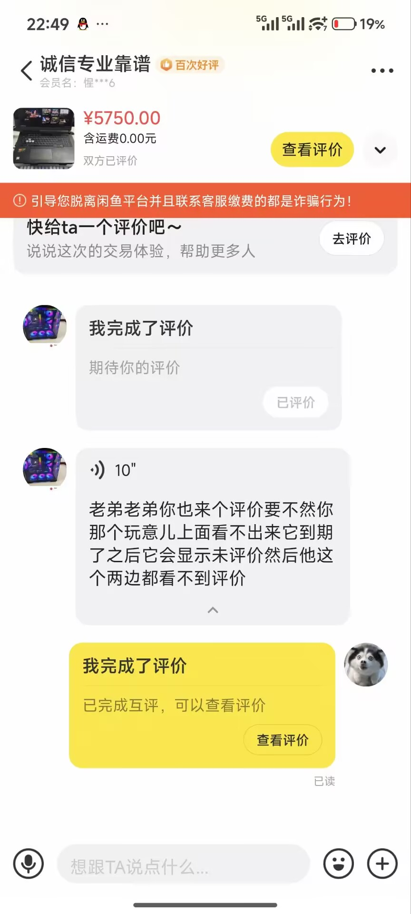
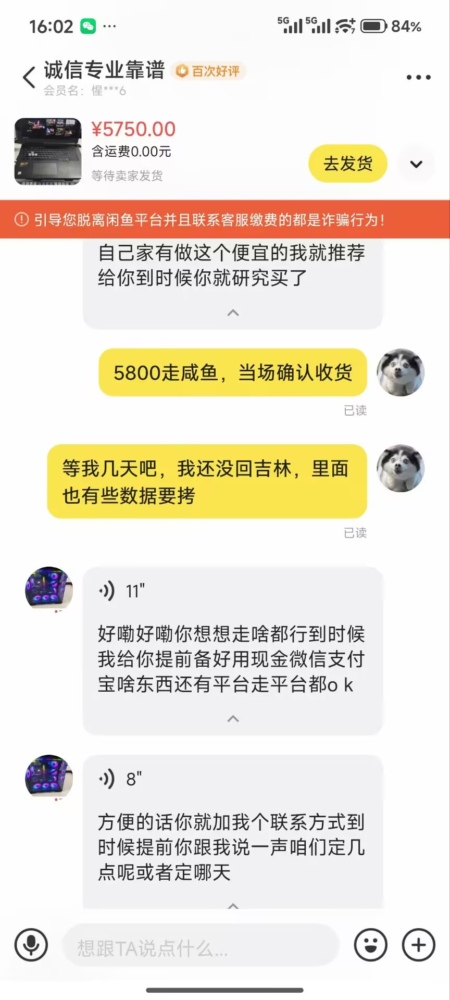

# 400
不要因为焦虑二冲动消费，做什么事之前仔细想一想

# 2025/4/29 拒绝面试
还未打听是线下面试还是线上面试，就直接拒绝
本质：自己简历上的东西还没有学完比较害怕、脸皮薄怕通过面试不去实习、自己比较心急，完全是下意识行为，应该留给自己足够的思考时间
总结：进社会脸皮厚一点、思考时间长一点

# 信息要仔细阅读

# 2025/5/26 被别人白嫖了
* 在问我目前在做什么项目时，我就直接具体回答在做什么，下一次再回答这种问题前，要仔细思考一下，给出一个模糊答案

* 他表面想跟我模拟面试，实际上想白嫖我的资源
* 三思而后行

### 止损与补救措施
#### **情况1：仅透露了项目主题，未涉及核心细节**
- **无需过度行动**：同类项目想做出差异化，关键在执行能力和资源整合。比如同样做“环保APP”，有人靠校园推广成功，有人靠技术迭代胜出，主题本身价值有限。  
- **后续注意**：下次交流时，可模糊表述为“在做一个互联网相关的小尝试”，或用反问转移话题：“你最近在忙什么项目呀？”

### **第三步：建立长期信息管理意识**
1. **区分公开信息与隐私边界**  
   - 在社交场景中（如面试、 networking），可准备“公开版”和“深度版”两种表述：  
     - *公开版*：聚焦项目目标和普适性价值（如“想解决大学生通勤的时间管理问题”）；  
     - *深度版*：仅对合作伙伴、导师等可信对象开放，涉及具体方案和数据。  
   - 练习用“框架性描述”代替“细节堆砌”，例如：“我们用了数据建模的方法优化流程，目前还在测试阶段”，而非具体公式或代码。

### **最后：接纳情绪，转化行动**
感到生气是因为你重视自己的付出，这恰恰是对项目负责的表现。但情绪宜疏不宜堵，你可以：  
- **写下来释放压力**：用文字梳理“我担心的具体点是什么？”“最坏的结果是什么？我能承受吗？”往往写着写着就会发现，很多担忧是被想象放大的。  
- **设定“信息过滤”习惯**：下次开口前，先停顿2秒问自己：“这个信息需要告诉对方吗？对方的提问是出于什么目的？”逐渐培养“选择性表达”的意识。  

记住，真正的“资源”是你持续创造价值的能力，而这种能力，永远不会因一次对话就被夺走。向前看，把精力投入到让项目变得更扎实、更不可替代上，才是对自己最好的保护。

# 咸鱼 450

买东西之前确定好出问题怎么办，退货钱谁出。。。。。

# 蓝杰

# 看信息要仔细

# 王康 - 操作系统 - TCP

不要那么想要帮助别人

说话要含糊其词

# 84

做事先理解含义

# 便携显示屏，亏 40

# sanc g52 max 漏光

冷静

# 后端 - 信息安全

别告诉别人在学什么

# 引力琥珀 2025.12.11

别情绪化

# 白泽亚

详细告诉他如何求职，他现在连考试重点都不告诉我，告诉一些价值信息要模糊

# 阿里发现我作弊

下次做笔试的时候，做的像一点，时间长一点，不要一道题一两分钟就完事了

# 2026 iscc 交易

先到处比价
byd，一道题20块，咸鱼才5块

# 币安

买东西前，看好每个信息

# 被李建shen窜动了

上体育课被李建shen撺掇问老师可不可以不跑1000，应该让他去

# 不要把劳动成果给别人

# 咸鱼卖笔记本 5750

自提时，强硬一些，他想要100，强硬一些，不要让它扣