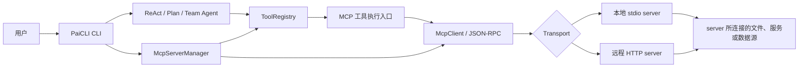
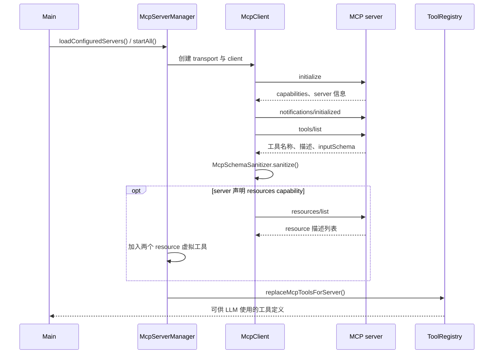
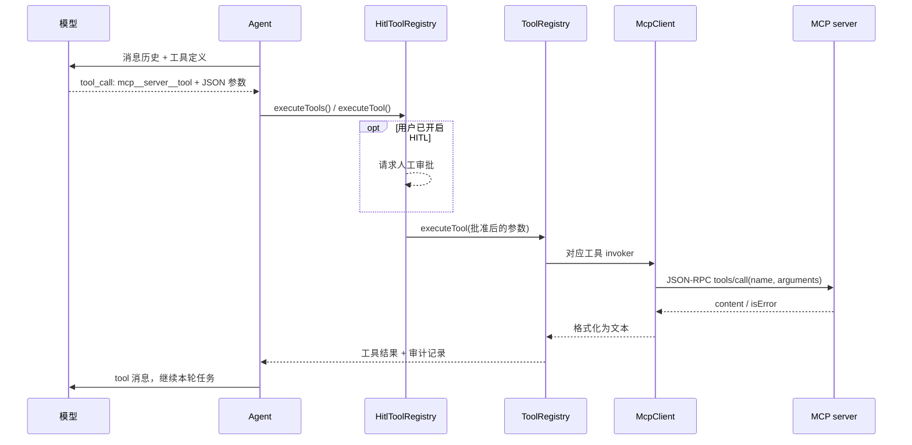
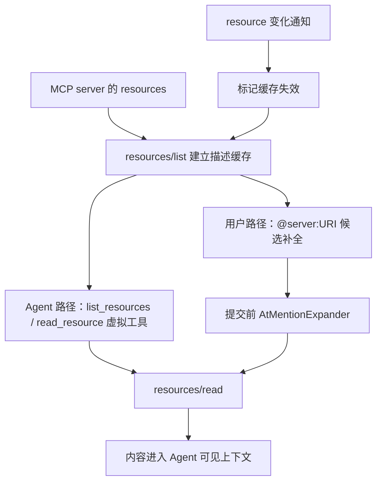

# PaiCLI MCP Server 设计与实现

> 适用代码：`5de88fb`（CLI Banner `v11.0.0`）。本文描述当前源码行为；`docs/phase-10-mcp-core.md`、`docs/phase-11-mcp-advanced.md` 是开发任务说明，遇到差异以源码为准。

## 1. MCP server 是什么，为什么接入

PaiCLI 是 **MCP client**，外部 MCP server 是能力提供方。server 可以运行在本机，也可以通过 HTTP 部署在远端。PaiCLI 通过统一协议发现并使用 server 提供的能力，不需要为每个外部系统单独修改 Agent 主循环。

当前实现接入三类 MCP 能力：

| 能力 | 含义 | 当前用法 |
| --- | --- | --- |
| Tools | 带参数的一次操作，可能读取数据，也可能产生副作用 | 从 `tools/list` 发现，注册到 `ToolRegistry`，由 Agent 通过 `tools/call` 调用 |
| Resources | 由 URI 标识、可读取的内容；可能是文档、配置或其他资料 | Agent 使用虚拟工具读取，或用户在输入中用 `@server:URI` 明确引用 |
| Prompts | server 暴露的提示词模板元信息 | `/mcp prompts <server>` 查看列表；当前不执行 `prompts/get` |

Resource 的价值是让 Agent 获得任务所需、但不在现有对话中的具体内容。例如，某个 server 提供一份接口规范，用户要求按规范写客户端时，可以把规范内容交给 Agent，而不必让模型猜测字段与约束。**连接 server 不等于已读取其中全部内容**：需要 Agent 调用 resource 工具，或用户显式引用 URI。



图中的文件、服务或数据源是示意：PaiCLI 能访问什么，完全取决于实际配置的 server 及其权限。没有 MCP 配置时，子系统仍会初始化，但不会启动外部 server。

## 2. 模块职责与设计边界

| 模块 | 主要职责 |
| --- | --- |
| `cli/Main.java` | 创建共享的 `HitlToolRegistry` 与 `McpServerManager`；启动 server；接入 CLI 命令、补全和输入展开 |
| `mcp/config/` | 读取并合并配置；展开变量；验证一个 server 只能选择一种 transport |
| `mcp/McpServerManager.java` | 管理多个 server 的状态、启动/关闭、工具注册与卸载、资源列表及通知处理 |
| `mcp/McpServer.java` | 保存单个 server 的配置、状态、客户端、工具、错误和启动时间 |
| `mcp/McpClient.java` | 封装 `initialize`、工具、resources、prompts 的 MCP 请求 |
| `mcp/jsonrpc/JsonRpcClient.java` | 构造 JSON-RPC 2.0 消息、配对请求/响应、超时和通知分发 |
| `mcp/transport/` | stdio 子进程和 Streamable HTTP 两种通信方式 |
| `mcp/protocol/` | 协议数据结构、MCP 工具描述和面向模型的 schema 清洗 |
| `mcp/resources/` | 资源描述、列表缓存，以及资源虚拟工具 |
| `mcp/mention/` | 解析、补全和展开用户输入中的 `@server:URI` |
| `mcp/notifications/` | 在独立线程处理 server 通知，避免阻塞 transport 读取线程 |
| `tool/ToolRegistry.java` | 把动态 MCP 工具并入内置工具集合，接收模型的调用并路由执行 |
| `hitl/`、`policy/AuditLog.java` | 对 MCP 工具应用审批策略，记录调用与显式资源引用 |

MCP 工具与内置工具共用 `ToolRegistry`，所以 ReAct、Plan-and-Execute、Multi-Agent 三条路径看到的是同一套动态工具定义。Plan 和 Team 创建执行实例时复用 ReAct 持有的工具注册表。

## 3. 配置如何变成连接

### 3.1 配置位置与格式

`McpConfigLoader` 先读用户级 `~/.paicli/mcp.json`，再读项目级 `.paicli/mcp.json`，按 server 名合并；同名条目由项目级整条覆盖。根对象为 `mcpServers`：

```json
{
  "mcpServers": {
    "local-docs": {
      "command": "java",
      "args": ["-jar", "${PROJECT_DIR}/tools/example-mcp-server.jar"],
      "env": {"EXAMPLE_MODE": "read-only"}
    },
    "remote-docs": {
      "url": "https://mcp.example.com/endpoint",
      "headers": {"Authorization": "Bearer ${EXAMPLE_MCP_TOKEN}"}
    }
  }
}
```

这只是格式示例，不代表仓库内存在该 Jar、远程地址或环境变量。一个 server **必须且只能**提供 `command` 或 `url`。`command`、`args`、`env`、`url`、`headers` 中可使用 `${PROJECT_DIR}`、`${HOME}`；其他 `${VAR}` 从进程环境变量读取，缺失时该 server 启动失败并标为 `ERROR`。这里的变量展开调用 `System.getenv`，不要假定 MCP 配置里的 `${VAR}` 会从仓库 `.env` 文件读取。配置可设 `disabled: true` 跳过启动。

`Main` 调用 `loadConfiguredServers()` 后执行 `startAll()`。多个启用的 server 由专用 daemon 线程池并行启动，线程上限为 8；每个 server 独立准备配置和初始化，单个失败不会阻断其他 server。CLI 随后打印启动摘要，并注册关闭钩子清理连接。创建或编辑 `mcp.json` 后，需要重新启动 PaiCLI 才会重新读取文件；`/mcp enable`、`disable`、`restart` 只改当前进程内状态。

### 3.2 两种 transport

**stdio：** `StdioTransport` 用 `ProcessBuilder` 在项目目录启动子进程。业务线程向 stdin 写一行 UTF-8 JSON 并 flush；独立 daemon 线程从 stdout 按行读取 JSON-RPC 消息；另一线程持续读取 stderr，保存最近 200 行供 `/mcp logs` 查看。分开读取 stderr 可避免子进程的错误输出填满操作系统缓冲区。关闭时先关闭 stdin，等待短暂退出窗口，再逐级终止进程。

**Streamable HTTP：** `StreamableHttpTransport` 对单个 endpoint 发送 POST，携带 `Content-Type: application/json`、`Accept: application/json, text/event-stream` 和协议版本。它接受 JSON 或 HTTP 响应中的 SSE `data:` 消息，记录响应的 `Mcp-Session-Id` 并在后续请求中带回；关闭时尽力发送带 session ID 的 DELETE。当前实现读取**本次 POST 响应体**后解析 SSE，不建立独立的长期 GET 通知流。

两种实现都遵循 `McpTransport.send()` / `onReceive()` / `close()` 接口；上层 `JsonRpcClient` 无需知道连接细节。

## 4. 初始化、发现工具与动态注册



`McpClient.initialize()` 使用协议版本 `2025-03-26` 发送 `initialize`，保存 server 返回的 capabilities，再发送 `notifications/initialized`。随后用 `tools/list` 获取工具。每个工具的 `inputSchema` 会先经过 `McpSchemaSanitizer`：移除 `$schema`、`$id`、`$ref`，将 `anyOf`、`oneOf` 降为 object 描述，并截断过长 description。这样做是为了适配模型工具参数所接受的 JSON Schema 子集；它是有损降级，不等价于完整 JSON Schema 解析。

工具统一命名为 `mcp__{server}__{tool}`，例如 `mcp__local-docs__search`。前缀避免与 `read_file` 等内置工具冲突，也使审批和审计能按名称识别 MCP 工具。同一 server 返回重名工具时，启动路径会报告错误；不同 server 可以有同名原始工具，因为命名空间不同。

`ToolRegistry` 的工具 Map 改为并发容器，并提供注册、卸载和按 server 全量替换的入口。替换用于 server 重启和 `notifications/tools/list_changed`：移除该 server 旧工具，再注册新列表。`getToolDefinitions()` 汇总当前所有工具供模型使用。若 server 被禁用，其工具会从注册表移除。

## 5. 外部工具调用如何执行

以 ReAct 为例，`Agent` 每轮调用 LLM 时带上 `ToolRegistry.getToolDefinitions()`。若模型返回某个 `mcp__...` 的 `tool_call`，Agent 将工具名、调用 ID、JSON 参数包装成 `ToolInvocation`，交给 `executeTools()`。同一轮多个互不依赖的调用仍沿用已有的并行工具执行机制，结果按原调用顺序回灌模型消息历史。



关键细节：

1. 注册时保存的 invoker 把 JSON 参数原样交给 `McpClient.callTool()`，后者解析 JSON、构造 `tools/call` 请求；发给 server 的 `name` 是**原始工具名**，不是 `mcp__...` 名称。
2. `JsonRpcClient` 给请求分配自增数字 ID，用 `ConcurrentHashMap<Long, CompletableFuture<JsonNode>>` 等待对应响应，并处理请求超时及 JSON-RPC 错误。
3. `McpCallToolResult` 把 `text` content 拼接成给模型看的字符串。image 等非文本 content 当前只变成提示文本；`isError` 会在返回文本前加错误提示。
4. `McpServerManager.invokeMcpTool()` 将调用异常转为给模型看的错误字符串。当前 `ToolRegistry` 的 `allow` 审计表示**调用路径已执行**，不能据此推断远程业务操作成功；server 的 `isError` 或被转换成字符串的异常也可能对应 `allow` 记录。

## 6. 审批、审计与信任边界

`ApprovalPolicy.requiresApproval()` 把所有 `mcp__` 前缀工具列入需要审批的范围。实际是否弹出审批框，由用户的 HITL 开关决定：**HITL 默认关闭**；执行 `/hitl on` 后，MCP 工具才会在调用前请求人工批准。拒绝或跳过不会发出 `tools/call`，由 `HitlToolRegistry` 记 `deny` 审计；批准或修改参数后继续进入 `ToolRegistry`。

进入审批或执行路径的 `mcp__` 调用会进入 `AuditLog`；若在 `ToolRegistry.executeTool()` 的取消检查前就返回，则不会写这条审计。记录包含时间、工具、参数、结果类别、原因、审批来源和耗时。参数写入前会对常见 `Bearer` 凭证及 `token`、`key`、`password`、`secret`、`authorization` 字段做模式脱敏，长度最多保存 1000 字符。这是针对常见写法的脱敏处理，不能保证识别任意形式的秘密。用户显式 `@` 引用 resource 的读取不经过 Agent 工具和 HITL，单独记录 `approver=mention`。

MCP server 是外部程序或远程服务，实际能力和副作用由其实现决定；PaiCLI 当前不会对 MCP 工具再套用内置文件工具的 `PathGuard`。部署时应分别考虑 server 本身的权限、其远程认证方式以及是否开启 HITL。

## 7. Resources 的两条使用路径

一个 resource 通常有 `uri`，也可能带 `name`、`title`、`description`、`mimeType`、`size`。只有 server 在初始化响应中声明 `resources` capability，`McpServerManager` 才会在启动时调用 `resources/list` 并注册两个虚拟工具。

### 7.1 Agent 自主读取

`mcp__{server}__list_resources` 让 Agent 获取 URI 列表，`mcp__{server}__read_resource` 用指定 URI 调 `resources/read`。虚拟工具与普通 MCP 工具走同一条注册、执行、HITL、审计链路。它适合用户只提出任务目标，让 Agent 自行选择所需资料的场景。server 返回文本 resource 时，结果封装为 `<resource uri="..." mimeType="...">`；二进制 blob 当前只返回占位说明，不注入原始字节。

### 7.2 用户显式引用

用户可以先用 `/mcp resources <server>` 查看 URI，再在**普通任务输入**中写 `@server:protocol://path`。例如，假设 `local-docs` server 真的返回 `doc://api/client`：

```text
请按照 @local-docs:doc://api/client 中的接口约束实现客户端。
```

提交任务给 ReAct、Plan 或 Team 之前，`AtMentionParser` 找出未被单引号或双引号包围的引用；`AtMentionExpander` 调 `resources/read`，将内容替换为带 server、URI、MIME 类型的 `<resource>` 块。单条内联内容最多保留 200,000 字符，超过会截断并附提示；读取失败会保留原引用并附 `<resource_error>`。JLine 补全从资源列表缓存生成候选，但只接普通输入模式，不接 Plan/Team 的 raw-mode 单键审阅。



`McpResourceCache` 缓存的是 **resource 描述列表**，而非正文。`notifications/resources/list_changed` 将 server 列表标为过期；`notifications/resources/updated` 按 URI 标记变化。显式引用每次仍会调用 `resources/read` 获取内容；`/mcp resources` 会重取列表。

## 8. Prompts、通知和 server 管理

`/mcp prompts <server>` 调 `prompts/list`，显示名称、标题及描述。当前没有 `prompts/get`、模板参数填写或自动注入对话的流程。`McpClient` 虽提供 `resources/subscribe` 方法，但当前管理器没有自动订阅资源；这里的通知处理是被动接收。

`NotificationRouter` 识别以下通知：

| 通知 | 当前处理 |
| --- | --- |
| `notifications/tools/list_changed` | 重新调用 `tools/list`，按 server 替换工具集合 |
| `notifications/resources/list_changed` | 将该 server 的 resource 列表缓存标为过期 |
| `notifications/resources/updated` | 将对应 URI 标为变化 |

通知 handler 放在独立 daemon executor 中。如果在 stdio 的 stdout 读取线程里同步处理 `tools/list_changed`，handler 发出 `tools/list` 后等待响应，而读取线程又被 handler 占用，就可能自我死锁。HTTP 侧当前只处理其请求响应中收到的消息，不提供持久化的独立通知监听通道。

CLI 管理命令：

| 命令 | 行为 |
| --- | --- |
| `/mcp` | 列出 server 状态、transport、工具数、运行时间及错误 |
| `/mcp restart <name>` | 关闭后重新启动并重新注册工具 |
| `/mcp logs <name>` | 查看该 stdio server 保存的最近 stderr 行 |
| `/mcp disable <name>` | 当前会话关闭 server 并移除其工具 |
| `/mcp enable <name>` | 当前会话重新启动 server |
| `/mcp resources <name>` | 刷新并显示该 server 的资源列表 |
| `/mcp prompts <name>` | 查看 prompt 模板列表，不执行模板 |

`McpServerStatus` 包含 `STARTING`、`READY`、`DISABLED`、`ERROR`。启动失败时保留错误信息，供 `/mcp` 查看。没有配置文件时不会启动 demo server；仓库中的旧任务说明出现过“默认配置 demo server”的计划，当前代码没有交付这一行为。

## 9. 运行中取消与 MCP 调用的关系

`Main.runWithCancelSupport()` 把 Agent run 放进单独线程，前台终端进入 raw mode 监听**单独按下的 ESC**。触发后设置 `CancellationToken`、取消 `Future` 并中断 runner。ReAct、Plan、Team 以及 `ToolRegistry` 在各自的迭代或工具执行边界检查取消状态；`execute_command` 对线程中断会销毁进程。因此取消是尽力而为、在检查点生效，不能据此保证外部 MCP server 已停止已接收的操作。

`CliCommandParser` 确实识别 `/cancel`，但当前运行期监听器只判断 ESC；非 ESC 字符会被丢弃。**按当前代码，运行中输入 `/cancel` 并回车不会发出取消请求**；空闲时输入 `/cancel` 只显示“当前没有正在运行的任务”。`README.md` 和第 11 期任务说明中关于运行中 `/cancel` 的表述与此不一致。

## 10. 当前交付边界与阅读顺序

- 已交付：stdio、Streamable HTTP、`initialize`、工具发现与调用、resources 双轨、prompts 列表查看、部分被动通知、HITL 与审计接入、运行中 ESC 取消。
- 未交付：OAuth/令牌刷新、`sampling/createMessage`、`prompts/get`、server 故障自动恢复、资源内容自动注入 system prompt、长期 HTTP 通知监听、图片等非文本工具结果的完整传递。
- 工具与 resource 的访问范围取决于 server 实现；连接成功只表示协议握手和发现流程完成，不保证某次业务调用成功。

按调用顺序阅读源码可从 `Main.java` → `McpServerManager.java` → `McpConfigLoader.java` / 两种 transport → `McpClient.java` → `ToolRegistry.java` → `HitlToolRegistry.java` / `AuditLog.java` 开始。若关注资源引用，再阅读 `resources/`、`mention/`、`notifications/`。
