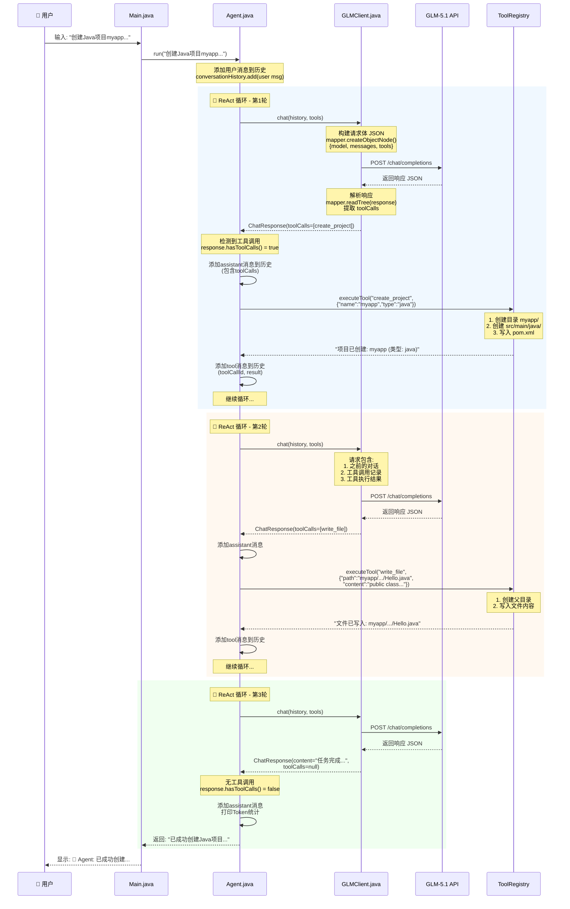

# PaiCLI Agent 执行流程详解

## 示例场景

用户输入：**"创建一个Java项目叫myapp，并在里面写一个Hello.java输出Hello World"**

---

## 完整流程图



---

## 数据流转详解

### 1️⃣ **初始化阶段**

```java
// conversationHistory 初始状态
[
  {role: "system", content: "你是一个智能编程助手..."}
]
```

### 2️⃣ **第1轮循环 - 工具调用：create_project**

#### 输入历史

```java
[
  {role: "system", content: "..."},
  {role: "user", content: "创建一个Java项目叫myapp..."}
]
```

#### GLM API 请求

```json
{
  "model": "glm-5.1",
  "messages": [
    {"role": "system", "content": "..."},
    {"role": "user", "content": "创建一个Java项目..."}
  ],
  "tools": [
    {
      "type": "function",
      "function": {
        "name": "create_project",
        "description": "创建新项目结构",
        "parameters": {
          "type": "object",
          "properties": {
            "name": {"type": "string", "description": "项目名称"},
            "type": {"type": "string", "description": "项目类型"}
          },
          "required": ["name", "type"]
        }
      }
    },
    // ... 其他4个工具
  ]
}
```

#### GLM API 响应

```json
{
  "choices": [{
    "message": {
      "role": "assistant",
      "content": "",
      "tool_calls": [{
        "id": "call_12345",
        "type": "function",
        "function": {
          "name": "create_project",
          "arguments": "{\"name\":\"myapp\",\"type\":\"java\"}"
        }
      }]
    }
  }],
  "usage": {
    "prompt_tokens": 156,
    "completion_tokens": 45
  }
}
```

#### 工具执行

```java
// ToolRegistry.executeTool()
tools.get("create_project").executor().execute({
  "name": "myapp",
  "type": "java"
})

// 实际操作
Files.createDirectories("myapp/src/main/java")
Files.createDirectories("myapp/src/main/resources")
Files.writeString("myapp/pom.xml", "...")

// 返回
"项目已创建: myapp (类型: java)"
```

#### 更新后的历史

```java
[
  {role: "system", content: "..."},
  {role: "user", content: "创建一个Java项目..."},
  {role: "assistant", content: "", toolCalls: [...]},
  {role: "tool", toolCallId: "call_12345", content: "项目已创建..."}
]
```

---

### 3️⃣ **第2轮循环 - 工具调用：write_file**

#### GLM API 请求（包含之前的上下文）

```json
{
  "model": "glm-5.1",
  "messages": [
    {"role": "system", "content": "..."},
    {"role": "user", "content": "创建一个Java项目..."},
    {"role": "assistant", "content": "", "tool_calls": [...]},
    {"role": "tool", "tool_call_id": "call_12345", "content": "项目已创建..."}
  ],
  "tools": [...]
}
```

#### GLM API 响应

```json
{
  "choices": [{
    "message": {
      "role": "assistant",
      "content": "",
      "tool_calls": [{
        "id": "call_67890",
        "type": "function",
        "function": {
          "name": "write_file",
          "arguments": "{\"path\":\"myapp/src/main/java/com/example/Hello.java\",\"content\":\"public class Hello {\\n    public static void main(String[] args) {\\n        System.out.println(\\\"Hello World\\\");\\n    }\\n}\"}"
        }
      }]
    }
  }]
}
```

#### 工具执行

```java
tools.get("write_file").executor().execute({
  "path": "myapp/src/main/java/com/example/Hello.java",
  "content": "public class Hello { ... }"
})

// 实际操作
Files.createDirectories("myapp/src/main/java/com/example")
Files.writeString("myapp/src/main/java/com/example/Hello.java", "...")

// 返回
"文件已写入: myapp/src/main/java/com/example/Hello.java"
```

#### 更新后的历史

```java
[
  {role: "system", content: "..."},
  {role: "user", content: "创建一个Java项目..."},
  {role: "assistant", content: "", toolCalls: [create_project]},
  {role: "tool", toolCallId: "call_12345", content: "项目已创建..."},
  {role: "assistant", content: "", toolCalls: [write_file]},
  {role: "tool", toolCallId: "call_67890", content: "文件已写入..."}
]
```

---

### 4️⃣ **第3轮循环 - 最终响应**

#### GLM API 请求

```json
{
  "model": "glm-5.1",
  "messages": [
    // 包含完整的6条消息历史
  ],
  "tools": [...]
}
```

#### GLM API 响应（无工具调用）

```json
{
  "choices": [{
    "message": {
      "role": "assistant",
      "content": "已成功创建Java项目 \"myapp\"，并在其中创建了 Hello.java 文件，内容为输出 \"Hello World\"。项目结构如下：\n\nmyapp/\n├── src/main/java/com/example/\n│   └── Hello.java\n└── pom.xml",
      "tool_calls": null
    }
  }],
  "usage": {
    "prompt_tokens": 458,
    "completion_tokens": 89
  }
}
```

#### Agent 判断

```java
if (response.hasToolCalls()) {
    // false，不进入
} else {
    conversationHistory.add(assistant message)
    System.out.printf("📊 Token使用: 输入=%d, 输出=%d%n", ...);
    return response.content();  // 返回给用户
}
```

---

## 关键代码片段

### Agent.run() 循环逻辑

```java
int iteration = 0;
while (iteration < MAX_ITERATIONS) {
    iteration++;
    
    // 调用 LLM
    ChatResponse response = llmClient.chat(conversationHistory, tools);
    
    if (response.hasToolCalls()) {
        // 有工具调用 → 执行 → 记录结果 → 继续循环
        conversationHistory.add(assistant message with toolCalls);
        
        for (ToolCall tc : response.toolCalls()) {
            String result = toolRegistry.executeTool(tc.name, tc.args);
            conversationHistory.add(tool message with result);
        }
        continue; // 继续下一轮
        
    } else {
        // 无工具调用 → 返回最终答案
        conversationHistory.add(assistant message);
        return response.content();
    }
}
```

### GLMClient.chat() JSON构建

```java
ObjectNode requestBody = mapper.createObjectNode();
requestBody.put("model", MODEL);

// 添加消息历史
ArrayNode messagesArray = requestBody.putArray("messages");
for (Message msg : messages) {
    ObjectNode msgNode = messagesArray.addObject();
    msgNode.put("role", msg.role());
    msgNode.put("content", msg.content());
    
    // 如果有工具调用
    if (msg.toolCalls() != null) {
        ArrayNode toolCallsArray = msgNode.putArray("tool_calls");
        // 添加工具调用详情
    }
    
    // 如果是工具结果
    if (msg.toolCallId() != null) {
        msgNode.put("tool_call_id", msg.toolCallId());
    }
}

// 添加工具定义
ArrayNode toolsArray = requestBody.putArray("tools");
for (Tool tool : tools) {
    // 添加工具schema
}

// 发送请求
String jsonString = requestBody.toString();
// POST to API...
```

---

## 核心设计模式

1. **ReAct 循环**：Think（LLM思考）→ Act（执行工具）→ Observe（观察结果）
2. **Function Calling**：LLM 返回结构化的工具调用请求
3. **对话历史管理**：所有交互记录在 conversationHistory 中作为上下文
4. **工具注册模式**：统一的工具接口，易于扩展

---

## Token 统计示例

```
第1轮：输入=156 tokens, 输出=45 tokens (工具调用)
第2轮：输入=287 tokens, 输出=52 tokens (工具调用)
第3轮：输入=458 tokens, 输出=89 tokens (最终答案)
总计：输入=901 tokens, 输出=186 tokens
```

随着对话轮次增加，输入 tokens 会累积（包含完整历史）。