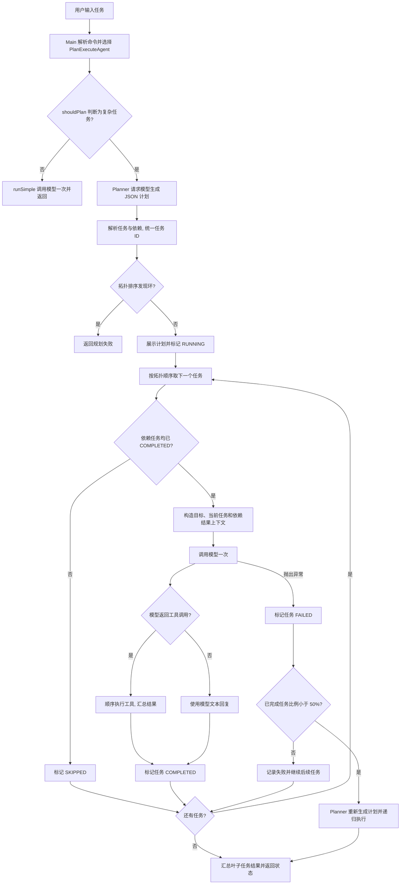
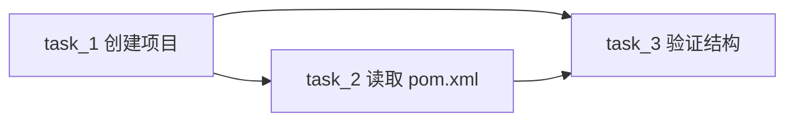

# 计划模式的实现与执行流程

本文按当前代码说明 PaiCLI 的 Plan-and-Execute 模式。它先让模型生成带依赖关系的任务列表，再按拓扑顺序逐个执行。虽然计划用 DAG 表示，当前执行器仍是**串行执行**。

## 从命令进入计划模式

程序默认使用 ReAct 模式。输入 `/plan` 会切换到计划模式，等待下一条任务；输入 `/plan <任务>` 会切换模式、立即执行任务，并在执行结束后切回 ReAct。也可以输入 `mode` 并选择 `2`，持续使用计划模式。命令识别在 `CliCommandParser`，切换和调用在 `Main`。

计划模式并不保证每条输入都会生成计划。`PlanExecuteAgent.run()` 先调用 `shouldPlan()`：如果文本长度超过 50 个字符，或者命中至少 3 个不同的动作关键词，就进入 `runWithPlan()`；否则走 `runSimple()`。关键词包括“创建、写、读、执行、编译、运行、修改、删除、然后、接着、再、最后”。`runSimple()` 只请求模型一次，若返回工具调用就执行工具并直接返回工具结果。

## 全流程



流程中的各步对应以下实现：

1. `Planner.createPlan()` 把目标交给模型，要求输出包含 `summary`、`tasks`、`id`、`description`、`type` 和 `dependencies` 的 JSON。
2. `Planner.parsePlan()` 清除可能的 Markdown 代码块，为任务按顺序重新编号为 `task_1`、`task_2` 等，再把依赖 ID 映射过去，建立反向依赖。`ExecutionPlan.computeExecutionOrder()` 用深度优先遍历做拓扑排序；检测到环会报错。
3. `PlanExecuteAgent.executePlan()` 展示计划并逐个处理任务。`Task.isExecutable()` 要求任务仍是 `PENDING`，且所有依赖任务均为 `COMPLETED`；不满足时标记为 `SKIPPED`。
4. 每个可执行任务只调用模型**一次**。执行提示词包含任务类型和描述，用户消息包含总目标、当前任务以及直接依赖任务的状态和结果。模型如返回工具调用，执行器逐个调用 `ToolRegistry`；否则直接采用模型回复。结果保存到当前 `Task`，供后续任务读取。
5. 执行抛出异常时，任务标记为 `FAILED`。若当前计划完成比例小于 50%，`Planner.replan()` 会把原目标、失败原因和已完成任务描述发给模型，生成新计划，再递归执行。否则记录失败，继续遍历任务。
6. 最后优先汇总没有后续依赖的叶子任务结果；如果有 `FAILED` 任务，返回“计划部分完成”，否则返回“计划执行完成”。

## 示例：创建项目、读取配置、验证结构

用户输入：

```text
/plan 创建一个 demoapp Java 项目，然后读取 demoapp/pom.xml，最后验证项目结构
```

这句话命中“创建、读、然后、最后”等关键词，所以会进入规划流程。模型可能给出如下计划；**实际计划由模型生成，每次可能不同**：

```json
{
  "summary": "创建并检查 Java 项目",
  "tasks": [
    {
      "id": "task_1",
      "description": "创建 demoapp Java 项目",
      "type": "COMMAND",
      "dependencies": []
    },
    {
      "id": "task_2",
      "description": "读取 demoapp/pom.xml",
      "type": "FILE_READ",
      "dependencies": ["task_1"]
    },
    {
      "id": "task_3",
      "description": "根据项目创建和 pom.xml 的结果验证项目结构",
      "type": "VERIFICATION",
      "dependencies": ["task_1", "task_2"]
    }
  ]
}
```



执行时，`task_1` 没有依赖，可以立即开始。模型可能调用 `create_project`，参数为 `{"name":"demoapp","type":"java"}`。工具创建目录和 `pom.xml`，其返回文本保存为 `task_1` 的结果。`task_2` 随后拿到该结果，模型可能调用 `read_file` 读取 `demoapp/pom.xml`。`task_3` 再收到前两项结果；当前执行提示词要求 `VERIFICATION` 类型直接基于上下文给出文本判断。最终答复主要取叶子任务 `task_3` 的结果。

注意：任务类型用于提示模型，并没有强制绑定具体工具；例如 `COMMAND` 任务仍可能选择 `create_project`。示例 JSON 中的三个任务也只是演示，规划提示词通常要求模型拆成 5–10 项，但代码没有强制检查数量。

## 当前实现的边界

- `ToolRegistry` 把文件或命令错误、非零退出码等放在**结果字符串**里返回。执行器通常会把这个字符串当作成功结果，将任务标记为 `COMPLETED`，因此重新规划不一定会触发。
- `executeTask()` 不会把工具结果再次发给模型让它继续判断；同一任务只有一次模型请求。`runSimple()` 也是如此。完整的 ReAct 多轮工具循环只在 `Agent` 类中。
- 重规划没有最大次数限制，且新计划从头执行；已完成任务的描述会交给模型，但代码没有强制跳过这些任务。
- 计划最终状态只检查是否存在 `FAILED`，没有要求 `isAllCompleted()`。因此只有 `SKIPPED`、没有 `FAILED` 时，仍可能返回“计划执行完成”。
- 单个任务的模型提示词要求 `ANALYSIS` 和 `VERIFICATION` 直接给结论，所以验证主要依赖先前任务的输出，并不自动再读取文件或运行测试。

## 相关代码

- 入口与模式切换：[`Main.java`](../src/main/java/com/paicli/cli/Main.java)、[`CliCommandParser.java`](../src/main/java/com/paicli/cli/CliCommandParser.java)
- 计划生成与重规划：[`Planner.java`](../src/main/java/com/paicli/plan/Planner.java)
- 依赖和拓扑排序：[`Task.java`](../src/main/java/com/paicli/plan/Task.java)、[`ExecutionPlan.java`](../src/main/java/com/paicli/plan/ExecutionPlan.java)
- 任务执行与结果汇总：[`PlanExecuteAgent.java`](../src/main/java/com/paicli/agent/PlanExecuteAgent.java)
- 模型请求与工具实现：[`GLMClient.java`](../src/main/java/com/paicli/llm/GLMClient.java)、[`ToolRegistry.java`](../src/main/java/com/paicli/tool/ToolRegistry.java)
