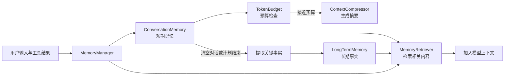

# PaiCLI Memory 与上下文工程：设计及执行流程

本文说明 `src/main/java/com/paicli/memory/` 的设计、主要实现逻辑，以及一次用户输入如何经过记忆系统。内容以当前代码行为为准。

## 一、整体设计

Memory 系统把信息分成两层：

- **短期记忆**保存当前会话中的用户消息、助手回复、工具结果和摘要，主要存在内存中。
- **长期记忆**保存可跨会话使用的关键事实，并持久化为 JSON 文件。

`MemoryManager` 是 Agent 使用这两层记忆的统一入口。它负责写入消息、检索相关内容、检查 Token 预算、触发摘要压缩，以及提取和保存事实。

### 主要类的职责

| 类 | 职责 |
| --- | --- |
| `Memory` | 统一定义存储、按 ID 获取、搜索、删除、清空和统计接口。 |
| `MemoryEntry` | 表示一条记忆，包含 ID、内容、类型、时间、元数据和估算 Token 数。类型有 `CONVERSATION`、`FACT`、`SUMMARY`、`TOOL_RESULT`。 |
| `ConversationMemory` | 用有序 Map 保存当前会话条目，统计占用并在超出容量时淘汰最旧条目。 |
| `LongTermMemory` | 保存事实等长期条目，按完全相同的内容去重，并在读写时与磁盘 JSON 文件同步。 |
| `MemoryQueryTokenizer` | 使用 Jieba 对中文查询分词，过滤单字和纯标点；英文保留完整单词。 |
| `MemoryRetriever` | 从长、短期记忆中做关键词匹配，按相关度排序，并在指定预算内拼接“相关记忆”文本。 |
| `TokenBudget` | 估算消息 Token 数、判断短期记忆是否需要压缩，并累计模型调用用量。 |
| `ContextCompressor` | 将较早条目分片生成摘要，必要时合并摘要；也使用模型从对话中提取关键事实。 |
| `MemoryManager` | 把上述组件组合起来，向 Agent 提供简单的记忆接口。 |

## 二、实现逻辑

### 写入短期记忆与预算检查

`MemoryManager.addUserMessage()`、`addAssistantMessage()` 和 `addToolResult()` 会创建 `MemoryEntry` 并写入 `ConversationMemory`，随后调用 `compressIfNeeded()`。默认短期记忆预算是 **8192 个估算 Token**，默认模型上下文窗口配置为 **200000**。

`MemoryEntry.estimateTokens()` 根据中文字符和其他字符数量做粗略估算。`TokenBudget` 在短期记忆达到可用预算约 **80%** 时要求压缩。`ConversationMemory` 本身还会在超出容量时直接淘汰最旧条目。

压缩器保留最近 **3 条记忆条目**，将更早的条目每 5 条分成一组，分别请求模型生成摘要；有多个摘要时，再请求模型合并。最后把摘要和近期条目放回短期记忆。这里的“3 条”是条目数，并非严格的三轮对话。

### 检索相关记忆

`MemoryRetriever` 同时扫描短期和长期记忆：完整查询命中内容时直接给分，否则使用分词结果计算关键词命中比例，并对部分匹配结果应用时间衰减；长期记忆的得分再乘以 `1.2`。检索结果按分数排序，最多取 10 条，并受调用方指定的 Token 上限约束。

这种检索基于**关键词和子串匹配**，目前没有 Embedding、向量数据库或语义检索。

### 长期保存与复用

长期记忆默认写入 `~/.paicli/memory/long_term_memory.json`。可以通过 JVM 参数 `-Dpaicli.memory.dir=目录` 指定位置；未设置该参数时，也支持环境变量 `PAICLI_MEMORY_DIR`。新建 `LongTermMemory` 时会加载已有文件，保存或删除条目时会重新写入文件。

手动输入 `/save <事实>` 可以直接保存一条长期事实。ReAct 模式执行 `/clear` 时，会先让模型从短期记忆中提取关键事实，之后清空短期记忆和对话历史。Plan 模式在一次计划运行结束后也会尝试提取事实。

## 三、用一次用户输入理解全流程

假设用户在默认 ReAct 模式输入：

> 读取 pom.xml，告诉我项目使用什么 Java 版本。

1. **记录输入。** `Agent.run()` 调用 `MemoryManager.addUserMessage()`，把原话作为 `CONVERSATION` 条目写入短期记忆，并检查是否需要压缩旧条目。
2. **检索旧记忆。** Agent 用这句话查询短期和长期记忆。假如长期记忆已有“PaiCLI 是 Maven 项目”，它可能进入本次的相关记忆文本。由于用户原话已写入短期记忆，它也可能被本次检索匹配到。
3. **组装请求。** Agent 将相关记忆加入 system prompt，同时把用户原话加入原有对话历史，然后调用模型。
4. **执行工具。** 模型可能请求 `read_file({"path":"pom.xml"})`。Agent 读取文件，把工具结果写入短期记忆，同时作为工具消息回传给模型。
5. **生成回答。** 模型根据文件内容回答，例如“项目使用 Java 17”。Agent 将最终回复写入短期记忆，记录这次最终响应的 Token 用量，并把回答显示给用户。
6. **后续沉淀事实。** 这次输入结束时，对话内容不会自动全部写入长期记忆。之后执行 `/clear` 时，系统才会尝试提取“项目使用 Java 17”之类的事实并持久化，供下一次对话检索。

这条路径可以简记为：**输入 → 短期记录 → 检索相关记忆 → 模型调用 → 工具结果回灌 → 回答与记录 → 后续提取长期事实**。

### Plan-and-Execute 模式的差别

Plan 模式同样记录用户输入、子任务回复和工具结果，但相关记忆是在**每个子任务执行前**按任务描述检索的。计划结束后会尝试提取事实。CLI 每次运行计划都会新建一个 `PlanExecuteAgent`，所以不同计划之间主要通过磁盘上的长期记忆复用信息。

## 四、当前边界

- 短期记忆的摘要压缩**不会同步裁剪** ReAct 发送给模型的原始 `conversationHistory`，因此还没有完整约束实际请求的上下文长度。
- Token 统计没有覆盖每一次带工具调用的模型响应；当前代码主要记录收到最终回复时的用量。
- 检索器使用关键词匹配，遇到语义相近但用词不同的表达，可能无法召回相关事实。
- 事实提取依赖一次额外的模型调用；调用失败时会返回空结果，长期记忆不会新增该次提取的事实。

## 五、代码入口

- `src/main/java/com/paicli/memory/MemoryManager.java`：系统入口和各组件协调。
- `src/main/java/com/paicli/agent/Agent.java`：ReAct 中的写入、检索和 `/clear` 前的事实提取。
- `src/main/java/com/paicli/agent/PlanExecuteAgent.java`：计划子任务的记忆检索、写入和计划结束后的事实提取。
- `src/main/java/com/paicli/cli/Main.java`：`/memory`、`/mem`、`/save`、`/clear` 命令入口。
