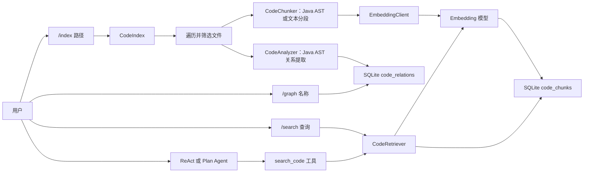
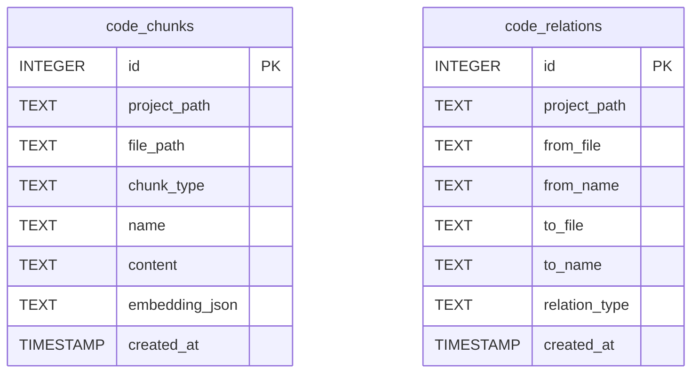
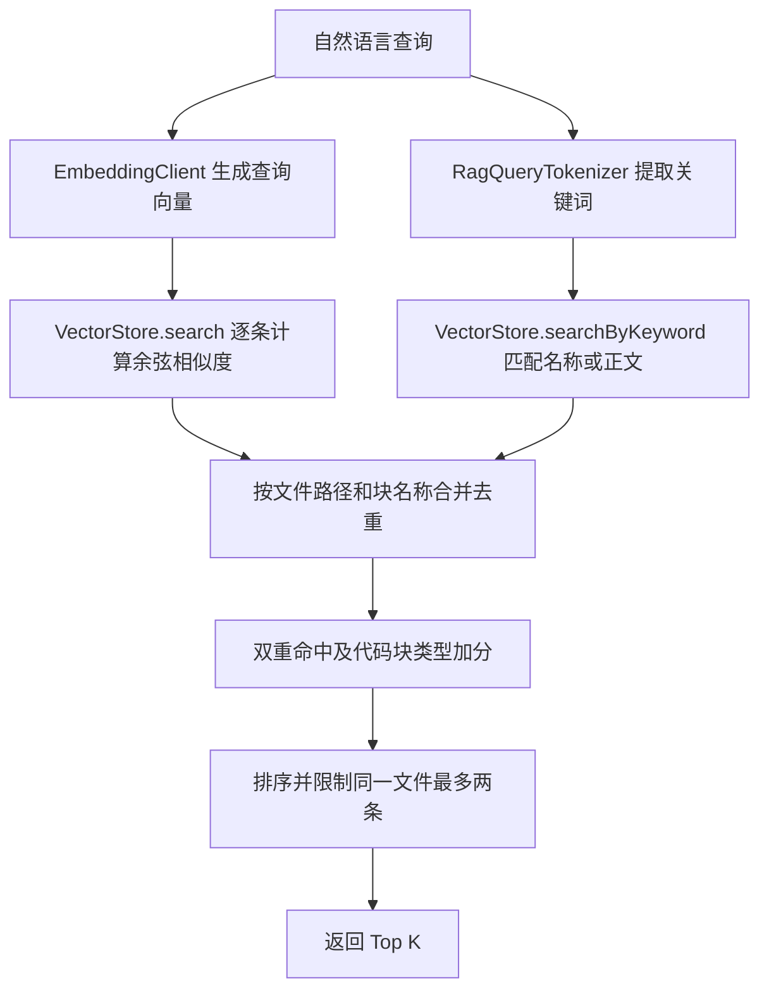

# PaiCLI RAG 代码库检索：设计、实现与完整示例

本文以当前仓库的代码为准，说明 PaiCLI 如何建立代码索引、检索相关源码，以及查询代码关系。RAG 在这里指“先检索相关代码，再把检索结果交给用户或 Agent 使用”；它并不负责训练新的大模型。

## 对外入口

| 入口 | 作用 | 主要数据 |
| --- | --- | --- |
| `/index [路径]` | 扫描文件、分块、生成向量并提取代码关系；省略路径时索引当前目录 | 写入 `code_chunks`、`code_relations` |
| `/search <查询>` | 用自然语言检索代码，结合向量相似度和关键词匹配 | 查询 `code_chunks` |
| `/graph <名称>` | 查询类或方法的已记录关系 | 查询 `code_relations` |
| Agent 工具 `search_code` | 由模型按需检索代码，为回答提供源码片段 | 查询 `code_chunks` |

CLI 命令在 [`Main.java`](../src/main/java/com/paicli/cli/Main.java) 和 [`CliCommandParser.java`](../src/main/java/com/paicli/cli/CliCommandParser.java) 中处理；Agent 工具在 [`ToolRegistry.java`](../src/main/java/com/paicli/tool/ToolRegistry.java) 中注册。

## 总体架构



两张表承担不同职责：`code_chunks` 保存代码片段和向量，`code_relations` 保存静态分析得到的结构关系。当前 `/search` 不用关系表扩展结果，`/graph` 也不计算向量相似度。

## 建立索引：从源码到向量

### 1. 遍历并筛选文件

[`CodeIndex.index()`](../src/main/java/com/paicli/rag/CodeIndex.java) 先把项目路径转换为规范化的绝对路径，再用 `Files.walkFileTree` 遍历。它跳过 `.git`、`target`、`build`、`node_modules`、`.idea` 等目录，并只收集代码和部分文本文件，例如 `.java`、`.py`、`.js`、`.md`、`.xml`、`.json`。这一步不会调用 Embedding 模型。

### 2. 将文件拆成 `CodeChunk`

[`CodeChunker`](../src/main/java/com/paicli/rag/CodeChunker.java) 对 Java 文件使用 JavaParser 解析 AST，生成类级和方法级代码块。类块主要取类声明附近的前几行；方法块取方法的完整源码范围。Java 解析失败时退回文本分段。非 Java 文件按文本分段，目标大小为每段约 2000 个字符。

[`CodeChunk`](../src/main/java/com/paicli/rag/CodeChunk.java) 是一个 Java `record`，包含 `filePath`、`chunkType`、`name`、`content`、`startLine` 和 `endLine`。向量化之前，`toEmbeddingText()` 把类型、名称和正文拼成一段文本：

```text
[method:SampleService.public User findUserById(Long id)]
public User findUserById(Long id) {
    return userRepository.findById(id);
}
```

上例是格式示意；实际方法名称由 JavaParser 返回的方法声明组成。行号存在于 `CodeChunk` 对象中，但**没有进入 Embedding 文本，也没有写入当前数据库表**。

### 3. 请求 Embedding 模型

[`CodeIndex`](../src/main/java/com/paicli/rag/CodeIndex.java) 对每个块执行 `embeddingClient.embed(chunk.toEmbeddingText())`，得到 `float[]`。Java 代码负责组装文本与 HTTP 请求；向量中的数值由外部 Embedding 模型计算。

[`EmbeddingClient`](../src/main/java/com/paicli/rag/EmbeddingClient.java) 默认请求本地 Ollama 的 `/api/embeddings`，模型默认为 `nomic-embed-text:latest`；也支持 OpenAI 兼容的远程 `/embeddings` 接口。配置从 `EMBEDDING_PROVIDER`、`EMBEDDING_MODEL`、`EMBEDDING_BASE_URL`、`EMBEDDING_API_KEY` 环境变量读取，其次读取同名 JVM 系统属性。发送前文本最多保留前 2000 个字符。

### 4. 另外提取代码关系

对 Java 文件，[`CodeAnalyzer`](../src/main/java/com/paicli/rag/CodeAnalyzer.java) 再从 AST 提取 `extends`、`implements`、`imports`、`contains` 和 `calls`。这些关系不经过 Embedding。`calls` 主要记录调用者所在方法和被调用的方法名，没有完整解析跨类调用目标。

### 5. 写入 SQLite

[`VectorStore`](../src/main/java/com/paicli/rag/VectorStore.java) 默认连接 `~/.paicli/rag/codebase.db`；`-Dpaicli.rag.dir=目录` 可以改变数据库目录。多个项目共用一个数据库文件，通过 `project_path` 区分。重新索引时，先删除该项目的旧记录，再写入本次的代码块和关系。



`embedding_json` 是普通 `TEXT` 列：Jackson 将 `float[]` 序列化成类似 `[0.12,-0.38,0.07]` 的 JSON 数组。实际维度由 Embedding 模型决定。数据库给项目路径、文件路径、块类型和关系名称建立了普通 SQL 索引，**没有使用专用向量近邻索引**。代码块与关系各自批量插入；重新索引的删除和两类插入并非一个覆盖全流程的事务。

## 查询：怎样找回相关代码

[`CodeRetriever.hybridSearch()`](../src/main/java/com/paicli/rag/CodeRetriever.java) 把语义检索和关键词检索结合起来：



语义分支会读出当前项目的向量 JSON，反序列化为 `float[]`，在 Java 内存中计算与查询向量的余弦相似度。关键词分支使用 SQLite `LIKE` 匹配块名称或正文。两路结果合并后，双重命中获得一次加分，`method` 和 `class` 块也获得类型加分。最后按分数排序，并限制同一文件最多占两条。`/search` 使用 [`SearchResultFormatter`](../src/main/java/com/paicli/rag/SearchResultFormatter.java) 输出摘要、路径、分数和源码片段；该摘要由代码模板生成，不另行请求聊天模型。

`/graph` 则直接按名称查询 `code_relations.from_name` 或 `to_name`，返回匹配的关系行。它目前是精确名称查询，不会自动递归展开完整调用图。

## 完整示例：从索引到回答

仓库的 [`SampleService.java`](../src/test/resources/rag/SampleService.java) 包含 `SampleService` 类及 `findUserById(Long id)` 方法。下面假设从**仓库根目录**运行 CLI，且 Embedding 服务已经可用。命令和可能命中的代码块用于解释流程，不表示这里实际运行过索引或确认了搜索排名。

### 第一步：索引当前项目

```text
/index .
```

`CodeIndex` 会遍历仓库，找到 `SampleService.java`，生成类块与方法块。例如 `findUserById` 方法块的正文含有 `userRepository.findById(id)`。Embedding 模型为该块生成向量，随后它与块名称、文件路径、源码正文一起进入 `code_chunks`。

与此同时，`CodeAnalyzer` 会记录 `SampleService extends BaseService`、`SampleService implements ServiceInterface`、`SampleService contains SampleService.findUserById` 等关系；方法内的 `findById` 调用也会被记录为简化的 `calls` 关系。这些行进入 `code_relations`。

### 第二步：用自然语言找实现

```text
/search 根据 ID 查找用户的方法在哪里
```

查询文本也会被向量化。`hybridSearch()` 比较查询向量和已存代码向量，再叠加关键词匹配与块类型加分。`SampleService.findUserById` 可能作为相关结果出现，CLI 展示它所在文件、方法名称和一小段代码。具体分数与排名取决于模型及整个项目的索引内容。

### 第三步：查看类关系

```text
/graph SampleService
```

这个命令读取 `code_relations`，展示与 `SampleService` 精确匹配的继承、实现和包含方法等关系。它不读取 `code_chunks` 中的向量。

### 第四步：让 Agent 使用检索

用户也可以直接问：“根据 ID 查找用户的逻辑在哪？”ReAct 或 Plan 模式把 `search_code` 暴露给模型；**模型可以选择**调用它，取得格式化的代码结果后再回答。这里的“自动检索”是模型按需选择工具，不是每次提问都强制检索。

## 当前实现的边界

- `hybridSearch()` 先执行语义检索。Embedding 服务不可用时，它会报错，当前没有自动退回纯关键词检索。
- Java 方法块没有按长度继续拆分，而 `EmbeddingClient` 最多发送前 2000 个字符；长方法的后半部分可能不参与向量计算。
- `CodeChunk` 的起止行号没有写入 SQLite，因此当前搜索结果不能直接从数据库还原这些行号。
- `/index` 可指定路径，但 [`Main.java`](../src/main/java/com/paicli/cli/Main.java) 中的 `/search` 和 `/graph` 使用当前目录 `"."` 作为项目路径。若索引了另一个目录，这两个 CLI 命令可能找不到该项目的数据。
- `calls` 是轻量 AST 提取，不是完成了类型绑定和动态调用分析的精确调用图。

以上边界说明的是当前代码行为；它们不影响理解核心设计：**先按代码结构拆分，再向量化与持久化；查询时结合语义和关键词；结构关系走独立的图谱表。**
