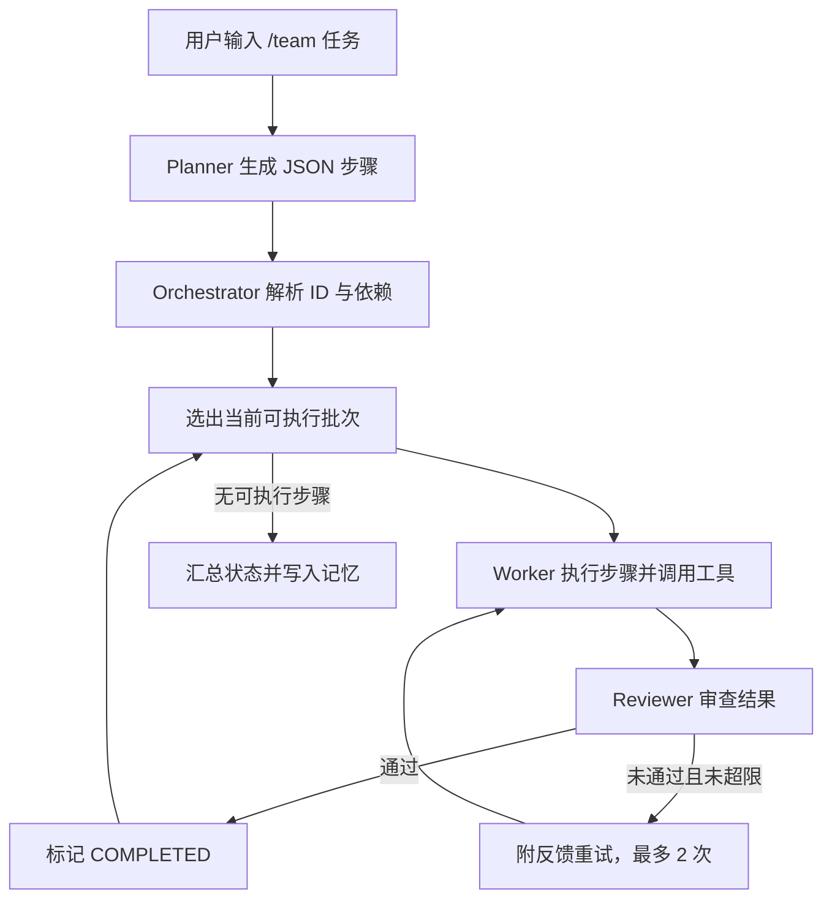
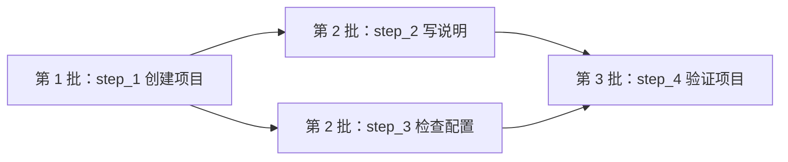
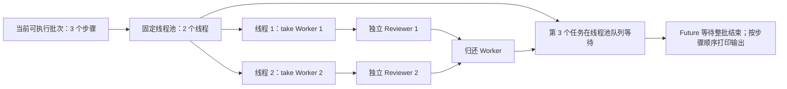

# Multi-Agent 编排与 Worker 并发执行

本文基于 `9243724` 的代码，说明 `/team` 模式的角色分工、步骤依赖与并发调度。

## 设计概览

Multi-Agent 是同一 Java 进程内的主从协作：`AgentOrchestrator` 负责规划、调度、审查与汇总；`SubAgent` 根据角色提示词承担具体工作。子代理共享 LLM 客户端和 `ToolRegistry`，各自维护对话历史。

| 角色 | 职责 | 是否可调用工具 |
| --- | --- | --- |
| Planner | 将用户任务拆成带依赖的 JSON 步骤 | 否 |
| Worker | 执行步骤，使用文件、命令和代码检索工具 | 是 |
| Reviewer | 审查 Worker 的结果并提出问题 | 否 |

编排器通过 `AgentMessage` 传递任务和结果，并单独识别 `ERROR`。CLI 输入 `/team <任务>` 会立即执行；只输入 `/team` 则由下一条输入提供任务，结束后回到 ReAct。CLI 创建编排器时复用 ReAct 的 `ToolRegistry` 与 `MemoryManager`，使代码索引项目路径与记忆状态保持一致。

## 从计划到依赖批次

Planner 输出的每个步骤包含 `id`、`description`、`type` 和 `dependencies`。`parsePlan()` 将步骤重新编号为 `step_1`、`step_2` 等，并把依赖中的原 ID 映射到新 ID。编排器用 `PENDING`、`RUNNING`、`COMPLETED`、`FAILED` 表示步骤状态。

每一轮，`getExecutableSteps()` 只选择 **状态为 `PENDING` 且所有依赖均为 `COMPLETED`** 的步骤。当前批次全部处理完后，再计算下一批。依赖失败的步骤无法进入批次，结束时会明确提示被跳过。Worker 执行某步时，编排器把已完成的直接依赖结果作为上下文传给它。

例如下面的依赖关系会形成三个批次：

`step_2` 和 `step_3` 都只依赖已完成的 `step_1`，因此可以同时执行；`step_4` 必须等待二者完成。当前实现没有显式检测循环依赖或不存在的依赖：这类步骤会保持 `PENDING`，直至没有可执行步骤时结束调度。

## Worker 如何并发执行

如果一批只有一个步骤，编排器轮流选择 Worker，直接调用 `runStep()`，输出实时显示。如果一批有多个独立步骤，则进入 `runBatchParallel()`：

1. 创建固定线程池，大小为 `min(批次步骤数, Worker 数)`。当前固定有两个 Worker，因此最多同时执行两个步骤。
2. 将两个 Worker 放入 `BlockingQueue<SubAgent>`。每个线程通过 `take()` 独占一个 Worker；若池中没有空闲 Worker，`take()` 会阻塞。超过两个的步骤通常先在 `ExecutorService` 的任务队列等待，因为线程数也只有两个。
3. 每个并发步骤创建自己的 Reviewer，避免共享审查对话历史。线程完成 Worker 执行、Reviewer 审查及必要的重试后，清空 Worker 历史并将其归还队列。
4. 编排器先提交本批全部任务，再通过 `Future.get()` 等待批次完成。等待发生在提交之后，因此不会把本批任务串行化。
5. 每个步骤把流式输出写入独立的 `ByteArrayOutputStream`。整批完成后，编排器按计划中的步骤顺序输出缓冲内容，避免多个线程同时写终端造成文字交错。**并发批次的计算并行，终端展示延后且有序；单步骤批次仍实时显示。**

步骤状态由同步的 `updateStep()` 回写；重试次数使用 `ConcurrentHashMap`。批次间以等待所有 `Future` 完成为边界，因此后一批不会在前一批尚未结束时开始。

## 审查、失败和收尾

`runStep()` 先让 Worker 执行，再让 Reviewer 审查。Reviewer 拒绝时，编排器将问题反馈给同一个 Worker，最多重试两次。Reviewer 返回无法明确解析的结果时，默认按未通过处理。Worker 返回 `ERROR` 或空结果时，步骤标为 `FAILED`；依赖它的步骤不会执行。

有两个需要区分的边界：Reviewer 的 LLM 调用失败时，编排器保留 Worker 的当前结果并将步骤标为完成；**Reviewer 连续拒绝且重试次数耗尽时，代码也会保留最后结果并标为 `COMPLETED`**，所以后续依赖步骤仍能继续。这不等同于审查通过。

最后，编排器汇总每步状态和结果预览，将用户输入及最终结果写入与 ReAct 共享的 `MemoryManager`。`SubAgent` 本身没有直接操作该记忆管理器。

## 相关代码

- `src/main/java/com/paicli/cli/Main.java`：`/team` 命令入口及共享依赖注入。
- `src/main/java/com/paicli/agent/AgentOrchestrator.java`：计划解析、依赖调度、并发批次、审查重试和结果汇总。
- `src/main/java/com/paicli/agent/SubAgent.java`：角色提示词、工具调用与流式输出。
- `src/main/java/com/paicli/agent/AgentRole.java`、`AgentMessage.java`：角色和消息类型。
