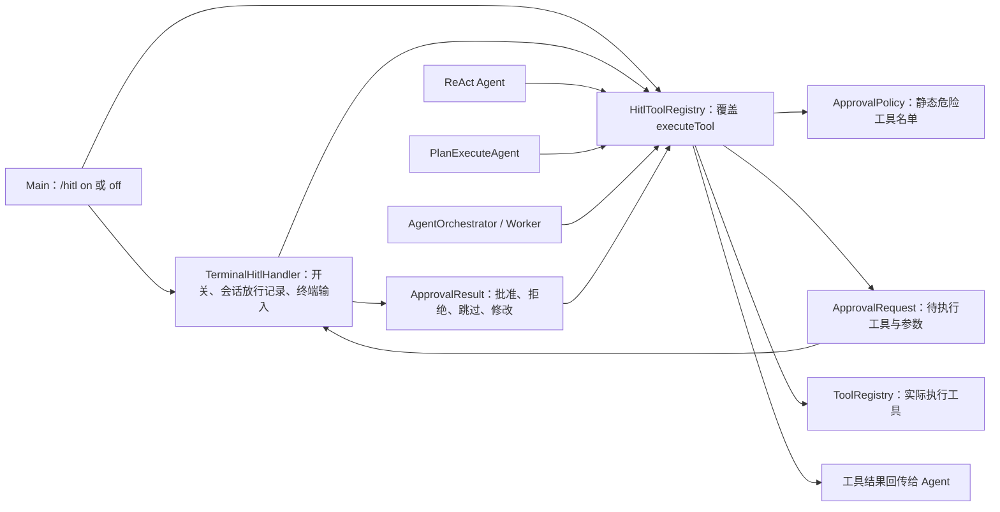
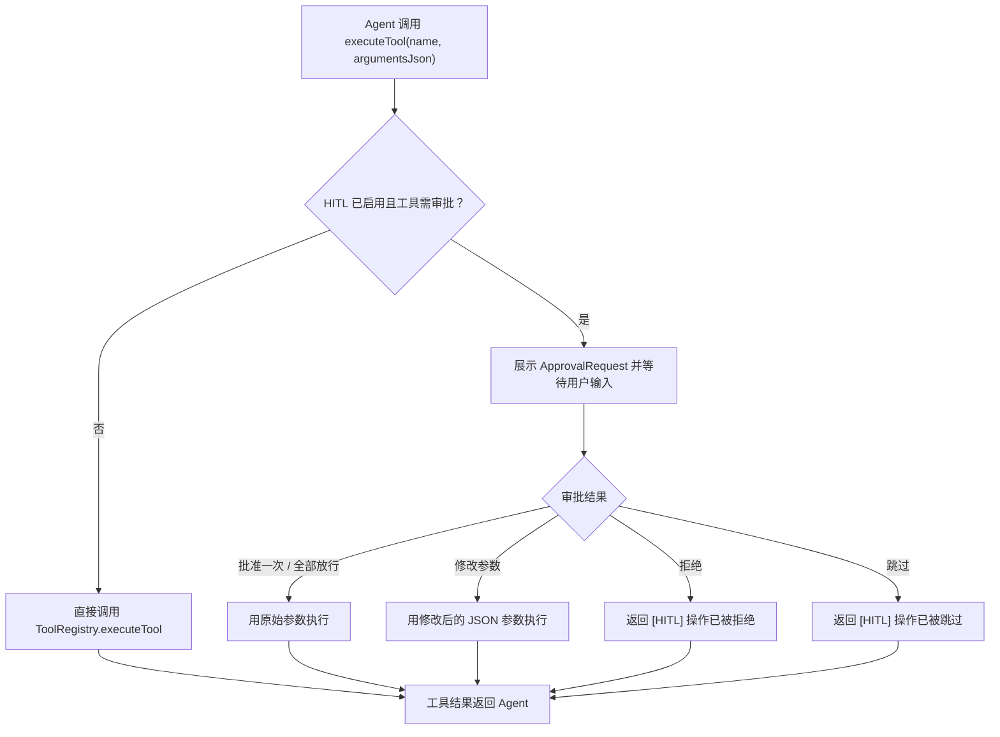
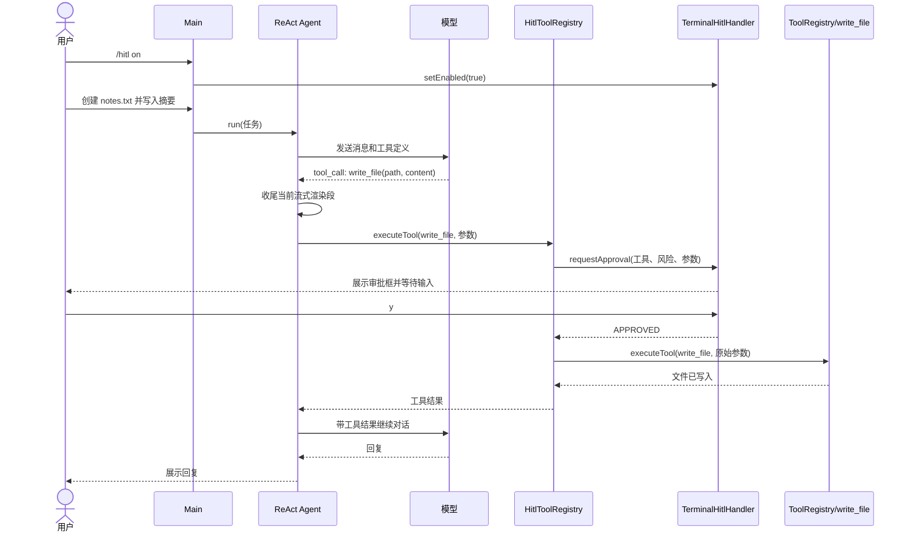

# PaiCLI 人工审批（HITL）：设计、实现与完整流程

本文基于当前仓库的实现，说明第 6 期 Human-in-the-Loop（HITL）如何在工具执行前加入人工决策。这里的“审批”是**每次危险工具调用的同步确认**：Agent 已经提出工具名和参数，但工具尚未执行；用户作出决定后，程序才继续。

## 对外功能

HITL 默认关闭，可在 CLI 运行时切换：

| 命令或输入 | 行为 |
| --- | --- |
| `/hitl` | 查看当前状态 |
| `/hitl on` | 启用危险工具调用审批 |
| `/hitl off` | 关闭审批，并清除本次会话的“全部放行”记录 |
| `/clear` | 清空当前对话历史，同时清除“全部放行”记录；长期记忆不受影响 |

启用后，ReAct、Plan-and-Execute 和 Multi-Agent 的 Worker 都通过同一个 `HitlToolRegistry` 执行工具。Plan 模式已有的**计划审阅**发生在计划执行之前；HITL 则发生在计划执行期间、每次危险工具调用之前，两者是不同层次的确认。

危险等级由工具名的静态规则决定：

| 工具 | 等级 | 是否弹出审批 | 原因 |
| --- | --- | --- | --- |
| `execute_command` | 🔴 高危 | 是 | 可执行 Shell 命令，影响系统或文件 |
| `write_file` | 🟡 中危 | 是 | 可写入或覆盖文件 |
| `create_project` | 🟡 中危 | 是 | 会创建目录和文件 |
| `read_file`、`list_dir`、`search_code` | 🟢 安全 | 否 | 当前规则视为只读工具 |

## 组件设计

各类的职责如下：

| 类 | 职责 |
| --- | --- |
| [`ApprovalPolicy`](../src/main/java/com/paicli/hitl/ApprovalPolicy.java) | 判断工具是否需要审批，提供危险等级和风险说明 |
| [`ApprovalRequest`](../src/main/java/com/paicli/hitl/ApprovalRequest.java) | 保存工具名、原始 JSON 参数等，并生成终端审批框；按显示列宽处理中文和 emoji，长参数显示预览 |
| [`ApprovalResult`](../src/main/java/com/paicli/hitl/ApprovalResult.java) | 表达一次审批决策，以及拒绝原因或修改后的参数 |
| [`HitlHandler`](../src/main/java/com/paicli/hitl/HitlHandler.java) | 定义同步请求审批、查询和切换启用状态的接口 |
| [`TerminalHitlHandler`](../src/main/java/com/paicli/hitl/TerminalHitlHandler.java) | 展示审批框，读取用户输入，维护同类工具的会话放行记录 |
| [`HitlToolRegistry`](../src/main/java/com/paicli/hitl/HitlToolRegistry.java) | 统一拦截危险工具调用，再决定是否调用父类 `ToolRegistry.executeTool()` |

CLI 在启动时创建一个**默认关闭**的 `TerminalHitlHandler` 和一个 `HitlToolRegistry`，然后用后者创建 ReAct Agent。创建 Plan Agent 或 Multi-Agent 编排器时，CLI 复用 ReAct Agent 的同一个工具注册表；因此一次 `/hitl on` 对三条执行路径都生效，也保留了 `/index` 设置的项目路径。入口见 [`Main.java`](../src/main/java/com/paicli/cli/Main.java)，命令识别见 [`CliCommandParser.java`](../src/main/java/com/paicli/cli/CliCommandParser.java)。

`HitlToolRegistry` 只覆写 `executeTool()`，不复制原有六种工具的实现。HITL 关闭或工具不在危险名单中时，它直接调用父类执行；启用且命中名单时，先创建 `ApprovalRequest`，阻塞等待 `HitlHandler.requestApproval()`，再处理决策。

## 审批选项的实际语义

终端提示提供五种选择：

| 输入 | `ApprovalResult` | 之后发生什么 |
| --- | --- | --- |
| `y` 或直接回车 | `APPROVED` | 仅本次调用使用原始参数执行 |
| `a` | `APPROVED_ALL` | 本次调用执行；本会话后续**同名工具**自动通过，例如放行 `write_file` 不会同时放行 `execute_command` |
| `n` | `REJECTED` | 可输入拒绝原因；工具不执行，拒绝消息作为工具结果返回 Agent |
| `s` | `SKIPPED` | 工具不执行，跳过消息作为工具结果返回 Agent |
| `m` | `MODIFIED` | 输入新的 JSON 参数；语法合法后以新参数调用原工具 |

`m` 只校验 JSON **语法**，不会预先检查参数是否满足工具要求；实际工具仍可能返回参数错误。修改输入为空时改为批准原始参数；JSON 不合法时返回主菜单重新选择。

无法识别的选项不会默认通过，而是重新提示。连续 5 次无效输入、输入流关闭或读取失败时，处理器保守地返回拒绝。`/hitl off` 和 `/clear` 都清空 `a` 积累的放行记录。

拒绝与跳过的返回值仍是普通的工具结果文本。Agent 会收到这段文本，并决定如何继续回复或调整后续操作；它们并不自动终止整个 ReAct 循环、执行计划或 Multi-Agent 任务。

## 示例：批准写入一个文件

假设用户启用审批后，请求“创建 `notes.txt`，写入今天的会议摘要”。以下是模型选择 `write_file` 工具时的完整调用链；模型是否选择该工具，取决于实际响应。

1. 用户输入 `/hitl on`。CLI 将 `TerminalHitlHandler.enabled` 设为 `true`。
2. 用户提交写文件任务。ReAct Agent 调用模型；模型返回 `write_file`，参数例如 `{"path":"notes.txt","content":"会议摘要：确认下周计划。"}`。
3. Agent 在真正执行工具前收尾本轮流式输出，避免审批框插入尚未输出完的 Markdown 文本。
4. Agent 调用共享的 `HitlToolRegistry.executeTool()`。静态策略识别 `write_file` 为中危，构造审批请求。
5. 终端展示工具名、等级、风险和参数预览，然后等待用户输入。此时文件**尚未写入**。
6. 用户按 `y`。处理器返回 `APPROVED`；注册表调用原 `ToolRegistry.executeTool()`，使用原参数写入文件。
7. 写入结果进入 Agent 的工具消息历史。Agent 再调用模型，最后向用户回复执行结果。

如果用户在第 6 步按 `n` 或 `s`，`write_file` 不会执行；Agent 收到相应提示。按 `m` 时，新 JSON 参数会取代原参数执行。按 `a` 时本次写入照常执行，后续 `write_file` 调用在本会话内自动通过。

## 与流式输出和并发模式的关系

`TerminalMarkdownRenderer` 可能暂存尚未遇到换行的文本。ReAct、Plan 和 SubAgent 在工具调用分支开始前都会调用各自的 `resetBetweenIterations()`，先完成当前渲染段，再展示 HITL 审批框；下一轮模型输出会重新打印标题。这使“模型回复 → 审批提示 → 工具结果后的回复”保持可读。

`TerminalHitlHandler.requestApproval()` 整体使用 `synchronized`。Multi-Agent 的独立步骤可能并发执行，但同一时间只有一个审批提示读取终端输入；其他待审批调用会等待。该锁保护审批交互，不会使整个 Multi-Agent 执行流程变为串行。

## 实现边界

- 审批规则只看**工具名**，并不理解 Shell 命令或文件内容的真实风险；它不是沙箱、权限系统或文件系统隔离。
- HITL 默认关闭。只有启用后，危险工具调用才等待人工决策。
- `a` 放行的是本次会话中的同名工具，不区分不同路径、命令内容或危险程度；使用时应按实际场景判断。
- 修改参数只做 JSON 语法校验；工具执行错误仍由原 `ToolRegistry` 返回。
- 当前实现的审批请求通过 `ApprovalRequest.of(name, argumentsJson, null)` 创建，执行理由通常为空；审批框仍展示工具、风险和参数。

