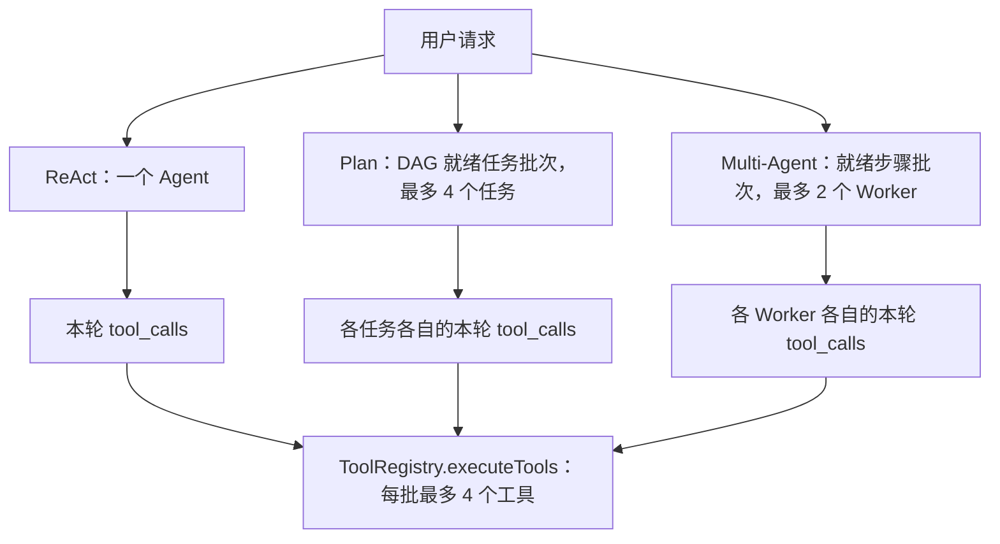
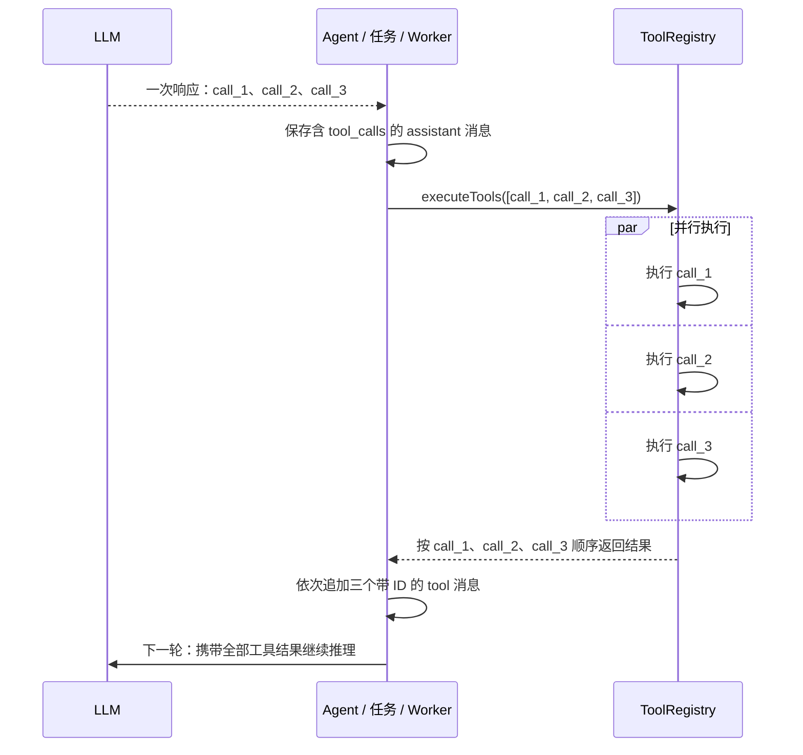
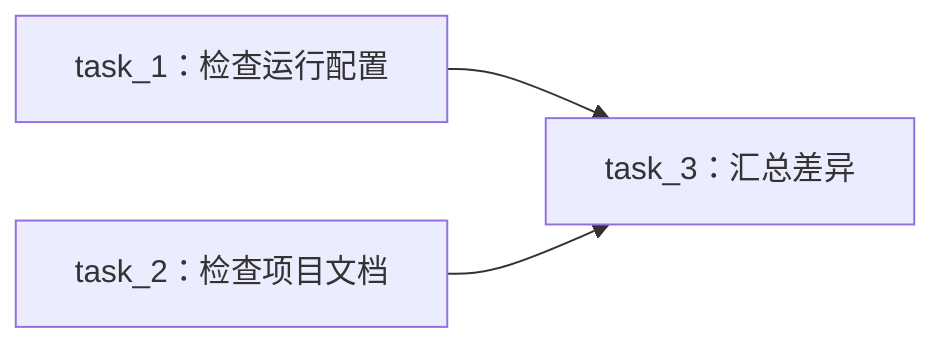

# PaiCLI 多层并发设计：工具、DAG 任务与 Multi-Agent Worker

本文依据当前代码（`039ecdc`）说明第 7 期的并发实现。这里的“同一轮”有两个不同含义：**一次 LLM 响应中的多个 `tool_calls`** 是工具批次；**一次计划调度循环中同时满足依赖条件的多个任务或步骤** 是 DAG 批次。后者可以包含前者。

## 能做什么

| 模式 | 外层调度 | 单个执行者内部 | 当前并发上限 |
| --- | --- | --- | --- |
| ReAct | 一个 Agent 逐轮向 LLM 请求下一步 | 同一轮的多个工具调用并行 | 每个工具批次最多 4 个 |
| Plan-and-Execute | 同一 DAG 就绪批次内的任务并行 | 每个任务可独立进行多轮 LLM 调用；每轮多个工具调用并行 | 最多 4 个任务；每个任务的工具批次最多 4 个 |
| Multi-Agent | 同一依赖批次内的步骤交给 Worker 池并行 | 每个 Worker 可独立进行多轮 LLM 调用；每轮多个工具调用并行 | 最多 2 个 Worker；每个 Worker 的工具批次最多 4 个 |

这些上限分别作用于各自创建的线程池，**没有跨所有任务或 Worker 的全局工具并发配额**。例如，4 个 Plan 任务若恰好各自同时发出 4 个工具调用，理论上可能有 16 个工具调用同时执行；2 个 Worker 对应的数字是 8。这是结构上的可能上限，不是每次运行都会达到的吞吐量。



## 共同的工具批次：从 LLM 响应到结果回灌

`Agent`、`PlanExecuteAgent` 和 Worker `SubAgent` 都把 LLM 返回的 `tool_calls` 转成 `ToolInvocation(id, name, argumentsJson)`，再调用 `ToolRegistry.executeTools()`。这三条路径并没有各自实现一套工具线程池。

1. **提交。** 空列表直接返回；只有一个调用时直接执行。多个调用时创建大小为 `min(调用数, 4)` 的固定线程池，并提交这一批调用。
2. **等待与超时。** 多调用批次使用 `invokeAll(..., 90 秒)`；到期仍未完成的调用被取消，并生成“工具执行超时”结果。`execute_command` 自身另有默认 60 秒的命令超时。单调用走直接执行分支，不受 90 秒的*批次*超时控制，但命令工具仍受自己的超时控制。线程取消是中断请求，并不提供对已发生文件修改的回滚保证。
3. **收集。** 每个结果保留原 `tool_call` 的 ID、工具名、参数、返回文本及耗时信息。某个调用失败或超时会得到对应的结果文本，不会使整批已完成结果丢失。
4. **回灌。** 线程完成顺序可以不同，但结果按输入列表顺序返回。调用方先记录含 `tool_calls` 的 assistant 消息，再按这个顺序追加带对应 ID 的 `tool` 消息，然后才发起下一轮 LLM 请求。**返回顺序稳定不等于执行顺序串行。**



核心代码：[ToolRegistry.java](../src/main/java/com/paicli/tool/ToolRegistry.java)、[Agent.java](../src/main/java/com/paicli/agent/Agent.java)、[PlanExecuteAgent.java](../src/main/java/com/paicli/agent/PlanExecuteAgent.java)、[SubAgent.java](../src/main/java/com/paicli/agent/SubAgent.java)。

## 例一：ReAct 的同一轮多工具调用

用户说：“比较 `pom.xml` 与 `README.md` 对运行方式的说明。”假设 Agent 在一次 LLM 响应里给出两个互不依赖的调用：

```text
tool_call A: read_file({"path":"pom.xml"})
tool_call B: read_file({"path":"README.md"})

执行：A ‖ B
回灌：A 的结果、B 的结果（与 LLM 返回的调用顺序一致）
下一轮 LLM：读取两份结果，形成比较结论
```

即使 B 先读完，Agent 也会等这一批结束，再将 A、B 的结果交给 LLM。ReAct 不会因为返回了两个 `tool_calls` 就产生两个独立的 Agent；并行发生在**工具层**。若第二个调用必须使用第一个调用的输出，就应等第一轮结果返回后再由 LLM 发起下一轮调用。实现入口是 `Agent.run()` 的工具分支和 `executeToolCalls()`。

## 例二：Plan-and-Execute 的任务与工具两层并行

用户说：“检查运行配置和项目文档，再汇总差异。”假设规划出的 DAG 是：



`task_1` 与 `task_2` 都是 `PENDING` 且没有未完成依赖，故进入第一批并行执行。两个任务各有自己的 LLM 消息历史，可以分别在某一轮发出多个工具调用：

```text
第一批任务并行：
  task_1 → 同一轮读取 pom.xml ‖ .env.example
  task_2 → 同一轮读取 README.md ‖ AGENTS.md

批次屏障：等待 task_1 和 task_2 都结束，并更新任务状态

第二批：
  task_3 → 获得已完成依赖的结果，汇总差异
```

`Task.isExecutable()` 要求任务仍为 `PENDING` 且所有前置任务均为 `COMPLETED`。`ExecutionPlan` 计算拓扑顺序，`PlanExecuteAgent` 按该顺序取出本轮全部就绪任务；多任务时使用最多 4 个线程，并在等待所有 `Future` 后更新完成或失败状态，再计算下一批。因此，即使 `task_1` 先结束，`task_3` 仍要等待第一批的 `task_2`。这是**分批屏障调度**，不是某个前置任务一完成就立即启动其下游任务。

每个并行任务的终端输出先写入自己的缓冲区，批次结束后按任务顺序打印，避免交错。只有一个就绪任务时直接执行，输出可实时显示。任务内部的多个工具调用仍使用共同的 `executeTools()`。任务失败时，代码会依据计划进度决定是否尝试重新规划；未完成的依赖不会被当作已完成。

相关实现：[Task.java](../src/main/java/com/paicli/plan/Task.java)、[ExecutionPlan.java](../src/main/java/com/paicli/plan/ExecutionPlan.java)、[PlanExecuteAgent.java](../src/main/java/com/paicli/agent/PlanExecuteAgent.java)。

## 例三：Multi-Agent 的 Worker 与工具两层并行

用户说：“分别检查启动配置和 CLI 文档，最后给出一致性结论。”假设 Planner 生成两个独立步骤 `step_1`、`step_2`，以及依赖二者的 `step_3`：

```text
第一批步骤并行：
  worker-1 执行 step_1 → 同一轮读取 pom.xml ‖ .env.example
  worker-2 执行 step_2 → 同一轮读取 Main.java ‖ README.md

各步骤：Worker 返回结果 → 各自的 Reviewer 审查 → 必要时反馈重试
批次屏障：两个步骤都处理完后，编排器才重新选就绪步骤

第二批：
  step_3 读取已完成步骤的结果，给出一致性结论
```

这里的四个工具调用**不是一个 LLM 响应中的四个调用**：两个 Worker 各自向 LLM 请求，分别收到自己的两个 `tool_calls`，再分别进入 `executeTools()`。`AgentOrchestrator` 只有两个 Worker；多步骤批次用 `min(步骤数, 2)` 个线程执行，并通过 Worker 队列保证同一个 Worker 不被两个步骤同时占用。每个并行步骤使用独立 Reviewer，避免审查历史混在一起。

与 Plan 类似，编排器等待整批 `Future`，再调度下一批；并行步骤的终端输出先分别缓存，批次结束后按步骤顺序展示。单步骤批次直接执行并实时输出。Worker 才使用工具；Planner 和 Reviewer 不调用工具。Reviewer 拒绝时，同一步骤最多重试 2 次；批次中的其他步骤可以继续运行。

相关实现：[AgentOrchestrator.java](../src/main/java/com/paicli/agent/AgentOrchestrator.java)、[SubAgent.java](../src/main/java/com/paicli/agent/SubAgent.java)。

## 并发边界与冲突处理

- **依赖靠显式表达。** 三种执行者的系统提示词都告知 LLM：同一轮工具会并行，有先后依赖的调用应分轮发起。Plan 和 Multi-Agent 还依赖规划阶段给任务或步骤填写正确的依赖边。
- **没有资源冲突检测。** `executeTools()` 不会分析参数是否指向同一个文件；DAG 调度器也不会自动给两个写同一文件的任务加依赖。两个独立调用可能竞争或覆盖结果。需要顺序时，应在计划中建立依赖，或在前一轮工具结果回来后再发起下一轮。
- **展示顺序与执行顺序分离。** 工具结果按原 `tool_call` 顺序回灌；Plan 和 Multi-Agent 的并行批次按任务或步骤顺序输出。这些措施解决消息对应与终端交错，不负责消除文件、进程等共享资源的冲突。
- **HITL 只串行化审批交互。** 启用 HITL 后，危险工具仍通过 `HitlToolRegistry.executeTool()` 拦截；`TerminalHitlHandler.requestApproval()` 整体同步化，让多个并发调用的终端审批逐个出现。批准后的实际工具执行不因此获得全局互斥锁。
- **当前是请求内并发。** 每个工具、任务或步骤批次都在当前运行过程中等待完成；这里没有持久化后台任务队列或跨会话调度。

相关实现：[HitlToolRegistry.java](../src/main/java/com/paicli/hitl/HitlToolRegistry.java)、[TerminalHitlHandler.java](../src/main/java/com/paicli/hitl/TerminalHitlHandler.java)。更详细的专题见 [Multi-Agent 编排](multi-agent-orchestration.md) 和 [HITL 审批](hitl-approval-flow.md)。
