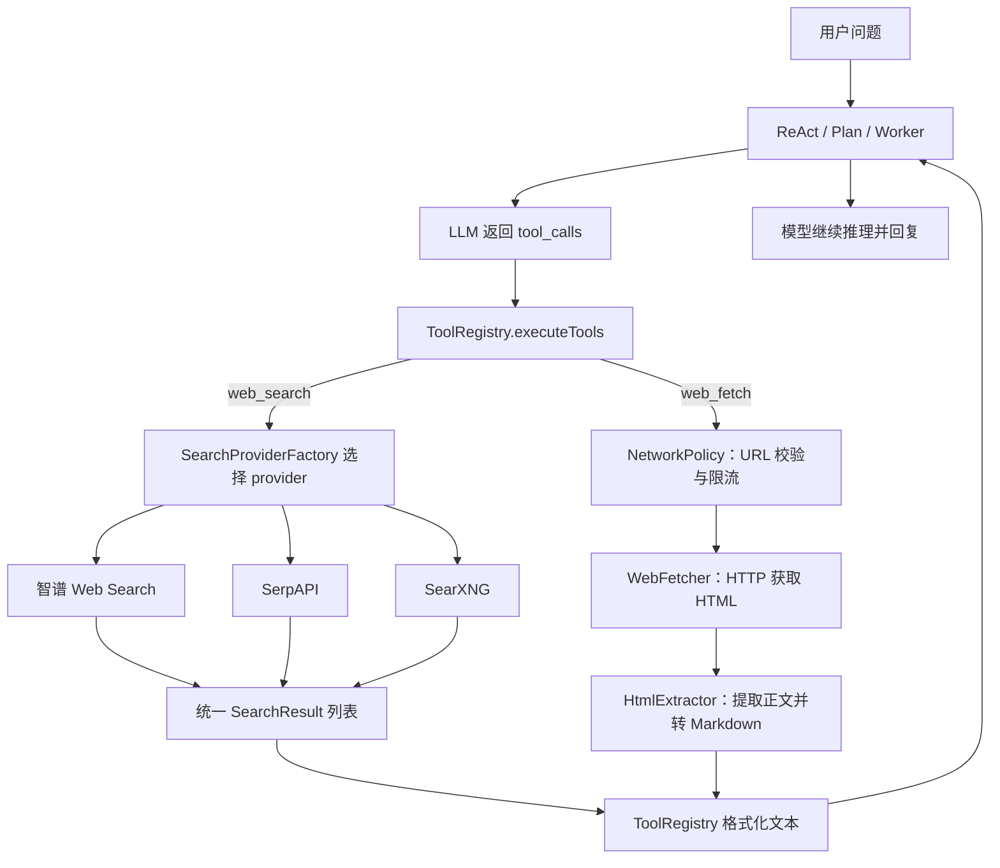
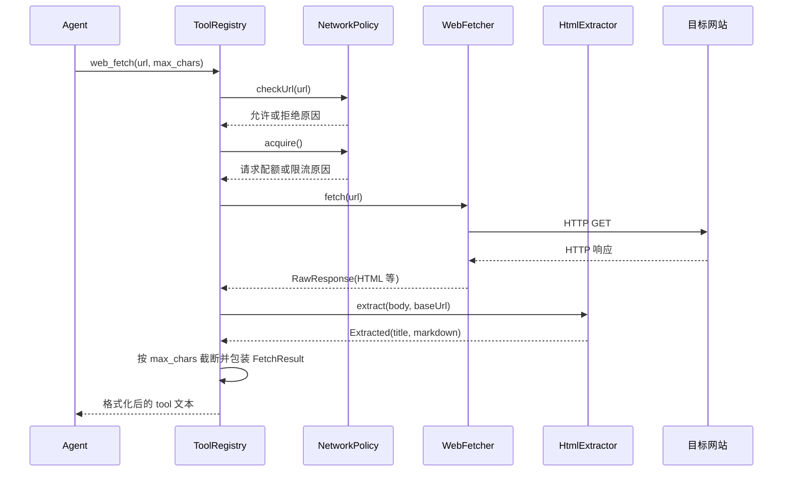

# PaiCLI 联网搜索与网页正文抓取：设计和实现

本文依据 `9f21674` 的源码，说明第 9 期新增的 `web_search` 和 `web_fetch` 如何从 Agent 工具调用走到外部搜索服务或网页，再把结果交还给模型。本文描述的是当前实现；路线图中的浏览器渲染和登录态会话不在这条链路里。

## 功能入口与总体流程

两个工具都在 [`ToolRegistry.registerWebTools()`](../src/main/java/com/paicli/tool/ToolRegistry.java) 注册，并随 `getToolDefinitions()` 作为工具定义提供给 LLM。ReAct、Plan-and-Execute 和 Multi-Agent 的 Worker 提示词均介绍了这两个工具。模型返回工具调用后，现有的 `executeTools()` 执行它们，再把结果以 `tool` 消息回灌给模型；多个互不依赖的工具调用可以沿用已有的批量并行机制。

| 工具 | 输入 | 返回给模型的内容 | 适用场景 |
| --- | --- | --- | --- |
| `web_search` | `query`（必填）、`top_k`（可选，默认 5） | 搜索结果的序号、标题、摘要、URL、来源域名 | 需要最新信息，先定位资料入口 |
| `web_fetch` | `url`（必填）、`max_chars`（可选，默认 8000） | 页面标题、提取后的 Markdown 正文及长度/截断提示 | 已有具体 URL，需要阅读网页正文 |



提示词给模型的选择原则是：项目代码优先用 `search_code`；有时效性的外部事实先用 `web_search`；已知 URL 直接用 `web_fetch`；抓取到空正文时说明限制，不要对同一页面反复重试。对应代码在 [`Agent.java`](../src/main/java/com/paicli/agent/Agent.java)、[`PlanExecuteAgent.java`](../src/main/java/com/paicli/agent/PlanExecuteAgent.java) 和 [`SubAgent.java`](../src/main/java/com/paicli/agent/SubAgent.java)。这是一套给模型的工具使用指引，具体是否调用以及调用顺序仍由模型决定。

## `web_search`：搜索服务的统一入口

### 1. 注册与调用

`ToolRegistry` 把 `query` 定义为必填字符串，`top_k` 定义为可选整数。执行时先检查查询是否为空，然后懒加载并缓存一个 `SearchProvider` 实例；不可用时返回配置提示；可用时调用 `provider.search(query, topK)`。搜索异常会转成 `搜索失败 (provider): ...` 的工具结果，不会直接让整轮 Agent 抛错。

`top_k` 的文本默认值是 5。提供无效的整数字符串时，`ToolRegistry.parseInt()` 回退到 5；合法整数最终由各 provider 自行限定数量。

### 2. Provider 抽象与选择

[`SearchProvider`](../src/main/java/com/paicli/web/SearchProvider.java) 规定 `name()`、`isReady()`、`unavailableHint()` 和 `search()` 四个方法。添加新搜索服务时，可以实现该接口，并在 [`SearchProviderFactory`](../src/main/java/com/paicli/web/SearchProviderFactory.java) 中接入选择逻辑；`ToolRegistry` 不需要解析每家服务的原始 JSON。

配置读取顺序是 **环境变量 → 同名 Java 系统属性 → 当前目录 `.env` → 用户主目录 `.env`**。`SEARCH_PROVIDER` 显式指定 `zhipu`、`serpapi` 或 `searxng` 时优先使用指定值；未指定时按下表从上到下选择第一个有配置的服务：

| 自动优先级 | Provider | 可用条件 | 可选配置 |
| --- | --- | --- | --- |
| 1 | `zhipu` | `GLM_API_KEY` | `ZHIPU_SEARCH_ENGINE`，默认 `search_std` |
| 2 | `serpapi` | `SERPAPI_KEY` | 无 |
| 3 | `searxng` | `SEARXNG_URL` | 无 |

三者都没有配置时，工厂仍创建一个不可用的智谱 provider，由 `isReady()` 和 `unavailableHint()` 给出配置提示。搜索 provider 的读取逻辑独立于多模型切换使用的 `PaiCliConfig`：例如把 GLM Key 仅写在 `~/.paicli/config.json` 中，并不等于 `SearchProviderFactory` 能读到该 Key。provider 在一个 `ToolRegistry` 中首次使用时缓存，运行中修改环境配置不会自动重建它。

### 3. 三个实现如何请求与解析

| 实现 | HTTP 请求 | 结果来源 | 数量处理 |
| --- | --- | --- | --- |
| [`ZhipuSearchProvider`](../src/main/java/com/paicli/web/ZhipuSearchProvider.java) | POST 智谱 `/api/paas/v4/tools/web_search`；Bearer Key；提交 `search_engine`、`search_query`、`count`、`content_size` | `search_result` 数组的 `title`、`link`、`content` | 正数最多 50；非正数回退到 10 |
| [`SerpApiSearchProvider`](../src/main/java/com/paicli/web/SerpApiSearchProvider.java) | GET `https://serpapi.com/search.json`；参数含 `q`、`api_key`、`num`、`hl=zh-cn` | `organic_results` 的 `title`、`link`、`snippet`；无常规结果时尝试 `answer_box` | 正数最多 10；非正数回退到 5 |
| [`SearxngSearchProvider`](../src/main/java/com/paicli/web/SearxngSearchProvider.java) | GET 配置实例的 `/search`；参数含 `q`、`format=json`、`language=zh` | `results` 数组的 `title`、`url`、`content` | 正数最多 10；非正数回退到 5 |

智谱当前允许 `search_std`、`search_pro`、`search_pro_sogou` 和 `search_pro_quark`；不认识的引擎名回退到 `search_std`。SearXNG 使用实例自己的 JSON API，因此该实例必须可访问且允许 JSON 输出。搜索服务各自创建 OkHttp 客户端，连接/读取超时在对应实现中设置。

各 provider 将有效条目转成 [`SearchResult`](../src/main/java/com/paicli/web/SearchResult.java)；其中 `source` 从结果 URL 的 host 提取。`ToolRegistry.formatSearchResults()` 再输出编号、标题、最多 200 字符的摘要、URL 和来源域名。搜索只提供资料入口与摘要，**不会自动下载每条搜索结果的网页全文**。

## `web_fetch`：已知 URL 的正文抓取

### 1. 调用链

[`ToolRegistry.webFetch()`](../src/main/java/com/paicli/tool/ToolRegistry.java) 实际串接以下四个步骤：



`url` 为空时直接返回提示。`max_chars` 不是下载大小限制，而是最终 Markdown 返回给模型前的字符截断值；默认 8000。当前代码只在它大于 0 时截断，因此传 0 或负数会跳过这一步，但 HTTP 响应仍受 5 MB 字节上限约束。

### 2. URL 校验与请求配额

[`NetworkPolicy.checkUrl()`](../src/main/java/com/paicli/web/NetworkPolicy.java) 仅允许 `http`、`https`，拒绝缺失主机、`localhost`、`*.localhost`、`0.0.0.0`，还通过 DNS 解析拒绝环回、未指定、链路本地与站内地址。校验通过后，`acquire()` 在当前 `NetworkPolicy` 实例上统计请求：默认每 60 秒最多 30 次。拒绝或限流都会转成工具结果。

这里的配额跟随 `ToolRegistry` 持有的 `NetworkPolicy` 实例，不是整个应用跨实例共享的配额。它也只作用于 `web_fetch`；`web_search` 由各 provider 直接请求其搜索服务。

### 3. HTTP 获取与正文提取

[`WebFetcher`](../src/main/java/com/paicli/web/WebFetcher.java) 使用 OkHttp 发 GET，请求头包含 HTML 接受类型、语言偏好和 User-Agent。默认连接超时 10 秒、整体请求超时 30 秒；4xx/5xx、空响应体等情况抛出异常，由工具入口转成 `抓取失败: ...`。响应按 `Content-Type` 指定的 charset 解码，否则按 UTF-8；读取字节时最多保留 5 MB，避免把大页面完整放进内存。它只负责取回文本，不执行页面脚本。

[`HtmlExtractor`](../src/main/java/com/paicli/web/HtmlExtractor.java) 用 Jsoup 解析 HTML，并依次：

1. 优先取页面 `<title>`，缺失时用 `<h1>` 作为标题。
2. 删除 `script`、`style`、`nav`、`aside`、`footer`、`form`、`iframe` 等噪声标签，以及 class/id 命中广告、弹窗、侧栏等关键词的节点。
3. 优先选文本足够长的 `<article>`、`<main>`、`[role=main]`；否则给 `div`、`section` 等候选节点按文本长度和链接密度打分，选择得分最高者。
4. 递归转为 Markdown，保留标题、段落、列表、链接、引用、代码块与表格；图片只保留非空的 `alt` 文本。最后压缩多余空行。

这是一套简化的正文提取规则，目标是博客、文档和官网等静态/SSR 页面，并不等同完整的 Mozilla Readability 实现。

### 4. 输出与失败情况

工具用 [`FetchResult`](../src/main/java/com/paicli/web/FetchResult.java) 表示 URL、标题、Markdown、原始正文字符数、是否截断和是否为空，然后格式化为工具文本。例如正文不为空时，返回 `🌐 抓取: URL`、`📄 标题`、`📏 正文 N 字符` 与 Markdown；如果超过 `max_chars`，额外标记“已截断”。

成功获取 HTML 但提取不到正文时，返回“未提取到正文。可能是 JS 渲染或防爬墙”的已知边界提示，而不是尝试浏览器渲染或无限重试。URL 被策略拒绝、配额用尽和 HTTP/解析异常各有单独的提示文本。

## 一个完整示例

用户问“某框架当前版本有哪些变化”时，模型可能先调用：

```text
web_search({"query":"某框架官方 release notes","top_k":5})
```

搜索结果返回标题、摘要和 URL。模型选中官方发布说明后再调用：

```text
web_fetch({"url":"https://example.org/releases/latest","max_chars":8000})
```

抓取工具将页面正文转成 Markdown 回灌给模型，模型据此组织回答。若用户一开始已提供 URL，提示词要求直接抓取；这两个工具没有写死必须连续调用的编排逻辑。

## 当前实现边界与维护要点

- **页面类型：**直接 HTTP 抓取，不能执行 JavaScript、复用浏览器登录态或穿过反爬验证；SPA 页面可能只返回很少内容或空正文。
- **网络围栏：**当前仅在发起抓取前校验传入 URL。OkHttp 默认可跟随重定向，而这条链路没有对重定向后的目标重新做 `NetworkPolicy` 校验；DNS 解析到实际连接之间也没有防 rebinding 的约束，因此不能把它视为完整的 SSRF 防护。
- **数据截断：**`WebFetcher.RawResponse` 记录了响应体是否碰到 5 MB 上限，但当前 `ToolRegistry.webFetch()` 没有把这一标志传到最终 `FetchResult`；最终输出的“已截断”只表示 Markdown 超过 `max_chars`。
- **配置缓存：**一个 `ToolRegistry` 首次搜索时确定并缓存 provider；需要切换搜索 provider 时，应重建注册表或提供显式刷新入口。`/model` 切换 LLM provider 不会自动切换搜索 provider。
- **代码与文案：**`ToolRegistry` 中 `web_search` 的工具描述仍写“SerpAPI（默认）和 SearXNG 两种 provider”，但实际工厂已经支持智谱并在有 `GLM_API_KEY` 时优先选择智谱。理解当前行为应以 `SearchProviderFactory` 为准。

本文件是对实现的静态说明，未进行真实网站或搜索 API 联调。
