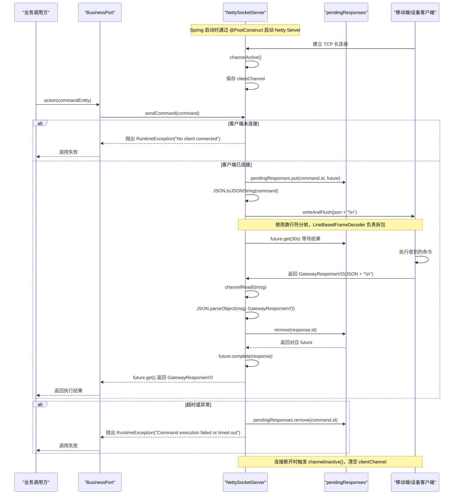

# NettySocketServer 通信方案总结

```java
@Slf4j
@Service
public class NettySocketServer {

    @Value("${gateway.socket.port}")
    private int port;

    private EventLoopGroup bossGroup;
    private EventLoopGroup workerGroup;
    private Channel serverChannel;

    // 存储连接的 Channel，这里简单起见只存储最近的一个或者用 Map 存储
    // 假设是单设备控制，或者后续可以根据 ID 路由
    private Channel clientChannel;

    // 存储待响应的 Future: Map<requestId, Future>
    private final Map<String, CompletableFuture<GatewayResponseVO>> pendingResponses = new ConcurrentHashMap<>();

    @PostConstruct
    public void start() {
        new Thread(() -> {
            bossGroup = new NioEventLoopGroup(1);
            workerGroup = new NioEventLoopGroup();
            try {
                ServerBootstrap b = new ServerBootstrap();
                b.group(bossGroup, workerGroup)
                        .channel(NioServerSocketChannel.class)
                        .childHandler(new ChannelInitializer<SocketChannel>() {
                            @Override
                            public void initChannel(SocketChannel ch) {
                                ChannelPipeline p = ch.pipeline();
                                // 基于换行符的解码器，解决粘包拆包问题
                                p.addLast(new LineBasedFrameDecoder(1024 * 1024 * 5)); // 5MB max frame (for screenshots)
                                p.addLast(new StringDecoder(StandardCharsets.UTF_8));
                                p.addLast(new StringEncoder(StandardCharsets.UTF_8));
                                p.addLast(new NettyServerHandler());
                            }
                        })
                        .option(ChannelOption.SO_BACKLOG, 128)
                        .childOption(ChannelOption.SO_KEEPALIVE, true);

                ChannelFuture f = b.bind(port).sync();
                log.info("Netty Socket Server started on port: {}", port);
                serverChannel = f.channel();
                serverChannel.closeFuture().sync();
            } catch (Exception e) {
                log.error("Netty Server start error", e);
            } finally {
                workerGroup.shutdownGracefully();
                bossGroup.shutdownGracefully();
            }
        }).start();
    }

    @PreDestroy
    public void stop() {
        if (serverChannel != null) {
            serverChannel.close();
        }
        if (bossGroup != null) {
            bossGroup.shutdownGracefully();
        }
        if (workerGroup != null) {
            workerGroup.shutdownGracefully();
        }
    }

    /**
     * 发送指令并等待响应
     *
     * @param command 指令对象
     * @return 响应结果
     */
    public GatewayResponseVO sendCommand(GatewayCommandEntity command) {
        if (clientChannel == null || !clientChannel.isActive()) {
            throw new RuntimeException("No client connected");
        }

        CompletableFuture<GatewayResponseVO> future = new CompletableFuture<>();
        pendingResponses.put(command.getId(), future);

        try {
            String json = JSON.toJSONString(command);
            // 发送数据，注意要带上换行符，因为客户端（或者解码器）可能依赖它
            clientChannel.writeAndFlush(json + "\n");
            log.info("Sent command: {}", json);

            // 等待响应，设置超时时间，例如 30 秒
            return future.get(30, TimeUnit.SECONDS);
        } catch (Exception e) {
            pendingResponses.remove(command.getId());
            throw new RuntimeException("Command execution failed or timed out", e);
        }
    }

    /**
     * Netty Handler
     */
    private class NettyServerHandler extends SimpleChannelInboundHandler<String> {

        @Override
        public void channelActive(ChannelHandlerContext ctx) {
            log.info("Client connected: {}", ctx.channel().remoteAddress());
            clientChannel = ctx.channel();
        }

        @Override
        public void channelInactive(ChannelHandlerContext ctx) {
            log.info("Client disconnected: {}", ctx.channel().remoteAddress());
            if (clientChannel == ctx.channel()) {
                clientChannel = null;
            }
        }

        @Override
        protected void channelRead0(ChannelHandlerContext ctx, String msg) {
            log.info("Received message: {}", msg);
            try {
                GatewayResponseVO response = JSON.parseObject(msg, GatewayResponseVO.class);
                if (response != null && response.getId() != null) {
                    CompletableFuture<GatewayResponseVO> future = pendingResponses.remove(response.getId());
                    if (future != null) {
                        future.complete(response);
                    } else {
                        log.warn("Received response for unknown or expired request ID: {}", response.getId());
                    }
                }
            } catch (Exception e) {
                log.error("Error parsing response", e);
            }
        }

        @Override
        public void exceptionCaught(ChannelHandlerContext ctx, Throwable cause) {
            log.error("Connection error", cause);
            ctx.close();
        }
    }

}
```


## 1. 方案定位

这套通信方案本质上是一个：

- `Spring` 托管的服务端组件
- 基于 `Netty` 的长连接 `TCP Server`
- 使用 `JSON` 文本传输消息
- 通过换行符 `\n` 做消息边界切分
- 通过请求 `id` 把异步响应重新关联回同步调用结果

它的目标不是做一个通用消息中间件，而是为业务层提供一个“像本地方法一样调用远端客户端能力”的控制通道。

## 2. 整体架构

### 2.1 参与角色

整个链路里主要有 5 个角色：

1. `业务调用方`
2. `BusinessPort`
3. `NettySocketServer`
4. `pendingResponses`
5. `移动端/设备客户端`

它们各自职责如下：

- `业务调用方`
  - 发起一次设备控制、动作执行或网关命令调用。
- `BusinessPort`
  - 作为基础设施适配层，对外暴露统一业务端口。
  - 内部把调用转交给 `NettySocketServer`。
- `NettySocketServer`
  - 负责启动 Netty 服务端。
  - 管理客户端连接。
  - 发送命令并接收响应。
  - 用请求 `id` 做响应配对。
- `pendingResponses`
  - 类型是 `Map<String, CompletableFuture<GatewayResponseVO>>`。
  - 负责把“异步回包”转换成“同步等待返回值”。
- `移动端/设备客户端`
  - 通过 TCP 连接到服务端。
  - 接收 JSON 命令。
  - 执行动作后回传 JSON 响应。

### 2.2 分层关系

从架构分层看，可以理解为：

- `Domain`
  - 定义业务端口接口和命令/响应模型。
- `Infrastructure`
  - `BusinessPort` 负责适配业务端口。
  - `NettySocketServer` 负责实际通信。
- `Client`
  - 作为被控端，接收命令并执行。

也就是说，上层业务并不直接接触 Netty API，而是通过端口模式调用基础设施能力。

## 3. 服务端启动设计

### 3.1 启动方式

`NettySocketServer` 被标注为 `@Service`，说明它由 Spring 容器管理。  
在 Bean 初始化完成后，会通过 `@PostConstruct` 自动执行 `start()`。

### 3.2 启动流程

`start()` 内部会：

1. 新建线程启动 Netty，避免阻塞 Spring 启动主流程。
2. 创建两个事件循环组：
   - `bossGroup`：负责接收连接
   - `workerGroup`：负责处理读写事件
3. 通过 `ServerBootstrap` 配置服务端：
   - `NioServerSocketChannel`
   - `SO_BACKLOG = 128`
   - `SO_KEEPALIVE = true`
4. 绑定配置端口 `gateway.socket.port`
5. 保存 `serverChannel`
6. 阻塞等待服务端关闭

### 3.3 关闭方式

在 Spring 容器销毁时，`@PreDestroy` 会执行 `stop()`，关闭：

- `serverChannel`
- `bossGroup`
- `workerGroup`

这说明它具备基本的生命周期管理能力。

## 4. 通信协议设计

### 4.1 传输层

底层使用的是 `TCP` 长连接。

特点：

- 服务端启动后常驻监听端口
- 客户端主动连接服务端
- 连接建立后可复用同一条通道持续通信

### 4.2 编码格式

消息内容使用 `JSON` 文本格式：

- 下发命令时：`GatewayCommandEntity -> JSON`
- 回传结果时：`JSON -> GatewayResponseVO`

这样做的优点是：

- 易调试
- 跨平台
- 对客户端实现语言要求低

### 4.3 消息边界

`TCP` 本身是字节流，没有天然消息边界，所以这里用了：

- `LineBasedFrameDecoder(1024 * 1024 * 5)`

也就是“按换行符拆帧”。

对应要求是：

- 每条消息必须以 `\n` 结尾
- 服务端发送时显式拼接 `json + "\n"`
- 客户端回传时也必须带换行

这个设计可以解决：

- 粘包
- 半包

同时最大帧长度设置为 `5MB`，注释说明是为了支持截图类大消息。

### 4.4 编解码器

Netty 管道中使用了：

- `LineBasedFrameDecoder`
- `StringDecoder(StandardCharsets.UTF_8)`
- `StringEncoder(StandardCharsets.UTF_8)`
- `NettyServerHandler`

这意味着协议的处理流程是：

1. 先按换行切分一条完整消息
2. 再把字节数组解码成 UTF-8 字符串
3. 再交给业务处理器做 JSON 反序列化

## 5. 连接管理设计

### 5.1 单连接模型

当前实现中，服务端只保留了一个：

- `private Channel clientChannel;`

这代表当前方案是“单客户端控制模型”。

也就是说：

- 新客户端连接上来时，会覆盖当前可用通道的语义
- 业务发送命令时，只会发给这一个 `clientChannel`

代码注释里也已经明确表达了这个意图：

- 当前是简单实现
- 更像单设备控制
- 如果要扩展，多设备场景需要根据设备 ID 路由

### 5.2 连接状态切换

当客户端连接建立时：

- `channelActive()` 被触发
- 当前连接会保存到 `clientChannel`

当连接断开时：

- `channelInactive()` 被触发
- 如果断开的就是当前保存的连接，则把 `clientChannel = null`

这样做的意义是：

- 保证发送前能判断是否还有活跃客户端
- 避免把命令发到失效通道

## 6. 请求响应模型设计

这是整个方案最关键的部分。

### 6.1 设计目标

网络通信本质上是异步的，但业务层通常希望像调用本地方法一样：

- 发出命令
- 等待结果
- 拿到返回值

为了实现这种体验，这里引入了：

- `CompletableFuture`
- `pendingResponses`

### 6.2 核心结构

```java
private final Map<String, CompletableFuture<GatewayResponseVO>> pendingResponses = new ConcurrentHashMap<>();
```

这个结构的含义是：

- Key：请求 ID
- Value：等待该请求响应结果的 future

### 6.3 为什么要用请求 ID

因为 TCP 通道上可能连续发送多条命令，回包顺序也未必严格和发送顺序完全一致。  
所以服务端不能只靠“先发先收”判断响应属于谁，而要靠：

- 每个请求带唯一 `id`
- 每个响应回传同一个 `id`

这样服务端收到回包后，才能准确找到对应的等待对象。

### 6.4 从异步到同步的桥接

`sendCommand()` 的实际逻辑是：

1. 创建 `CompletableFuture`
2. 按 `command.getId()` 放入 `pendingResponses`
3. 异步把命令发给客户端
4. 当前线程调用 `future.get(30, TimeUnit.SECONDS)` 阻塞等待
5. 等客户端回包后，在 `channelRead0()` 中 `future.complete(response)`
6. 阻塞线程被唤醒，拿到结果并返回给上层

这个模式本质上是：

- 网络层异步
- 业务层同步

## 7. 一次完整请求流程

下面是一次标准调用的完整过程。

### 7.1 服务准备阶段

1. Spring 启动应用
2. `NettySocketServer.start()` 启动 Netty 服务端
3. 服务端监听 `gateway.socket.port`
4. 客户端主动连接进来
5. `channelActive()` 触发并保存 `clientChannel`

### 7.2 业务发起调用

1. 业务调用方发起请求
2. 调用 `BusinessPort.action(commandEntity)`
3. `BusinessPort` 内部执行 `nettySocketServer.sendCommand(commandEntity)`

### 7.3 服务端发送命令

1. `sendCommand()` 先检查：
   - `clientChannel != null`
   - `clientChannel.isActive()`
2. 如果没有可用客户端，直接抛出：
   - `RuntimeException("No client connected")`
3. 创建一个新的 `CompletableFuture<GatewayResponseVO>`
4. 以 `command.getId()` 为 key 存入 `pendingResponses`
5. 使用 `JSON.toJSONString(command)` 序列化命令
6. 执行：

```java
clientChannel.writeAndFlush(json + "\n");
```

7. 日志记录发送内容
8. 当前线程调用：

```java
future.get(30, TimeUnit.SECONDS)
```

开始同步等待响应

### 7.4 客户端处理命令

1. 客户端从 TCP 通道接收到一条 JSON 命令
2. 客户端按命令内容执行业务动作
3. 组织 `GatewayResponseVO`
4. 保持相同 `id`
5. 序列化为 JSON，并以 `\n` 结尾返回

### 7.5 服务端接收响应

1. Netty 收到客户端数据
2. `LineBasedFrameDecoder` 按换行切出完整报文
3. `StringDecoder` 把字节解码成 `String`
4. `NettyServerHandler.channelRead0()` 收到字符串消息
5. 执行：

```java
GatewayResponseVO response = JSON.parseObject(msg, GatewayResponseVO.class);
```

6. 读取：
   - `response.getId()`
7. 从 `pendingResponses` 中移除并获取对应 future：

```java
CompletableFuture<GatewayResponseVO> future = pendingResponses.remove(response.getId());
```

8. 如果找到 future，则执行：

```java
future.complete(response);
```

### 7.6 返回业务结果

1. `future.complete(response)` 后
2. `sendCommand()` 中阻塞等待的 `future.get(...)` 返回
3. `sendCommand()` 把 `GatewayResponseVO` 返回给 `BusinessPort`
4. `BusinessPort.action()` 再把结果返回给业务调用方

到这里，一次完整调用结束。

## 8. 时序图



## 9. 具体调用的 API

### 9.1 Spring 相关

- `@Service`
- `@Value`
- `@Resource`
- `@PostConstruct`
- `@PreDestroy`

### 9.2 Netty 启动与配置

- `new NioEventLoopGroup(1)`
- `new NioEventLoopGroup()`
- `new ServerBootstrap()`
- `group(bossGroup, workerGroup)`
- `channel(NioServerSocketChannel.class)`
- `childHandler(new ChannelInitializer<SocketChannel>() {...})`
- `option(ChannelOption.SO_BACKLOG, 128)`
- `childOption(ChannelOption.SO_KEEPALIVE, true)`
- `bind(port).sync()`
- `closeFuture().sync()`
- `shutdownGracefully()`

### 9.3 Netty Pipeline 相关

- `ChannelPipeline.addLast(...)`
- `new LineBasedFrameDecoder(1024 * 1024 * 5)`
- `new StringDecoder(StandardCharsets.UTF_8)`
- `new StringEncoder(StandardCharsets.UTF_8)`
- `SimpleChannelInboundHandler<String>`

### 9.4 收发与事件回调

- `channelActive(ChannelHandlerContext ctx)`
- `channelInactive(ChannelHandlerContext ctx)`
- `channelRead0(ChannelHandlerContext ctx, String msg)`
- `exceptionCaught(ChannelHandlerContext ctx, Throwable cause)`
- `clientChannel.writeAndFlush(json + "\n")`
- `clientChannel.isActive()`
- `ctx.close()`

### 9.5 JSON 与并发控制

- `JSON.toJSONString(command)`
- `JSON.parseObject(msg, GatewayResponseVO.class)`
- `new ConcurrentHashMap<>()`
- `new CompletableFuture<>()`
- `pendingResponses.put(id, future)`
- `pendingResponses.remove(id)`
- `future.get(30, TimeUnit.SECONDS)`
- `future.complete(response)`

## 10. 这个方案的优点

### 10.1 对业务层友好

业务层看到的是：

- 发命令
- 等结果
- 拿返回值

调用方式简单，屏蔽了底层异步通信细节。

### 10.2 协议简单

采用：

- TCP
- JSON
- 换行分帧

客户端实现门槛低，抓包和排查也比较直观。

### 10.3 支持并发请求配对

通过 `id + future` 的方式，允许多条请求在逻辑上独立等待自己的响应，而不是只能串行处理。

## 11. 当前实现的限制

### 11.1 只支持单客户端

当前只有一个 `clientChannel`，不支持：

- 多设备同时在线
- 按设备 ID 路由
- 会话隔离

### 11.2 缺少心跳与重连机制

当前代码里没有看到：

- 心跳保活
- 空闲检测
- 自动重连
- 失联恢复

因此在弱网或移动端断连场景下，健壮性有限。

### 11.3 异常模型较粗

目前失败主要是：

- 没有客户端连接
- 超时
- JSON 解析异常

缺少更细粒度的：

- 错误码
- 业务失败原因
- 重试策略

### 11.4 同步等待会占用调用线程

`future.get(30, TimeUnit.SECONDS)` 是阻塞等待。  
如果请求量增大，或者客户端处理慢，会占用业务线程资源。

### 11.5 协议耦合在字符串 JSON 上

当前协议虽然简单，但如果后续要扩展：

- 认证
- 消息版本
- 压缩
- 二进制传输
- 大文件分片

会逐步暴露协议层能力不足的问题。

## 12. 一句话总结

这套通信方案的本质是：

“服务端维护一条到客户端的 Netty 长连接，把业务命令序列化成按行分帧的 JSON 发给客户端，再通过请求 ID 和 `CompletableFuture` 把异步回包重新封装成同步方法返回。”

它很适合当前这种：

- 单设备
- 命令式控制
- 业务快速接入

的场景；如果后续要走向多设备、高并发和高可用，需要补上路由、心跳、连接治理和协议演进能力。
