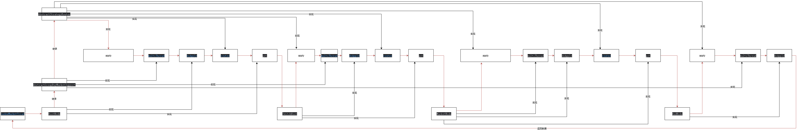

MRD -> BRD -> PRD

# 5、 2-2

把设计模式抽象出来，单独放在一个工程文件包了，需要时引用

## 后端开发中的规则树模型：深入解析

在后端开发中，**规则树模型**（Rule Tree Model）是一种将业务规则以树形结构进行组织和表达的强大模型。它本质上是**决策树（Decision Tree）** 在业务逻辑实现中的一种应用，通过一系列层层递进的“判断节点”和最终的“执行/结果节点”，来清晰、高效地处理复杂的条件逻辑。

与将规则硬编码在代码中的传统方式不同，规则树模型将业务逻辑与程序代码解耦，使得规则的修改和维护变得更加灵活和直观，尤其适合于业务规则频繁变更或具有高度复杂性的场景。

### 核心构成

一个典型的规则树由以下几个核心部分组成：

- **根节点（Root Node）：** 整棵树的起点，代表了最初始的判断条件。
    
- **内部节点（Internal Nodes）/ 判断节点（Decision Nodes）：** 代表一个具体的业务判断条件。每个节点都会对输入的业务数据进行评估，并根据评估结果（例如“是/否”、“大于/小于/等于”或满足特定枚举值）指向下一个节点。
    
- **分支（Branches）：** 连接节点的路径，代表了在某个判断节点上得出的不同结论。
    
- **叶子节点（Leaf Nodes）/ 结果节点（Result Nodes）：** 树的终点，不再进行任何判断。它代表了当一条完整的规则路径被满足后，最终得出的结论或需要执行的动作。这个结果可以是一个决策（如“批准”、“拒绝”）、一个计算出的数值（如折扣率、信用评分）、或者一个需要触发的业务流程。
    

**示例：一个简单的电商优惠券适用规则树**

> **场景描述：** 判断一个用户在下订单时是否能够使用某张特定的优惠券。
> 
> - **根节点：** 用户等级是否为“VIP会员”？
>     
>     - **是 (分支1):** 进入下一个判断节点。
>         
>         - **判断节点2:** 订单金额是否大于100元？
>             
>             - **是 (分支1.1):** 适用优惠券 (**叶子节点 - 结果为“适用”**)。
>                 
>             - **否 (分支1.2):** 不适用优惠券 (**叶子节点 - 结果为“不适用”**)。
>                 
>     - **否 (分支2):** 不适用优惠券 (**叶子节点 - 结果为“不适用”**)。
>         


# 6、2-3





## bug


因为没有参数，`@AllArgsConstructor` ， `@NoArgsConstructor` 各会生成一个无参构造函数


# 7、2-4


策略模式


# 8、2-5


## bug

```java
public void addCrowdTagsUserId(String tagId, String userId) {  
    CrowdTagsDetail crowdTagsDetailReq = new CrowdTagsDetail();  
    crowdTagsDetailReq.setTagId(tagId);  
    crowdTagsDetailReq.setUserId(userId);  
  
    try {  
        // 如果无法执行 sql 语句，后面会无法执行，会直接跳动 catch 块  
        crowdTagsDetailDao.addCrowdTagsUserId(crowdTagsDetailReq);  
  
        // 获取BitSet  
        RBitSet bitSet = redisService.getBitSet(tagId);  
        boolean set = bitSet.set(redisService.getIndexFromUserId(userId), true);  
        if (set) {  
            log.info("写入 bitSet 成功");  
        }  
    } catch (Exception ignore) {  
        // 忽略唯一索引冲突  
    }  
}
```


# 9、2-6


# 10、 2-7

TagNode 节点


## 课后作业

## bug

```
Requested bean is currently in creation: Is there an unresolvable circular reference?
```

Spring 容器在创建某个 Bean 时，发现了无法解决的循环依赖问题。

-  MarketNode 依赖于 TagNode
-  TagNode 又依赖于 MarketNode


# 11、 2-8


1. 初始化项目，遍历每个 bean，查看字段有没有 `DCCValue` 注解，如果有，则设置默认值，并以前缀加上字段的名称为键，bean 对象为值，存放在 map 中
2. 发送 http 请求，生成 redis 队列消息
3. redis 监听者收到消息后，先从 map 中，获取对象，再修改字段的值
4. 此时 DCCService 就可以根据新的值进行限流


# 12、2-9

1. 先根据 `userId` 、`outTradeNo` 查询是否存在交易记录
2. 判断拼团是否完成了目标
3. 营销优惠试算 2-4
4. 锁单

# 13、2-10


# 14、2-11


# 15、2-12 拼团组队结算统计


## bug

若在 mb 只查询部分字段，必须在实体类中加上全字段构造方法，否则 mb 会报错

1. 错误发生在结果集处理阶段（`while handling results`）
2. 具体是在通过构造函数创建实体对象时出现索引越界（`createUsingConstructor`）


# 16、2-13


- 首先，你在实现功能编码的时候，要先考虑清楚你的模型结构如何处理。如，本节要做一个结算规则的处理，那么这些规则你是想在一个类里写大量的方法用 `if...else` 还是怎么实现。
- 之后，你要开始思考。如果不使用 `if...else` 一层层判断，那么就要先思考这块的业务流程，可以被分为几块处理。把他们的边界思考好。
- 然后，从一个个类下手，用类实现边界。也就是用类来区分你原来在一个大方法中写的一片流程代码，而每个类的衔接，可以使用规则树模型、责任链模型等，衔接中间流转的调用过程。

## bug


如果不建立映射关系，查询的值会为空

# 17、2-14


# 19、2-15


## bug

### only_full_group_by

简单来说，这个错误是由于你的MySQL数据库开启了一个叫做 **`only_full_group_by`** 的严格模式所导致的。

这个模式要求，在使用 `GROUP BY` 进行分组查询时，你 `SELECT` 出来的所有字段，**要么**必须出现在 `GROUP BY` 子句中，**要么**就必须被包含在聚合函数（如 `COUNT()`, `MAX()`, `MIN()`, `SUM()`, `AVG()` 等）里。

```sql
select 
  user_id, 
  team_id, 
  out_trade_no 
from 
  group_buy_order_list 
where 
  activity_id = ? and status in (0, 1) 
group by 
  team_id
```

1. **你的意图**: 你想按照 `team_id` 对订单进行分组。
    
2. **分组结果**: `group by team_id` 会把所有 `team_id` 相同的行合并成一条结果。
    
3. **问题所在**: 对于同一个 `team_id`，可能存在多个不同的 `user_id` 和 `out_trade_no`。当你要求数据库返回一条合并后的记录时，数据库就懵了：对于 `user_id` 和 `out_trade_no` 这两个字段，我应该显示哪一个值呢？是第一个？还是最后一个？它无法确定。
    
4. **`only_full_group_by` 模式的作用**: 在这个严格模式下，为了保证数据的确定性和一致性，MySQL会直接拒绝这种有歧义的查询，并抛出你看到的这个错误。
    

**打个比方**： 老师让你“按班级”统计学生信息，但你提交的报告是“班级，学生姓名”。老师就会问：“每个班有好几十个学生，你只给我留了一个填‘学生姓名’的空位，我到底该填哪个学生的名字？” 这就是你数据库遇到的困境。

# 25、3-3 小商城对接营销锁单


# 26、3-4 小商城对接营销结算


# 27、3-5 小商城UI与接口对接


# 29、2-6 通过浏览器指纹获取登录ticket + 无痕登录


# 30、2-16

使用 MQ 要做好幂等处理，数据库要做好索引


# 31、2-17


# 32、2-18 消费MQ结算消息

完善小型支付商城对拼团组队结算消息的处理，同时完成小型支付商城中支付交易结算消息的处理。这样我们整个系统就都具备分布式部署的能力了。也就是多个应用实例同时部署，一个MQ在一个应用实例消费宕机，可以被其他应用实例继续拉取消费。


# 33、2-19 独占锁和无锁化场景运用


# 34、2-20 函数式数据缓存和降级到DB处理

![[attachments/Pasted image 20251002164633.png]]

  
- 首先，在日常的业务场景中，很多高频使用的数据，都是从 Redis 缓存获取。如果缓存不存在，才会从数据库读取。
 - 之后，也会给缓存配置降级，如果缓存有问题，或者要做一些验证，必须从库里读取，则会动态的配置，让当时的操作从数据库获取。
- 注意，整个操作过程，缓存、降级、数据库，是一整条代码编程。如果在每个方法里都加这样的内容，就会显得很臃肿，所以一般会抽象一个方法，使用函数式的方式进行编程，降低使用者的编码量。**这个技巧很重要**

```java
public abstract class AbstractRepository {  
  
    private final Logger logger = LoggerFactory.getLogger(AbstractRepository.class);  
  
    @Resource  
    protected IRedisService redisService;  
    @Resource  
    protected DCCService dccService;  
  
    /**  
     * 通用缓存处理方法  
     * 优先从缓存获取，缓存不存在则从数据库获取并写入缓存  
     *  
     * @param cacheKey      缓存键  
     * @param dbFallback    数据库查询函数  
     * @param <T>           返回类型  
     * @return              查询结果  
     */  
    protected <T> T getFromCacheOrDb(String cacheKey, Supplier<T> dbFallback) {  
        // 判断是否开启缓存  
        if (dccService.IsOpenCache()) {  
            // 从缓存获取  
            T cacheResult = redisService.getValue(cacheKey);  
            // 缓存存在则直接返回  
            if (null != cacheResult) {  
                return cacheResult;  
            }  
            // 缓存不存在则从数据库获取  
            T dbResult = dbFallback.get();  
            // 数据库查询结果为空则直接返回  
            if (null == dbResult) {  
                return null;  
            }  
            // 写入缓存  
            redisService.setValue(cacheKey, dbResult);  
            return dbResult;  
        } else {  
            // 缓存未开启，直接从数据库获取  
            logger.warn("缓存降级 {}", cacheKey);  
            return dbFallback.get();  
        }  
    }  
  
    /**  
     * 通用缓存处理方法（带过期时间）  
     * 优先从缓存获取，缓存不存在则从数据库获取并写入缓存  
     *  
     * @param cacheKey      缓存键  
     * @param dbFallback    数据库查询函数  
     * @param expired       过期时间  
     * @param <T>           返回类型  
     * @return              查询结果  
     */  
    protected <T> T getFromCacheOrDb(String cacheKey, Supplier<T> dbFallback, long expired) {  
        // 判断是否开启缓存  
        if (dccService.IsOpenCache()) {  
            // 从缓存获取  
            T cacheResult = redisService.getValue(cacheKey);  
            // 缓存存在则直接返回  
            if (null != cacheResult) {  
                return cacheResult;  
            }  
            // 缓存不存在则从数据库获取  
            T dbResult = dbFallback.get();  
            // 数据库查询结果为空则直接返回  
            if (null == dbResult) {  
                return null;  
            }  
            // 写入缓存（带过期时间）  
            redisService.setValue(cacheKey, dbResult, expired);  
            return dbResult;  
        } else {  
            // 缓存未开启，直接从数据库获取  
            logger.warn("缓存降级 {}", cacheKey);  
            return dbFallback.get();  
        }  
    }  
}
```


# 39、2-25 逆向流程场景分析

![[attachments/Pasted image 20251002164645.png]]

-  首先，我们来回顾下前面章节，完成的业务流程。从运营配置拼团活动，到用户从「小型支付商城（对接的一个场景）」，开始查看带有拼团优惠的上，进行试算，过滤规则。再到参与拼团，完成下单和一系列的流程处理。之后是拼团对于支付收单的入账计算，达成拼团目标后，回调（HTTP/MQ）商城服务，完成整个交易过程。

- 那么，从本节开始，我们要考虑的是如何处理逆向流程，也就是退单的过程。退单分为当前过程中，拼团是否完成，未完成则根据是否支付了，取消锁单量和完成量。如果拼团已完成，则取消锁单量和完成量，拼团优惠释放后，则回调商城（refundGroupBuySuccess）,完成退单退货服务。

- 一般，对于已经完成拼团的，有用户退单是不会对其他用户已经完成交易的进行退单的，会造成很差的体验。这部分成本往往由商家和平台分摊，毕竟平台的目的是为了卖货。

![[attachments/Pasted image 20251002164654.png]]

-   首先，逆向的流程，要分析用户是在哪个流程节点下进行中断行为。包括3个场景；
	- 参与拼团，完成锁单，未支付。    
	- 参与拼团，完成锁单，已支付。拼团未组队完成。
	- 参与拼团，完成锁单，已支付。拼团已组队完成。

- 场景1，对于未支付，基本是超时退单场景，因为用户本身就未支付，也不会在发起其他动作了。另外这个场景，如果超时关单的临界点用户支付了，还需要做逆向退款，告诉用户优惠过期，重新参与。否则这一单可能没法完成拼团组队，恰巧这会拼团组队已经有其他用户锁单了。

- 场景2，对于已支付，未完成的，则发起退掉拼团营销优惠，之后退款。另外一个方式是先退款，拿到退款在退拼团组队。这样两个方式，一种是优先个人，另外一个是优先组队团队。两种方式都有，也可以通过拼团活动配置策略，来配置优先级。    

- 场景3，对于已支付，已完成的，则可以先退掉用户的支付，之后在退拼团的完成量。如果此时拼团已完成，则可以记录拼团为完成含退单，并记录退单量，但不允许其他用户在参与了。因为整个组队已经整体完成了组队，并结算完成了。

所以，综上在发生逆向时，可以先退拼团，也可以先退个人支付款，两种方式都是可以实现的

![[attachments/Pasted image 20251002164706.png]]

# 40、2-26 未支付退单流程（枚举策略模式应用）

![[attachments/Pasted image 20251002164718.png]]

-   首先，在 trade 领域层，新增加一个逆向流程接口，之后在领域层增加退单策略。

- 之后，退单策略分为三个实现类，`未支付退单`、`已支付未成团退单`、`已支付已成团退单`，本节先实现其中未支付退单。由未支付退单，一定是这个人参与了锁单，但拼团未完成。

- 最后，在仓储层实现实现对数据库的事务操作。更新退单记录，更新拼团锁单量扣减。

- 此外，本部分在后续章节还要迭代，使用设计模式的方式优化实现逻辑。因为整个退单的步骤也比较多，还包括了后需要发送 MQ 消息的过程。


![[attachments/Pasted image 20251002164727.png]]


# 41、2-27 已支付未成团退单

![[attachments/Pasted image 20251003123509.png]]

![[attachments/Pasted image 20251003123514.png]]

# 42、2-28 已支付已成团退单

![[attachments/Pasted image 20251003200628.png]]

# 43、2-29 退单锁单量恢复

![[attachments/Pasted image 20251003203505.png]]

![[attachments/Pasted image 20251003203512.png]]

分布式锁保护的库存恢复 ： refund2AddRecovery 方法是整个流程的核心，它通过以下步骤确保库存恢复的安全性和幂等性：

- 参数校验：检查恢复库存键和订单ID是否为空

- 分布式锁机制：使用"refund_lock_" + 订单ID作为锁键，设置30天过期时间

- 重复操作防护：获取锁失败则记录警告日志并跳过操作

- 库存恢复操作：在锁保护下调用Redis的incr操作增加库存计数

- 异常处理：发生异常时释放锁并重新抛出异常，允许MQ重试消费

```java
public void refund2AddRecovery(String recoveryTeamStockKey, String orderId) {  
    // 如果恢复库存key为空，直接返回  
    if (StringUtils.isBlank(recoveryTeamStockKey) || StringUtils.isBlank(orderId)) {  
        return;  
    }  
  
    // 使用orderId作为锁的key，避免同一订单重复恢复库存  
    String lockKey = "refund_lock_" + orderId;  
  
    // 尝试获取分布式锁，防止重复操作 30天过期  
    Boolean lockAcquired = redisService.setNx(lockKey, 30 * 24 * 60 * 60 * 1000L, TimeUnit.MINUTES);  
  
    if (!lockAcquired) {  
        log.warn("订单 {} 恢复库存操作已在进行中，跳过重复操作", orderId);  
        return;  
    }  
  
    try {  
        // 在锁保护下执行库存恢复操作  
        redisService.incr(recoveryTeamStockKey);  
        log.info("订单 {} 恢复库存成功，恢复库存key: {}", orderId, recoveryTeamStockKey);  
    } catch (Exception e) {  
        log.error("订单 {} 恢复库存失败，恢复库存key: {}", orderId, recoveryTeamStockKey, e);  
        // 如果抛异常则释放锁，允许MQ重新消费恢复库存  
        redisService.remove(lockKey);  
        throw e;  
    }  
}
```


# 44、2-30 设计模式重构退单


![[attachments/Pasted image 20251004104944.png]]

# 45、2-31 退订接口和定时任务

![[attachments/Pasted image 20251004164510.png]]

# 46、3-7 用户订单列表和退单 UI

![[attachments/Pasted image 20251004165954.png]]

# 47、3-8 退单退款服务对接

![[attachments/Pasted image 20251004171359.png]]


# end


